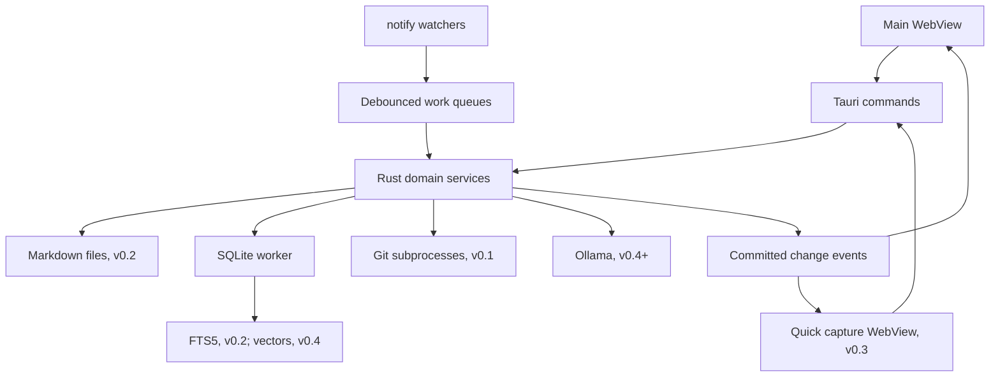

# Brainiac — Product & Technical Specification

**Status:** implementation-ready for M0/v0.1 — Git-first roadmap (v0.1 open questions resolved 1 October 2026)  
**Updated:** 1 October 2026  
**Target:** macOS desktop application, Rust backend, Tauri v2 shell

This specification consolidates the supplied project discussion and replaces its Go/Wails architecture with Rust/Tauri v2. Requirements describe intended behavior; proposed defaults and technical spikes remain open to revision. No application code has been implemented yet.

## 1. Product vision

Brainiac is a personal second brain and daily work manager for a programmer. It connects durable Markdown knowledge, imported outside content, actionable tasks, and the developer's local repositories in one keyboard-oriented desktop application. Local semantic search and grounded AI answers extend that foundation in later releases.

The central workflow is **capture → organize → act → retrieve**:

1. Capture a thought, task, email, issue, article, or video reference while working.
2. Give it context by linking notes, tasks, and repositories.
3. Pick the day's work and open the relevant context.
4. Recover past decisions through keyword search, then optional semantic search.

The first user is the developer building the app. Initial scope is one person, one Mac, one or more local repositories, and no required account. A note vault is introduced in v0.2. Personal and company material can be organized in separate folders and workspaces; multiple independent vaults are a later extension.

**First-release workflow: open repositories → inspect changes and history → track workspace state → open the relevant code in an editor.** The broader capture/knowledge workflow is introduced in subsequent releases.

### Product principles

- Notes remain useful outside Brainiac as ordinary Markdown files.
- Core workflows work offline; local AI is optional.
- Capture, navigation, task completion, and search work from the keyboard.
- Editing reliability and responsive daily use take priority over graph visualization and automation.
- Background work is bounded, observable, and cancellable.
- Integrations enrich context without becoming prerequisites for using the app.

### Long-term scope

The product can eventually include PR and CI status, calendar context, recurring tasks, and explicit development actions. It does not need to replace an IDE, Git client, calendar, or general-purpose project management platform in its first release.

## 2. Release boundaries

**v0.1 — Git viewer and single/multi-repository tracker.** This is the user's current priority. It must work as a complete local Git inspection tool before notes, tasks, content imports, or AI are introduced.

| Capability | Release | Scope |
| --- | --- | --- |
| Add/open one local repository | v0.1 | Folder picker, recent and pinned repositories |
| Named multi-repository workspaces | v0.1 | Root repo + `projects/` discovery and manual repository selection |
| Repository overview | v0.1 | Branch, dirty/conflict state, file counts, local upstream comparison, stale/error state |
| Changes and diff viewer | v0.1 | Staged/unstaged changes, untracked preview, unified text diffs |
| Commit history and details | v0.1 | Paginated history, commit metadata, changed files, per-file patches |
| Branches and tags | v0.1 | Read-only lists and history selection |
| Tracking and refresh | v0.1 | Watchers, bounded jobs, manual refresh, wake/activation reconciliation |
| Command palette | v0.1 | Repository/workspace switching and viewer commands |
| Notes, task hub, Inbox, Today | v0.2 | One Markdown vault, safe editing, dates, context associations |
| Keyword knowledge search | v0.2 | FTS5 across saved notes and tasks |
| Backlinks and note/repository associations | v0.2 | Connect knowledge to the existing Git workspace |
| External content imports | v0.3 | Paste, bookmarks, Markdown copies, articles, `.eml`, provenance and duplicate handling |
| Global capture window | v0.3 | System shortcut, floating capture, shared backend state |
| Authenticated import adapters | v0.3.x | Selected Jira issues/mail messages; provider choice and video transcript acquisition validated separately |
| Semantic search | v0.4 | Optional local embeddings and hybrid retrieval |
| Grounded AI answers | v0.5 | Citation-backed local RAG |
| Remote PR/CI tracking, Git mutations, sync, plugins | Later | Separate features after local viewing is useful |

v0.1 requires a usable local Git binary. Detect it on startup and provide a clear setup message when absent; do not silently install developer tools. Core Git viewing works offline and requires no Markdown vault, Ollama instance, remote-service account, or elevated macOS permissions. Ahead/behind information reflects existing local refs and may be stale relative to the remote server.

## 3. Technology stack

Rust owns application behavior and persistence. The UI remains a web frontend inside Tauri's system WebView; using Rust does not require implementing the frontend in Rust/WASM. [Tauri overview](https://v2.tauri.app/)

| Layer | Proposed technology | Responsibility |
| --- | --- | --- |
| Desktop shell | **Tauri v2** | Windows, menus, application lifecycle, IPC, packaging |
| Backend | **Rust**, stable toolchain | Domain services, safe file operations, indexing, integrations |
| Frontend | **React + TypeScript + Vite** | Editor, navigation, task views, dashboard |
| Styling | **Tailwind CSS** and application design tokens | Consistent density, spacing, theme, focus states |
| Markdown editor, v0.2 | **TipTap + its Markdown extension**, with source editing fallback | Rich editing of a defined Markdown subset |
| Source editor, v0.2 | **CodeMirror 6** | Edit Markdown that cannot safely round-trip through the rich editor |
| Database | **SQLite through `rusqlite`**, bundled SQLite | Tasks, settings, metadata, transactions, FTS5 |
| Async orchestration | **Tokio**, through Tauri's async runtime | Queues, timers, HTTP, cancellation, process orchestration |
| File watching | **`notify`** | Vault changes and repository invalidation |
| Markdown parsing, v0.2 | **`pulldown-cmark`** | Backend extraction of headings, text, and links |
| Serialization/errors | **`serde`, `serde_json`, `thiserror`** | IPC DTOs, configuration, structured errors |
| Identity/content versions | **`uuid`, `sha2`** | Stable IDs and SHA-256 content hashes |
| Git inspection, v0.1 | **System Git CLI invoked from Rust** | Status, discovery, history, refs, file contents, and diffs |
| Local inference, later | **Ollama via `reqwest`** | Embeddings and streamed generation |
| Vector storage, later | **`sqlite-vec` Rust binding** | Local nearest-neighbor retrieval |
| Diagnostics | **`tracing`** | Local structured logs and timings |

Use `rusqlite` with `bundled` to control the SQLite version and `backup` for consistent database snapshots. v0.1 uses SQLite for workspaces, repository registration, pins, and settings. Introduce note/task schemas and verify FTS5 in v0.2; these must not block the Git MVP. Frontend code receives domain commands rather than direct SQL access. [rusqlite documentation](https://github.com/rusqlite/rusqlite)

Commit `Cargo.lock` and the frontend package lockfile. Pin a tested Rust toolchain and compatible Tauri v2 dependency set at bootstrap; record updates deliberately. Exact crate and frontend versions are implementation decisions, not guessed constraints in this document.

### Decided bootstrap choices

- **Rust ↔ TypeScript types: `ts-rs`.** Every DTO in `models.rs` derives `serde::Serialize`/`Deserialize` and `ts_rs::TS`. A Rust test (`cargo test`) exports the generated `.ts` files into `src/lib/generated/`, which is committed. The hand-written IPC client in `src/lib/ipc.ts` wraps each `invoke` call with these types. CI fails if the exported files differ from the committed ones. `tauri-specta` was considered and rejected for now because its Tauri v2 line is still a release candidate; it can replace the hand-written wrappers later without changing the DTOs.
- **Package manager: `pnpm`** (already installed). **Rust toolchain: stable via `rustup`**, pinned in `rust-toolchain.toml`.
- **Minimum Git: 2.30.** The hard floor for `--porcelain=v2` is 2.11; 2.30 is a conservative floor. Detect the version at startup and show the setup message below it.
- **Open in editor default: VS Code's `code` CLI**, invoked as `code <path>` for a repository root and `code -g <file>:<line>` for a file. The executable and argument template are a setting so another editor can be configured; no editor detection beyond checking the configured executable exists.
- **Backup scope in v0.1: SQLite snapshots only** (before migrations and once per active day). The export/restore manifest with vault files is v0.2.
- **Open source from day one.** Proposed license: `MIT OR Apache-2.0`, the Rust ecosystem convention; confirm before the first public push. Git test fixtures are created by the tests themselves in temporary directories, so no real repository or workspace file is committed.

### Editor decision gate — v0.2

TipTap's Markdown support documents limitations. Treat fidelity as a release gate rather than assuming any Markdown file can be serialized without loss. [TipTap Markdown documentation](https://tiptap.dev/docs/editor/markdown)

- Test headings, lists, checkboxes, tables, fenced code, links, images, frontmatter, HTML, and unknown syntax.
- Keep frontmatter separate from the rich document and preserve unknown keys.
- Opening a note without editing must never rewrite it.
- Unsupported or lossy constructs use source mode, preserving original text.
- If the rich editor cannot pass the fixture suite, ship v0.2 with source editing and preview; add rich editing when it meets the contract.

## 4. User experience

### Main window — v0.1

Use a quiet macOS layout: system font, light/dark appearance, native menu bar, standard window controls, visible keyboard focus, and readable text without translucency. Start directly in the Git workspace; do not show empty Brain, Tasks, or Inbox views before v0.2.

```text
┌──────────────────────────────────────────────────────────────────────────────┐
│ Brainiac                 Repository / workspace switcher               ⌘K   │
├──────────────────┬───────────────────────────────────┬───────────────────────┤
│ All repositories │ Workspace overview                │ Selected repository   │
│                  │ or                                │                       │
│ Workspaces       │ Repository viewer                 │ Branch / HEAD         │
│   Work           │ ┌ Changes · History · Branches ┐   │ Upstream comparison   │
│   Personal       │ │ File/commit list             │   │ Last refresh          │
│                  │ │ Selected diff/details        │   │ Open in editor        │
│ Repositories     │ └──────────────────────────────┘   │ Reveal in Finder      │
│   api            │                                   │                       │
│   frontend       │                                   │                       │
│ Pinned / Recent  │                                   │                       │
├──────────────────┴───────────────────────────────────┴───────────────────────┤
│ Refreshing / Up to date / Stale / Error              Last checked timestamp   │
└──────────────────────────────────────────────────────────────────────────────┘
```

The sidebar switches scope. The center shows either an aggregate repository table or a selected repository's viewer. Inside the viewer, show a file/commit list beside the diff/detail surface. The optional inspector presents context and actions without reducing diff readability; collapse it on smaller windows.

### Git navigation and interactions — v0.1

| View | Behavior |
| --- | --- |
| All repositories | Registered repositories, deduplicated across workspaces, filtered by name/path, dirty, conflicted, or stale/error state |
| Workspace | Its member repositories and aggregate counts; click a row to open the repository viewer |
| Changes | Staged, unstaged, untracked, and conflicted entries; selecting a tracked file opens its applicable diff |
| History | Paginated commit list for HEAD or a selected ref; selecting a commit opens metadata, changed files, and patches |
| Branches and tags | Read-only local/remote-tracking refs and tags; select a ref to view its history without checking it out |
| Pinned / Recent | Fast access to repositories and workspaces |

- **Onboarding:** add a repository, select a root repository to discover its `projects/` repositories, create a workspace from selected folders, and choose which discovered repositories to track. Preview resolution errors and let valid entries proceed.
- **Single repo:** open a registered repository directly without creating a workspace first.
- **Multi repo:** see which repositories have changes or conflicts, filter the overview, and drill into one while retaining the selected workspace.
- **Inspect changes:** select staged/unstaged files and inspect added/deleted lines. A file changed in both places has distinct index and working-tree comparisons.
- **Inspect history:** select a commit, read its message, inspect its files/patches, and copy its hash. Preserve repository identity on every history result.
- **Open code:** open a repository or selected current file in the configured editor; reveal its folder in Finder.
- **Refresh:** update the selected repository or workspace without losing navigation/selection unnecessarily.

Repository name/path filtering and commit-message/hash filtering belong to the Git viewer. They do not depend on the future FTS5 knowledge index. History filtering searches Git history lazily; label the selected ref scope and do not imply results span other repositories.

### Knowledge views — v0.2

Add Brain (vault tree/editor), Tasks, Inbox, and Today alongside the existing Workspaces view. Tasks link to notes and repositories. Inbox holds untriaged tasks and locally authored capture notes; source-import notes arrive in v0.3.

Today shows open tasks planned for today, due today, or overdue, with completed items in a separate section. It uses local calendar dates. Planning a task and setting its deadline remain separate actions. Search finds saved notes and tasks with excerpts.

### Keyboard defaults

| Shortcut | Action |
| --- | --- |
| `Cmd+K` | Repository/workspace palette in v0.1; knowledge search added in v0.2 |
| `Cmd+O` | Add/open a local repository |
| `Cmd+R` | Refresh selected repository or workspace |
| `Cmd+,` | Settings |
| `Escape` | Dismiss palette or inspector; later preserve capture/editor drafts |
| `Cmd+N`, v0.2 | New note |
| `Cmd+Shift+N`, v0.2 | New task |
| `Cmd+S`, v0.2 | Save note immediately |
| `Cmd+Shift+Space`, v0.3 | Configurable global quick capture |

Avoid overriding standard text-editing shortcuts. Essential actions have a menu or visible control. Error messages describe the failed action and offer a concrete recovery action.

## 5. Backend architecture

Start with one Cargo package and a few Rust modules organized by feature. Keep business logic independent of Tauri so it can be tested without launching a WebView. Additional packages and layered directories are unnecessary for the initial release.



### Project layout for the first release

The top-level `src/` contains the web frontend; `src-tauri/` contains a normal Cargo project plus Tauri configuration. This split follows the standard Tauri scaffold. The Rust module names below are our application choices, not framework requirements. [Tauri project structure](https://v2.tauri.app/start/project-structure/)

```text
brainiac/
  SPEC.md
  package.json                 Frontend dependencies and scripts
  index.html                   Frontend entry document
  src/                         React/TypeScript frontend
    main.tsx                   Mount the React app
    App.tsx                    Main layout
    components/                Repository table, changes, history, diff, palette
    lib/                       Typed IPC client
  src-tauri/
    Cargo.toml                 Rust package metadata and dependencies
    Cargo.lock                 Exact resolved Rust dependencies
    build.rs                   Tauri build integration
    tauri.conf.json             Application/window/bundle configuration
    capabilities/              WebView permissions
    icons/                     Application icons
    migrations/                Ordered SQL migrations
    src/
      main.rs                  Small desktop entry point calling lib.rs
      lib.rs                   Tauri setup, shared state, command registration
      commands.rs              Thin IPC handlers calling application modules
      models.rs                Entities, DTOs, structured errors
      db.rs                    SQLite worker, migrations, backup
      workspaces.rs            Repository registration, membership, workspace import
      git.rs                   Git discovery, status, refs, history, diffs
      watcher.rs               Repository notifications and refresh scheduling
    tests/                     Integration tests; unit tests can live in modules
```

Create modules as their behavior is implemented; the scaffold does not need empty placeholders for every file. Add `notes.rs`, `tasks.rs`, and `search.rs` in v0.2; `imports.rs` in v0.3; then AI modules at their milestones. The initial project does not need an editor or content-ingestion dependencies.

In Rust, a **package** is described by `Cargo.toml`; a **crate** is a compilation unit, such as its library or executable; a **module** organizes code within a crate. Tauri's scaffold has a small desktop binary (`main.rs`) that delegates to the application library (`lib.rs`). This is scaffold reuse, not a separate backend service.

Files become modules through declarations such as `mod notes;` in `lib.rs`. A directory does not automatically become a package. When a module grows, split it into submodules: for example, `notes.rs` can become a module root at `notes/mod.rs` with `notes/save.rs` and `notes/recovery.rs`. Add that structure when the code needs it.

### Concurrency and lifecycle

- Keep database connections owned by a dedicated blocking database worker. Commands communicate through bounded queues and response channels.
- Filesystem parsing, hashing, and other blocking work run on bounded workers, never the UI thread or an async executor thread directly.
- Use one serialized write pipeline per note and optimistic versions for task updates.
- Coalesce watcher events by resource. One active job and one pending refresh per resource prevent unbounded queues.
- Start with two concurrent Git status jobs and one embedding job; adjust after measurement.
- On sleep, suspend timers; on wake and application activation, reconcile stale state.
- On quit, flush accepted saves and draft checkpoints, cancel jobs, close the database, and unregister shortcuts. If flushing fails, preserve the draft and offer retry or quit with recovery.
- Support a single application instance. Before v0.3, closing the last window quits after flushing. In v0.3, closing the window may keep capture available in the menu bar; `Cmd+Q` still quits.

## 6. Storage and ownership

### Sources of truth

| Data | Authoritative store | Rebuildable? |
| --- | --- | --- |
| Saved note body and frontmatter | Markdown files in the selected vault | Search metadata can be rebuilt from files |
| Imported source snapshots and provenance | Markdown frontmatter/body and any retained original files in the vault | Source cache can be rebuilt; originals must be backed up |
| Pending import jobs and uncommitted previews | SQLite plus managed staging files where needed | Requires recovery until a note is committed |
| Tasks, planned dates, deadlines, associations | SQLite | Requires backup/export |
| Imported-note identities without embedded IDs | SQLite | Requires backup to preserve exact associations |
| Pins, workspace membership, settings | SQLite | Requires backup/export |
| Search text cache, backlinks, repository snapshots | SQLite derived tables | Yes |
| Chunks and embeddings | SQLite derived tables | Yes, from files and model configuration |
| Unsaved editor recovery | Local draft journal | Recovery data, not the saved note |

This ownership table covers the full roadmap. In v0.1, persist workspace membership, repository registration, pins, and settings; cache Git observations with timestamps. Note/task/import stores are introduced at their later milestones.

SQLite therefore holds both authoritative application data and derived indexes. Deleting the database is not a safe way to rebuild search.

Use Tauri's application data directory for the database, recovery journal, and managed backups. The user chooses the Markdown vault; its location is not hard-coded. Keep paths inside the vault relative so relocating the vault does not invalidate every record.

### Note identity and compatibility — v0.2

- New notes receive a UUID in a namespaced frontmatter key, `brainiac_id`.
- Existing notes with no such key receive a persisted application ID without modifying the file. Adding an embedded ID is an explicit action.
- Title comes from frontmatter `title`, then the first H1, then the filename.
- App-driven renames preserve identity. External moves use embedded IDs where available; otherwise match a unique content hash within the reconciliation batch.
- Ambiguous moves become missing/new entries and can be relinked; identical contents alone do not prove identity.
- Duplicate embedded IDs produce a visible conflict; never merge two notes silently.
- Preserve arbitrary frontmatter keys, code fences, and relative links. Changing a title does not automatically rename the file.
- In v0.2, supported notes are UTF-8 `.md` files on a local filesystem. Unsupported encoding and files over the proposed 5 MiB editing limit receive a clear message and an Open Externally action.

### Logical data model

The implementation converts this model into versioned SQL migrations at the indicated releases; future tables are not created for the Git MVP. IDs are UUID strings, timestamps are UTC instants, and planned/deadline dates are nullable `YYYY-MM-DD` values.

| Entity | Essential fields and constraints | Release |
| --- | --- | --- |
| `vaults` | `id`, `name`, `root_path`; one active vault initially | v0.2 |
| `notes` | `id`, `vault_id`, `relative_path`, `embedded_id?`, `title`, `content_hash`, `mtime`, `indexed_at`, `missing_at?`; unique live path per vault | v0.2 |
| `tasks` | `id`, `title`, `description`, `status`, `triaged_at?`, `planned_date?`, `due_date?`, `linked_note_id?`, `created_at`, `updated_at`, `completed_at?`, `version` | v0.2 |
| `pins` | `entity_type`, `entity_id`, `position`; repository/workspace pins in v0.1, note pins in v0.2; unique entity | v0.1 |
| `settings` | `key`, `value_json`, `version` | v0.1 |
| `note_revisions` | `id`, `note_id`, `content`, `content_hash`, `created_at`, `reason`; bounded local history | v0.2 |
| `search_documents` | FTS5 rows: entity type/ID plus title and searchable body | v0.2 |
| `note_sources` | `note_id`, source type, canonical URL/provider ID, source time, import time, content scope, source hash; derived from note provenance | v0.3 |
| `import_jobs` | `id`, input reference, adapter, state, staged payload reference, error, result note ID, idempotency key | v0.3 |
| `workspaces` | `id`, `name`, `discovery_mode` (`root_projects`, `manual`), `root_repository_id?`, `projects_relative_path?` | v0.1 |
| `workspace_folders` | `id`, `workspace_id`, `display_name`, `canonical_path` | v0.1 |
| `repositories` | `id`, `canonical_root`, `git_dir`, `common_git_dir`, `last_opened_at?` (drives the Recent list), `last_checked_at`, cached status/error as JSON | v0.1 |
| `workspace_repositories` | `workspace_id`, `repository_id`, `membership_origin` (`discovered`, `manual`); many-to-many membership | v0.1 |
| `note_links` | `source_note_id`, `target_note_id?`, `raw_target`, source location; unresolved links retained | v0.2 |
| `note_repository_links` | `note_id`, `repository_id` | v0.2 |
| `embedding_profiles` | `id`, provider/model identity, dimensions, distance metric, chunker version | v0.4 |
| `note_chunks` | `id`, `note_id`, source hash, heading, byte/line range, text, chunk hash | v0.4 |
| vector tables | Chunk ID and embedding, partitioned by compatible embedding profile | v0.4 |

Task status is `todo`, `in_progress`, `done`, or `cancelled`, enforced by a database constraint. Completing sets `completed_at`; reopening clears it. Markdown checkboxes remain note content from v0.2 and do not automatically create or synchronize task records.

Use foreign keys, WAL mode, a bounded busy timeout, and explicit transactions. Keep missing-note tombstones to preserve task context. Add task `linked_repository_id` in the v0.2 migration. Repository status is a cache with an observation time, never an authoritative copy of Git state.

## 7. Developer workspaces — v0.1

### Primary topology: root repository with child repositories

A common layout is a root repository that anchors a workspace, with independent project repositories nested inside it:

```text
workspace-root/                 Git repository; also the workspace anchor
  .git/
  projects/
    project-a/                  Independent Git repository
      .git/
    project-b/                  Independent Git repository
      .git/
    project-n/                  Independent Git repository
      .git/
```

Treat this as a hierarchical workspace containing multiple repositories. The root repository has its own status, history, branches, and diffs. Each child repository has independent Git state. Physical nesting does not imply a monorepo, a submodule relationship, coordinated branches, or atomic changes across repositories. Display actual Git relationships only when detected.

#### Discovery and membership

- **Add workspace from root** selects the root repository, defaults the discovery directory to `projects/`, and previews the root plus its discovered children. Keep the relative directory configurable.
- Enumerate immediate child directories of `projects/`; query Git to resolve each candidate's working-tree root and metadata paths. Register a child only when its resolved canonical Git root equals the candidate directory. A plain folder that inherits the enclosing root's Git context is not another repository.
- Handle `.git` directories and `.git` files, including linked worktrees and actual submodules. Preserve the detected relationship; do not assume every child is a submodule.
- Include the root repository as a distinct **Root** row and each child as a **Project** row. Keep grouping metadata in workspace membership; repository records can still appear in other workspaces.
- Deduplicate by canonical checkout root, retaining distinct linked worktree paths. Do not combine separate projects merely because their current branch names match.
- A missing `projects/` directory leaves the root repository usable and shows the discovery issue. Non-Git children are skipped with a preview explanation; explicitly selected non-Git workspace folders can remain folder entries.
- Watch the discovery directory for added/removed child folders and expose **Rescan projects**. Refresh the candidate list and surface additions. Mark removed or inaccessible registered projects missing; preserve registrations and future context links until explicitly removed or relocated.
- Stay within the selected root/discovery directory. Symlinked external projects require explicit selection. Deeper descendants require explicit addition; do not crawl arbitrary nested dependency trees.
- Brainiac owns its tracked-repository selection independently of editor configuration. The user can select a subset of discovered projects and add other repositories manually.

#### Presentation and Git boundaries

Show the root followed by an expandable `projects/` group in the sidebar. The overview includes **Root + projects**, **Projects only**, and individual-repository scopes. Aggregate counts reflect the selected scope and retain per-repository attribution; histories and diffs are never implicitly merged into one Git history.

Root-repository status is exactly what Git reports for the root. Child-repository status is collected independently, including when `projects/` is ignored by the root. If the root tracks a child as a gitlink/submodule or reports a nested directory as untracked, display that parent entry as its own observation; it is not a substitute for the child's detailed status. Do not add child file counts into the root's own dirty-file count.

Route working-tree notifications to the most specific registered repository root. Refresh an ancestor when its own tracked state or detected Git relationship may have changed; avoid a full parent status job on every child keystroke. Keep a separate lightweight watcher for workspace membership discovery. Treat each linked worktree's available project folders independently; do not assume a root worktree automatically contains every child checkout.

### Relationship to editor workspace files

Editor workspace files such as VS Code's `.code-workspace` often describe the same topology: a root folder plus a list of project folders, some commented out, alongside editor-only settings such as `files.exclude` and task definitions. Reading, importing, watching, rewriting, or synchronizing such files is not a v0.1 requirement.

The resulting navigation for such a workspace looks like:

```text
Work workspace
  Root
  projects/
    api
    gateway
    admin
    web-ui
```

v0.1 supports this arrangement by selecting the root, discovering actual repositories under `projects/`, and letting the user choose which ones to track. Other repositories on disk may be selected too. Brainiac's selection is persisted in its own SQLite configuration; an editor's active or commented folder entries do not determine membership.

Editor display settings such as hiding `projects/` or `.git` do not change Brainiac's tracking model. Each selected repository remains independently inspectable. Task or launch definitions found in such files introduce no launcher requirement and are never executed.

A `.code-workspace` convenience importer can be considered later if useful. It is outside v0.1 acceptance criteria, with no required ongoing synchronization.

### Single-repository viewer

A registered repository opens directly; workspace membership is optional. Keep tabs for Changes, History, and Branches/Tags, and remember the last tab per repository. A fresh repository with no commits shows an empty history while still showing staged/untracked files. Missing/inaccessible paths show an error with Relocate or Remove registration; removing registration does not touch the working directory.

#### Changes and diffs

- Group staged, unstaged, untracked, and conflicted files. Show paths, change kinds, and rename source/destination.
- For tracked text, display a unified diff with line numbers, additions/deletions, and context. Separate HEAD-to-index and index-to-working-tree comparisons; the same file can appear in both groups.
- Untracked files use a bounded, read-only text preview labeled untracked. Conflicted files show conflict status and current contents; conflict resolution is later scope.
- Binary files, submodule changes, Git LFS pointers, symlinks, and oversized patches receive explicit summaries rather than misleading text diffs. Do not download LFS objects or traverse submodules automatically.
- Initial display limits: 1 MiB or 10,000 patch lines per file, whichever comes first. Mark truncation and offer Open in editor; never silently omit remaining content.
- Load only the selected patch. Revalidate/invalidate displayed working-tree diffs when repository state changes and discard obsolete requests after selection switches.
- Keep patch rendering read-only, virtualize long output, and escape source text.

Git supplies comparisons of working tree, index, and commits; disable external diff/text-conversion helpers and paginate/bound output. [Git diff documentation](https://git-scm.com/docs/git-diff)

#### History and commit details

- Default history is the current HEAD's reachable commits, newest/topologically ordered. Load 100 records per page, anchored to the selected ref's resolved commit ID so new commits do not shift an in-progress traversal unexpectedly.
- Show commit hash, subject, author, authored/committed time, parent IDs, and branch/tag decorations. Display full message in commit details.
- Offer ref selection and commit-message/hash filtering. Queries remain scoped to the selected repository/ref; indicate loading and cancellation.
- Selecting a commit loads its changed-file list; selecting a file loads its patch. Compare a normal commit with its parent, a root commit with an empty tree, and a merge commit with its first parent by default. Label the chosen parent and permit selecting another parent.
- Copy commit hash and relative file path. Display removed files and rename history correctly; opening a historical path is separate from opening its current working-tree file.
- A graphical branch-lane visualization and blame are future additions. A useful history list and parent links are sufficient for v0.1.

Use Git's history/object commands behind structured Rust DTOs rather than parsing terminal-decorated output. [Git log documentation](https://git-scm.com/docs/git-log), [Git show documentation](https://git-scm.com/docs/git-show)

#### Branches and tags

List local branches, remote-tracking branches, and tags, marking the current branch and upstream where present. Selecting a ref changes the history view without checking out the branch. Resolve refs to object IDs in Rust before comparison/history queries. [Git ref enumeration](https://git-scm.com/docs/git-for-each-ref)

### Multi-repository dashboard

Show repository name/path, branch or detached HEAD, staged/unstaged/untracked/conflicted file counts, last refresh, and error/stale status. Count unique changed paths separately from staged/unstaged groups so a doubly modified file is not counted as two files. Provide workspace totals, filters for dirty/conflicted/stale repositories, sorting by name or latest observed commit time, and Refresh all. One repository failure must not block the others. Deduplicate the All repositories view while allowing one repository to belong to several workspaces. Ahead/behind appears only when an upstream exists and reflects local refs; automatic network fetch is outside this release.

Invoke the system Git binary with argument arrays and timeouts, using machine-readable output such as `git status --porcelain=v2 --branch -z`. Parse NUL-delimited paths and distinguish staged versus unstaged states. [Git status documentation](https://git-scm.com/docs/git-status)

Run Git without a pager, with optional locks disabled for inspection, and with external diff/textconv helpers disabled for patch/content operations. Validate revision/path inputs, separate path arguments with `--`, and never interpolate them into a shell. Do not execute repository hooks, imported tasks, or custom shell actions.

Use the CLI first for compatibility with the user's installed Git. Hide it behind a `GitService` boundary; `git2` or `gix` can be evaluated later if measured bottlenecks justify another implementation.

### Refresh strategy

Watching `.git/HEAD`, refs, and index alone misses changes to unstaged working files. Observe both Git metadata and working-tree changes, excluding ignored/generated trees from expensive recursive observation.

- Debounce repository invalidation for approximately 500 ms.
- Resolve worktree-specific and shared Git metadata directories explicitly.
- Reconcile on launch, wake, activation, and manual refresh.
- Use a slow safety refresh, proposed 60 seconds while the dashboard is visible, for missed events. Back off on expensive repositories and label stale data.
- If status exceeds a proposed 5-second timeout, preserve the last snapshot with a warning and retry option.
- Batch/coalesce event bursts; never run a status command per keystroke or per watcher callback.

v0.1 actions are inspect status/diffs/history/refs, copy hashes/paths, refresh, reveal in Finder, and open in editor. Knowledge/task associations arrive in v0.2. v0.1 performs no automatic network fetches or Git write operations. Branch checkout, commit, stash, pull, and automatic dev-server startup remain future, explicit actions.

## 8. Safe note editing and indexing — v0.2

### Save contract

`read_note` returns Markdown and a version based on its SHA-256 hash. `save_note` submits the expected version and new Markdown.

1. Persist a recoverable draft checkpoint and serialize app-originated writes to this note.
2. Read the current file and compare its hash with the expected version.
3. If divergent, return `CONFLICT`; keep the editor draft and the disk version available.
4. Preserve the pre-save file in local revision history. If that fails, stop the save and retain the draft.
5. Write a temporary sibling file, flush it, recheck the expected disk version, and atomically replace the destination. Preserve file permissions and sync the directory where supported.
6. Update note metadata and its FTS row in one database transaction.
7. Return the new version and emit a committed change event. If indexing fails after the file write, report **Saved; search update pending** and enqueue repair.

The filesystem and SQLite do not share a transaction. Recovery must reconcile a completed file write with an interrupted database update. Hash checks detect observed conflicts; they cannot provide a filesystem compare-and-swap against arbitrary external editors. Revision history and draft recovery reduce that residual race risk.

Auto-save after a proposed 750 ms of inactivity. `Cmd+S` flushes immediately. Display Saving, Saved, Save failed, or Conflict accurately; switching views retains an unflushed draft.

### External modifications

- Watch directories so atomic replacement saves are observed. Debounce note events for roughly 300 ms, then read and hash.
- A hash equal to the accepted version is a no-op, including notifications from the app's own writes.
- For a clean active editor, reload the changed file and refresh the base version.
- For a dirty active editor, stop auto-save and offer **Reload disk**, **Save draft as copy**, or **Compare versions**. Preserve the draft before discarding it.
- If a file disappears while open, keep the draft and offer restore as a new file or relink.
- Startup, wake, watcher errors, and manual refresh trigger reconciliation. Notifications accelerate indexing; they are not the sole correctness mechanism.
- Watcher callbacks enqueue work instead of parsing or accessing SQLite directly. `notify` is the Rust watcher abstraction. [notify documentation](https://docs.rs/notify/latest/notify/)

### Delete and recovery

App deletion moves the note into a recoverable vault-local trash location and removes it from active search. Keep its tombstone and associations. Restore resolves destination collisions explicitly. Never permanently delete the user's file as the default action.

External deletion marks a note missing and removes its search row. User-visible task context remains available as a missing note reference. Reconciliation must not treat an inaccessible vault as mass deletion.

### Backup and restore

- Create a consistent SQLite snapshot before each migration and once per active day; retain seven daily snapshots by default.
- Keep draft checkpoints and a bounded revision history: proposed 30 days, at most 20 revisions per note, and a global 250 MiB budget, excluding unresolved conflicts and active drafts.
- Provide an export containing vault files, a consistent database snapshot, and a versioned manifest. Serialize application writes during snapshot/export and detect externally changed files; retry or report an incomplete export rather than claiming an atomic snapshot across independent editors.
- Export tasks as JSON with IDs, dates, statuses, and associations for portability.
- Restore validates the manifest and schema before replacement, then rescans files and rebuilds derived indexes.
- Local snapshots are recovery aids; a complete backup must include both vault files and application data, preferably on another device or backup system.

## 9. Keyword search — v0.2

Index note titles, saved note body including code blocks, and task titles/descriptions. Search starts during vault ingestion and becomes complete when ingestion finishes. No embedding model is required.

Use a normal, content-bearing FTS5 table with entity IDs stored as unindexed columns. Maintain one row per live note/task, replacing it transactionally on updates. Keep the cache rebuildable independently of authoritative task records. FTS5 provides ranking, phrase, and prefix queries. [SQLite FTS5 documentation](https://www.sqlite.org/fts5.html)

Search behavior:

- Default input is literal user text; compile it into safe FTS expressions rather than passing arbitrary query syntax through.
- Support quoted phrases and final-token prefix matching; handle malformed quotes without exposing SQL errors.
- Boost title matches and include a title/path substring fallback for developer identifiers that tokenize poorly.
- Filter by Note or Task. Return a bounded first page of 50 results with stable pagination.
- Cancel or ignore obsolete requests when the query changes.
- Render snippets as escaped text plus highlight ranges, never trusted HTML.
- Clearly distinguish No matches, Indexing incomplete, and Search unavailable.
- Update task FTS rows in the task write transaction. Note indexing follows the successful file write and can be repaired.

## 10. Capture and imports — v0.3

Import is a core way to create knowledge, available from the same capture interface as writing a note. Sources feed a common Rust ingestion pipeline and become ordinary Markdown notes in the Inbox. Importers do not create separate knowledge silos or require AI to produce a useful result.

### Capture interface

Provide an **Add to brain** action in the main window and command palette. Accept pasted text, a URL, or a selected/dropped supported file. Show the detected source and allow the user to correct the title, add a personal comment, and choose a destination. Default to `Inbox/`.

After saving, the item is immediately readable and searchable using the content actually captured. Show a small source badge, capture date, and **Open original** action. The inspector exposes provenance without making the note editor feel like an import-management tool. Inbox triage offers file/move, link to a task or repository, and create a task explicitly.

Later, the same capture action can be reached from global quick capture, a browser extension, or a macOS share extension. Those entry points submit to the same backend pipeline. Native share-extension packaging and browser handoff need their own technical spike; they are not assumed to come automatically with Tauri.

### Source behaviors

| Source | Captured note | Initial path | Richer integration |
| --- | --- | --- | --- |
| Pasted text/selection | Supplied text, optional source URL, and personal comment | v0.3 paste | Browser extension supplies selected text and page metadata |
| Markdown file | Independent copy in the vault, preserving original source reference | v0.3 picker/drop | Batch import with preview |
| Web page | Article title, source URL, author/date when available, extracted readable body | v0.3 URL bookmark; v0.3 extraction | Browser capture for authenticated or client-rendered pages |
| Email | Subject, sender/recipients/date, selected message body, message identity | Paste in v0.3; `.eml` in v0.3 | Selected-message import through an authorized mailbox connector |
| Jira issue | Issue key/title, description, status/assignee snapshot, source link | Paste text or bookmark in v0.3 | Explicit fetch through configured Jira deployment/account |
| YouTube video | Video link/title and user's notes; timestamped transcript when supplied/available | Bookmark and pasted transcript in v0.3 | Metadata and supported transcript acquisition |

Saving a URL is distinct from capturing its contents. Every import has a `content_scope`: `full_text`, `excerpt`, `transcript`, or `metadata_only`. A bookmark-only note must not appear to have the full article or video available for search or RAG.

For email, “send to my brain” initially means supplying message content or an exported `.eml`. A dedicated forwarding address would require an optional mail-receiving service or reading a configured mailbox; an offline desktop application cannot independently receive public email while closed. Connected mailbox import uses provider authorization, such as the Gmail API. [Gmail API overview](https://developers.google.com/workspace/gmail/api/guides)

For Jira, start with importing individual selected issues. Distinguish Cloud versus Data Center during connector design; keep provider-specific authentication and document formats inside the adapter. The issue becomes a captured snapshot, optionally linked to a task. Importing it does not establish two-way task/status synchronization.

For YouTube, do not promise automatic transcripts for every public video. The official caption-download API requires permission to edit the video. Accept pasted/uploaded transcripts, or a separately verified acquisition method; otherwise save the reference and label transcript unavailable. Preserve transcript timestamps so citations can open the relevant video position. [YouTube caption-download API](https://developers.google.com/youtube/v3/docs/captions/download)

### Common ingestion pipeline

```text
Paste / file / URL / provider selection
  → identify source and persist import job
  → acquire content, if needed
  → extract and normalize to Markdown
  → preview content and provenance
  → check duplicates and choose disposition
  → save Inbox note through the normal safe-write pipeline
  → index captured content
  → optional enrichment in later releases
```

Implement `imports.rs` with a small source-kind enum and separate adapter functions initially. Each adapter returns a common `ImportedContent` DTO: suggested title, Markdown, source identity/URL, source timestamps, content scope, content hash, warnings, and optional original-file references. Parsing/network acquisition does not write a note itself; the import service commits through `NoteService`.

Job states are `queued`, `acquiring`, `extracting`, `awaiting_review`, `saving`, `complete`, `failed`, and `cancelled`. Simple pasted captures can skip a separate preview screen because the capture form is already editable. Network/file extraction shows a preview before committing. Retry resumes safely with the same job ID; cancelled/failed jobs never produce apparently complete notes. Completion means the note exists; search may independently show an indexing-pending state.

### Provenance and user edits

- Embed a `brainiac_source` frontmatter object containing source type, stable source ID/URL, imported time, source modified time when known, content scope, and source-content hash. Keep provider-specific metadata in a namespaced object.
- Put personal commentary in a clearly separate section from captured source text. Summaries, when added later, are labeled generated content and never replace the source body.
- Keep source material useful offline after import. Original web content may later change or disappear; Open original is navigation, not the storage strategy.
- Retain raw originals such as `.eml` in a vault-local `attachments/imports/<import-id>/` folder in v0.3. Save relative references in frontmatter and include them in export/restore. Unsupported attachments stay as originals, with no implied indexing.
- Imported Markdown copies get a new Brainiac ID; preserve any original ID as source metadata so copying does not create identity collisions. Do not modify the source file. Detect dependencies such as relative images and warn when they cannot be copied/resolved by the supported importer.
- Source caches are reconstructible from provenance. Pending acquisition credentials and job state stay outside note files.

### Duplicates and updates

Deduplicate by provider account plus stable item ID where available: Jira issue ID, email Message-ID/provider message ID, video ID, or conservatively normalized URL. Use content hashes as a second signal, not the sole identity for unrelated items.

For a repeated unchanged capture, offer **Open existing** or **Save another copy**. If the source changed, offer an explicit new snapshot or a previewed update of the imported section. Never silently overwrite a user's annotations or independently edited note. URL normalization must not strip query parameters that identify different content.

Snapshot import is the default. Live synchronization, scheduled bulk acquisition, and remote mutations are separate later features with their own contracts.

### Extraction limits and search behavior

- Apply bounded download sizes, redirect counts, timeouts, and cancellation. Use source-specific parsers and strip active HTML, scripts, and tracking pixels.
- Generic URL import fetches public `http`/`https` pages; it does not borrow browser cookies, bypass login walls, or silently execute page JavaScript. If extraction fails, offer bookmark-only or paste selection.
- Authenticated/provider imports use explicit configured accounts, with credentials in Keychain. Configure company Jira hosts deliberately rather than forwarding credentials to arbitrary pasted hosts or redirects.
- Keep external page resources from triggering incidental downloads. Fetch attachments only through an explicit supported import action.
- Index the resulting Markdown using the existing FTS/chunking pipeline. Add source-type filters and display original-source provenance on results.
- RAG uses only captured bodies/transcripts and distinguishes personal comments from source excerpts. It cannot answer from the uncaptured contents of a saved URL.
- Import verification covers duplicate retries, source identity collisions, partial failures, MIME/HTML conversion, unavailable transcripts, user edits during refresh, and backup/restore of original files.

### Import rollout

1. **v0.3 core:** text/selection capture, URL bookmarks, Markdown copies, provenance, Inbox triage, duplicate/retry handling.
2. **v0.3 source adapters:** public-page extraction and `.eml` parsing/original retention, with explicit bookmark/paste fallback.
3. **v0.3.x:** one authenticated connector, selected by daily use—Jira or the email provider—and validated video metadata/transcript improvements.
4. **Later:** browser/share entry points, optional forwarding service, batches, and explicit synchronization.

All external content-import behavior starts in v0.3. Selecting local repositories and discovering `projects/` in v0.1 is workspace configuration, separate from importing knowledge content.

**Acceptance scenario:** capture an email, an issue excerpt, an article, and a video reference into the Inbox; add commentary, create a task from one item, find captured material offline, open each original source, retry an interrupted import without duplicates, and identify which items contain only metadata.

## 11. Global capture and window state — v0.3

Use the official `tauri-plugin-global-shortcut` from Rust. Default to `Cmd+Shift+Space`, allow rebinding, and show shortcut registration conflicts. Handle pressed events once; key release must not trigger a second capture. [Tauri global shortcut plugin](https://v2.tauri.app/plugin/global-shortcut/)

The capture window is a small undecorated window with text input, Note/Task selection, and optional search. Enter saves, Escape dismisses, and dismissal preserves an unsaved draft. Keep it pre-created and hidden if measurement supports faster activation.

Prototype activation over other apps, multiple displays, Spaces, and fullscreen windows. Test focus return on dismissal. Prefer supported Tauri window APIs and an opaque fallback before adding macOS-specific code. Translucency is visual polish, not a dependency for capture. [Tauri window customization](https://v2.tauri.app/learn/window-customization/)

Do not assume Accessibility or Full Disk Access is required for global shortcuts. Determine actual permissions from the implemented mechanism on supported macOS versions; ask for an OS permission only when that feature needs it.

Rust is the shared authority across windows:

1. Each WebView submits a command.
2. Rust validates, commits, and returns canonical state.
3. Rust emits a versioned change event to authorized windows.
4. Each window refreshes affected state; newly opened or resumed windows fetch a snapshot.

Events invalidate caches; they are not a durable event log. Include entity ID, version, and origin window. Frontends discard older events and unsubscribe on teardown. Dirty editors use the conflict contract even when a change originated in another app window.

## 12. Semantic search — v0.4

Keep lexical search fully functional when semantic search is disabled, indexing is incomplete, or Ollama is unavailable.

### Embedding ingestion

1. Parse Markdown into heading-aware chunks while preserving code blocks.
2. Start with a target around 400 tokens, bounded overlap, and a hard cap below the selected model's context limit. Long sections require splitting; headings alone are insufficient.
3. Store source hash, heading context, line/byte ranges, text, and chunker version.
4. Hash the actual embedding input, including added heading context. Reuse unchanged vectors only within the same model/profile and chunker configuration.
5. Request embeddings from a configured local Ollama model through `/api/embed`. Validate returned dimensions and avoid silent input truncation. [Ollama embedding API](https://docs.ollama.com/api/embed)
6. Publish the replacement chunk set only if the note's source hash still matches the job's input. Discard superseded jobs.
7. Remove superseded/deleted chunks from retrieval promptly; periodically clean orphaned storage.

The embedding model, its dimensions, language coverage, and context limit are selected during a representative-corpus spike. Do not hard-code 384 dimensions or assume the model examples from the source discussion are interchangeable.

### Vector integration and hybrid retrieval

Use the `sqlite-vec` Rust binding with the same bundled SQLite used by `rusqlite`. Register the extension through a vetted initialization path, encapsulate required unsafe FFI, and verify release packaging before adopting it. Never load arbitrary extensions supplied by a note or workspace. [sqlite-vec Rust binding](https://docs.rs/sqlite-vec/latest/sqlite_vec/)

- Keep chunk metadata in ordinary tables and vector data in compatible profile-specific tables.
- Schema dimensions and the query embedding must match the active profile. Model changes create a new index generation; do not mix vectors from different models.
- Use the extension's supported nearest-neighbor query syntax, including its `k` constraint where required. [sqlite-vec KNN documentation](https://alexgarcia.xyz/sqlite-vec/features/knn.html)
- Combine keyword and semantic candidate ranks with reciprocal rank fusion; deduplicate overlapping chunks and cap results per note.
- Return source excerpts and distinguish keyword from semantic matches.
- Start with notes only. Task, commit-message, and source-code embeddings are separate future scope.
- Model installation is an explicit user action. Show download/storage requirements, indexing progress, pause, cancellation, and retry.

## 13. Ask my brain — v0.5

RAG uses hybrid retrieval to answer questions about saved notes. It adds synthesis after retrieval is useful and measured.

- Retrieve relevant chunks, verify their source hashes, and fit them into the generation model's context budget.
- Include source labels, note identity, heading, and location in the prompt.
- Stream output through a Tauri IPC channel, with request ID, cancellation, and terminal success/error state. Tauri recommends channels for streamed data. [Tauri Rust commands and channels](https://v2.tauri.app/develop/calling-rust/)
- Show citations that open the supporting note at its source location. If the file changed since generation, label the citation stale.
- If supporting material is missing or weak, say that the notes do not establish an answer; offer relevant excerpts.
- Treat retrieved text as reference material, not instructions. This feature has no filesystem-write or shell tools.
- Do not silently turn generated suggestions into tasks or modify notes.
- Keep conversations session-local initially; Save as note is explicit.
- AI requests go only to the configured local endpoint by default. A cloud provider would require a later explicit product decision and opt-in.

## 14. Tauri command and event contracts

In v0.1, expose repository/workspace registration, Git queries, settings/pins, and application snapshots. Note/task/search commands arrive in v0.2; import/capture commands in v0.3. `get_app_snapshot` must work without a vault.

Commands are thin adapters over Rust services. Use `#[tauri::command]`, serializable request/response DTOs, and a typed TypeScript client. Generate DTO types from Rust or verify shared schemas in CI; do not assume Tauri automatically creates complete TypeScript bindings. [Tauri command documentation](https://v2.tauri.app/develop/calling-rust/)

| Command | Important input/output |
| --- | --- |
| `select_vault` | Native folder selection; returns vault and scan state |
| `list_notes` / `read_note` | IDs and pagination; content plus hash version |
| `create_note` / `rename_note` / `trash_note` / `restore_note` | Vault-relative destination, collision handling, expected version |
| `save_note` | Note ID, expected hash, Markdown; new version or conflict |
| `list_tasks` / `create_task` / `update_task` / `delete_task` | Filter or mutation DTO; expected integer version on existing records |
| `search` | Query, entity filters, pagination; ranked escaped excerpts |
| `prepare_import` / `commit_import` / `list_import_jobs` | Source input or job ID; preview/provenance, duplicate choice, resulting note, retry state |
| `get_app_snapshot` | v0.1 repositories/workspaces, settings and observation versions; optional vault/tasks/indexing added in v0.2 |
| `rebuild_search` / `export_backup` / `restore_backup` | Job ID, progress and explicit completion |
| `register_repository` / `create_workspace` / `discover_projects` / `update_workspace_membership` / `refresh_repository` | v0.1: validated registration, root-based/manual workspace configuration, discovered candidates, selected membership, timestamped status |
| `list_repositories` / `list_changes` / `get_diff` | v0.1: workspace/filter scope, repository ID, diff kind and safe file selector; bounded results |
| `list_commits` / `get_commit` / `list_refs` | v0.1: repository/ref scope, pagination cursor or commit ID; history/details/ref DTOs |
| `configure_shortcut` | v0.3: validated binding and registration result |
| `semantic_search` / `ask_brain` / `cancel_job` | v0.4+: profile/request IDs, results or response channel |

Errors expose stable codes: `VALIDATION`, `NOT_FOUND`, `CONFLICT`, `PERMISSION_DENIED`, `IO`, `DB`, `DEPENDENCY_UNAVAILABLE`, `TIMEOUT`, and `CANCELLED`. Include a user-facing message and retryability, keeping low-level diagnostics in local logs.

### v0.1 DTOs

These are the shapes `models.rs` defines and `ts-rs` exports. Notation is TypeScript for readability; `?` marks optional fields. IDs are UUID strings, timestamps are RFC 3339 UTC strings, and file paths inside a repository are repository-relative with forward slashes, exactly as Git reports them. Enum values are `snake_case` strings.

```ts
type AppError = { code: ErrorCode; message: string; retryable: boolean; details?: string };

type AppSnapshot = {
  snapshot_version: number;              // increments on every committed change
  git: { available: boolean; version?: string; path?: string; message?: string };
  repositories: RepositorySummary[];
  workspaces: Workspace[];
  pins: Pin[];                            // ordered
  recent_repository_ids: string[];        // by last_opened_at desc, max 10
  settings: Settings;
};

type Settings = {
  editor: { executable: string; repo_args: string[]; file_args: string[] }; // default: "code", ["{path}"], ["-g", "{path}:{line}"]
  refresh_interval_seconds: number;       // default 60
  status_timeout_seconds: number;         // default 5
  diff_limits: { max_bytes: number; max_lines: number }; // default 1 MiB, 10000
};

type Pin = { entity_type: "repository" | "workspace"; entity_id: string; position: number };

type RepositorySummary = {
  id: string;
  name: string;                           // folder name
  canonical_root: string;
  display_path: string;                   // path as the user added it, may be a linked worktree
  state: "fresh" | "stale" | "refreshing" | "missing" | "error";
  last_checked_at?: string;
  last_commit_at?: string;                // for dashboard sorting
  head?: HeadState;
  counts?: ChangeCounts;
  upstream?: UpstreamState;
  error?: AppError;
  last_tab?: "changes" | "history" | "refs";
};
type HeadState = { kind: "branch" | "detached" | "unborn"; branch?: string; commit_id?: string };
type UpstreamState = { ref: string; ahead: number; behind: number };
type ChangeCounts = { staged: number; unstaged: number; untracked: number; conflicted: number; unique_paths: number };

type ChangeGroup = "staged" | "unstaged" | "untracked" | "conflicted";
type ChangeKind = "added" | "modified" | "deleted" | "renamed" | "copied" | "type_changed" | "unmerged" | "untracked";
type ChangeEntry = { group: ChangeGroup; kind: ChangeKind; path: string; old_path?: string; is_submodule: boolean };
type ChangesResult = { repository_id: string; observed_at: string; entries: ChangeEntry[] };

type DiffSelector =
  | { kind: "index_vs_head"; path: string }
  | { kind: "worktree_vs_index"; path: string }
  | { kind: "untracked_preview"; path: string }
  | { kind: "commit"; commit_id: string; path: string; old_path?: string; parent_index: number }; // 0 = first parent; old_path pairs a rename
type DiffResult = {
  selector: DiffSelector;
  content:
    | { kind: "text"; old_path?: string; new_path?: string; hunks: Hunk[]; truncated: boolean; total_lines?: number }
    | { kind: "binary" | "submodule" | "lfs_pointer" | "symlink" | "too_large"; summary: string; byte_size?: number };
};
type Hunk = { header: string; old_start: number; old_lines: number; new_start: number; new_lines: number; lines: DiffLine[] };
type DiffLine = { kind: "context" | "add" | "delete"; old_no?: number; new_no?: number; text: string };

type ListCommitsRequest = { repository_id: string; ref?: string; filter?: string; cursor?: string; limit?: number }; // limit default 100, max 500
type CommitPage = { repository_id: string; ref: string; anchor_commit_id: string; items: CommitSummary[]; next_cursor?: string };
// cursor is an opaque string the backend encodes as { anchor_commit_id, offset }; a cursor from another anchor is rejected with VALIDATION
type CommitSummary = {
  id: string; short_id: string; subject: string;
  author_name: string; author_email: string; authored_at: string; committed_at: string;
  parent_ids: string[]; decorations: string[];       // e.g. "HEAD -> main", "tag: v1.2", "origin/main"
};
type CommitDetail = CommitSummary & {
  repository_id: string;
  body: string; committer_name: string; committer_email: string;
  compared_parent_index: number; files: CommitFile[];
};
type CommitFile = { path: string; old_path?: string; kind: ChangeKind; additions?: number; deletions?: number; is_binary: boolean };

type RefEntry = { name: string; full_name: string; kind: "local_branch" | "remote_branch" | "tag"; target_id: string; is_head: boolean; upstream?: string };
type RefsResult = { repository_id: string; refs: RefEntry[] };

type Workspace = {
  id: string; name: string;
  discovery_mode: "root_projects" | "manual";
  root_repository_id?: string; projects_relative_path?: string;
  members: WorkspaceMember[];
};
type WorkspaceMember = {
  role: "root" | "project" | "folder";
  origin: "discovered" | "manual";
  display_name: string; canonical_path: string;
  repository_id?: string;                 // absent for non-Git folders
  status: "ok" | "missing" | "not_git";
};
type WorkspacePreview = {
  name: string; discovery_mode: Workspace["discovery_mode"];
  entries: { display_name: string; configured_path: string; resolved_path?: string;
             status: "ok" | "missing" | "not_git" | "unsupported" | "duplicate" | "nested";
             repository_root?: string; existing_repository_id?: string; message?: string }[];
  candidates?: WorkspacePreview["entries"];   // discovered but not yet included
};

type RepositoryChangedEvent = { repository_id: string; snapshot_version: number; origin: "watcher" | "refresh" | "timer" | "wake" | "registration"; changed: boolean };
// changed is false when a timer/wake poll or a list_changes call observed the same status as before; watcher, manual refresh, and registration events are always changed
```

Commands map onto these as follows: `get_app_snapshot → AppSnapshot`; `register_repository(path) → RepositorySummary`; `remove_repository(id)`; `open_repository(id)` marks it recent; `set_repository_tab(id, tab)`; `open_in_editor(id, path?, line?)`; `reveal_in_finder(id, path?)`; `discover_projects(root_path, projects_relative_path?) → WorkspacePreview`; `create_workspace(name, mode, selected entries) → Workspace`; `update_workspace_membership(workspace_id, entries) → Workspace`; `refresh_repository(id) → RepositorySummary`; `list_changes(id) → ChangesResult`; `get_diff(id, DiffSelector) → DiffResult`; `list_commits(ListCommitsRequest) → CommitPage`; `get_commit(id, commit_id, parent_index?) → CommitDetail`; `list_refs(id) → RefsResult`. Every result carries the repository ID so a late response for a previously selected repository can be discarded by the frontend.

Committed notifications include `note_changed`, `note_missing`, `task_changed`, `repository_changed`, and `index_status_changed`. Scope payloads to the authorized window. Do not broadcast note contents through global events. Commands return definitive state even if an event is missed. [Tauri frontend events](https://v2.tauri.app/develop/calling-frontend/)

## 15. Permissions, privacy, and distribution

Tauri capabilities constrain which windows can access core/plugin APIs. Define separate main and capture capabilities, explicitly select them in configuration, and avoid permissions shared unintentionally across windows. [Tauri capabilities](https://v2.tauri.app/security/capabilities/)

- Keep generic filesystem, SQL, HTTP, and shell execution unavailable to JavaScript. Rust services implement narrow operations.
- Custom commands validate caller window and operation authorization; plugin capabilities do not replace backend checks on custom filesystem/process commands.
- Validate vault-relative paths and reject traversal, collisions, and symlink escapes. In v0.2, keep vault traversal inside its selected root. In v0.1, constrain repository file previews to registered repository roots and distinguish symlinks from regular files.
- Load packaged UI assets only. Apply a restrictive production CSP and sanitize rendered Markdown; raw note HTML must not execute scripts.
- Allow local images inside the vault through a scoped asset mechanism. Block remote image fetching by default to avoid unintended requests.
- Open approved `http`/`https` links externally; never treat a note link as a shell command.
- Invoke Git/editor executables with fixed argument arrays and bounded execution. Imported workspace content never supplies arbitrary executable code.
- Keep credentials in macOS Keychain when remote integrations arrive. Logs exclude note bodies, model prompts, tokens, and credentials.
- No telemetry or remote inference by default. Local storage is ordinary plaintext; application-level encryption is future scope.

Proposed support target is macOS 13+ on Apple Silicon, validated against the selected Tauri dependencies. Intel support requires its own build and test pass before being claimed. Distribute a direct-download `.app`/DMG initially; App Store sandboxing is a separate decision. [Tauri macOS bundles](https://v2.tauri.app/distribute/macos-application-bundle/)

Sign and notarize builds before distribution to other users. Verify packaged builds on a clean supported Mac. Releases are tag-driven GitHub releases built by CI (`docs/RELEASING.md`), and the app updates itself from the latest release through the Tauri updater: artifacts are signed with a minisign key held outside the repository, the public key is embedded in `tauri.conf.json`, and the app checks silently after launch plus on demand from "Check for Updates…". Apple Developer signing and notarization are optional in the workflow and switched on by adding the secrets. [Tauri macOS signing](https://v2.tauri.app/distribute/sign/macos/), [Tauri updater](https://v2.tauri.app/plugin/updater/)

## 16. Quality targets and verification

These are initial targets to measure, not framework guarantees. Use a release build on a reference Apple Silicon Mac with 16 GiB RAM; record its exact model and OS in benchmark results.

| Measurement | Initial target |
| --- | --- |
| Warm launch to interactive UI | Under 2 seconds; repository refresh continues in background |
| Open a 100 KiB indexed note, v0.2 | p95 under 150 ms |
| Keyword results, v0.2, 10,000 notes / ~100 MiB text | p95 under 150 ms, excluding typing debounce |
| Normal note save visible in search, v0.2 | Within 2 seconds |
| Local note edit reflected in an idle editor, v0.2 | Within 2 seconds when watcher delivery succeeds |
| Selected text diff / first 100 history records, v0.1 | p95 under 500 ms on representative repos, with visible loading beyond that |
| Local Git change reflected in viewer, v0.1 | Within 2 seconds after event delivery on representative repos; stale state visible otherwise |
| Quick-capture activation, v0.3 | p95 under 250 ms with warm window |
| Idle CPU with dashboard/AI inactive | Under 1% averaged over five minutes |
| Core app memory, AI runtime excluded | Initial budget under 250 MiB, measured across app/WebView processes |

Benchmark a 20-repository workspace in v0.1, including at least one large real-world repository. Determine repository refresh and watcher limits from that fixture rather than imposing an arbitrary repository size threshold.

### Required verification

Apply checks at the milestone that introduces the behavior. v0.1 is gated by Git/viewer/workspace persistence and macOS smoke tests; note/editor/import/AI tests belong to their later releases.

- Rust unit tests for task transitions, date behavior, path validation, query compilation, and parsing.
- Temporary-directory integration tests for atomic saves, observed conflicts, external replacement/rename/delete, missing vaults, and write failures.
- Migration/backup/restore tests that preserve tasks and associations and independently rebuild search.
- Editor fixtures verifying rich-mode fidelity and source-mode fallback; dirty-buffer recovery after an interrupted save.
- Git fixtures for unstaged edits without `.git` changes, simultaneous staged/unstaged edits, untracked files, renames, conflicts, detached HEAD, empty repositories, linked worktrees, ignored directories, and subprocess timeout. Verify root/merge commit diffs, ref-scoped history pagination, binary/oversized diff handling, unusual filenames, rapid selection changes, and partial multi-repository failure. Inspection must not modify working files, refs, or index contents.
- Async tests for event bursts, superseded indexing jobs, cancellation, and window snapshot recovery.
- Manual macOS smoke tests for shortcuts, menus, focus, Spaces, appearance/accessibility settings, and packaged application behavior.
- Frontend component/browser tests can mock IPC. They do not replace actual WebView smoke tests: Tauri's WebDriver documentation does not offer macOS desktop support. [Tauri WebDriver limitations](https://v2.tauri.app/develop/tests/webdriver/)

CI should run Rust formatting, Clippy, Rust tests, frontend type checks/tests, and a macOS release build. Add dependency/license review before public distribution. Keep tests focused on behavior that could lose data or break the core workflows.

## 17. Implementation roadmap

Milestones use working-software exit gates rather than fixed calendar promises. Complete and use each release before expanding scope.

### M0 — Validate the Git foundations

- [x] Scaffold Tauri v2 + React/TypeScript; verify dev and packaged builds.
- [x] Open the main window with macOS menus and keyboard navigation (App, File, Edit, View, Window menus; ⌘O, ⌘R, ⌘K wired through menu events).
- [x] Prove Rust command/error DTOs and stale-response handling (`ts-rs` bindings in `src/lib/generated/`, `AppError` codes, `createLatest` guard with tests).
- [x] Detect the system Git binary; resolve a repository and linked worktree correctly.
- [x] Read status, history, and one bounded text diff through the Rust Git module.
- [x] Prove SQLite workspace/settings persistence, migrations, and backup.
- [x] Exercise repository notifications against staged and unstaged changes (integration test observes an unstaged edit with no `.git` change).

M0 landed on 1 October 2026 with 58 Rust tests and 3 frontend tests. Known M0 simplifications to revisit in v0.1: diff output is not virtualized, commit details show metadata only (no changed-file list), the Branches tab is a placeholder, and the periodic refresh runs regardless of dashboard visibility. The first three were resolved after 0.1.0 (diffs over 1,000 rows are windowed with fixed-height rows).

**Exit gate:** a packaged app opens a local repository, shows its current changes and history, displays a selected diff, and refreshes after an external edit without modifying Git state.

### v0.1 — Git viewer and repository tracker

- [ ] Add/open one repository directly; persist recent/pinned repositories and relocate missing paths.
- [ ] Create a workspace from a root repository and discover independent repositories under `projects/`, with root/project grouping and rescan.
- [ ] Let the user choose which discovered repositories to track and manage membership independently of their IDE.
- [ ] Aggregate status table, unique changed-file counts, dirty/conflicted/stale filters, partial-error handling.
- [ ] Changes list with staged/unstaged diffs, untracked previews, conflict and binary/large-file states.
- [x] Paginated commit history, message/hash filtering, metadata, changed files, and per-file commit patches.
- [x] Read-only branch/tag lists and ref-scoped history selection.
- [ ] Debounced tracking, bounded subprocesses, manual refresh, wake/activation reconciliation.
- [ ] Repository/workspace command palette, copy hashes/paths, Open in editor, Reveal in Finder.
- [ ] SQLite snapshot backup of settings/workspaces (export manifest is v0.2); no note vault, account, FTS index, or model required.

**Exit gate:** use the app for a week with both a standalone repository and a root + `projects/` multi-repository workspace. Identify dirty/conflicted repos, inspect staged and unstaged patches, navigate history and refs, observe external changes, retain registrations after restart, and recover from one slow/missing repo while the rest remain usable. Confirm viewing does not alter working files, refs, or the index.

**Topology acceptance:** select the root once and discover its direct `projects/*` repositories. Root and child changes remain separately attributed even when the root ignores `projects/`. Adding/removing a child is detected, plain child folders do not become false repositories, and repeated discovery/manual selection does not duplicate registrations. Include independent nested repos, a linked worktree, and an actual submodule in fixtures.

**Setup acceptance:** configure the root plus the selected project repositories through folder discovery/selection, persist that selection across restart, and inspect all of them without reading or depending on the IDE workspace file.

### v0.2 — Knowledge, tasks, and code context

- [ ] Vault onboarding, scan/reconciliation, folder navigation, pinned/recent notes.
- [ ] Editor fidelity spike; note CRUD, auto-save, source fallback, conflicts, trash, draft/history recovery.
- [ ] Tasks with status, triage, planned dates, deadlines, linked note and linked repository.
- [ ] Inbox, Today, Tasks, Brain alongside the existing Workspaces/Git views.
- [ ] FTS5 note/task ingestion, ranked keyword search, safe snippets, rebuild status.
- [ ] Note/repository associations, standard Markdown links/backlinks, unresolved targets.
- [ ] Complete vault/database export and restore preserving tasks and associations.

**Exit gate:** use Brainiac for real notes and daily tasks alongside Git tracking; edits survive restart, knowledge search works offline, Today behaves correctly across midnight, and restore recovers files, tasks, and context links.

### v0.3 — Content imports and global capture

- [ ] Text/selection capture, URL bookmarks, Markdown copies, source provenance, resumable import jobs.
- [ ] Public article extraction with bookmark/paste fallback.
- [ ] `.eml` import, safe body conversion, message identity, original retention and export/restore.
- [ ] Duplicate/update preview, personal-annotation preservation, source filters, content-scope labels.
- [ ] Video reference and supplied timestamped transcript support; validate richer transcript acquisition separately.
- [ ] Configurable global shortcut, floating capture, menu bar entry, background lifetime preference.
- [ ] Shared backend state, snapshot recovery, capture draft retention, macOS focus tests.

**Exit gate:** import representative articles/emails/issue excerpts/video references, find their captured content offline, identify metadata-only items, preserve annotations, retry failed imports without duplicates, and capture from another app without losing drafts or main-window updates.

**v0.3.x follow-up:** add one authenticated source adapter chosen by daily use, Jira or the email provider. Validate its authentication/deployment and selected-item import before expanding providers. Native share/browser entry points and a forwarding service remain separate follow-ups.

### v0.4 — Semantic retrieval

- [ ] Validate sqlite-vec/Rust/bundled-SQLite release integration.
- [ ] Choose and document a local embedding profile using actual notes.
- [ ] Chunk/hash/version pipeline, bounded indexing, progress, cancellation.
- [ ] Vector retrieval, hybrid ranking, model-change reindexing.

**Exit gate:** a labeled set of roughly 30 real queries demonstrates useful retrieval beyond keyword search; deleted/stale chunks are excluded and Ollama failure leaves core search functional.

### v0.5 — Grounded AI answers

- [ ] Context assembly, generation model configuration, streamed channel output.
- [ ] Openable citations, stale-source labeling, insufficient-evidence behavior.
- [ ] Cancellation/timeouts and explicit Save as note.

**Exit gate:** representative questions produce answers supported by the displayed notes, empty-evidence cases are handled honestly, and no generated output writes files or executes commands automatically.

### Later — Life management and integrations

Expand the v0.3 import adapters and consider GitHub/GitLab PR and CI summaries; Linear references; local calendar context; recurring tasks and reminders; daily/weekly review templates; optional graph navigation; explicit branch/dev-server actions; multiple vaults; sync; automation or plugin APIs.

Remote services require their own authentication, rate-limit, cache, error, and privacy requirements. Polling with backoff is sufficient for an initial desktop integration; webhooks need an explicitly designed delivery mechanism. Do not make these dependencies of the core app.

## 18. Decisions and remaining unknowns

### Established direction

- macOS first, Rust backend, Tauri v2 desktop shell.
- Local Markdown is authoritative for saved notes.
- External content enters through a shared import pipeline as source-preserving Inbox notes.
- SQLite stores authoritative tasks/application data and rebuildable search caches.
- Keyword and vector search coexist; optional local AI follows usable retrieval.
- Multi-repository workspace support is part of the product roadmap.
- The primary supported topology is a root Git repository with independent project repositories directly inside `projects/`.
- Open source from day one: the repository holds no company-specific paths, workspace files, or credentials, and test fixtures are synthetic.

### Proposed defaults

- React/TypeScript frontend, TipTap with a mandatory source fallback.
- User priority: Git viewer and single/multi-repository tracking in v0.1; notes/tasks/keyword search in v0.2; external imports and global capture in v0.3.
- No vault required in v0.1; one vault introduced in v0.2. Use local Git CLI inspection before evaluating Rust Git libraries.
- Direct-download macOS distribution, Apple Silicon first.
- `ts-rs` for shared types, `pnpm`, Git 2.30+, VS Code `code` CLI as the default editor, SQLite-snapshot-only backup in v0.1 (see "Decided bootstrap choices" in section 3).

### Resolve at the relevant milestone

| Unknown | Resolution method | Needed before |
| --- | --- | --- |
| Rich-editor Markdown fidelity | Round-trip fixture suite on existing notes | v0.2 editor commitment |
| Actual note languages and syntax extensions | Sample a representative vault; document unsupported constructs | v0.2 compatibility claim |
| macOS minimum and Intel requirement | Verify target hardware, dependencies, and packaged builds | Release distribution |
| Real-world workspace size and Git cost | Benchmark representative workspace/repositories | v0.1 watcher tuning |
| Quick-capture focus behavior | macOS/Spaces/fullscreen prototype | v0.3 |
| Embedding model and dimensions | Local retrieval evaluation, model availability and license review | v0.4 schema/profile selection |
| SQLite-vector integration compatibility | Build and query a bundled release executable | v0.4 |
| Remote integrations and company data constraints | Choose the first provider and its allowed scopes | Integration release |
| Preferred mail source and capture gesture | Choose `.eml`, connected mailbox, or optional forwarding workflow | Email connector implementation |
| Jira deployment/authentication | Confirm Cloud versus Data Center and company-supported access | Jira connector implementation |
| Article extraction and transcript availability | Evaluate representative pages/videos; document fallback coverage | Rich import compatibility claims |
| Sync expectations and encryption | Separate design; define conflicts and authoritative stores | Any sync implementation |

These unknowns do not prevent implementing the core domain and persistence services. The first concrete development step is M0, followed by the smallest complete open repository → inspect status → view diff/history → track changes workflow.
