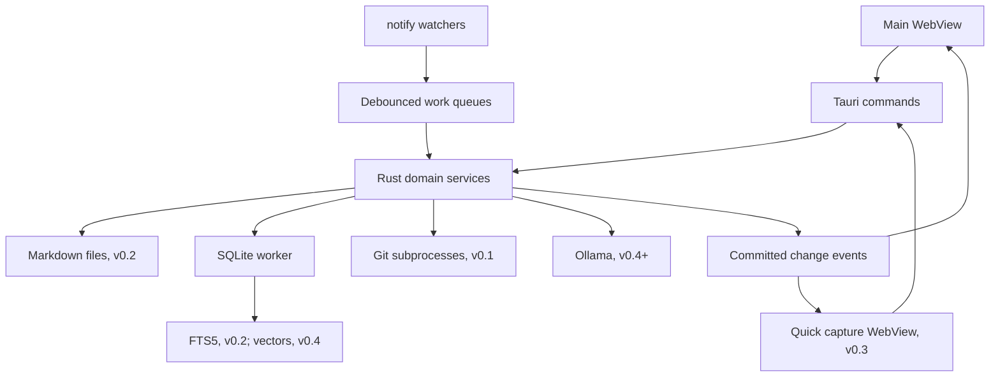

# Architecture

How Brainiac is built. This document matches the code: a change that makes it wrong updates it in the same commit. What the app does is in [`SPEC.md`](../SPEC.md); plans for later releases are in [`roadmap.md`](roadmap.md).

## Technology stack

Rust owns application behavior and persistence. The UI remains a web frontend inside Tauri's system WebView; using Rust does not require implementing the frontend in Rust/WASM. [Tauri overview](https://v2.tauri.app/)

| Layer | Proposed technology | Responsibility |
| --- | --- | --- |
| Desktop shell | **Tauri v2** | Windows, menus, application lifecycle, IPC, packaging |
| Backend | **Rust**, stable toolchain | Domain services, safe file operations, indexing, integrations |
| Frontend | **React + TypeScript + Vite** | Editor, navigation, task views, dashboard |
| Styling | **Tailwind CSS** and application design tokens | Consistent density, spacing, theme, focus states |
| Note editor, v0.2 | **CodeMirror 6** with `@codemirror/lang-markdown` and Brainiac's Live Preview decorations | Edit the note's Markdown text; Live Preview draws formatting over it without changing it, and Source mode turns the decorations off |
| Database | **SQLite through `rusqlite`**, bundled SQLite | Tasks, settings, metadata, transactions, FTS5 |
| Async orchestration | **Tokio**, through Tauri's async runtime | Queues, timers, HTTP, cancellation, process orchestration |
| File watching | **`notify`** | Vault changes and repository invalidation |
| Markdown parsing, v0.2 | **`pulldown-cmark`** | Backend extraction of headings, text, and links |
| Serialization/errors | **`serde`, `serde_json`, `thiserror`** | IPC DTOs, configuration, structured errors |
| Identity/content versions | **`uuid`, `sha2`** | Stable IDs and SHA-256 content hashes |
| Git inspection, v0.1 | **System Git CLI invoked from Rust** | Status, discovery, history, refs, file contents, and diffs |
| Local inference, later | **Ollama via `reqwest`** | Embeddings and streamed generation |
| Vector storage, later | **`sqlite-vec` Rust binding** | Local nearest-neighbor retrieval |
| Diagnostics | **`tracing`** | Local structured logs and timings |

Use `rusqlite` with `bundled` to control the SQLite version and `backup` for consistent database snapshots. v0.1 uses SQLite for workspaces, repository registration, pins, and settings. Introduce note/task schemas and verify FTS5 in v0.2; these must not block the Git MVP. Frontend code receives domain commands rather than direct SQL access. [rusqlite documentation](https://github.com/rusqlite/rusqlite)

Commit `Cargo.lock` and the frontend package lockfile. Pin a tested Rust toolchain and compatible Tauri v2 dependency set at bootstrap; record updates deliberately. Exact crate and frontend versions are implementation decisions, not guessed constraints in this document.

## Backend

Start with one Cargo package and a few Rust modules organized by feature. Keep business logic independent of Tauri so it can be tested without launching a WebView. Additional packages and layered directories are unnecessary for the initial release.



### Project layout for the first release

The top-level `src/` contains the web frontend; `src-tauri/` contains a normal Cargo project plus Tauri configuration. This split follows the standard Tauri scaffold. The Rust module names below are our application choices, not framework requirements. [Tauri project structure](https://v2.tauri.app/start/project-structure/)

```text
brainiac/
  SPEC.md                      What the app does
  docs/                        architecture.md, roadmap.md, RELEASING.md
  package.json                 Frontend dependencies and scripts
  index.html                   Frontend entry document
  src/                         React/TypeScript frontend
    main.tsx                   Mount the React app
    App.tsx                    Main layout
    components/                Repository table, changes, history, diff, palette
    lib/                       Typed IPC client
  src-tauri/
    Cargo.toml                 Rust package metadata and dependencies
    Cargo.lock                 Exact resolved Rust dependencies
    build.rs                   Tauri build integration
    tauri.conf.json             Application/window/bundle configuration
    capabilities/              WebView permissions
    icons/                     Application icons
    migrations/                Ordered SQL migrations
    src/
      main.rs                  Small desktop entry point calling lib.rs
      lib.rs                   Tauri setup, shared state, command registration
      commands.rs              Thin IPC handlers calling application modules
      models.rs                Entities, DTOs, structured errors
      db.rs                    SQLite worker, migrations, backup
      workspaces.rs            Repository registration, membership, workspace import
      git.rs                   Git discovery, status, refs, history, diffs, fetch
      watcher.rs               Repository notifications and refresh scheduling
      fetcher.rs               How a fetch runs: remote, refspecs, locks, concurrency, backoff
      activity.rs              Ref tracking per Git directory, events, per-workspace feeds, team pulse
      workspaces/              Membership, and the service glue for the feed and fetching
    tests/                     Integration tests; unit tests can live in modules
```

Create modules as their behavior is implemented; the scaffold does not need empty placeholders for every file. Add `vault.rs` (scan, reconciliation, the vault watcher), `notes.rs` (read, save, trash, revisions), `index.rs` (note bodies, search, links between notes), and `tasks.rs` in v0.2; `imports.rs` in v0.3; then AI modules at their milestones. The initial project does not need an editor or content-ingestion dependencies.

In Rust, a **package** is described by `Cargo.toml`; a **crate** is a compilation unit, such as its library or executable; a **module** organizes code within a crate. Tauri's scaffold has a small desktop binary (`main.rs`) that delegates to the application library (`lib.rs`). This is scaffold reuse, not a separate backend service.

Files become modules through declarations such as `mod notes;` in `lib.rs`. A directory does not automatically become a package. When a module grows, split it into submodules: for example, `notes.rs` can become a module root at `notes/mod.rs` with `notes/save.rs` and `notes/recovery.rs`. Add that structure when the code needs it.

### Concurrency and lifecycle

- Keep database connections owned by a dedicated blocking database worker. Commands communicate through bounded queues and response channels.
- Filesystem parsing, hashing, and other blocking work run on bounded workers, never the UI thread or an async executor thread directly.
- Use one serialized write pipeline per note and optimistic versions for task updates.
- Coalesce watcher events by resource. One active job and one pending refresh per resource prevent unbounded queues.
- Start with two concurrent Git status jobs and one embedding job; adjust after measurement.
- On sleep, suspend timers; on wake and application activation, reconcile stale state.
- On quit, flush accepted saves and draft checkpoints, cancel jobs, close the database, and unregister shortcuts. If flushing fails, preserve the draft and offer retry or quit with recovery.
- Support a single application instance. Before v0.3, closing the last window quits after flushing. In v0.3, closing the window may keep capture available in the menu bar; `Cmd+Q` still quits.

## Storage

### Sources of truth

| Data | Authoritative store | Rebuildable? |
| --- | --- | --- |
| Saved note body and frontmatter | Markdown files in the selected vault | Search metadata can be rebuilt from files |
| Imported source snapshots and provenance | Markdown frontmatter/body and any retained original files in the vault | Source cache can be rebuilt; originals must be backed up |
| Pending import jobs and uncommitted previews | SQLite plus managed staging files where needed | Requires recovery until a note is committed |
| Tasks, planned dates, deadlines, associations | `brainiac.db` | Requires backup/export |
| Note identities without embedded IDs | `brainiac.db` | Requires backup to preserve exact associations |
| Pins, workspace membership, settings | `brainiac.db` | Requires backup/export |
| Repository snapshots | `brainiac.db` cache columns | Yes |
| Note bodies, search, links between notes | `index.db` | Yes, from the vault |
| Chunks and embeddings | `index.db` | Yes, from the vault and model configuration |
| Revisions and unsaved editor drafts | `history.db` | Recovery data, not the saved note |

This ownership table covers the full roadmap. In v0.1, persist workspace membership, repository registration, pins, and settings; cache Git observations with timestamps; keep the activity feed's ref tips and events. Note/task/import stores are introduced at their later milestones.

`brainiac.db` (the file named `brainiac.sqlite3` today) holds only data that cannot be rebuilt; everything derived lives in `index.db`, which can be deleted to rebuild search (Storage layout, below).

Use Tauri's application data directory for the database, recovery journal, and managed backups. The user chooses the Markdown vault; its location is not hard-coded. Keep paths inside the vault relative so relocating the vault does not invalidate every record.

Opening the database (`db::Db::open`) checks two header fields SQLite itself never enforces. `PRAGMA application_id` is set to Brainiac's (`db::APPLICATION_ID`) after migrating, so every snapshot carries it; a file with another non-zero ID is refused, and a file with 0 (from before 0.1.3) is adopted. `PRAGMA user_version` is the number of applied migrations; a file newer than this build's `db::SCHEMA_VERSION` is refused before anything writes to it, because older code would ignore tables it does not know. Either refusal hides the main window and shows a dialog naming the backups folder; dismissing it quits. Snapshots (before migrations and daily, seven kept) are copied with SQLite's backup API on the worker's own connection into a hidden `.<name>.partial` file that is renamed into place when complete, so a crash never leaves a partial file that looks like a snapshot; leftovers are removed with the next daily snapshot.

### Storage layout — v0.2

Only two things cannot be rebuilt: the vault's Markdown files and a small core database. Everything else is a cache that can be discarded and rebuilt from them, which decides where data lives, what is backed up, and how restore works.

| File | Holds | Rebuildable | Backed up |
| --- | --- | --- | --- |
| Vault (`.md` files) | Note text, frontmatter including `brainiac_id`, links written in notes | Source of truth | By the user, and in Brainiac's export |
| `brainiac.db` | Settings, repositories, workspaces, pins, activity, vaults, note identity, tasks and their search table, note-to-repository links | No | Snapshots before migrations and daily, and export |
| `index.db` | Note bodies, the notes search table, parsed links between notes; chunks and vectors from v0.4 | Yes, from the vault | Never; rebuilt after a restore |
| `history.db` | Note revisions and draft checkpoints | No, but optional | Its own snapshots, less often than `brainiac.db` |

- Under WAL, a transaction across attached database files is atomic within each file but not across them; a crash during commit can leave one file updated and another not. [SQLite ATTACH](https://www.sqlite.org/lang_attach.html) The split is safe only because `index.db` is rebuildable: each indexed row records the content hash it was built from, and startup re-indexes rows whose hash no longer matches `brainiac.db`.
- The split keeps snapshots small (copies of the core, not of every note body and revision) and lets indexing write to `index.db` on its own connection instead of queueing behind Git queries on the core database's worker. Indexing commits in transactions of at most 200 notes, and search and list queries use a read-only connection.
- Every file carries `PRAGMA application_id` and is checked on open, as `brainiac.db` is today.
- Note-to-repository links have no foreign key to `repositories`: removing a repository keeps the link, with the repository's name and remote URL copied onto it when it was made. `repositories` gains `remote_url` (the `origin` fetch URL, refreshed on observation), which restore and reconnection match on.

### Data model

Tables of v0.3 onward are in `docs/roadmap.md` and are not created before their release. IDs are UUID strings and timestamps are UTC instants. The v0.1 schema is `src-tauri/migrations/0001_init.sql`; v0.2's core tables arrive in `0002`, and `index.db` and `history.db` get their own migration lists.

| Entity | Essential fields and constraints | Release |
| --- | --- | --- |
| `pins` | `entity_type`, `entity_id`, `position`; repository/workspace pins in v0.1, note pins in v0.2; unique entity | v0.1 |
| `settings` | `key`, `value_json`, `version` | v0.1 |
| `workspaces` | `id`, `name`, `discovery_mode` (`discovered`, `manual`), `root_repository_id?`, `discovery_root?`, `discovery_path?`; activity settings: watched branch and tag patterns and since when each is watched, `auto_fetch`, `notify_moves`, `morning_digest`, `warn_conflicts`, `last_digest_on?` | v0.1 |
| `workspace_members` | `id`, `workspace_id`, `display_name`, `canonical_path`, `origin` (`discovered`, `manual`), `repository_id?` (absent for non-Git folders); unique path per workspace, so one repository can belong to several workspaces | v0.1 |
| `repositories` | `id`, `canonical_root`, `git_dir`, `common_git_dir`, `last_opened_at?` (drives the Recent list), `last_checked_at`, cached status/error as JSON, `last_fetch_at?` and `last_fetch_error?` of Brainiac's own fetches | v0.1 |
| `ref_baselines` | `git_store` (a `common_git_dir`), `watched_json`, `taken_at`; which watched patterns the stored tips cover, derived and rebuildable | v0.1 |
| `ref_tips` | `git_store`, `ref_name`, `target_id`; the last seen tip of each watched remote-tracking branch and tag, derived and rebuildable | v0.1 |
| `activity_events` | `id`, `git_store`, `kind` (`advanced`, `rewritten`, `created`, `tagged`), `ref_name` (full), `match_name` (what patterns match), `old_id?`, `new_id`, `observed_at`, `seen_at?`, detail JSON (commits, authors, overlapping paths, drift); pruned after 90 days | v0.1 |

v0.2 adds, with the file each lives in:

| Entity | File | Essential fields and constraints |
| --- | --- | --- |
| `repositories.remote_url` | core | New column; see Storage layout |
| `vaults` | core | `id`, `name`, `root_path`; one active vault initially |
| `notes` | core | `id`, `vault_id`, `relative_path`, `embedded_id?`, `title`, `content_hash`, `mtime`, `last_opened_at?`, `missing_at?`; unique live path per vault; missing notes stay as tombstones so tasks keep their context |
| `tasks` | core | `id`, `title`, `description`, `status`, `triaged_at?`, `planned_date?`, `due_date?`, `linked_note_id?`, `linked_repository_id?`, `created_at`, `updated_at`, `completed_at?`, `version` |
| `task_statuses` | core | Lookup table: `todo`, `in_progress`, `done`, `cancelled` |
| `task_search` | core | External-content FTS5 over `tasks` (title, description), kept in step by triggers in the task's own transaction |
| `task_title_search` | core | External-content FTS5 over `tasks` (title) with the trigram tokenizer, kept in step by the same triggers |
| `note_repository_links` | core | `note_id`, `repository_id`, `repository_name`, `remote_url?`, `created_at`; no foreign key to `repositories` |
| `pin_entity_types` | core | Gains `note` |
| `note_bodies` | index | `note_id`, `content_hash`, `title`, `relative_path`, `body`; the content table for `note_search` and `note_name_search` |
| `note_search` | index | External-content FTS5 over `note_bodies` (title, body) |
| `note_name_search` | index | External-content FTS5 over `note_bodies` (title, relative path) with the trigram tokenizer |
| `note_links` | index | `source_note_id`, `target_note_id?`, `raw_target`, kind (Markdown link or wikilink), source location; unresolved links retained |
| `note_revisions` | history | `id`, `note_id`, `content`, `content_hash`, `created_at`, `reason` (`app_save`, `external_change`, `restore`) |
| `drafts` | history | `note_id`, `base_hash`, `content`, `updated_at`; one per note with unsaved edits |

`planned_date` and `due_date` are local calendar dates (`YYYY-MM-DD`), not UTC instants, so Today does not shift with time zones or daylight saving. Completing a task sets `completed_at`; reopening clears it; a task is to sort while `triaged_at` is empty. Every task write carries the expected `version` and fails with `CONFLICT` when it changed.

Use foreign keys, WAL mode, a bounded busy timeout, and explicit transactions. Repository status is a cache with an observation time, never an authoritative copy of Git state.

### Notes, indexing, and backups — v0.2

**Save contract.** `read_note` returns Markdown and a version, its SHA-256 hash. `save_note` submits the expected version and the new Markdown:

1. Persist a draft checkpoint in `history.db` and serialize app-originated writes to this note.
2. Read the current file and compare its hash with the expected version; if it differs, return `CONFLICT` and keep both the draft and the disk version.
3. Store the pre-save file as a revision. If that fails, stop and keep the draft.
4. Write a temporary sibling file, flush it, recheck the disk version, and atomically replace the destination, preserving permissions and syncing the directory where supported.
5. Update the note's metadata in `brainiac.db`, then its body, search row, and links in `index.db`, in separate transactions; an interrupted index update is found by its content hash and redone.
6. Return the new version and emit `note_changed`. If indexing failed after the file write, report "Saved; search update pending" and queue a repair.

The filesystem and SQLite do not share a transaction, and hash checks cannot be a compare-and-swap against arbitrary external editors; revisions and drafts cover that residual race.

**Vault watcher.** `notify` watches the vault's directories so atomic-replace saves are seen. Callbacks only queue work; a per-note queue debounces for about 300 ms, then reads and hashes. A hash equal to the accepted version is a no-op, including the app's own writes. Before re-indexing an outside change, the previously indexed text from `index.db` is stored as a revision with reason `external_change`. Startup, wake, watcher errors, and manual refresh run a full reconciliation; notifications only speed it up.

**Search.** `note_search` and `task_search` are external-content FTS5 tables: text is stored once in a table Brainiac owns, triggers keep the index in step in the same transaction, `integrity-check` detects drift, and `rebuild` regenerates it from the content table, which a contentless table cannot do. `note_search` and `task_search` use the `unicode61` tokenizer with `remove_diacritics 2`, which splits identifiers at `_`, `::`, `/`, `.`, and `-`, so `fetch_with_backoff` is a phrase of three words. `note_name_search` and `task_title_search` use `trigram` with `remove_diacritics 1` so titles and paths match any part of a word; bodies are not trigram-indexed (Decisions, 2 Oct 2026). User input is compiled into safe FTS expressions, never passed through: control characters are removed, each bare word and each quoted phrase is quoted so FTS5 syntax stays literal, every bare word gets `*` so it also matches as a prefix, and terms are joined with `AND`. Terms shorter than three characters skip the trigram tables. Ranking uses `bm25` with title weighted highest; snippets come from the `unicode61` tables. A search queries the text and name tables and the in-memory repository list and merges the results and the in-memory repository list and merges the results. [SQLite FTS5](https://www.sqlite.org/fts5.html)

**Backups.** Snapshots of `brainiac.db` keep the v0.1 mechanism (backup API on the worker's connection, written under a temporary name and renamed). `history.db` is snapshotted the same way on its own schedule; `index.db` never is. An export writes the vault, a `VACUUM INTO` copy of `brainiac.db` (consistent and compacted), tasks as JSON, and a versioned manifest: schema version, vault ID, each note's ID, relative path, and content hash, and each linked repository's name and remote URL. Application writes are serialized during an export; a file changed meanwhile is retried or reported. Restore validates the application ID, manifest, and schema before replacing anything, matches notes by `brainiac_id`, then path and hash, matches repositories by remote URL, and rebuilds `index.db`. [VACUUM INTO](https://www.sqlite.org/lang_vacuum.html)

**One write path.** Every write, whoever asks for it, goes through a domain service, and the service (not the Tauri handler) emits the committed change event. The UI, the vault watcher, and the local MCP server planned for v0.2.x (`docs/roadmap.md`) then get identical validation, version conflicts, and live updates.

### Evolving the data

- Migrations stay append-only and run at startup after a pre-migration snapshot; an app refuses a database newer than it knows (Storage, above). That is enough for one user on one machine.
- Rows use UUIDs, notes are identified by vault ID plus relative path, and unknown frontmatter keys are preserved, so multiple vaults or sync can be added later without rewriting identity. Absolute paths stay only where they are local by nature, such as a repository's folder; its remote URL is the identity that travels.
- Sync, if it comes, cannot migrate every device at once, because devices run different app versions: record a format version on synced records and translate on read. [Ink & Switch: Cambria](https://www.inkandswitch.com/cambria/)
- New embedding models or chunkers (v0.4) add a profile; they never change existing vectors in place.

## Git

Invoke the system Git binary with argument arrays and timeouts, using machine-readable output such as `git status --porcelain=v2 --branch -z`. Parse NUL-delimited paths and distinguish staged versus unstaged states. [Git status documentation](https://git-scm.com/docs/git-status)

Run Git without a pager, with lazy fetching disabled (`GIT_NO_LAZY_FETCH=1`, so a partial clone never downloads missing objects behind a read; Git before 2.44 ignores it), with optional locks disabled for inspection, and with external diff/textconv helpers disabled for patch/content operations. Validate revision/path inputs, separate path arguments with `--`, and never interpolate them into a shell. Do not execute repository hooks, imported tasks, or custom shell actions.

Use the CLI first for compatibility with the user's installed Git. Hide it behind a `GitService` boundary; `git2` or `gix` can be evaluated later if measured bottlenecks justify another implementation.

### Fetch invocation

Fetching (`SPEC.md`, Fetching) is the only command that writes to a repository. Every fetch runs, with explicit refspecs that are each checked to write only `refs/remotes/<remote>/` or `refs/tags/`:

```text
git -c gc.auto=0 -c maintenance.auto=false -c fetch.prune=false -c fetch.pruneTags=false
    -c fetch.writeCommitGraph=false -c core.hooksPath=/dev/null
    fetch --refmap= --no-prune --no-prune-tags --no-auto-gc --no-auto-maintenance
          --no-recurse-submodules --no-write-fetch-head --quiet <remote> <refspecs>
```

- Command-line options beat per-remote configuration such as `remote.<name>.prune`; the empty `--refmap` stops Git from also applying the configured `remote.<name>.fetch` refspecs to what it fetched.
- The environment sets `GIT_TERMINAL_PROMPT=0`, `GCM_INTERACTIVE=never`, empty `GIT_ASKPASS`/`SSH_ASKPASS`, and, unless the user configured `core.sshCommand`, `GIT_SSH_COMMAND="ssh -o BatchMode=yes -o ConnectTimeout=15"`.
- Timeout 60 seconds. Git is stopped with SIGTERM, which lets it remove its lock files, and only killed if it is still running three seconds later.
- `-c transfer.bundleURI=false` keeps a fetch from downloading bundles into `refs/bundles/`.
- `crate::fetcher::Fetcher` owns remote and refspec choice, lock checks, one fetch per Git directory (later requests join it), outcome recording, auto-fetch scheduling and backoff, and the branches a remote no longer has; it reports `Fetched`, `Joined`, `Busy`, or `Failed`. `GitService::fetch` owns the command line.
- On a timeout, and when output is truncated, Git's stdout is closed or the process stopped right away, so a large diff comes back truncated instead of timing out.

### Activity tracking

`crate::activity::ActivityTracker` is the only code that reads or writes `ref_baselines`, `ref_tips`, and `activity_events` (its private `store` module), so its in-memory state (per-directory locks, fingerprints, the team-pulse cache) cannot go stale behind its back. Removing a repository's last checkout calls `ActivityTracker::forget`; relocating a registration can call `ActivityTracker::relocate`, which re-keys a Git directory's baseline, tips, and events under both directories' locks and does nothing when the old key holds nothing (a repeated relocation). The relocation transaction re-reads each registration and fails with `CONFLICT` when another relocation changed it first. Feeds, unread counts, and Mark seen filter in SQL: a pattern's `*` is SQLite's `GLOB` `*`, and each pattern also has a start time (`workspaces.watched_since_json`).

## IPC

The app exposes repository and workspace registration, Git queries, fetching, the activity feed, settings and pins, and application snapshots; v0.2 adds the vault, notes, tasks, search, and backups. Commands of v0.3 onward are in `docs/roadmap.md`.

Commands are thin adapters over Rust services. Use `#[tauri::command]`, serializable request/response DTOs, and a typed TypeScript client. Generate DTO types from Rust or verify shared schemas in CI; do not assume Tauri automatically creates complete TypeScript bindings. [Tauri command documentation](https://v2.tauri.app/develop/calling-rust/)

| Command | Important input/output |
| --- | --- |
| `get_app_snapshot` | Repositories, workspaces, pins, recents, settings, and the snapshot version |
| `register_repository` / `create_workspace` / `discover_repositories` / `update_workspace_membership` / `refresh_repository` | v0.1: validated registration, discovered/manual workspace configuration, discovered candidates, selected membership, timestamped status |
| `relocate_repository` / `rescan_workspace` | v0.1: a moved registration's new folder, or what it needs confirmed; a discovered workspace's untracked repositories and suggested moves |
| `list_repositories` / `list_changes` / `get_diff` | v0.1: workspace/filter scope, repository ID, diff kind and safe file selector; bounded results |
| `list_commits` / `get_commit` / `list_refs` | v0.1: repository/ref scope, pagination cursor or commit ID; history/details/ref DTOs |
| `fetch_repository` | v0.1: repository ID; fetch outcome with the refs that moved |
| `get_workspace_activity` / `get_team_pulse` / `mark_activity_seen` / `update_activity_settings` | v0.1: workspace ID; feed and freshness; team pulse; seen markers; watched refs and notification settings |
| `select_vault` | v0.2: native folder selection; vault and scan state |
| `list_notes` / `read_note` | v0.2: folder or filter with pagination; content plus hash version |
| `create_note` / `rename_note` / `trash_note` / `restore_note` | v0.2: vault-relative destination, collision handling, expected version; rename optionally updates links in other notes |
| `save_note` | v0.2: note ID, expected hash, Markdown; new version or `CONFLICT` |
| `link_repository` / `unlink_repository` | v0.2: note ID and repository ID |
| `list_tasks` / `create_task` / `update_task` / `delete_task` | v0.2: filter or mutation DTO; expected integer version on existing tasks |
| `search` | v0.2: query, kind filters, pagination; ranked results with escaped snippets and highlight ranges, and the index state |
| `rebuild_search` / `export_backup` / `restore_backup` | v0.2: job ID, progress, and explicit completion |

Errors expose stable codes: `VALIDATION`, `NOT_FOUND`, `CONFLICT`, `PERMISSION_DENIED`, `IO`, `DB`, `DEPENDENCY_UNAVAILABLE`, `TIMEOUT`, and `CANCELLED`. Include a user-facing message and retryability, keeping low-level diagnostics in local logs.

### Types and conventions

The request and response types are defined once, in `src-tauri/src/models.rs`, and exported by `ts-rs` to `src/lib/generated/` (the documentation comments travel with them). Change a shape there, describe any behavior change in `SPEC.md`, and regenerate with `cargo test`.

- IDs are UUID strings; timestamps are RFC 3339 UTC strings; enum values are `snake_case` strings.
- Optional fields serialize as `null`, so TypeScript sees `T | null`.
- Paths inside a repository are repository-relative with forward slashes, exactly as Git reports them.
- History cursors are opaque strings encoding the anchor commit and offset; a cursor from another anchor is rejected with `VALIDATION`.
- `RepositoryChangedEvent.changed` is false when a timer/wake poll or a `list_changes` call observed the same status as before; watcher, manual refresh, fetch, and registration events are always changed.

Commands map onto these as follows: `get_app_snapshot → AppSnapshot`; `register_repository(path) → RepositorySummary`; `remove_repository(id)`; `open_repository(id)` marks it recent; `set_repository_tab(id, tab)`; `open_in_editor(id, path?, line?)`; `reveal_in_finder(id, path?)`; `discover_repositories(folder_path, discovery_path?) → WorkspacePreview`; `rescan_workspace(workspace_id) → WorkspaceRescan`; `relocate_repository(RelocateRepositoryRequest) → RelocationOutcome` fails with `CONFLICT` when another registration has the folder, writes nothing when it returns `needs_confirmation`, and re-watches every registration that moved; `create_workspace(CreateWorkspaceRequest) → Workspace`; `update_workspace_membership(UpdateWorkspaceMembershipRequest) → Workspace`; `rename_workspace(workspace_id, name) → Workspace`; `remove_workspace(workspace_id)` also deletes its pin and keeps member registrations; `set_pinned(entity_type, entity_id, pinned)`; `refresh_repository(id) → RepositorySummary`; `list_changes(id) → ChangesResult`; `get_diff(id, DiffSelector, DiffOptions?) → DiffResult`; `list_commits(ListCommitsRequest) → CommitPage`; `get_commit(id, commit_id, parent_index?) → CommitDetail`; `list_refs(id) → RefsResult`; `fetch_repository(id) → FetchResult` fails with `CONFLICT` when another Git process holds a lock and `PERMISSION_DENIED` when the remote needs sign-in; `get_workspace_activity(workspace_id) → WorkspaceActivity`; `get_team_pulse(workspace_id) → TeamPulse`; `mark_activity_seen(workspace_id, event_ids?)` marks the given events, or all of the workspace's, as seen; `update_activity_settings(workspace_id, ActivitySettings) → Workspace`. Every result carries the repository ID so a late response for a previously selected repository can be discarded by the frontend.

Events are `repository_changed` and `menu`; v0.2 adds `note_changed`, `note_missing`, `task_changed`, and `index_status_changed`, each emitted by the domain service that committed the change. Scope payloads to the authorized window. Do not broadcast note contents through global events. Commands return definitive state even if an event is missed. [Tauri frontend events](https://v2.tauri.app/develop/calling-frontend/)

## Security, privacy, and distribution

Tauri capabilities constrain which windows can access core/plugin APIs. Define separate main and capture capabilities, explicitly select them in configuration, and avoid permissions shared unintentionally across windows. [Tauri capabilities](https://v2.tauri.app/security/capabilities/)

- Keep generic filesystem, SQL, HTTP, and shell execution unavailable to JavaScript. Rust services implement narrow operations.
- Custom commands validate caller window and operation authorization; plugin capabilities do not replace backend checks on custom filesystem/process commands.
- Validate vault-relative paths and reject traversal, collisions, and symlink escapes. In v0.2, keep vault traversal inside its selected root. In v0.1, constrain repository file previews to registered repository roots and distinguish symlinks from regular files.
- Load packaged UI assets only. Apply a restrictive production CSP and sanitize rendered Markdown; raw note HTML must not execute scripts.
- Allow local images inside the vault through a scoped asset mechanism. Block remote image fetching by default to avoid unintended requests.
- Open approved `http`/`https` links externally; never treat a note link as a shell command.
- Invoke Git/editor executables with fixed argument arrays and bounded execution. Imported workspace content never supplies arbitrary executable code.
- Keep credentials in macOS Keychain when remote integrations arrive. Logs exclude note bodies, model prompts, tokens, and credentials. Fetching uses Git's own credential configuration and never asks for or stores credentials itself.
- macOS notifications (`tauri-plugin-notification`) are sent from Rust only, for workspaces that turned them on; the WebView gets no notification permission.
- No telemetry or remote inference by default. Local storage is ordinary plaintext; application-level encryption is future scope.

Proposed support target is macOS 13+ on Apple Silicon, validated against the selected Tauri dependencies. Intel support requires its own build and test pass before being claimed. Distribute a direct-download `.app`/DMG initially; App Store sandboxing is a separate decision. [Tauri macOS bundles](https://v2.tauri.app/distribute/macos-application-bundle/)

Sign and notarize builds before distribution to other users. Verify packaged builds on a clean supported Mac. Releases are tag-driven GitHub releases built by CI (`docs/RELEASING.md`), and the app updates itself from the latest release through the Tauri updater: artifacts are signed with a minisign key held outside the repository, the public key is embedded in `tauri.conf.json`, and the app checks silently after launch plus on demand from "Check for Updates…". Apple Developer signing and notarization are optional in the workflow and switched on by adding the secrets. [Tauri macOS signing](https://v2.tauri.app/distribute/sign/macos/), [Tauri updater](https://v2.tauri.app/plugin/updater/)

## Quality and verification

These are initial targets to measure, not framework guarantees. Use a release build on a reference Apple Silicon Mac with 16 GiB RAM; record its exact model and OS in benchmark results.

| Measurement | Initial target |
| --- | --- |
| Warm launch to interactive UI | Under 2 seconds; repository refresh continues in background |
| Open a 100 KiB indexed note, v0.2 | p95 under 150 ms |
| Keyword results, v0.2, 10,000 notes / ~100 MiB text | p95 under 150 ms, excluding typing debounce |
| Normal note save visible in search, v0.2 | Within 2 seconds |
| Local note edit reflected in an idle editor, v0.2 | Within 2 seconds when watcher delivery succeeds |
| Selected text diff / first 100 history records, v0.1 | p95 under 500 ms on representative repos, with visible loading beyond that |
| Local Git change reflected in viewer, v0.1 | Within 2 seconds after event delivery on representative repos; stale state visible otherwise |
| Quick-capture activation, v0.3 | p95 under 250 ms with warm window |
| Idle CPU with dashboard/AI inactive | Under 1% averaged over five minutes |
| Core app memory, AI runtime excluded | Initial budget under 250 MiB, measured across app/WebView processes |

Benchmark a 20-repository workspace in v0.1, including at least one large real-world repository. Determine repository refresh and watcher limits from that fixture rather than imposing an arbitrary repository size threshold.

### Required verification

Apply checks at the milestone that introduces the behavior. v0.1 is gated by Git/viewer/workspace persistence and macOS smoke tests; note/editor/import/AI tests belong to their later releases.

- Rust unit tests for task transitions, date behavior, path validation, query compilation, and parsing. Query compilation is tested with malformed and hostile input (unbalanced quotes, FTS5 operators and column filters, `*`, `^`, NUL and other control characters, input with no word characters): none may produce an error.
- Temporary-directory integration tests for atomic saves, observed conflicts, external replacement/rename/delete, missing vaults, and write failures.
- Migration/backup/restore tests that preserve tasks and associations and independently rebuild search.
- Editor fixtures verifying that an edit saves only the edited text (line endings, final newline, frontmatter, HTML, and unknown syntax untouched); dirty-buffer recovery after an interrupted save. Live Preview tests (`pnpm test:editor`, `e2e/editor/`) run the editor in WebKit with real keyboard and mouse input: opening, scrolling, and switching modes leave the text identical to the file; the cursor reaches every line and character and clicks land on the clicked character across hidden markup; undo, copying, and scrolling past images behave; a keystroke in a 5 MiB note reaches the screen within 50 ms; and no web request is made.
- Git fixtures for unstaged edits without `.git` changes, simultaneous staged/unstaged edits, untracked files, renames, conflicts, detached HEAD, empty repositories, linked worktrees, ignored directories, and subprocess timeout. Verify root/merge commit diffs, ref-scoped history pagination, binary/oversized diff handling, unusual filenames, rapid selection changes, and partial multi-repository failure. Inspection must not modify working files, refs, or index contents; a fetch (tested against a local bare remote) changes only remote-tracking refs and tags. Activity fixtures cover a baseline, a fast-forward, a force-push, a new tag, and an overlap with working-tree changes.
- Async tests for event bursts, superseded indexing jobs, cancellation, and window snapshot recovery.
- Manual macOS smoke tests for shortcuts, menus, focus, Spaces, appearance/accessibility settings, and packaged application behavior.
- Frontend component/browser tests can mock IPC. They do not replace actual WebView smoke tests: Tauri's WebDriver documentation does not offer macOS desktop support. [Tauri WebDriver limitations](https://v2.tauri.app/develop/tests/webdriver/)

CI should run Rust formatting, Clippy, Rust tests, frontend type checks/tests, and a macOS release build. Add dependency/license review before public distribution. Keep tests focused on behavior that could lose data or break the core workflows.

## Decisions

Decisions already made. Add new ones at the end with a date; do not edit an accepted one, write a new entry that replaces it.

### Bootstrap choices

- **Rust ↔ TypeScript types: `ts-rs`.** Every DTO in `models.rs` derives `serde::Serialize`/`Deserialize` and `ts_rs::TS`. A Rust test (`cargo test`) exports the generated `.ts` files into `src/lib/generated/`, which is committed. The hand-written IPC client in `src/lib/ipc.ts` wraps each `invoke` call with these types. CI fails if the exported files differ from the committed ones. `tauri-specta` was considered and rejected for now because its Tauri v2 line is still a release candidate; it can replace the hand-written wrappers later without changing the DTOs.
- **Package manager: `pnpm`** (already installed). **Rust toolchain: stable via `rustup`**, pinned in `rust-toolchain.toml`.
- **Minimum Git: 2.30.** The hard floor for `--porcelain=v2` is 2.11; 2.30 is a conservative floor. Detect the version at startup and show the setup message below it.
- **Open in editor default: VS Code's `code` CLI**, invoked as `code <path>` for a repository root and `code -g <file>:<line>` for a file. The executable and argument template are a setting so another editor can be configured; no editor detection beyond checking the configured executable exists.
- **Backup scope in v0.1: SQLite snapshots only** (before migrations and once per active day). The export/restore manifest with vault files is v0.2.
- **Open source from day one.** Proposed license: `MIT OR Apache-2.0`, the Rust ecosystem convention; confirm before the first public push. Git test fixtures are created by the tests themselves in temporary directories, so no real repository or workspace file is committed.

### Established direction

- macOS first, Rust backend, Tauri v2 desktop shell.
- Local Markdown is authoritative for saved notes.
- External content enters through a shared import pipeline as source-preserving Inbox notes.
- SQLite stores authoritative tasks/application data and rebuildable search caches.
- Keyword and vector search coexist; optional local AI follows usable retrieval.
- Multi-repository workspace support is part of the product roadmap.
- Workspaces impose no folder layout: they are built by manual selection or by discovering repositories inside a user-chosen folder, which may itself be a root repository.
- Open source from day one: the repository holds no company-specific paths, workspace files, or credentials, and test fixtures are synthetic.

### Proposed defaults

- React/TypeScript frontend, TipTap with a mandatory source fallback.
- User priority: Git viewer and single/multi-repository tracking in v0.1; notes/tasks/keyword search in v0.2; external imports and global capture in v0.3.
- No vault required in v0.1; one vault introduced in v0.2. Use local Git CLI inspection before evaluating Rust Git libraries.
- Direct-download macOS distribution, Apple Silicon first.
- `ts-rs` for shared types, `pnpm`, Git 2.30+, VS Code `code` CLI as the default editor, SQLite-snapshot-only backup in v0.1.

### Later decisions

- **1 Oct 2026 — Fetching is the one allowed write.** Fetch now and opt-in, per-workspace auto-fetch (off by default) may update remote-tracking refs and tags with the hardened invocation above; nothing else writes to a repository.
- **2 Oct 2026 — Activity is tracked per Git directory** (`common_git_dir`), with baselines that remember the patterns they cover and per-workspace filtering on read.
- **2 Oct 2026 — Migrations folded into `0001_init.sql`** before any public release that needs an upgrade path; from the next release on, migrations are only appended.
- **2 Oct 2026 — A relocated folder is the same repository when it contains a recorded commit**: the last observed `HEAD` or a tip in the activity baseline, checked with one `git rev-list --no-walk --ignore-missing`. Paths and remote URLs are not identity. Anything else needs the user's confirmation and starts the activity feed over. The relocation lives in `workspaces/relocation.rs`; Rescan's move suggestions use the same check and run in the backend (`rescan_workspace`), replacing the frontend comparison of `discover_repositories` with the member list.
- **2 Oct 2026 — The database refuses what it cannot safely use.** Brainiac marks its database with `PRAGMA application_id` and refuses a file with another ID or with a `user_version` newer than it knows, instead of running older code over a newer schema. Snapshots are written to a temporary name and renamed when complete. These ship before the first schema change so that every version able to read v0.2's data also refuses it when too old.
- **2 Oct 2026 — v0.2 keeps data in three SQLite files beside the vault**: `brainiac.db` for what cannot be rebuilt, `index.db` for everything derived from the vault (search, links between notes, later vectors), and `history.db` for revisions and drafts. Transactions across attached files are not atomic under WAL, so only rebuildable data leaves the core file, and each indexed row records the content hash it was built from. Search uses external-content FTS5 tables so they can be checked and rebuilt.
- **2 Oct 2026 — v0.2 product choices**: no Inbox view until v0.3 (tasks to sort fold into Today); the notes section is called Notes; a vault may be a Git repository, and trash, drafts, and revisions stay out of it; `brainiac_id` is written into a note when it first gets a task or repository link; Brainiac reads Markdown links and wikilinks and writes Markdown links; notes link to repositories only, and a link survives the repository's removal.
- **2 Oct 2026 — Notes are edited as Markdown text in CodeMirror 6, styled as typed; there is no rich editor in v0.2.** This replaces the proposed TipTap editor with a source fallback. The spike (S1) round-tripped 15 fixtures through TipTap 3.31 and its Markdown extension: one came back unchanged, three once Brainiac kept line endings and the final newline itself. TipTap deleted HTML and comments, escaped wikilinks, footnotes, and `snake_case`, shortened nested code fences, merged and renumbered ordered lists, and rewrote list markers, emphasis, tables, and links. A Markdown-to-document converter cannot keep what its document model does not store, while CodeMirror edits the file's text, so a save cannot change what the user did not type. A rich editor is reconsidered only if it re-serializes just the edited blocks.
- **2 Oct 2026 — Keyword search indexes text with `unicode61` and only titles and paths with `trigram`; every query word matches as a prefix.** The spike (S2) indexed 10,000 notes (8 MB of Markdown from package documentation, plus planted notes with accents, CJK text, and identifiers) with the bundled SQLite 3.53 and ran 47 queries. `unicode61` with `remove_diacritics 2` found every match at a word start for snake_case identifiers and their parts, Rust paths, file paths, versions, and accented Catalan and Spanish words: 4.9 MB of index, built in 127 ms. `trigram` over bodies took 30.4 MB and 843 ms; it added only word parts inside camelCase identifiers and unspaced CJK text, could not use the index for words under three characters (`io` matched 7,673 notes by substring against 1,299 by word), and cut snippets to about a dozen characters. Trigram tables over titles and paths add 1.9 MB. Porter stemming was rejected: `allocator` matched 472 notes against 114. Prefixing every word, not only the last, raised two-word recall from 64% to 100% without adding results that lack a query word. A ranked top-20 query with a snippet took 0.3 ms median and 3.6 ms at most, and reindexing a saved note 0.7 ms median. A NUL character in the input made FTS5 fail with "unterminated string", so the compiler removes control characters.
- **2 Oct 2026 — The note editor gets Live Preview in v0.2, drawn with CodeMirror decorations over the note's text.** This extends the previous decision, which left out a rich mode: S1 ruled out editors that convert Markdown to their own document, not formatting drawn over the text. Live Preview hides markup away from the line being edited and draws bullets, checkboxes, rules, images from the vault, and link text as widgets; the editor's document stays the file's text, so drawing cannot rewrite a note. Source mode is the same editor with the decorations off. Web images are not loaded, so opening a note makes no network request. Tables, math, callouts, and embeds stay plain text in v0.2. A spike (S1b) checks cursor and selection movement across hidden markup, undo, copying, and scrolling a long note with images before the editor is built.
- **2 Oct 2026 — Live Preview passed its spike (S1b); the note editor is `src/lib/editor/`.** In WebKit 26, the engine Tauri uses on macOS, 18 checks passed on a typical note and a 3,000-line note with images: opening, scrolling, and switching modes left all 15 editor fixtures byte-identical; the arrow keys visit every line and character; clicks and drag selections land on the clicked characters while hidden markup appears; a checkbox click changes one character; undo and redo restore the exact text; copying gives the Markdown with the note's line endings; no web request is made; and typing in a 5 MiB note reaches the screen as fast as in a typical note (12 ms against 11 ms). The spike found four rules the module now enforces. The saved text comes from `sliceDoc()`, because `doc.toString()` joins lines with `\n` even in a CRLF note. Enter never renumbers the list items below, unlike the command in `@codemirror/lang-markdown`. Up and Down move one line at a time, because CodeMirror moves by pixels and jumped over a line drawn as an image. A caret on screen stays on screen when an image above it finishes loading.
