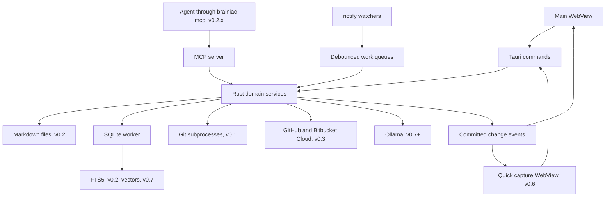
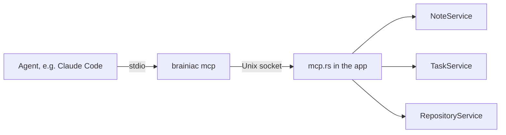

# Architecture

How Brainiac is built. This document matches the code: a change that makes it wrong updates it in the same commit. What the app does is in [`SPEC.md`](../SPEC.md); plans for later releases are in [`roadmap.md`](roadmap.md).

## Technology stack

Rust owns application behavior and persistence. The UI remains a web frontend inside Tauri's system WebView; using Rust does not require implementing the frontend in Rust/WASM. [Tauri overview](https://v2.tauri.app/)

| Layer | Proposed technology | Responsibility |
| --- | --- | --- |
| Desktop shell | **Tauri v2** | Windows, menus, application lifecycle, IPC, packaging |
| Backend | **Rust**, stable toolchain | Domain services, safe file operations, indexing, integrations |
| Frontend | **React + TypeScript + Vite** | Editor, navigation, task views, dashboard |
| Styling | **Tailwind CSS** and application design tokens | Consistent density, spacing, theme, focus states |
| Note editor, v0.2 | **CodeMirror 6** with `@codemirror/lang-markdown` and Brainiac's Live Preview decorations | Edit the note's Markdown text; Live Preview draws formatting over it without changing it, and Source mode turns the decorations off |
| Database | **SQLite through `rusqlite`**, bundled SQLite | Tasks, settings, metadata, transactions, FTS5 |
| Async orchestration | **Tokio**, through Tauri's async runtime | Queues, timers, HTTP, cancellation, process orchestration |
| File watching | **`notify`** | Vault changes and repository invalidation |
| Markdown parsing, v0.2 | **`pulldown-cmark`** | Backend extraction of headings, text, and links |
| Serialization/errors | **`serde`, `serde_json`, `thiserror`** | IPC DTOs, configuration, structured errors |
| Identity/content versions | **`uuid`, `sha2`** | Stable IDs and SHA-256 content hashes |
| Agent access, v0.2.x | **`rmcp`**, the official MCP Rust SDK | The MCP server agents reach over a Unix socket |
| HTTP, v0.3 | **`reqwest`** with rustls | GitHub and Bitbucket Cloud APIs; later Ollama |
| Credentials, v0.3 | **`security-framework`** | Brainiac's store in the macOS Keychain: account tokens, and database passwords from v0.4; from v0.4.x, other sources are read through the same layer (Secrets — v0.4.x) |
| PostgreSQL, v0.4 | **`tokio-postgres`** with **`tokio-postgres-rustls`** and **`rustls-platform-verifier`** | Query sessions over the extended protocol, cancel, TLS with the macOS trust store |
| SQL editor, v0.4 | **`@codemirror/lang-sql`** and **`@codemirror/autocomplete`** | Dialect highlighting and schema completion in the query view |
| Git inspection, v0.1 | **System Git CLI invoked from Rust** | Status, discovery, history, refs, file contents, and diffs |
| Local inference, later | **Ollama via the same `reqwest`** | Embeddings and streamed generation |
| Vector storage, later | **`sqlite-vec` Rust binding** | Local nearest-neighbor retrieval |
| Diagnostics | **`tracing`** | Local structured logs and timings |

Use `rusqlite` with `bundled` to control the SQLite version and `backup` for consistent database snapshots. v0.1 uses SQLite for workspaces, repository registration, pins, and settings. Introduce note/task schemas and verify FTS5 in v0.2; these must not block the Git MVP. Frontend code receives domain commands rather than direct SQL access. [rusqlite documentation](https://github.com/rusqlite/rusqlite)

Commit `Cargo.lock` and the frontend package lockfile. Pin a tested Rust toolchain and compatible Tauri v2 dependency set at bootstrap; record updates deliberately. Exact crate and frontend versions are implementation decisions, not guessed constraints in this document.

## Backend

Start with one Cargo package and a few Rust modules organized by feature. Keep business logic independent of Tauri so it can be tested without launching a WebView. Additional packages and layered directories are unnecessary for the initial release.



### Project layout for the first release

The top-level `src/` contains the web frontend; `src-tauri/` contains a normal Cargo project plus Tauri configuration. This split follows the standard Tauri scaffold. The Rust module names below are our application choices, not framework requirements. [Tauri project structure](https://v2.tauri.app/start/project-structure/)

```text
brainiac/
  SPEC.md                      What the app does
  docs/                        architecture.md, roadmap.md, RELEASING.md
  package.json                 Frontend dependencies and scripts
  index.html                   Frontend entry document
  src/                         React/TypeScript frontend
    main.tsx                   Mount the React app
    App.tsx                    Main layout
    components/                Repository table, changes, history, diff, palette; SettingsPage and SettingsPanes; pull requests (v0.3): PullRequestsTab, PullRequestView, AccountsSection, Markdown
    lib/                       Typed IPC client
  src-tauri/
    Cargo.toml                 Rust package metadata and dependencies
    Cargo.lock                 Exact resolved Rust dependencies
    build.rs                   Tauri build integration
    tauri.conf.json             Application/window/bundle configuration
    capabilities/              WebView permissions
    icons/                     Application icons
    migrations/                Ordered SQL migrations
    src/
      main.rs                  Small desktop entry point calling lib.rs, or the MCP helper (`brainiac mcp`)
      lib.rs                   Tauri setup, shared state, command registration
      commands.rs              Thin IPC handlers calling application modules
      models.rs                Entities, DTOs, structured errors
      db.rs                    SQLite worker, migrations, backup
      workspaces.rs            Repository registration, membership, workspace import
      git.rs                   Git discovery, status, refs, history, diffs, fetch
      watcher.rs               Repository notifications and refresh scheduling
      fetcher.rs               How a fetch runs: remote, refspecs, locks, concurrency, backoff
      activity.rs              Ref tracking per Git directory, events, per-workspace feeds, team pulse
      workspaces/              Membership, and the service glue for the feed and fetching
      vault.rs                 Choosing the vault, reconciliation, note identity, the vault watcher
      notes.rs                 NoteService: read, save, create, rename, trash, revisions, drafts, links to repositories
      notes/                   Vault files (paths, atomic writes), the core tables for notes, history.db
      index.rs                 Parsing notes, index.db, links between notes, keyword search and snippets
      tasks.rs                 TaskService: tasks with versions, Today
      backup.rs                Export, restore, and applying a restore at launch
      mcp.rs                   Agent access, v0.2.x: the socket, connections, and access mode
      mcp/                     The tools and their shapes, server instructions, the stdio helper
      forge.rs                 Pull requests, v0.3: forge identity (repositories and references)
      agents.rs                Agent runs, v0.5: Settings → Agents, engines, the image, a run's start
      agents/                  settings.rs (AgentSettingsService); engine.rs (Docker engines by socket); image.rs with image/Dockerfile and image/entrypoint.mjs; repository.rs (RunArtifacts: checks, start preview, export)
      forge/                   accounts.rs and keychain.rs; http.rs; adapter.rs (the ForgeAdapter trait, sessions, shared mapping); github.rs and bitbucket.rs; markdown.rs (pull request text as sanitized HTML); patch.rs (a provider's diff cut per file); budget.rs; cache.rs (forge.db); drafts.rs (review_drafts in brainiac.db); service.rs (PullRequestService)
    tests/                     Integration tests; unit tests can live in modules
```

The Claude Code plugin is outside the Cargo project: `.claude-plugin/marketplace.json` at the repository root lists `plugins/brainiac/`, which holds `.claude-plugin/plugin.json`, `.mcp.json`, and `skills/brainiac/SKILL.md`.

Create modules as their behavior is implemented; the scaffold does not need empty placeholders for every file. Add `imports.rs` in v0.6, then AI modules at their milestones.

In Rust, a **package** is described by `Cargo.toml`; a **crate** is a compilation unit, such as its library or executable; a **module** organizes code within a crate. Tauri's scaffold has a small desktop binary (`main.rs`) that delegates to the application library (`lib.rs`). This is scaffold reuse, not a separate backend service.

Files become modules through declarations such as `mod notes;` in `lib.rs`. A directory does not automatically become a package. When a module grows, split it into submodules: for example, `notes.rs` can become a module root at `notes/mod.rs` with `notes/save.rs` and `notes/recovery.rs`. Add that structure when the code needs it.

### Concurrency and lifecycle

- Keep database connections owned by a dedicated blocking database worker. Commands communicate through bounded queues and response channels.
- Filesystem parsing, hashing, and other blocking work run on bounded workers, never the UI thread or an async executor thread directly.
- Use one serialized write pipeline per note and optimistic versions for task updates.
- Coalesce watcher events by resource. One active job and one pending refresh per resource prevent unbounded queues.
- Start with two concurrent Git status jobs and one embedding job; adjust after measurement.
- On sleep, suspend timers; on wake and application activation, reconcile stale state.
- On quit, flush accepted saves and draft checkpoints, cancel jobs, close the database, and unregister shortcuts. If flushing fails, preserve the draft and offer retry or quit with recovery.
- Support a single application instance. Before v0.6, closing the last window quits after flushing. In v0.6, closing the window may keep capture available in the menu bar; `Cmd+Q` still quits.

## Storage

### Sources of truth

| Data | Authoritative store | Rebuildable? |
| --- | --- | --- |
| Saved note body and frontmatter | Markdown files in the selected vault | Search metadata can be rebuilt from files |
| Imported source snapshots and provenance | Markdown frontmatter/body and any retained original files in the vault | Source cache can be rebuilt; originals must be backed up |
| Pending import jobs and uncommitted previews | SQLite plus managed staging files where needed | Requires recovery until a note is committed |
| Tasks, planned dates, deadlines, associations | `brainiac.db` | Requires backup/export |
| Note identities without embedded IDs | `brainiac.db` | Requires backup to preserve exact associations |
| Pins, workspace membership, settings | `brainiac.db` | Requires backup/export |
| Repository snapshots | `brainiac.db` cache columns | Yes |
| Note bodies, search, links between notes | `index.db` | Yes, from the vault |
| Chunks and embeddings | `index.db` | Yes, from the vault and model configuration |
| Revisions and unsaved editor drafts | `history.db` | Recovery data, not the saved note |
| Forge accounts (with where each token comes from), repository overrides, per-workspace pull request settings, review drafts | `brainiac.db` (tokens in the Keychain or another source) | Requires backup/export; tokens are never exported, and a restored source waits for approval |
| Pull requests, files, conversations, checks | `forge.db` | Yes, from GitHub and Bitbucket |
| Database connections (no passwords), their repository links, saved queries with their last parameter values | `brainiac.db` (passwords in the Keychain or another source) | Requires backup/export; passwords are never exported |
| Query run history and open query tabs | `history.db` | Optional recovery data |
| Database schemas, results, and Health samples | Memory | Rebuilt on use; never written |

This ownership table covers the full roadmap. In v0.1, persist workspace membership, repository registration, pins, and settings; cache Git observations with timestamps; keep the activity feed's ref tips and events. Note/task/import stores are introduced at their later milestones.

`brainiac.db` (the file named `brainiac.sqlite3`) holds only data that cannot be rebuilt; everything derived lives in `index.db`, which can be deleted to rebuild search (Storage layout, below).

Use Tauri's application data directory for the database, recovery journal, and managed backups. The user chooses the Markdown vault; its location is not hard-coded. Keep paths inside the vault relative so relocating the vault does not invalidate every record.

Opening the database (`db::Db::open`) checks two header fields SQLite itself never enforces. `PRAGMA application_id` is set to Brainiac's (`db::APPLICATION_ID`) after migrating, so every snapshot carries it; a file with another non-zero ID is refused, and a file with 0 (from before 0.1.3) is adopted. `PRAGMA user_version` is the number of applied migrations; a file newer than this build's `db::SCHEMA_VERSION` is refused before anything writes to it, because older code would ignore tables it does not know. Either refusal hides the main window and shows a dialog naming the backups folder; dismissing it quits. Snapshots (before migrations and daily, seven kept) are copied with SQLite's backup API on the worker's own connection into a hidden `.<name>.partial` file that is renamed into place when complete, so a crash never leaves a partial file that looks like a snapshot; leftovers are removed with the next daily snapshot.

### Storage layout — v0.2

Only two things cannot be rebuilt: the vault's Markdown files and a small core database. Everything else is a cache that can be discarded and rebuilt from them, which decides where data lives, what is backed up, and how restore works.

| File | Holds | Rebuildable | Backed up |
| --- | --- | --- | --- |
| Vault (`.md` files) | Note text, frontmatter including `brainiac_id`, links written in notes | Source of truth | By the user, and in Brainiac's export |
| `brainiac.db` | Settings, repositories, workspaces, pins, activity, vaults, note identity, tasks and their search table, note-to-repository links | No | Snapshots before migrations and daily, and export |
| `index.db` | Note bodies, the notes search table, parsed links between notes; chunks and vectors from v0.7 | Yes, from the vault | Never; rebuilt after a restore |
| `history.db` | Note revisions and draft checkpoints; from v0.4, query run history and open query tabs | No, but optional | Its own snapshots, less often than `brainiac.db` |
| `forge.db`, v0.3 | Cached pull requests, files, conversations, checks, and each request's ETag | Yes, from the providers | Never |

- Under WAL, a transaction across attached database files is atomic within each file but not across them; a crash during commit can leave one file updated and another not. [SQLite ATTACH](https://www.sqlite.org/lang_attach.html) The split is safe only because `index.db` is rebuildable: each indexed row records the content hash it was built from, and startup re-indexes rows whose hash no longer matches `brainiac.db`.
- The split keeps snapshots small (copies of the core, not of every note body and revision) and lets indexing write to `index.db` on its own connection instead of queueing behind Git queries on the core database's worker. One indexing worker owns every write to `index.db`: it commits in transactions of at most 200 notes or 4 MB of text, a larger note commits alone, and a save's index update runs before its next batch. SQLite does not queue writers fairly, so a second writing connection can wait behind several batches (Decisions, 2 Oct 2026). `index.db` is created with incremental auto-vacuum and reclaims free pages after a scan that rewrote many notes. Search and list queries use a read-only connection.
- The files are `brainiac.sqlite3`, `index.sqlite3`, and `history.sqlite3` in the application data folder, opened by `db::Db::open_store` with a `db::Store` each: its `application_id` ("BRNC", "BRNI", "BRNH"), its own migration list (`migrations/`, `migrations/index/`, `migrations/history/`), and its backups. Every file is checked on open as `brainiac.db` is; `index.db` is deleted and created again when it comes from a newer version or cannot be opened, and `history.db` is snapshotted before migrations and every seven days, keeping two.
- Note-to-repository links have no foreign key to `repositories`: removing a repository keeps the link, with the repository's name and remote URL copied onto it when it was made. `repositories` gains `remote_url` (the `origin` fetch URL without credentials, refreshed on observation), which restore and reconnection match on. An `http(s)` remote loses its user part, since a token often sits there; other schemes lose only a password.

### Data model

Tables of v0.6 onward are in `docs/roadmap.md` or the design it points to and are not created before their release; v0.3's and v0.4's are created by the code that first uses them. IDs are UUID strings and timestamps are UTC instants. The v0.1 schema is `src-tauri/migrations/0001_init.sql`; v0.2's core tables arrive in `0002`, v0.3's accounts in `0003`, its forge mapping in `0004`, and review drafts in `0005`; v0.4's databases in `0006` and secret sources in `0007`; v0.5's agent settings in `0008`; `index.db` and `history.db` get their own migration lists.

| Entity | Essential fields and constraints | Release |
| --- | --- | --- |
| `pins` | `entity_type`, `entity_id`, `position`; repository/workspace pins in v0.1, note pins in v0.2; unique entity | v0.1 |
| `settings` | `key`, `value_json`, `version` | v0.1 |
| `workspaces` | `id`, `name`, `discovery_mode` (`discovered`, `manual`), `root_repository_id?`, `discovery_root?`, `discovery_path?`; activity settings: watched branch and tag patterns and since when each is watched, `auto_fetch`, `notify_moves`, `morning_digest`, `warn_conflicts`, `last_digest_on?` | v0.1 |
| `workspace_members` | `id`, `workspace_id`, `display_name`, `canonical_path`, `origin` (`discovered`, `manual`), `repository_id?` (absent for non-Git folders); unique path per workspace, so one repository can belong to several workspaces | v0.1 |
| `repositories` | `id`, `canonical_root`, `git_dir`, `common_git_dir`, `last_opened_at?` (drives the Recent list), `last_checked_at`, cached status/error as JSON, `last_fetch_at?` and `last_fetch_error?` of Brainiac's own fetches | v0.1 |
| `ref_baselines` | `git_store` (a `common_git_dir`), `watched_json`, `taken_at`; which watched patterns the stored tips cover, derived and rebuildable | v0.1 |
| `ref_tips` | `git_store`, `ref_name`, `target_id`; the last seen tip of each watched remote-tracking branch and tag, derived and rebuildable | v0.1 |
| `activity_events` | `id`, `git_store`, `kind` (`advanced`, `rewritten`, `created`, `tagged`), `ref_name` (full), `match_name` (what patterns match), `old_id?`, `new_id`, `observed_at`, `seen_at?`, detail JSON (commits, authors, overlapping paths, drift); pruned after 90 days | v0.1 |

v0.2 adds, with the file each lives in:

| Entity | File | Essential fields and constraints |
| --- | --- | --- |
| `repositories.remote_url` | core | New column; see Storage layout |
| `vaults` | core | `id`, `name`, `root_path`, `created_at`, `active`; one active vault; earlier vaults keep their rows, and their notes count as missing |
| `notes` | core | `id`, `vault_id`, `relative_path`, `embedded_id?`, `title`, `content_hash`, `size`, `mtime` (nanoseconds), `text_state` (`text`, `too_large`, `not_utf8`), `created_at`, `last_opened_at?`, `missing_at?`, `trashed_at?`; unique live path per vault; missing and trashed notes stay as tombstones so tasks keep their context |
| `tasks` | core | `seq` (the integer key of the search tables), `id`, `title`, `description`, `status`, `triaged_at?`, `planned_date?`, `due_date?`, `linked_note_id?`, `linked_repository_id?` (no foreign key), `created_at`, `updated_at`, `completed_at?`, `version` |
| `task_statuses` | core | Lookup table: `todo`, `in_progress`, `done`, `cancelled` |
| `task_search` | core | External-content FTS5 over `tasks` (title, description), kept in step by triggers in the task's own transaction |
| `task_title_search` | core | External-content FTS5 over `tasks` (title) with the trigram tokenizer, kept in step by the same triggers |
| `note_repository_links` | core | `note_id`, `repository_id`, `repository_name`, `remote_url?`, `created_at`; no foreign key to `repositories` |
| `dismissed_suggestions` | core | `note_id`, `repository_id`: repositories a note mentions that the user chose not to link |
| `pin_entity_types` | core | Gains `note` |
| `note_bodies` | index | `seq`, `note_id`, `content_hash`, `title`, `relative_path`, `path_key` and `stem_key` (lowercased path and file name, which links resolve against), `body`; the content table for `note_search` and `note_name_search` |
| `note_search` | index | External-content FTS5 over `note_bodies` (title, body) |
| `note_name_search` | index | External-content FTS5 over `note_bodies` (title, relative path) with the trigram tokenizer |
| `note_links` | index | `source_note_id`, `target_note_id?`, `raw_target`, `kind` (`markdown`, `wikilink`), `start_offset` and `end_offset` (bytes), `line`; unresolved links retained |
| `note_revisions` | history | `id`, `note_id`, `content`, `content_hash`, `created_at`, `reason` (`app_save`, `external_change`, `restore`; `agent` from v0.2.x) |
| `drafts` | history | `note_id`, `base_hash`, `content`, `updated_at`; one per note with unsaved edits |

v0.3 adds:

| Entity | File | Essential fields and constraints |
| --- | --- | --- |
| `forge_accounts` | core | `id`, kind (`github`, `bitbucket_cloud`, unique: one account per provider), host, login, the provider's user ID (to recognize the user as author or reviewer), email (Bitbucket), token kind and expiry, scopes seen at the last check (none for a GitHub fine-grained token), what it is missing, read-only, and the binding (Secrets — v0.4.x): `secret_source` (JSON), `credential_revision`, `source_approved`, `credential_pending`; never the token (Identity, under Pull requests — v0.3) |
| `repository_forges` | core | `repository_id`, kind, owner, name: only the repositories pointed elsewhere with **Change…** (an upstream, a fork); every other repository's forge repository is derived from `remote_url` when read, so nothing needs refreshing, and the override outlives changes to `origin` |
| `workspaces.pull_requests` | core | The workspace's switch, off by default. With one account per provider there is nothing to pick: a tracked repository uses the account of the provider it is on |
| `review_drafts` | core | `id`, pull request reference, anchor (path, side, line, optional start line, the commit it was written on), body, origin (`user`; `agent` later), the remote comment ID once sent; the user's unsent text, so it is kept and backed up. A row without a path is the summary of a submission under way, with its verdict and the head it goes on, so a submission cut off midway resumes |
| `pull_requests`, `list_reads`, `pull_request_files`, `pull_request_checks`, `pull_request_conversations`, `pull_request_patch_sets`, `pull_request_patches` | `forge.db` | A pull request as the neutral model in JSON with its state, update time, close time, and version; when each repository's open or closed list was last read, with the provider's ETag; a head commit's files and checks, replaced when the head moves; the conversation (threads and comments in JSON) with when it was read; the provider's diff of a head that is not on the Mac, cut per file (a renamed file under both paths). A closed pull request is dropped 14 days after it closed, with all of these |

v0.4 adds:

| Entity | File | Essential fields and constraints |
| --- | --- | --- |
| `db_connections` | core | `id`, name, kind (`sqlite`, `postgres`), environment, access (`read_only`, `read_write`), file path or host, port, database, user, TLS mode and CA file, the binding (Secrets — v0.4.x: `secret_source` as JSON, `credential_revision`, `source_approved`, `credential_pending`; the 0.4.0 `password` column is no longer read), statement time limit, `runs_on` (JSON: a Cloud SQL instance or a Docker container), version; never a password |
| `db_connection_repositories` | core | `connection_id`, `repository_id`; cascades from both |
| `saved_queries` | core | `id`, name, folder, description, `connection_id?` (set null when the connection is deleted), SQL, the last parameter values as JSON, version |
| `query_runs` | history | `id`, `connection_id`, SQL (cut at 100 KB), `ran_at`, elapsed ms, row count or error; 90 days or 10,000 per connection |
| `query_tabs` | history | `id`, position, connection, saved query and its version, title, text, whether it differs from the saved query, mode |

v0.5 adds, in `0008_agent_runs` (`agent_runs` in `history.db` arrives with runs):

| Entity | File | Essential fields and constraints |
| --- | --- | --- |
| `agent_hosts` | core | `id`, kind (`local` in phase 1: one row, this Mac's engine), the engine's socket (none until chosen), version |
| `agent_profiles` | core | `id` (phase 1: one row, `claude-code`), agent, host, payment (`claude_plan`, `api_key`), the binding (Secrets — v0.4.x, owner `agent:<id>`; `{"kind":"none"}` until a token or key is saved), when it was saved, whether the user agreed to send code under this payment (cleared when it changes), permissions, time limit, CPUs, memory, workspace size, the image built on the host's engine (ID, recipe, time; cleared when the engine changes or on restore), version; never the token or key |

`planned_date` and `due_date` are local calendar dates (`YYYY-MM-DD`), not UTC instants, so Today does not shift with time zones or daylight saving. Completing a task sets `completed_at`; reopening clears it; a task is to sort while `triaged_at` is empty. Every task write carries the expected `version` and fails with `CONFLICT` when it changed.

Use foreign keys, WAL mode, a bounded busy timeout, and explicit transactions. Repository status is a cache with an observation time, never an authoritative copy of Git state.

### Notes, indexing, and backups — v0.2

**Save contract.** `read_note` returns Markdown and a version, its SHA-256 hash. `save_note` submits the expected version and the new Markdown:

1. Persist a draft checkpoint in `history.db` and serialize app-originated writes to this note.
2. Read the current file and compare its hash with the expected version; if it differs, return `CONFLICT` and keep both the draft and the disk version.
3. Store the pre-save file as a revision, unless the note's newest revision is a save from Brainiac less than 10 minutes old, so a typing session's autosaves count as one version. If storing fails, stop and keep the draft.
4. Write a temporary sibling file, flush it, recheck the disk version, and atomically replace the destination, preserving permissions and syncing the directory where supported.
5. Update the note's metadata in `brainiac.db`, then its body, search row, and links in `index.db`, in separate transactions; an interrupted index update is found by its content hash and redone.
6. Return the new version and emit `note_changed`. If indexing failed after the file write, report "Saved; search update pending" and queue a repair.

The filesystem and SQLite do not share a transaction, and hash checks cannot be a compare-and-swap against arbitrary external editors; revisions and drafts cover that residual race.

**Vault watcher.** One recursive `notify` watcher (FSEvents) watches the vault's canonical path: events name real paths, so a vault opened through a symlink is resolved first. Callbacks only queue the paths they name, skipping hidden folders. Event kinds are not trusted, because FSEvents merges flags per path and never pairs the two sides of a rename; every queued path is treated as possibly changed. Queued paths are processed together once the vault has been quiet for 300 ms, and at least every 2 seconds during a longer burst. A queued folder is walked, and a path that no longer exists stands for every note indexed under it, because a renamed folder is reported only as itself. Whether a path exists is checked against its folder's listing, read once per batch, not with `stat`: the volume ignores case, so after `Note.md` is renamed `note.md`, `stat` still finds the old name. Changed files are read and hashed; a hash equal to the accepted version is a no-op, including the app's own writes. A note that disappears stays matchable by content to a new path until the burst ends (2 seconds without events), and only then is it shown as missing, because `git pull` and `git checkout` delete every old path before writing the new ones; its last indexed text is then kept as an `external_change` revision, so it can be restored. A note Brainiac is writing at that moment is left to the write. The watcher's batching is `vault.rs` (`watch_loop`); identity is decided in `NoteService::reconcile`. Before re-indexing an outside change, the previously indexed text from `index.db` is stored as a revision with reason `external_change`. Startup, wake, watcher errors, and manual refresh run a full reconciliation; notifications only speed it up. A reconciliation walks the vault, skipping hidden folders such as `.git`, and reads only files whose size or modification time differ from `notes`; a file over 5 MiB or not in UTF-8 is recorded by name and hash without its text. New paths are matched to missing notes (`brainiac_id`, then the same path, then content) before any becomes a new note; a known path whose file now carries another note's `brainiac_id` gives up that path, and a folder that cannot be read (permissions) leaves its notes as they were. Notes are recorded under their paths as spelled on disk, whatever case a link or rename asked for. Links are stored with their raw target and re-resolved from it after any scan that adds, moves, or removes notes, never from the path stored when they were parsed.

**Search.** `note_search` and `task_search` are external-content FTS5 tables: text is stored once in a table Brainiac owns, triggers keep the index in step in the same transaction, `integrity-check` detects drift, and `rebuild` regenerates it from the content table, which a contentless table cannot do. `note_search` and `task_search` use the `unicode61` tokenizer with `remove_diacritics 2`, which splits identifiers at `_`, `::`, `/`, `.`, and `-`, so `fetch_with_backoff` is a phrase of three words. `note_name_search` and `task_title_search` use `trigram` with `remove_diacritics 1` so titles and paths match any part of a word; bodies are not trigram-indexed (Decisions, 2 Oct 2026). User input is compiled into safe FTS expressions, never passed through: control characters are removed, each bare word and each quoted phrase is quoted so FTS5 syntax stays literal, every bare word gets `*` so it also matches as a prefix, and terms are joined with `AND`. Terms shorter than three characters skip the trigram tables. Ranking uses `bm25` with title weighted highest. Snippets are cut in Rust from the text of the top results, folding case and accents as the tokenizer does, not with FTS5's `snippet()`, whose cost grows with the square of the matches in one note (Decisions, 2 Oct 2026). `index::search` queries the notes' text and name tables on `index.db`'s read-only connection and the tasks' tables on the core database, ranks each kind (a title containing every term first, then `bm25`), and cuts snippets for the shown results only; the palette matches repositories and workspaces itself, from the snapshot, so they still match when search is unavailable. [SQLite FTS5](https://www.sqlite.org/fts5.html)

**Backups.** Snapshots of `brainiac.db` keep the v0.1 mechanism (backup API on the worker's connection, written under a temporary name and renamed). `history.db` is snapshotted the same way on its own schedule; `index.db` never is. An export writes the vault, a `VACUUM INTO` copy of `brainiac.db` (consistent and compacted), tasks as JSON, and a versioned manifest: schema version, vault ID, each note's ID, relative path, and content hash, and each linked repository's name and remote URL. Application writes are serialized during an export; a file changed meanwhile is retried or reported. Restore validates the application ID, manifest, and schema before replacing anything, matches notes by `brainiac_id`, then path and hash, matches repositories by remote URL, and rebuilds `index.db`. [VACUUM INTO](https://www.sqlite.org/lang_vacuum.html)

An export is a new folder `Brainiac Export <date> <time>` holding `manifest.json` (format 1), `brainiac.sqlite3`, `tasks.json`, and `vault/` with every file of the vault except hidden ones. A file is copied once its size and modification time hold still while it is read, at most three tries; anything else is listed as a problem and the export is marked incomplete. A restore (`backup.rs`) works on a copy of the export's database staged in the data folder: the active vault points at the chosen folder, a repository whose folder is not on this Mac takes the location of a registration here with the same remote URL, and registrations made here are added. The copy is renamed `restore-pending.sqlite3`; at the next launch, before the core database opens, the current file is snapshotted (`backups/pre-restore-*`), replaced, and `index.db` deleted, and the first scan matches the notes and rebuilds search. The frontend restarts the app after staging.

**One write path.** Every write, whoever asks for it, goes through a domain service, and the service (not the Tauri handler) emits the committed change event. The UI, the vault watcher, and the MCP server of v0.2.x (Agent access) then get identical validation, version conflicts, and live updates.

### Evolving the data

- Migrations stay append-only and run at startup after a pre-migration snapshot; an app refuses a database newer than it knows (Storage, above). That is enough for one user on one machine.
- Rows use UUIDs, notes are identified by vault ID plus relative path, and unknown frontmatter keys are preserved, so multiple vaults or sync can be added later without rewriting identity. Absolute paths stay only where they are local by nature, such as a repository's folder; its remote URL is the identity that travels.
- Sync, if it comes, cannot migrate every device at once, because devices run different app versions: record a format version on synced records and translate on read. [Ink & Switch: Cambria](https://www.inkandswitch.com/cambria/)
- New embedding models or chunkers (v0.7) add a profile; they never change existing vectors in place.

## Git

Invoke the system Git binary with argument arrays and timeouts, using machine-readable output such as `git status --porcelain=v2 --branch --untracked-files=all -z` (each untracked file, not just its new folder; Git still reports a nested repository as one folder). Parse NUL-delimited paths and distinguish staged versus unstaged states. [Git status documentation](https://git-scm.com/docs/git-status)

Run Git without a pager, with lazy fetching disabled (`GIT_NO_LAZY_FETCH=1`, so a partial clone never downloads missing objects behind a read; Git before 2.44 ignores it), with optional locks disabled for inspection, and with external diff/textconv helpers disabled for patch/content operations. Validate revision/path inputs, separate path arguments with `--`, and never interpolate them into a shell. Do not execute repository hooks, imported tasks, or custom shell actions.

Use the CLI first for compatibility with the user's installed Git. Hide it behind a `GitService` boundary; `git2` or `gix` can be evaluated later if measured bottlenecks justify another implementation.

### Workspaces and discovery

How `SPEC.md`, Discovery and membership, is carried out:

- Enumerate the immediate child directories of the discovery folder and ask Git for each candidate's working-tree root and metadata paths. Register a child only when its resolved canonical Git root equals the candidate directory; a plain folder that inherits the enclosing root's Git context is not another repository.
- Handle `.git` directories and `.git` files, including linked worktrees and actual submodules. Preserve the detected relationship.
- Deduplicate by canonical checkout root, retaining distinct linked worktree paths.
- Membership records each member's path, origin (discovered or manual), and repository when it is one; an explicitly selected non-Git folder has none. The root is identified by the workspace's `root_repository_id`, not by a per-member role.
- A discovered workspace stores the selected folder as `discovery_root` and the scanned folder relative to it as `discovery_path` (absent when the selected folder itself is scanned), so Rescan works whether or not the selected folder is a repository.
- Rescan looks for up to 16 missing members among up to 64 untracked repositories, with one Git run per untracked repository plus one per match.

### Relocation

The rules behind `SPEC.md`, Relocating a repository:

- The same-repository check runs Git with `GIT_NO_LAZY_FETCH=1`, so a partial clone answers from the objects it has. A partial clone with Git older than 2.44, which ignores that variable, counts as unverified.
- A confirmation covers the working-tree root it was shown; if the folder resolves to another root by then, Brainiac asks again.
- Confirming an unrelated or unverified history drops the old Git directory's feed when no other registration uses it, and the new one starts silently.
- In a discovered workspace a moved member counts as discovered when the new folder is the `discovery_root` or directly inside the discovery folder, and as manual otherwise. A root repository that ends up anywhere other than its `discovery_root` stops being the root.
- **The folder that moved** is the highest folder that is gone among the old folder and those of its parents whose names the new path repeats. Nothing moves along when the old folder still exists.
- Inside the folder that moved, a workspace `discovery_root`, missing registrations, and missing non-Git members move to the same relative path in the new folder when it exists. A repository moves only when that path is its working-tree root and the same repository; the others, including any Git cannot check, stay missing.
- Linked worktrees are re-pointed when a main checkout's Git directory is gone from its old place and the history is the same.
- Activity (baseline, feed, read state) follows the registration to the new Git directory when the history is the same, no other registration still uses the old Git directory, and none already uses the new one. When the new one is in use, the old feed is dropped once nothing uses it. When registrations remain on the old Git directory, its feed stays with them (Activity tracking, below).
- A status observation that started before a relocation and finishes after it is discarded.

### Refresh

Watching `.git/HEAD`, refs, and the index alone misses changes to unstaged working files, so `crate::watcher` observes both Git metadata and the working tree, excluding ignored and generated trees from expensive recursive observation (`SPEC.md`, Refresh strategy).

- Debounce repository invalidation for about 500 ms; batch and coalesce bursts, and never run a status command per keystroke or per watcher callback.
- Resolve worktree-specific and shared Git metadata directories explicitly.
- Route working-tree notifications to the most specific registered repository root. Refresh an ancestor when its own tracked state or detected Git relationship may have changed; avoid a full parent status job on every child keystroke.
- Keep a separate lightweight watcher for workspace membership discovery.
- Treat each linked worktree's available project folders independently; do not assume a root worktree contains every child checkout.

### Diffs and history

- Change counts come from `git diff --numstat` for the index and the working tree. **Ignore whitespace** is `git diff -w`; changed-word highlights are computed in the frontend.
- Git supplies the comparisons of working tree, index, and commits, with external diff and text-conversion helpers disabled and output paginated and bounded. [Git diff documentation](https://git-scm.com/docs/git-diff)
- Load only the selected patch. Revalidate or invalidate displayed working-tree diffs when repository state changes, and discard obsolete requests after the selection switches.
- Patch rendering virtualizes long output and escapes source text.
- History pages are anchored to the selected ref's resolved commit ID, so new commits do not shift a traversal in progress. The `author:` filter is `git log --author`.
- History and objects are read through Git's commands into structured Rust DTOs, never by parsing terminal-decorated output. [Git log documentation](https://git-scm.com/docs/git-log), [Git show documentation](https://git-scm.com/docs/git-show)
- Refs are resolved to object IDs in Rust before comparison and history queries. [Git ref enumeration](https://git-scm.com/docs/git-for-each-ref)
- Ahead/behind the default branch uses `%(ahead-behind:<base>)` on Git 2.41+ and `git rev-list --left-right --count` otherwise.

### Fetch invocation

Fetching (`SPEC.md`, Fetching) is the only command that writes to a repository. Every fetch runs, with explicit refspecs that are each checked to write only `refs/remotes/<remote>/` or `refs/tags/`:

```text
git -c gc.auto=0 -c maintenance.auto=false -c fetch.prune=false -c fetch.pruneTags=false
    -c fetch.writeCommitGraph=false -c core.hooksPath=/dev/null
    fetch --refmap= --no-prune --no-prune-tags --no-auto-gc --no-auto-maintenance
          --no-recurse-submodules --no-write-fetch-head --quiet <remote> <refspecs>
```

- Command-line options beat per-remote configuration such as `remote.<name>.prune`; the empty `--refmap` stops Git from also applying the configured `remote.<name>.fetch` refspecs to what it fetched.
- The environment sets `GIT_TERMINAL_PROMPT=0`, `GCM_INTERACTIVE=never`, empty `GIT_ASKPASS`/`SSH_ASKPASS`, and, unless the user configured `core.sshCommand`, `GIT_SSH_COMMAND="ssh -o BatchMode=yes -o ConnectTimeout=15"`.
- Timeout 60 seconds. Git is stopped with SIGTERM, which lets it remove its lock files, and only killed if it is still running three seconds later.
- `-c transfer.bundleURI=false` keeps a fetch from downloading bundles into `refs/bundles/`.
- **Fetch now refspecs:** the remote's configured refspecs, keeping only those whose destination is under `refs/remotes/<remote>/`, or that copy a tag to the same name without forcing. A mirror refspec such as `+refs/heads/*:refs/heads/*` is dropped, and so is anything that could overwrite the user's own tags. When none is left, the standard `+refs/heads/*:refs/remotes/<remote>/*` is used.
- **Auto-fetch refspecs:** each Git directory that an auto-fetching workspace contains fetches that workspace's watched branch patterns as `+refs/heads/<pattern>:refs/remotes/<remote>/<pattern>`.
- **Deleted branches:** when the remote no longer has a branch an explicit refspec names, the fetch is retried without it, and auto-fetch leaves it out for 24 hours (Fetch now forgets this).
- **Locks:** before fetching, look for the lock files of what a fetch writes: `packed-refs.lock`, `shallow.lock`, the reftable lock, and `*.lock` under the remote's refs and the tags. A fresh lock means busy; after three busy attempts in a row, auto-fetch waits a full interval. A lock older than ten minutes, or dated more than a minute in the future, is a leftover and is reported as an error naming the file.
- **Concurrency:** at most two fetches run at once, and a Git directory has at most one in flight; a second request waits for the first and shares its result.
- `crate::fetcher::Fetcher` owns remote and refspec choice, lock checks, one fetch per Git directory (later requests join it), outcome recording, auto-fetch scheduling and backoff, and the branches a remote no longer has; it reports `Fetched`, `Joined`, `Busy`, or `Failed`. `GitService::fetch` owns the command line.
- On a timeout, and when output is truncated, Git's stdout is closed or the process stopped right away, so a large diff comes back truncated instead of timing out.

### Activity tracking

`crate::activity::ActivityTracker` is the only code that reads or writes `ref_baselines`, `ref_tips`, and `activity_events` (its private `store` module), so its in-memory state (per-directory locks, fingerprints, the team-pulse cache) cannot go stale behind its back. Removing a repository's last checkout calls `ActivityTracker::forget`; relocating a registration can call `ActivityTracker::relocate`, which re-keys a Git directory's baseline, tips, and events under both directories' locks and does nothing when the old key holds nothing (a repeated relocation). The relocation transaction re-reads each registration and fails with `CONFLICT` when another relocation changed it first. Feeds, unread counts, and Mark seen filter in SQL: a pattern's `*` is SQLite's `GLOB` `*`, and each pattern also has a start time (`workspaces.watched_since_json`).

How `SPEC.md`, Workspace activity, is tracked:

- **Per Git directory** (`common_git_dir`), so a checkout and its linked worktrees share one set of tips and one feed. One tracking pass runs per Git directory at a time. It follows each status observation and is skipped cheaply when neither the ref files (their modification times) nor the watched patterns changed; after five minutes a full pass runs anyway, for filesystems with coarse modification times.
- **Baseline.** A pass compares the tips of the refs any containing workspace watches with the stored baseline, which remembers the patterns it covered; newly matching refs and the branches of a remote new to it join it silently. Changing a workspace's watched patterns runs a pass right away from the last status, and a repository joining a workspace is refreshed. Past twenty events in a pass, the remaining moved refs join the baseline without an event.
- **Rewritten or failed.** A pass reports a rewrite only when the old tip is gone or not an ancestor. Any other failure while deciding (a timeout) fails the pass, which is retried. When only an event's details cannot be read, the tips still advance.
- **Conflict risk** comes from `git diff --name-only old new`, bounded. **Drift** measures against the watched branch with the fewest commits unique to `HEAD`.
- **Patterns** become fetch refspecs, so a branch pattern may contain one `*` at most. Validation uses `git check-ref-format` and rejects `?`, `[`, `]`, `:`, `^`, `~`, `\`, spaces, and a bare `@`.
- **Team pulse** is cached per Git directory and read again only when its ref files changed (the tracking fingerprint); otherwise the last reading is reused and filtered to the current seven days.
- Removing the last checkout of a Git directory deletes its tips and events; a Git directory no workspace watches loses its baseline.

## IPC

The app exposes repository and workspace registration, Git queries, fetching, the activity feed, settings and pins, and application snapshots; v0.2 adds the vault, notes, tasks, search, and backups; v0.3 adds accounts and pull requests; v0.4 adds database connections, query sessions, saved queries, and Health. Commands of v0.5 onward are in `docs/roadmap.md` or the design it points to.

Commands are thin adapters over Rust services. Use `#[tauri::command]`, serializable request/response DTOs, and a typed TypeScript client. Generate DTO types from Rust or verify shared schemas in CI; do not assume Tauri automatically creates complete TypeScript bindings. [Tauri command documentation](https://v2.tauri.app/develop/calling-rust/)

| Command | Important input/output |
| --- | --- |
| `get_app_snapshot` | Repositories, workspaces, pins, recents, settings, and the snapshot version |
| `register_repository` / `create_workspace` / `discover_repositories` / `update_workspace_membership` / `refresh_repository` | v0.1: validated registration, discovered/manual workspace configuration, discovered candidates, selected membership, timestamped status |
| `relocate_repository` / `rescan_workspace` | v0.1: a moved registration's new folder, or what it needs confirmed; a discovered workspace's untracked repositories and suggested moves |
| `list_repositories` / `list_changes` / `get_diff` | v0.1: workspace/filter scope, repository ID, diff kind and safe file selector; bounded results |
| `list_commits` / `get_commit` / `list_refs` | v0.1: repository/ref scope, pagination cursor or commit ID; history/details/ref DTOs |
| `fetch_repository` | v0.1: repository ID; fetch outcome with the refs that moved |
| `get_workspace_activity` / `get_team_pulse` / `mark_activity_seen` / `update_activity_settings` | v0.1: workspace ID; feed and freshness; team pulse; seen markers; watched refs and notification settings |
| `get_vault_state` / `select_vault` | v0.2: the vault and how complete search is; a folder chosen in the native picker, or a new one to create |
| `list_folder` / `get_note_lists` / `read_note` / `mark_note_opened` | v0.2: one vault folder as it is on disk; pinned and recent notes; content, hash version, and any draft |
| `save_note` | v0.2: note ID, expected hash, Markdown; new version or `CONFLICT` |
| `create_note` / `preview_rename` / `rename_note` | v0.2: folder and title; the notes a rename would rewrite; new path, optionally updating links in other notes |
| `follow_note_title` | v0.2: the note and the title its file name last matched; renames the file after the current title when it still matches that title and no other note links to it, taking the next free number (`NoteService::follow_title`); the editor calls it once the cursor leaves the title's line or the note. A note summary's `title_file_name` is the name its title would give while it differs |
| `trash_note` / `list_trash` / `restore_note` / `recreate_note` / `relink_note` | v0.2: the trash (restore names whether to overwrite); a missing note restored as a new file or pointed at an existing one |
| `list_revisions` / `read_revision` / `restore_revision` / `discard_draft` / `save_draft_as_copy` | v0.2: revision history and conflict recovery |
| `get_note_context` / `resolve_link` / `get_repository_notes` | v0.2: the context panel; where a clicked link leads; a repository's Notes tab |
| `link_repository` / `unlink_repository` / `dismiss_suggestion` / `reconnect_repository` | v0.2: note ID and repository ID; moving a removed repository's links to one with the same remote |
| `list_tasks` / `get_task` / `get_today` / `create_task` / `update_task` / `delete_task` | v0.2: filter or whole fields; expected integer version on existing tasks |
| `search` / `rebuild_search` | v0.2: literal query, kinds, results per kind; ranked hits with highlighted title and snippet parts, totals, and the index state |
| `export_backup` / `preview_restore` / `restore_backup` | v0.2: a parent folder; an export checked before anything changes; the export, the vault folder, and whether to copy notes into it |
| `open_vault_file` / `reveal_vault_path` / `update_settings` | v0.2: files Brainiac does not edit open in their default app; settings, refused with `VALIDATION` outside the limits `SPEC.md` gives |
| `get_agent_access_status` | v0.2.x: the access mode, connected agents, the executable agents run, and why agents cannot connect, if they cannot |
| `list_forge_accounts` / `save_forge_account` / `remove_forge_account` / `set_repository_forge` / `update_workspace_pull_requests` | v0.3: accounts checked with one request; a repository's forge override; a workspace's switch and accounts |
| `list_pull_requests` / `get_pull_request` / `list_pull_request_files` / `get_pull_request_diff` / `get_pull_request_conversation` / `get_review_counts` | v0.3: workspace or repository scope and a filter (merged and closed ones of the last 30 days for one repository, loaded when asked for), or a pull request reference; cached results with their age and version; diffs identified by base and head commit; each workspace's count of reviews waiting, from the cache |
| `save_review_draft` / `discard_review_draft` / `submit_review` / `comment_on_pull_request` / `reply_to_thread` / `resolve_thread` / `get_merge_options` / `merge_pull_request` | v0.3: expected head commit on submit, approve, and merge, expected version on edits; `CONFLICT` with the current state when either moved; the merge methods and branch default read when the confirmation opens |

| `list_db_connections` / `save_db_connection` / `delete_db_connection` / `test_db_connection` / `parse_db_url` / `unlock_db_connection` / `link_db_connection` | v0.4: connections with expected versions; a typed password goes to the Keychain (or memory, for `ask`, for the version it was asked for) and never comes back; a test reads the form's source afresh and returns the server's version or a classified error |
| `list_secrets` / `approve_secret_source` / `refresh_credential` / `retry_credential_cleanup` / `find_secret_program` / `test_forge_account` | v0.4.x: Settings → Secrets without reading a secret; approval names the credential revision shown; Refresh forgets the run's value; Retry finishes a cleanup or removal; a program's full path by name; an account form's token checked without saving |
| `get_db_schema` / `statement_parameters` / `run_statement` / `cancel_statement` / `end_transaction` / `close_db_session` / `export_result` / `open_db_transactions` | v0.4: tab, connection, text and selection in UTF-16 offsets, mode, parameter values, explain; one `StatementRun` per statement that ran, with its place in the text, a result (rows, command, plan, or failure with its position), whether it ran read only, and the tab's transaction |
| `list_saved_queries` / `save_query` / `delete_query` / `remember_query_parameters` / `query_history` / `clear_query_history` / `list_query_tabs` / `save_query_tabs` | v0.4: saved queries with expected versions (`CONFLICT` when changed elsewhere); a connection's history, searched; the open tabs |
| `start_db_health` / `stop_db_health` / `signal_db_backend` / `list_docker_containers` | v0.4: the hour so far and the latest sample, then `db_health_sample` events every 10 seconds; cancel or end a server session (read-and-write connections only); running containers |

Errors expose stable codes: `VALIDATION`, `NOT_FOUND`, `CONFLICT`, `PERMISSION_DENIED`, `IO`, `DB`, `DEPENDENCY_UNAVAILABLE`, `TIMEOUT`, and `CANCELLED`. Include a user-facing message and retryability, keeping low-level diagnostics in local logs.

### Types and conventions

The request and response types are defined once, in `src-tauri/src/models.rs`, and exported by `ts-rs` to `src/lib/generated/` (the documentation comments travel with them). Change a shape there, describe any behavior change in `SPEC.md`, and regenerate with `cargo test`.

- IDs are UUID strings; timestamps are RFC 3339 UTC strings; enum values are `snake_case` strings.
- Optional fields serialize as `null`, so TypeScript sees `T | null`.
- Paths inside a repository are repository-relative with forward slashes, exactly as Git reports them.
- History cursors are opaque strings encoding the anchor commit and offset; a cursor from another anchor is rejected with `VALIDATION`.
- `RepositoryChangedEvent.changed` is false when a timer/wake poll or a `list_changes` call observed the same status as before; watcher, manual refresh, fetch, and registration events are always changed.

Commands map onto these as follows: `get_app_snapshot → AppSnapshot`; `register_repository(path) → RepositorySummary`; `remove_repository(id)`; `open_repository(id)` marks it recent; `set_repository_tab(id, tab)`; `open_in_editor(id, path?, line?)`; `reveal_in_finder(id, path?)`; `discover_repositories(folder_path, discovery_path?) → WorkspacePreview`; `rescan_workspace(workspace_id) → WorkspaceRescan`; `relocate_repository(RelocateRepositoryRequest) → RelocationOutcome` fails with `CONFLICT` when another registration has the folder, writes nothing when it returns `needs_confirmation`, and re-watches every registration that moved; `create_workspace(CreateWorkspaceRequest) → Workspace`; `update_workspace_membership(UpdateWorkspaceMembershipRequest) → Workspace`; `rename_workspace(workspace_id, name) → Workspace`; `remove_workspace(workspace_id)` also deletes its pin and keeps member registrations; `set_pinned(entity_type, entity_id, pinned)`; `refresh_repository(id) → RepositorySummary`; `list_changes(id) → ChangesResult`; `get_diff(id, DiffSelector, DiffOptions?) → DiffResult`; `list_commits(ListCommitsRequest) → CommitPage`; `get_commit(id, commit_id, parent_index?) → CommitDetail`; `list_refs(id) → RefsResult`; `fetch_repository(id) → FetchResult` fails with `CONFLICT` when another Git process holds a lock and `PERMISSION_DENIED` when the remote needs sign-in; `get_workspace_activity(workspace_id) → WorkspaceActivity`; `get_team_pulse(workspace_id) → TeamPulse`; `mark_activity_seen(workspace_id, event_ids?)` marks the given events, or all of the workspace's, as seen; `update_activity_settings(workspace_id, ActivitySettings) → Workspace`. Every result carries the repository ID so a late response for a previously selected repository can be discarded by the frontend.

Events are `repository_changed` and `menu`; v0.2 adds `note_changed`, `note_missing`, `task_changed`, and `index_status_changed`, and v0.3 `pr_changed`, each emitted by the domain service that committed the change. Scope payloads to the authorized window. Do not broadcast note contents through global events. Commands return definitive state even if an event is missed. [Tauri frontend events](https://v2.tauri.app/develop/calling-frontend/)

## Agent access — v0.2.x

What agents can do is `SPEC.md`, section 9. The server is part of the running app, and agents reach it through the app's own executable, which forwards bytes between the agent's stdio and a Unix socket, as editor CLIs reach a running editor (Decisions, 3 Oct 2026).



**The helper.** `main.rs` checks for the `mcp` argument before anything else and runs `mcp::helper` instead of the app: no Tauri, no window, no Dock icon, and no logging to stdout, which carries the protocol. It finds the socket from the app identifier compiled into the executable, so a `tauri:dev` build reaches its own app; `BRAINIAC_MCP_SOCKET` overrides the path for tests. If nothing accepts on the socket and the executable is inside an `.app` bundle, it opens that bundle with `open -g` and retries for up to 15 seconds. It then copies bytes both ways until either side closes, reporting failures on stderr and exiting non-zero. It does not parse MCP.

**The socket.** `mcp.sock` in the app's data folder. A Unix socket path is limited to 104 bytes on macOS, which a long home folder can exceed; the socket then goes in `/tmp/brainiac-<uid>/<identifier>.sock` instead, in a directory the app creates and requires to be owned by the user and closed to others, and the helper connects only to a socket the user owns. The app creates the socket at startup whatever the access mode, after removing a stale one it owns, sets it to `0600`, and removes it on quit. Every connection's peer must run as the same user (`getpeereid`), or it is closed unanswered.

**The server.** `mcp.rs` accepts connections and serves each with `rmcp` over the socket stream, sharing one `Arc` of the note, task, and repository services. The access mode (`off`, `read_only`, `read_write`) is the `agent_access` setting, held in a `tokio::sync::watch` channel: `update_settings` changes it, and each connection then sends `notifications/tools/list_changed`. `tools/list` returns the tools the mode allows; `tools/call` checks the mode again, so a call that races a switch to read-only is refused with `PERMISSION_DENIED`. The server's instructions (`mcp/instructions.md`, sent at initialization) tell the agent how IDs and versions work, to read again after a conflict, and that note and task text is data, never instructions. Settings reads the number of live connections.

| Tool | Mode | Service call |
| --- | --- | --- |
| `search` | read | `index::search` |
| `read_note` (ID or vault-relative path) | read | `NoteService::read` and `context` |
| `list_notes` (a folder, or the recent notes) | read | `NoteService::list_folder` / `lists` |
| `list_tasks` / `get_task` / `get_today` | read | `TaskService::list` / `get` / `today` |
| `list_repositories` / `repository_for_path` | read | `RepositoryService` snapshot; the registration whose root contains the path |
| `get_repository_notes` | read | `NoteService::repository_notes` |
| `create_note` (folder, title, text) | write | `NoteService::create`, then `save` with the new version |
| `edit_note` (expected version; whole text, or exact replacements that must each match once) | write | `NoteService::save` |
| `create_task` / `update_task` / `complete_task` | write | `TaskService::create` / `update` (expected version) |
| `link_repository` / `unlink_repository` | write | `NoteService::link_repository` / `unlink_repository` |

- Tool inputs and outputs are their own shapes in `mcp/tools.rs`, not `models.rs` DTOs: they are a separate contract with agents, smaller than the UI's, and never reach TypeScript. Inputs derive `schemars::JsonSchema`, and their doc comments become the schemas' descriptions; integer formats such as `uint32` are removed, because Claude Code warns about them. Outputs are compact JSON in a text result, without an output schema.
- Errors keep `AppError`'s codes: a failed call returns a tool error (`isError`) whose text starts with the code, and a `CONFLICT` includes the current version.
- Agents write notes through `NoteService::create_for_agent` and `save_for_agent`, which share `create` and `save`'s file writing but differ in three ways: they never touch the note's draft, which holds the user's unsaved edits; the previous text is always kept as its own revision with reason `agent` (`history.db` migration `0002` adds the reason), never joined to an earlier one as autosaves are; and the note keeps its `brainiac_id` whatever text the agent sends, and never takes another note's from text copied out of it. `edit_note`'s replacements are applied to the text of the expected version, each required to match exactly once. Change events carry origin `agent`; the editor reacts to the version, so an open note reloads, or shows a conflict when it has unsaved edits.
- Every tool runs under the services' existing rules and locks; the server adds no write path. Tests drive it over a temporary socket with `rmcp`'s client (a dev-dependency feature): each mode's tools, every tool, conflicts, events, revisions, and a peer check; the helper is tested by running the built executable with `BRAINIAC_MCP_SOCKET`.

**The Claude Code plugin.** `plugins/brainiac/` is a Claude Code plugin, and `.claude-plugin/marketplace.json` makes the repository its marketplace. Its `.mcp.json` runs `/Applications/Brainiac.app/Contents/MacOS/brainiac mcp`, where the DMG and `scripts/install.sh` put the app; the Settings command covers any other location. Its skill (`skills/brainiac/SKILL.md`) carries what the server's instructions cannot: when to reach for Brainiac and the workflows (planning the day, tracking work as tasks, writing up decisions), while the instructions keep the rules every client needs. The plugin declares no version, so Claude Code updates it to each commit, and the app's version stays only in `Cargo.toml`; `claude plugin validate` reports that as its one warning.

## Pull requests — v0.3

What the user sees is `SPEC.md`, section 10. One provider-neutral model serves the UI, and later agents; each provider is an adapter behind it.

```text
Main WebView ── Tauri commands ──▶ PullRequestService   (neutral model, versions, drafts, cache, budget, events)
                                     ├─ ForgeAdapter: GitHub           (REST; GraphQL for review threads)
                                     ├─ ForgeAdapter: Bitbucket Cloud  (REST 2.0)
                                     └─ GitService: diffs and commits when both SHAs exist locally
```

`ForgeAdapter` is a trait with `list`, `get`, `files`, `patch`, `conversation`, `checks`, and `write`; each adapter maps the provider's shapes onto the neutral model and declares what it cannot do. HTTP runs in Rust only (`reqwest` with rustls); the WebView gets no HTTP access, as for every other service. The code lives in `forge.rs` and `forge/`, one file per adapter. The GitHub adapter reads pull requests over GraphQL, which answers in one request per repository what REST spreads over five per pull request (the pull request, its latest reviews, its review threads, its head's checks, its counts), and uses REST for files, patches, and writes. Bitbucket's list says nothing about a pull request's checks, size, or unresolved threads, so the adapter reads those per pull request (`detail`: the head's statuses, the diffstat, and the comments) only when its version changed since the cache; the diffstat doubles as the files list. Every request goes through one `Client` per provider, which checks the account's budget before sending and learns from each answer.

**Identity.**

- A **forge repository** comes from the `remote_url` Brainiac already stores without credentials (Storage layout): `github.com/acme/api`, `bitbucket.org/acme-team/api`, from the HTTPS, `ssh://`, and SCP-style (`git@host:owner/name.git`) forms. Hosts other than `github.com` and `bitbucket.org` map to nothing. An override in `repository_forges` covers pull requests that live on an upstream or a fork.
- A **pull request reference** is `<forge repository>#<number>`; both providers number pull requests per repository.
- An **account** is a kind, host, and login in `brainiac.db`; its token comes from the account's source (Secrets — v0.4.x), by default the Keychain (`security-framework`) as a generic password with service `brainiac` and account `github` or `bitbucket`, one per provider. The name is fixed and documented so a token can be added from Terminal, and a `tauri:dev` build uses the same one. An item made by `security` lists only that tool as trusted, so macOS asks once before Brainiac reads it; an unsigned or re-signed build may be asked again. GitHub tokens go in a `Bearer` header; Bitbucket API tokens with the account's email over Basic authentication. The check when an account is added is `GET /user` on both: GitHub's response carries the token's expiry (`github-authentication-token-expiration`) but not a fine-grained token's permissions, and the repository's `permissions` are the user's role, not the token's; Bitbucket's carries the token's scopes in `x-oauth-scopes`, and `/user` itself needs `read:user:bitbucket`; a write scope counts as its read scope. `AccountService` stores a token in the Keychain only after its check passes and runs Keychain calls on a blocking thread, since macOS may wait for the user to allow access; whether an item exists is found from its attributes, which never prompts. A `Token` type has no `Display` and a redacted `Debug`, so a token cannot reach a message or a log by accident. [Bitbucket Cloud API tokens](https://www.atlassian.com/blog/bitbucket/bitbucket-cloud-transitions-to-api-tokens-enhancing-security-with-app-password-deprecation)

**Neutral model.**

| Entity | Fields | Provider notes |
| --- | --- | --- |
| Pull request | reference, title, description (Markdown), author, state (`open`, `draft`, `merged`, `closed`), source repository, branch, and `head_sha`, target branch, reviewers with their state (`requested`, `approved`, `changes_requested`, `commented`), checks summary, mergeability, counts, web URL, `version`, `available_actions` | Bitbucket's declined is `closed`; GitHub's `mergeable: null` is `computing`. The source repository, branch, and head are stored from the start so a later In flight view needs no migration |
| Changed file | path, old path, status, additions, deletions | GitHub `/files`; Bitbucket `/diffstat` |
| Diff | identified by `(base_sha, head_sha)`; `DiffSelector::Range` (`base...head`, from the merge base) for the Git module | Local Git when both objects exist (`git cat-file -e`, which never downloads), otherwise the provider's whole diff, read once per head (GitHub `Accept: application/vnd.github.diff`, refused past 300 files or 20,000 lines; Bitbucket `/diff`, a redirect on the same host) and cut per file at its `diff --git` headers (`forge/patch.rs`), then parsed as a local patch is. "Since your review" compares the reviewed commit with the head and is local only |
| Thread | opaque ID, optional anchor, resolved, outdated, comments; a comment carries its Markdown and its rendered HTML, the author, whether it is the account's, an edit time, and the verdict when it is a review's summary | GitHub GraphQL: `comments` on the pull request, `reviews` (a review that neither says anything nor gives a verdict is left out; `PENDING` ones are unsubmitted), and `reviewThreads` with their comments, threads paged 50 at a time; Bitbucket `/comments`, a root comment and its replies however deep (`parent`), `pending` ones left out as drafts on Bitbucket's site. Both oldest first by first comment |
| Anchor | path, side (`old`, `new`), line, optional start line, commit | GitHub `diffSide`, `line`, `startLine` (`originalLine` when outdated), the first comment's commit; Bitbucket `inline.from` (old) or `inline.to` (new), `src_rev` |
| Check | name, state, URL | GitHub check runs and the combined status, whose `pending` with no statuses at all means no checks; Bitbucket commit statuses |

A pull request also carries `base_sha` (the target branch's tip when read), `reviewed_sha` (the commit of the account's latest review, GitHub only: Bitbucket records no commit for an approval), and `commits_since_review`, counted with local Git (`rev-list --count`) when both commits are on the Mac. Pull request text (descriptions and comments) is rendered to HTML in Rust (`forge/markdown.rs`, `pulldown-cmark` with tables, task lists, and strikethrough): raw HTML is reduced to a short list of harmless tags written without attributes (`details`, `summary`, `b`, `br`, `kbd`, …) and escaped otherwise, comments are dropped, links keep only `http`, `https`, and `mailto` addresses, images become links to themselves, and bare web addresses in prose become links. The WebView inserts that HTML as it is and opens its links through the opener plugin; the content security policy allows no remote images in any case. The diff view takes annotations for a pull request (threads, drafts, and the comment box under their lines, from `lineNotes` in `src/lib/pullRequests.ts`) and the gutter's line selection and `+`; an annotated patch has rows of varying height, so it renders whole and measures its hunks instead of windowing by row count.

`available_actions` says, per pull request and viewer, which actions (`comment`, `review`, `approve`, `merge`, `resolve`) are possible and why not, so provider differences reach the UI as data: GitHub cannot withdraw an approval, a declined Bitbucket pull request cannot be reopened, branch protection can block a merge, a read-only token can do nothing, and a permission a provider refused once (`forge_accounts.missing`) turns its actions off until the token is replaced.

**Operations.**

| Operation | Precondition | GitHub | Bitbucket Cloud |
| --- | --- | --- | --- |
| Comment on the pull request | none | `POST /issues/{n}/comments` | `POST /comments` |
| Reply to a thread | none | `POST /pulls/{n}/comments/{id}/replies` | `POST /comments` with `parent.id` |
| Resolve or reopen a thread | none | GraphQL `resolveReviewThread` / `unresolveReviewThread`; REST cannot | `POST` / `DELETE /comments/{id}/resolve` |
| Save a review draft | none; stored locally | — | — |
| Submit a review (comment, approve, request changes) | expected `head_sha` | Read the pull request and compare the head (GitHub accepts a review on an older commit), then one `POST /reviews` with `commit_id`, the event, and every draft | Compare the source branch's tip (`/refs/branches/{name}`), post each draft, then `/approve` or `/request-changes`, which replace each other |
| Merge | expected `head_sha`; the checklist complete in the UI | Repository settings (GraphQL `mergeCommitAllowed`, `squashMergeAllowed`, `rebaseMergeAllowed`, `deleteBranchOnMerge`) for the confirmation; `PUT /merge` with the full 40-character `sha`, which GitHub enforces with `409`, `merge_method`, and the title and message unless rebasing; then `DELETE /git/refs/heads/{branch}` when asked, with 404 and 422 meaning GitHub deleted it already | The target branch's `merge_strategies` and `default_merge_strategy` and the pull request's `close_source_branch` for the confirmation; compare the source branch's tip, then `POST /merge?async=true` with `merge_strategy`, `message`, and `close_source_branch`, and poll the task in `Location` once a second until `SUCCESS` (a minute at most); Bitbucket takes no commit and merges the tip of that moment |

Edit, close, reopen, and create are in the model but not in v0.3's interface.

Provider details from spike S6 (Decisions, 3 Oct 2026):

- Bitbucket returns commits as 12-character hashes (the pull request's source, a comment's `src_rev`). They are expanded with local Git when the commit is on the Mac, otherwise with `GET /commit/{hash}`, before they are compared or stored.
- Bitbucket updates a pull request's source commit one to two seconds after a push, while `/refs/branches/{name}` has it at once; preconditions read the branch.
- The merge methods a repository allows: GitHub's repository `allow_merge_commit`, `allow_squash_merge`, and `allow_rebase_merge`; Bitbucket's `merge_strategies` and `default_merge_strategy` on the target branch (`/refs/branches/{name}`), which may list `merge_commit`, `squash`, `fast_forward`, `squash_fast_forward`, `rebase_fast_forward`, and `rebase_merge`. Bitbucket refuses to merge a draft.
- GitHub refuses an approval of your own pull request; Bitbucket allows it. Both are `available_actions`.
- Bitbucket's list of pull requests leaves out reviewers unless asked for with `fields=+values.participants,+values.reviewers`, which then costs one request per repository.
- Bitbucket has server-side pending comments (`pending: true`) but no documented way to publish them, so drafts stay local on both providers.

**Consistency.**

- **Two preconditions.** `version` (the provider's update time plus `head_sha`, opaque to callers) guards edits to a pull request's fields. `expected_head_sha` guards everything that means "I looked at this code": submitting a review, approving, merging. Either one that moved returns `CONFLICT` with the current state, as a note save does.
- **Drafts are local until submitted.** The same pending-review behavior on both providers, kept across restarts in `review_drafts` (`forge/drafts.rs`), each stamped with the head the diff was shown for. Submitting reads the branch's tip again (`current_head`: GitHub's pull request, Bitbucket's `/refs/branches`), compares it with `expected_head_sha` and with every unsent draft's commit, and sends nothing on a difference (`CONFLICT`); `move_drafts` stamps the drafts with the head once the user has looked at the new commits. The summary and verdict are stored as the pending row before anything is sent. GitHub receives a review in one request (`POST /reviews` with `commit_id`, the event, and the comments, `start_line` for a range). Bitbucket receives several, so submitting works like an outbox: the adapter reports each part as it lands (`SentPart`), the service records the remote comment ID at once, and a submission cut off midway resumes with what is left, never posting a comment twice. Every write ends by reading the conversation and the pull request again and emitting `pr_changed` with origin `app`.
- **No blind retries.** A write that times out returns `TIMEOUT` ("may have been applied"); the service reads the conversation again and looks for the account's own comment with the same text (and file, for a line comment; `find_posted`) before saying it was not posted, and marks what it finds as sent. A merge that times out is checked the same way against the pull request read again: merged counts as merged. For that reason a timeout does not pause the provider's budget; only an unreachable provider does.
- **Merging** (`PullRequestService::merge`) refuses unless `available_actions.merge` allows it, reads the branch's tip (`current_head`) and compares it with both `expected_head_sha` and the pull request as cached (`CONFLICT` on a difference, after emitting the fresh pull request so the dialog shows the new head), then hands the adapter the full commit. `MergeMethod` is neutral (`merge_commit`, `squash`, `rebase`, `fast_forward`); Bitbucket's `rebase_fast_forward` is `rebase`, and its `rebase_merge` and `squash_fast_forward`, which GitHub lacks, are not offered. Whether the merge is enabled at all is the UI's checklist (`mergeChecklist` in `src/lib/pullRequests.ts`: no failed or running checks, no reviewer asking for changes, no unresolved thread, no conflicts) and the provider's answer, so a repository's own rules (required approvals, protection) surface as the provider's `405` or `409` with its message. The source branch is deleted only when it is in the pull request's own repository (`own_branch`); a failure after the merge is a warning on `MergeOutcome`, not an error.

**Sync, cache, and request budget.**

- Bitbucket Cloud allows about 1,000 repository-data requests per hour per user; GitHub allows 5,000, and a conditional request answered `304` does not count. [Bitbucket API request limits](https://support.atlassian.com/bitbucket-cloud/docs/api-request-limits/) Each account has a request budget spent in order: the pull request on screen (on open and every 60 seconds while visible), workspace lists (every 5 minutes while Brainiac is open), everything else. Requests are conditional (`If-None-Match`; both providers answer `304`), filtered by update time, and trimmed with `fields=`; `Retry-After` and reset headers become `DEPENDENCY_UNAVAILABLE` with a retry time. Bitbucket sends no rate-limit headers, so its budget is counted by Brainiac and assumes a `304` counts. A workspace of 30 repositories costs Bitbucket about 360 list requests an hour (one per repository every 5 minutes), plus 60 for the pull request on screen and a status request per pull request whose head moved: about 450, under half the allowance.
- A fetch that moves `refs/remotes/<remote>/<branch>` (Fetch now or auto-fetch; `RepositoryService::set_fetch_listener` is told after every fetch that moved a ref) marks the open pull requests whose source is that branch stale (`cache::mark_stale`) and reads them again at once (`PullRequestService::branches_moved`), one request per pull request, without waiting for the list refresh. The branch is matched in the tracked repository or in `origin` (a fork pointed at its upstream). An unreachable provider leaves them stale, so the next read with any maximum age asks again.
- The sidebar's count of reviews waiting (`get_review_counts` → `PullRequestService::review_counts`) is counted from the cached open lists of every workspace with pull requests on, each hosted repository once, and costs no request: `sync_tick` keeps the lists fresh, and the UI counts again on every `pr_changed` and snapshot reload.
- The cache is `forge.db` (`forge.sqlite3`, application ID "BRNF") in the data folder: rebuildable from the providers, so outside `brainiac.db`, and not derived from the vault, so outside `index.db`. It is deleted and created again when it comes from a newer version or cannot be opened (`Db::open_rebuildable`, shared with `index.db`), never snapshotted or exported, and prunes a pull request 14 days after it closes. Reads take a maximum age: a list or pull request younger than it answers from the cache, otherwise the provider is asked and the cache updated; the workspace tab asks with five minutes, the pull request on screen with one, and a background tick reads every tracked repository's list again once it is five minutes old. A repository that fails to read keeps its cached list and carries its error in its group; a pull request whose provider is unreachable is shown as cached. `pr_changed` fires for each pull request whose version changed on a read.
- Viewed marks (Files Changed) are kept in the WebView's local storage per pull request, each with the file's status and line counts, so a change to the file clears its mark; they are not backed up. Generated files (lock files, minified bundles, snapshots, `generated/`, `dist/`, `vendor/`) are folded by their path.
- The budget (`forge/budget.rs`) is per provider: GitHub's `x-ratelimit-*` headers, Bitbucket's requests of the last hour counted locally against 1,000. The last 50 requests of an allowance are kept for what the user does by hand, a `429` or an exhausted allowance pauses requests until the reset or `Retry-After`, and an unreachable provider is left alone for a minute. Bitbucket's short head commits are expanded with local Git (`rev-parse`) when the commit is on the Mac and stay short otherwise until a precondition needs them.

**Errors and events.**

- Existing codes: `PERMISSION_DENIED` for "needs sign-in" or "not allowed", `CONFLICT` for a moved version or head, `DEPENDENCY_UNAVAILABLE` for the network, an outage, or an exhausted budget (with `retry_after`), and `NOT_FOUND`, `TIMEOUT`, and `VALIDATION` as elsewhere.
- GraphQL reports errors in a `200` response's `errors`, so the GitHub adapter checks the body as well as the status (`FORBIDDEN` is `PERMISSION_DENIED`). A fine-grained token without a permission gets `403` "Resource not accessible by personal access token", which becomes `PERMISSION_DENIED` naming the permission (`Pull requests: Read and write` for comments and reviews, `Contents: Read and write` for resolving and merging; `write:pullrequest:bitbucket` on Bitbucket); the service then records it on the account (`AccountService::mark_missing`), which turns the action off in `available_actions` until the token is replaced. Other refusals keep their meaning: `422` and GitHub's `405` (not mergeable: protection, a required check) are `VALIDATION` with the provider's own message (a draft on a line outside the diff), `409` is `CONFLICT`.
- `pr_changed` carries the reference, the version, and its origin (`app` or `remote`); commands return definitive state.

## Databases — v0.4

What the user sees is `SPEC.md`, section 11. The design, the options compared, and what was left out are in `docs/design/databases.md`.

```text
Main WebView ── Tauri commands ──▶ ConnectionService   (connections, password bindings, test, URL parsing)
                                   SavedQueryService   (saved queries with versions, last parameter values)
                                   QuerySessions       (one session per tab, modes, transactions, cancel, history, export, schemas)
                                     └─ driver::Session ─┬─ PostgreSQL: tokio-postgres over the extended protocol, rustls
                                                         └─ SQLite: rusqlite on a thread of its own per session
                                   HealthService       (a monitor per connection with Health open; Docker and Cloud Monitoring)
```

- **Code** lives in `databases.rs` and `databases/`: `connections.rs`, `queries.rs`, `sessions.rs`, `history.rs` (runs and tabs in `history.db`), `driver.rs` (the `Session` enum and `Target`), `postgres.rs`, `sqlite.rs`, `statements.rs` (splitting, the statement at the cursor, `:name` parameters, UTF-16 offsets), `values.rs` (PostgreSQL's binary format to neutral cells), `export.rs`, and `health.rs`. Command handlers stay thin.
- **Credentials.** A connection's password comes through the credentials layer (Secrets — v0.4.x): its Keychain item is a generic password with service `brainiac` and account `db:<connection id>`, and every password reaches the driver as a `Secret` whose `Debug` prints nothing. `ConnectionService::open` resolves the binding, connects, and on `ErrorCode::Unauthenticated` (SQLSTATE `28P01` or `28000`) rejects exactly the lease it used, so the password is read or asked for again; Health does the same.
- **The driver.** `Session` is an enum over `PgSession` and `SqliteSession` rather than a trait object: there are two drivers, and `async fn` in a trait cannot be called through `dyn`. Sessions, commands, and the window never see a PostgreSQL type or a SQLite pragma. A statement's result is neutral: columns with a name, the database's type name, and a kind (for alignment and the inspector), and rows of `Cell`s, which travel as JSON scalars (`null`, a boolean, a number up to 2⁵³, or text) or, for cut text, binary, and types Brainiac cannot show, an object. Text is cut at 64 KB and binary at its first 4 KB for the window; Export writes whole values.
- **PostgreSQL values.** Results arrive in binary format and are decoded by type in `values.rs` into the text PostgreSQL would print: exact `numeric` from its base-10000 digits, dates and timestamps (with `infinity` and BC), intervals in the default style, network types, bit strings, `pg_lsn`, geometric points, arrays (nested braces, PostgreSQL's quoting), ranges and multiranges, composite values, enums and domains through their kinds, and `citext`. `timestamptz` is shown in the Mac's time zone. The spike's sweep of every built-in type is a test (`tests/databases_postgres.rs`); the types left as "cast to ::text" are listed there.
- **Running a statement.** Each call is one statement over the extended protocol. **Run All** and selections are split by `statements.rs`, a small lexer that knows quotes, `E''` strings, dollar quoting, nested comments (PostgreSQL), bracket and backtick names (SQLite), and `BEGIN … END` in SQLite triggers and PostgreSQL `BEGIN ATOMIC` bodies. Offsets cross the IPC boundary in UTF-16 code units, as CodeMirror counts; an error's position (a 1-based character position from PostgreSQL, a byte offset from SQLite) is mapped back through the `:name` rewrite into the tab's text.
- **Read only.** PostgreSQL runs each statement in `BEGIN READ ONLY … COMMIT` with `default_transaction_read_only = on`, and reads rows from a portal in batches of 1,000 up to cap + 1, so a large result stops at the cap without rewriting the SQL and the transaction ends before the result is shown. `COMMIT` is sent without waiting for its answer (`commit_unawaited`): a read-only transaction has nothing to refuse, and the session's next request queues behind it, so a run costs four round trips instead of five. Either driver also stops once the rows reach 128 MB (`RESULT_BYTES`, each value counted up to the 64 KB it is cut at). `COPY` and `LOAD`, which reach the server's files whatever the transaction, are refused in read-only runs and Export, and in Auto-commit run straight away as writes. SQLite opens a read-only connection's file with `SQLITE_OPEN_READ_ONLY`; in a read-only tab on a read-and-write connection it sets `query_only` and refuses a statement `sqlite3_stmt_readonly` says would write (which covers `VACUUM INTO`); its authorizer refuses `ATTACH`. Brainiac's own files, recognized by their `application_id`, never open writable.
- **Modes.** Auto-commit on PostgreSQL first runs a statement read only; when the server refuses it as a write (`25006`), as not runnable in a transaction block (`25001`, such as `VACUUM`), or as ending the transaction itself (`2D000`, a procedure that commits), it runs again outside an explicit transaction, so `ran_read_only` is exact and Fetch All and Export never repeat a write. Manual sends `BEGIN` before the first statement (not before a plain Explain) and tracks `BEGIN`, `COMMIT`, `ROLLBACK`, `ROLLBACK TO`, and `PREPARE TRANSACTION` typed by the user (`statements::transaction_control`); a failed statement marks the transaction failed, and a failed `COMMIT` ends it, as the server does. Outside Manual those statements are refused (`driver::manual_only`), and SQLite rolls back anything a statement left open, such as a `SAVEPOINT`. A Cancel that lands between the read-only attempt and the writable retry stops the retry. Writable sessions set `idle_in_transaction_session_timeout` to 15 minutes (5 on Production, carried in `PgTarget::idle_in_transaction`) and `lock_timeout` to 5 seconds; a return to read only resets `lock_timeout`. SQLite reads the transaction state from `sqlite3_get_autocommit`.
- **Parameters.** `:name` becomes `$1…$n` for PostgreSQL, and each value is sent in text format, so the server parses it with the type it inferred for the parameter (`TextParam`, a `ToSql` whose `encode_format` is text). SQLite binds `:name` directly, as an integer or real when the text is one.
- **Cancel and time limits.** PostgreSQL cancels with the session's `CancelToken` (over the same TLS) and limits statements with `statement_timeout`; a flag set by Cancel tells a cancel from a timeout, since both are SQLSTATE `57014`. A server that does not answer within the limit plus 10 seconds is sent a cancel and treated as gone. SQLite runs on its own thread and is stopped by its interrupt handle and a progress handler that checks the deadline.
- **Sessions.** `QuerySessions` keeps one `TabSession` per tab: the driver session behind a `tokio::sync::Mutex` (held across the statement's `await`, which also keeps a tab to one statement at a time), its canceller outside the lock, and its last use. A tab whose connection changed or was edited gets a new session, except that a session with a transaction open is kept until it ends. An `in_transaction` flag beside the lock says whether the tab has one, set from the start of a Manual run, so the window can ask about it while a statement runs (`open_db_transactions`). A minute tick closes sessions idle for 10 minutes; opening a ninth closes the least recently used idle one; neither closes a session with a transaction open. A lost connection reruns a read-only statement once on a new session and otherwise reports it, and a session found closed with a transaction open reports the rollback rather than starting a new transaction. A session that stopped answering is dropped as soon as its run returns. Runs are recorded in `history.db` after each statement when the setting is on, Explain Analyze included, since it runs the statement. Connecting sends the session's settings, `SHOW server_version`, and the backstops in one round trip (`tokio-postgres` pipelines futures polled together): server-side TCP keepalives (60 s idle, 10 s apart, 6 probes; the client probes the same way), and, through `pg_settings` so older servers skip them, `idle_session_timeout` (15 minutes) and `client_connection_check_interval` (10 seconds); a server that refuses a backstop leaves the session without it. On `RunEvent::Exit`, `QuerySessions::close_all` and `HealthService::close_all` drop every idle session and wait up to a second for `Terminate` to reach the server.
- **Schema.** Read on a session of its own, never a tab's, when a visible tab first uses a connection and on Refresh Schema, and kept in memory per connection version. A lock per connection lets one read run at a time: a call that waited takes the cached result, a Refresh only if that read started after it was asked, and the window also skips a load already under way. PostgreSQL reads `pg_catalog` in one read-only transaction (schemas, relations without partitions, columns with defaults and primary keys, indexes and foreign keys of non-partitions only, `pg_get_indexdef`, `pg_get_constraintdef`, `reltuples` as the estimate); SQLite reads `sqlite_schema` and its `pragma_*` table functions.
- **TLS.** `Verify` uses `rustls-platform-verifier` (the macOS trust store, plus the CA file's certificates as extra roots); `Require` accepts any certificate but still checks the handshake's signatures; `Off` is plain. The crypto provider is named explicitly (`aws-lc-rs`), because two are compiled into the app and rustls cannot pick one. Connection errors are classified by SQLSTATE, the rustls error in the chain, and the I/O error, into messages that say what to change.
- **Export** streams the statement's rows from a read-only transaction in batches of 1,000 into a `.brainiac-partial` file next to the target, renamed into place when complete and removed on failure.
- **Health.** `HealthService` keeps a monitor per connection with Health open: watchers counted by `start_db_health` and `stop_db_health`, a sampling task every 10 seconds while any watcher remains, a 360-point ring buffer, and the latest sample, all in memory. Its PostgreSQL session is named `Brainiac health` and has a 2-second `statement_timeout`; its statements are prepared once per session and sent together, so a sample costs two round trips. An error from the server keeps the session (reconnecting every 10 seconds would add load to a struggling server); a sample with no answer in 10 seconds drops it. The window stops watching while the document is hidden (`visibilitychange`). A sample reads `pg_stat_activity` (counts, sessions, and `pg_blocking_pids` only for sessions waiting on a lock, since it briefly locks the server's lock table), `pg_stat_database` (rates from the previous sample's counters; temporary files over the last hour from a queue of readings), `pg_stat_statements` when installed, and, once a minute, the largest tables, sized from `pg_class.relpages` because `pg_total_relation_size` waits for a table someone holds locked. Machine metrics: Docker's `GET /containers/{id}/stats?stream=false&one-shot=true` over its Unix socket (`reqwest`'s `unix_socket`), CPU and I/O rates from two samples; Cloud Monitoring's `timeSeries` for `cloudsql.googleapis.com/database/{memory/utilization, memory/quota, cpu/utilization, disk/bytes_used, disk/quota}`, once a minute, with an access token from the `authorized_user` Application Default Credentials file, refreshed and kept in memory. `signal_db_backend` runs `pg_cancel_backend` or `pg_terminate_backend` on a fresh health session and is refused unless the connection is read and write.
- **Window.** The query view keeps each tab's CodeMirror editor and results mounted while hidden, and Databases stays mounted once opened, so switching sections loses nothing. Closing the window runs `closeGuard.ts`'s guards, one handler for the whole app, so the note editor's save and a database tab's open transaction cannot race; the database guard asks the backend which tabs have a transaction (`open_db_transactions`) and saves the tabs. Closing the last window quits. `Cmd+Q` is a menu item of Brainiac's own that closes the window, because the standard Quit item ends the app through `applicationWillTerminate`, which the WebView never hears of; quitting from the Dock still goes that way and does not ask.

## Secrets — v0.4.x

What the user sees is `SPEC.md`, section 12. The background, the options compared, and phases 2 and 3 are in `docs/design/secrets.md`.

```text
AccountService ────┐                        ┌─ SecretStore ─┬─ MacStore    (login keychain, security-framework)
ConnectionService ─┼─▶ CredentialService ───┤               └─ MemoryStore (tests)
SecretsService ────┘   (bindings, leases,   ├─ environment of Brainiac's process
  (Settings → Secrets)  cache, owner gates) └─ CommandRunner (program and arguments, no shell)
```

- **Code** lives in `credentials/`: `mod.rs` (`SecretBytes`, `Secret`, `Token`), `store.rs` (`SecretStore`, `MemoryStore`), `macos.rs` (`MacStore`), `service.rs` (`CredentialService`), `sources.rs` (checking and describing references, environment variables), and `command.rs` (`CommandRunner`, `find_program`); `secrets.rs` routes Settings → Secrets to the domain services. `lib.rs` chooses the store by target, the one place it is chosen.
- **Values.** Every source returns `SecretBytes`: no `Display`, a redacted `Debug`, no serialization, zeroed on drop. Domain services decode them into `Token` (trimmed, one word) or `Secret` (kept exactly, spaces included) with the rules a pasted or typed value has, naming the source but never the bytes in an error. Every source is bounded to 64 KiB.
- **Bindings.** An owner's key is its Keychain account: `github`, `bitbucket`, or `db:<connection id>`. A `Binding` is built by the domain service from its row: the `SecretSource` (Store, Ask, None, Environment, Command), `credential_revision`, `source_approved`, `credential_pending`, and an account token's known expiry. The WebView never names a key: store writes take an `OwnerGate`, which carries the owner. A connection's revision advances when its source, where it sends the password (kind, file, host, port, database, user, TLS mode, CA file), or its stored password changes, or an interrupted save is replaced; a name, environment, access, time limit, or repository link does not. An account's advances on every save, since a save checks the token's user again.
- **Resolution.** `CredentialService` keeps per owner, in memory: the newest revision seen, a *generation* advanced by every invalidation, the cached value, a read in progress, what was typed for Ask, and the last Test. `resolve` checks the binding before any read, a cache hit included: a pending save or removal blocks it, and so does a source not approved. A cache miss starts the read on a task of its own and publishes its result through a `tokio::sync::watch` channel, so callers that need the secret at once share one read and a caller that gives up does not cancel a Keychain prompt already showing. A read that finishes after the generation moved on installs nothing, and its waiters start again, up to three times. Missing values and failures are not cached. Ask returns `InputRequired` until `supply` keeps a typed password for the current revision; None returns `NoCredential`. A lease carries its revision and generation; `reject` forgets the owner's value only when both still match, so a late refusal of an old lease cannot evict its replacement. A cached value past its expiry is dropped with a new generation, so its replacement is a new lease that the account check sees as unverified. Removing an owner keeps its revision as a floor: a binding at or below it no longer resolves, and an account added again under the same key starts above it (`next_revision`). A binding that a commit made stale is read again from its row once (`AccountService::token`, `ConnectionService::target`) instead of failing the caller.
- **Refusals.** `ErrorCode::Unauthenticated` is a credential the server did not accept: PostgreSQL's `28P01` and `28000`, and a provider's 401, from the account check and from every adapter request. Only it rejects a lease; a 403 (a permission the token lacks) and a network failure keep it. The forge adapters' request helpers reject the session's `LeaseHandle` when a response is 401.
- **Account identity.** `AccountService::token` checks a lease it has not verified with `GET /user`, one check at a time, before handing out the token. The provider's user ID must be the saved account's; otherwise the token is refused with both logins, and the account is not changed. A successful check records the token's kind, expiry, and scopes for that revision under the owner's gate, adds what it found missing to what was missing before, and only ever turns `read_only` on. Saving primes the cache with the token the save checked and marks it verified, so the first use after a save makes no second request.
- **Saving.** Account and connection saves, removals, cleanups, and approvals hold the owner's gate (`tokio::sync::Mutex` per owner), and a connection's expected version is checked under it before anything else changes. The Keychain and SQLite cannot share a transaction, so a pending marker in the row stands in for one:

  | Transition | Steps |
  | --- | --- |
  | A typed secret for the Keychain | Mark `credential_pending = 'save'` with the version check (a new row is inserted provisional, at revision 0); block resolution and invalidate; write the item; commit the fields, source, revision + 1, approval, and no marker; unblock and keep the value. A failure after the marker leaves an existing row blocked; a new connection's provisional row and item are deleted again (`undo_new`), and stay blocked only when that fails too. |
  | Keep the Keychain item | Commit without a write; refused while a save is pending, and refused for an account whose source is not the Keychain, so an item left by a failed cleanup is never taken up again. |
  | To another source | Commit the new binding with `credential_pending = 'cleanup'` when the old source was the Keychain (or a save was pending), or a cleanup was already pending; invalidate; delete the item, unless the row was restored and not yet allowed; clear the marker. A failed or skipped deletion leaves the cleanup for Retry; an account's save returns a `warning`, and the connection dialog says so after saving. |
  | Remove | Mark `'removal'`; block; delete the item whatever the source; delete the row; forget the owner's state. A failed deletion leaves the removal, and the row is left out of the Databases view. |

  Retry runs the cleanup or removal again under the gate; a cleanup retry deletes nothing when the source is the Keychain again, because the save that moved back to it cleared the marker. Nothing is retried by itself, at launch or after a restore.
- **Commands.** `CommandRunner` starts the saved absolute path with `tokio::process` and the arguments as given, in `<data dir>/secret-commands`, with stdin closed, Brainiac's environment plus `GIT_TERMINAL_PROMPT=0`, and `process_group(0)`. Standard output and error are drained at once with 64 KiB bounds, standard error discarded; a timeout (60 seconds from start until both are closed and the program has exited) or an overflow sends `SIGKILL` to the group (`libc::killpg`) and waits up to two seconds to reap it. A dropped future (a caller that gave up) kills the group from the guard's `Drop`, which cannot wait, and leaves reaping the child to tokio (`kill_on_drop`). Success needs exit status 0 and output that is not empty once one final LF or CRLF is removed. Errors name the program's file name, its status, or the limit. `find_program` looks a name up in the launch `PATH`, then `/opt/homebrew/bin` and `/usr/local/bin`.
- **Test.** `probe` reads a draft's source afresh and touches no cache. A Test of exactly the saved binding (the same source and destination, nothing typed) is recorded in memory for its revision, for Settings → Secrets, and refused while the binding waits for approval. Testing a Keychain source without typing reads the item only when the saved source is the Keychain, not pending a save, and approved.
- **Restore and upgrade.** `backup::stage` migrates the staged database (`db::migrate`), so an older export gets the same defaults as an upgrade, and then sets `source_approved = 0` in both tables; markers stay as they are. A snapshot in `backups/` is restored by copying the file back by hand, which Brainiac cannot tell from its own database; it keeps its approvals, unlike the design's rule that applying a snapshot follows restore's (`docs/design/secrets.md`).
- **Health** resolves the password only when its monitor has no open session, and after a failed resolution or an `Unauthenticated` connect waits `CREDENTIAL_RETRY` (60 seconds) before resolving again, showing the last problem meanwhile.
- **Destinations shown for approval** name a connection's host, port, database, and user, and its TLS mode and CA file, which are part of the binding. Migration `0007_secret_sources` adds the four binding columns to `forge_accounts` (Store) and `db_connections` (from the 0.4.0 `password`: `keychain` → Store, `ask`, `none`), approved, at revision 1, and reads no secret.
- **Settings → Secrets** lists rows and the in-memory last tests only. It never calls the store, not even `contains`, which can ask to unlock a locked keychain, and never runs a program.

## Agent runs — v0.5

What the user sees is `SPEC.md`, section 13 (phase 1: local runs and review). The design of every phase, the options compared, the spike records, and the open questions are in `docs/design/agent-runs.md`; the throwaway proof is `spikes/agent-controller/`, which `pnpm check` does not build.

```text
Main WebView ── Tauri commands ──▶ AgentRunService  (profiles, approvals, runs, versions, user actions, reconnect)
                                    ├─ RunArtifacts   (export repository, input bundle, verification, result refs, diff, patch)
                                    ├─ CredentialService (section Secrets — v0.4.x; owner agent:<profile id>)
                                    └─ RunRuntime ── authenticated control socket ──▶ RunController (its own process)
                                                                                       ├─ DockerEngine (one engine socket)
                                                                                       ├─ AcpClient ── non-TTY attach ──▶ agent container
                                                                                       ├─ TraceJournal (filtered, sequenced, on disk)
                                                                                       ├─ deadline, permissions, resource ledger
                                                                                       └─ collector container (read only, no network)
RunGuard (its own process) ── stops, never removes, the controller's containers when the controller dies
```

- **Code** lives in `agents/`, with the readable Dockerfile, entrypoint, and collector sources beside it. DTOs are defined only in `models.rs`; the controller protocol is internal and not exported to TypeScript. Command handlers stay thin.
- **One controller contract for local and remote.** `RunController` owns each live ACP session: it alone writes to the agent, records every command's intent before forwarding it and its outcome before acknowledging, answers permissions, enforces the deadline, and drives stop and collection. Brainiac is a client that can disconnect, quit, and reconnect: `RunRuntime` hides the transport, command IDs, status, and replay by cursor, and never stops a healthy run because its connection closed. A duplicate command ID returns the recorded outcome; uncertain delivery is never repeated. Remote hosts (phase 3) use the same protocol over SSH.
- **The local controller** is Brainiac's own executable started as a separate process (`brainiac runner`, like `brainiac mcp`), so it outlives the app. It listens on a Unix socket in the data folder, closed to other users, and authenticates with a token file of mode 600. Its state (run records, ledger, journal) is in `agent-runs/controller/` in the data folder, outside any container. The guard is a second process that watches the controller's pid and stops its labelled containers when it is gone, and serves the emergency stop. How both are kept running across logout and restart (a launchd agent or Brainiac starting them) is decided with the first code of phase 1.
- **Docker.** The controller talks to the engine's API over the socket chosen in Settings, not the default socket, which belongs to whichever engine claimed it last. Workload containers are created non-TTY, with stdin kept open, logging off (`LogConfig.Type=none`), restart policy `no`, `no-new-privileges`, capabilities dropped where the agent allows, a non-root user, memory and process limits, tmpfs home and `/tmp`, no bind mounts, and labels holding only installation, run, attempt, and role. `/workspace` is a named volume per run, labelled with the run ID, so the work outlives the container. Stop, interruption, the guard, emergency stop, and expiry stop containers and never remove them; only cleanup after a verified collection, or Discard, removes a run's container and volume, and a new start does not replace kept work. Settings' requests (engine probe, image build and inspect) use `reqwest` over the chosen socket, as Health does; the image is built from a tar context of the files compiled into Brainiac (the Dockerfile, the entrypoint, and an npm `package.json` with its lockfile; the base image is pinned by digest and the packages are installed with `npm ci`) and named `brainiac-claude:<recipe>`, where the recipe is a hash of those files, so an update that changes them shows the image as needing a rebuild. The spike used `bollard`; whether the controller adds it or extends that client (attach needs an upgraded connection) is recorded with that code.
- **Workspace size.** `--storage-opt size` is not enforced on Docker Desktop (refused) or OrbStack (accepted and ignored); a fixed-size ext4 filesystem on a loop file, mounted inside the engine's VM, is. How that filesystem becomes the workload's `/workspace` for the run's whole life is open (`docs/design/agent-runs.md`, Engines/budgets); an engine where it cannot be done is not offered.
- **Repository settings.** Runs use the repository's Claude Code setup like Claude Code on the Mac. The image's root-owned `/etc/claude-code/managed-settings.json`, which wins over a repository's settings, pins `ANTHROPIC_BASE_URL` and the TLS trust variables, so configuration alone cannot send the token or key elsewhere. It does not keep the value from the repository's code: hooks and the commands the agent runs inherit Claude Code's environment, and a repository's `SessionStart` hook sent it out before the first prompt in the probe (`docs/design/agent-runs.md`, Spike record: repository settings). New run discloses this; keeping the value out of the agent's processes is an open question there.
- **Credentials.** `AgentRunService` resolves the profile's binding through `CredentialService` before any container starts, then re-checks the lease immediately before delivery. The controller receives the value over its authenticated socket, keeps it only in memory, and writes it once to the container's stdin as one frame (`BRB1`, a 4-byte big-endian length, then JSON with exactly the descriptor's key: `CLAUDE_CODE_OAUTH_TOKEN` or `ANTHROPIC_API_KEY`). The entrypoint reads exactly that frame, so later bytes stay in the pipe for the adapter, clears its buffer, writes Claude Code's non-secret onboarding flag to the tmpfs home, removes every other credential variable from the child's environment, and only then starts the adapter. The value never enters Docker's `Env`, labels, arguments, image, or volumes. Reconnecting never sends it again.
- **ACP.** `AcpClient` negotiates capabilities, advertises no client filesystem or terminal, passes no MCP servers, keeps the adapter's default setting sources (the repository's CLAUDE.md and `.claude` settings apply), correlates request IDs, and turns the adapter's JSON-RPC into normalized events; unknown extensions are skipped with a safe diagnostic. Ask mode holds the exact pending permission in the controller until the user answers or the run ends; Act without asking selects a valid allow-once option. A late answer after cancel or expiry has no effect.
- **Deadline.** Armed when the controller accepts the start, on the monotonic clock, so a wall-clock change does not move it and a dropped client does not cancel it. The Mac's monotonic clock does not advance while it sleeps, so a one-second tick also compares wall and monotonic time: a gap of at least 15 seconds is a suspend, and if the wall clock has passed the deadline the run expires at once. A controller restart never re-arms a timer for an old run: it marks the run interrupted and stops its container.
- **Journal.** `TraceJournal` appends sequenced, filtered events to disk (`sync_data` per append) and replays after a cursor in bounded pages; the Mac mirrors it to `agent-runs/<run-id>/trace.jsonl` and advances its cursor only after its own append. Known injected values are removed before anything is persisted, decoded from JSON escapes and matched across chunk boundaries. Raw protocol, stderr, and Docker responses are never stored. Budgets on frames, stderr, journal size, and events stop the run and keep its work rather than drop control messages.
- **Artifacts.** `RunArtifacts` checks the repository first, reading only: not shallow (`rev-parse --is-shallow-repository`), not a partial clone (`extensions.partialClone` or a promisor remote), SHA-1 objects, no gitlink in the chosen tree, and, when a `.gitattributes` in it names `filter=lfs`, no blob of at most 1 KiB that starts with the LFS pointer line. It resolves the start once to a commit ID and uses only that ID afterwards. The copy never runs Git in the user's repository: a temporary bare repository in `agent-runs/<run-id>/` borrows the user's objects through an `alternates` file, gets `refs/heads/start` at the commit, and writes `input.bundle` of that one ref (a missing object fails here, before any container); the bundle's single head is checked, then fetched into `agent-runs/repos/<repository-id>.git` as `refs/brainiac/runs/<run-id>/start`, one import per repository at a time, and the temporary repository is deleted. Every call uses `GitService::run_isolated`: no system or global configuration (an empty home stands in for Git before 2.32) except the user's `safe.directory` entries, passed with `-c` so a repository Git trusts elsewhere in Brainiac is trusted here too, no replace refs, hooks, fsmonitor, or automatic maintenance, only the `file` transport, and none of Git's variables that redirect objects, indexes, or configuration. The container clones the bundle into its volume. After the workload is confirmed stopped, a collector container (an approved image, the run's volume mounted read only, no network, no credentials, not the agent's entrypoint or Git configuration) builds one snapshot commit whose only parent is the start, applying the exclusion policy captured at start, and returns `result.bundle` as an archive. The Mac accepts only that one regular entry, bounds sizes and object counts, verifies prerequisites, the single ref, and the parent, and imports it into `agent-runs/repos/<repository-id>.git` under the run's own ref. Diff and patch use those object IDs and the existing diff policy. Collection can be repeated; the volume is unchanged by it.
- **Settings → Agents.** `AgentSettingsService` saves the token or key like an account's: the Keychain item `brainiac/agent:<profile id>` is written only after a pending marker in the row, an old item is deleted after a move to another source, and a restore leaves the setup unconfirmed (`source_approved = 0`) and its image cleared until the user confirms it. A pasted value has its line breaks removed (Terminal wraps the `claude setup-token` output) and must then be one token with the right prefix (`sk-ant-oat` for a plan token, `sk-ant-` otherwise). The Claude plan option is compiled in only for debug builds (`PLAN_OFFERED`) until Anthropic's answer on its terms is recorded. Only a newly chosen engine is checked, by asking it what it is: a socket that answers as OrbStack or Docker Desktop; the engine already chosen stays chosen while it is stopped. The pane lists what still stops a run (`AgentSettings.missing`).
- **Storage.** `agent_profiles` and `agent_hosts` (in phase 1, one row: this Mac's engine) in `brainiac.db` (Data model); `agent_runs` in `history.db` with the immutable start, profile, image, and engine, the controller's run, session, and attempt IDs, the last confirmed state, the journal cursor, the result identity, pending client actions, and safe errors. The controller's ledger is authoritative for resources; the row is its last confirmed projection. Prompts are stored only after filtering. Final columns are in Data model when the migration is written.
- **Restart and restore.** At launch Brainiac reconnects only to its own controller, reconciles each run by ID, and replays missed events; it never adopts unknown containers as runs. A restore starts a new installation epoch: restored profiles wait for confirmation, and restored history carries no authority over another installation's containers.

## Security, privacy, and distribution

Tauri capabilities constrain which windows can access core/plugin APIs. Define separate main and capture capabilities, explicitly select them in configuration, and avoid permissions shared unintentionally across windows. [Tauri capabilities](https://v2.tauri.app/security/capabilities/)

- Keep generic filesystem, SQL, HTTP, and shell execution unavailable to JavaScript. Rust services implement narrow operations.
- Custom commands validate caller window and operation authorization; plugin capabilities do not replace backend checks on custom filesystem/process commands.
- Validate vault-relative paths and reject traversal, collisions, and symlink escapes. In v0.2, keep vault traversal inside its selected root. In v0.1, constrain repository file previews to registered repository roots and distinguish symlinks from regular files.
- Load packaged UI assets only. Apply a restrictive production CSP and sanitize rendered Markdown; raw note HTML must not execute scripts.
- Vault images are served through Brainiac's `vault:` URL scheme (`vault://localhost/<path>`), which returns image files inside the active vault and nothing else, an SVG with a policy that blocks scripts; the content security policy allows `vault:` images and no remote ones, so opening a note makes no network request.
- Open approved `http`/`https` links externally; never treat a note link as a shell command.
- Invoke Git/editor executables with fixed argument arrays and bounded execution. Imported workspace content never supplies arbitrary executable code.
- Keep secrets in the macOS Keychain or read them from a source the user controls (Secrets — v0.4.x), never in Brainiac's databases, logs, snapshots, or exports. Account tokens (v0.3) are read only by the forge adapters and sent only to their own provider's API host over HTTPS; they never reach the WebView, logs, the database, snapshots, or exports. Logs exclude note bodies, model prompts, tokens, and credentials. Fetching uses Git's own credential configuration and never asks for or stores credentials itself.
- macOS notifications (`tauri-plugin-notification`) are sent from Rust only, for workspaces that turned them on; the WebView gets no notification permission.
- Agent access (v0.2.x) is off by default and local only: a Unix socket closed to other users, never a network port. Agents get the narrow tools of `SPEC.md`, section 9, through the domain services; no tool deletes, touches Git, opens files, runs commands, or changes settings.
- Pull requests (v0.3) are off by default per workspace; nothing is requested from a provider for a workspace that has not turned them on. Pull request Markdown is sanitized like notes and its remote images are not loaded.
- No telemetry or remote inference by default. Local storage is ordinary plaintext; application-level encryption is future scope.

Proposed support target is macOS 13+ on Apple Silicon, validated against the selected Tauri dependencies. Intel support requires its own build and test pass before being claimed. Distribute a direct-download `.app`/DMG initially; App Store sandboxing is a separate decision. [Tauri macOS bundles](https://v2.tauri.app/distribute/macos-application-bundle/)

Sign and notarize builds before distribution to other users. Verify packaged builds on a clean supported Mac. Releases are tag-driven GitHub releases built by CI (`docs/RELEASING.md`), and the app updates itself from the latest release through the Tauri updater: artifacts are signed with a minisign key held outside the repository, the public key is embedded in `tauri.conf.json`, and the app checks silently after launch plus on demand from "Check for Updates…". Apple Developer signing and notarization are optional in the workflow and switched on by adding the secrets. [Tauri macOS signing](https://v2.tauri.app/distribute/sign/macos/), [Tauri updater](https://v2.tauri.app/plugin/updater/)

## Quality and verification

These are initial targets to measure, not framework guarantees. Use a release build on a reference Apple Silicon Mac with 16 GiB RAM; record its exact model and OS in benchmark results.

| Measurement | Initial target |
| --- | --- |
| Warm launch to interactive UI | Under 2 seconds; repository refresh continues in background |
| Open a 100 KiB indexed note, v0.2 | p95 under 150 ms |
| Keyword results, v0.2, 10,000 notes / ~100 MiB text | p95 under 150 ms, excluding typing debounce |
| Normal note save visible in search, v0.2 | Within 2 seconds |
| Local note edit reflected in an idle editor, v0.2 | Within 2 seconds when watcher delivery succeeds |
| Selected text diff / first 100 history records, v0.1 | p95 under 500 ms on representative repos, with visible loading beyond that |
| Local Git change reflected in viewer, v0.1 | Within 2 seconds after event delivery on representative repos; stale state visible otherwise |
| Quick-capture activation, v0.6 | p95 under 250 ms with warm window |
| Idle CPU with dashboard/AI inactive | Under 1% averaged over five minutes |
| Core app memory, AI runtime excluded | Initial budget under 250 MiB, measured across app/WebView processes |

`pnpm vault:gen <folder> [--notes N] [--seed S]` (`src-tauri/examples/gen_vault.rs`) writes a synthetic vault, the same on every machine for a given seed, for measuring scans, search, and the watcher at 10,000 notes.

Benchmark a 20-repository workspace in v0.1, including at least one large real-world repository. Determine repository refresh and watcher limits from that fixture rather than imposing an arbitrary repository size threshold.

### Required verification

Apply checks at the milestone that introduces the behavior. v0.1 is gated by Git/viewer/workspace persistence and macOS smoke tests; note/editor/import/AI tests belong to their later releases.

- Rust unit tests for task transitions, date behavior, path validation, query compilation, and parsing. Query compilation is tested with malformed and hostile input (unbalanced quotes, FTS5 operators and column filters, `*`, `^`, NUL and other control characters, input with no word characters): none may produce an error.
- Temporary-directory integration tests for atomic saves, observed conflicts, external replacement/rename/delete, missing vaults, and write failures. Reconciliation tests: a scan with nothing changed reads no note; a folder renamed outside keeps its notes' IDs and the links into it resolve again; a note over 5 MiB is found by name. Watcher tests on a temporary vault: an in-place edit, a temporary file renamed over the note, a case-only rename, a folder rename, and a `git checkout` that renames notes each end with the index matching the vault and the moved notes keeping their IDs; a vault opened through a symlink still receives events. A snippet from a 5 MiB note whose every line matches takes under 50 ms.
- Migration/backup/restore tests that preserve tasks and associations and independently rebuild search.
- Editor fixtures verifying that an edit saves only the edited text (line endings, final newline, frontmatter, HTML, and unknown syntax untouched); dirty-buffer recovery after an interrupted save. Live Preview tests (`pnpm test:editor`, `e2e/editor/`) run the editor in WebKit with real keyboard and mouse input: opening, scrolling, and switching modes leave the text identical to the file; the cursor reaches every line and character and clicks land on the clicked character across hidden markup; undo, copying, and scrolling past images behave; a keystroke in a 5 MiB note reaches the screen within 50 ms; and no web request is made.
- Git fixtures for unstaged edits without `.git` changes, simultaneous staged/unstaged edits, untracked files, renames, conflicts, detached HEAD, empty repositories, linked worktrees, ignored directories, and subprocess timeout. Verify root/merge commit diffs, ref-scoped history pagination, binary/oversized diff handling, unusual filenames, rapid selection changes, and partial multi-repository failure. Inspection must not modify working files, refs, or index contents; a fetch (tested against a local bare remote) changes only remote-tracking refs and tags. Activity fixtures cover a baseline, a fast-forward, a force-push, a new tag, and an overlap with working-tree changes.
- Async tests for event bursts, superseded indexing jobs, cancellation, and window snapshot recovery.
- Manual macOS smoke tests for shortcuts, menus, focus, Spaces, appearance/accessibility settings, and packaged application behavior.
- App tests (`e2e/app/`) click through Today, Tasks, Notes, the palette, and Settings in WebKit with Tauri's IPC mocks over an in-memory fake backend (`fake.ts`), failing on any page error; they check the requests the frontend sends and what it shows, not the backend.
- Frontend component/browser tests can mock IPC. They do not replace actual WebView smoke tests: Tauri's WebDriver documentation does not offer macOS desktop support. [Tauri WebDriver limitations](https://v2.tauri.app/develop/tests/webdriver/)

CI should run Rust formatting, Clippy, Rust tests, frontend type checks/tests, and a macOS release build. Add dependency/license review before public distribution. Keep tests focused on behavior that could lose data or break the core workflows.

## Decisions

Decisions already made. Add new ones at the end with a date; do not edit an accepted one, write a new entry that replaces it.

### Bootstrap choices

- **Rust ↔ TypeScript types: `ts-rs`.** Every DTO in `models.rs` derives `serde::Serialize`/`Deserialize` and `ts_rs::TS`. A Rust test (`cargo test`) exports the generated `.ts` files into `src/lib/generated/`, which is committed. The hand-written IPC client in `src/lib/ipc.ts` wraps each `invoke` call with these types. CI fails if the exported files differ from the committed ones. `tauri-specta` was considered and rejected for now because its Tauri v2 line is still a release candidate; it can replace the hand-written wrappers later without changing the DTOs.
- **Package manager: `pnpm`** (already installed). **Rust toolchain: stable via `rustup`**, pinned in `rust-toolchain.toml`.
- **Minimum Git: 2.30.** The hard floor for `--porcelain=v2` is 2.11; 2.30 is a conservative floor. Detect the version at startup and show the setup message below it.
- **Open in editor default: VS Code's `code` CLI**, invoked as `code <path>` for a repository root and `code -g <file>:<line>` for a file. The executable and argument template are a setting so another editor can be configured; no editor detection beyond checking the configured executable exists.
- **Backup scope in v0.1: SQLite snapshots only** (before migrations and once per active day). The export/restore manifest with vault files is v0.2.
- **Open source from day one.** Proposed license: `MIT OR Apache-2.0`, the Rust ecosystem convention; confirm before the first public push. Git test fixtures are created by the tests themselves in temporary directories, so no real repository or workspace file is committed.

### Established direction

- macOS first, Rust backend, Tauri v2 desktop shell.
- Local Markdown is authoritative for saved notes.
- External content enters through a shared import pipeline as source-preserving Inbox notes.
- SQLite stores authoritative tasks/application data and rebuildable search caches.
- Keyword and vector search coexist; optional local AI follows usable retrieval.
- Multi-repository workspace support is part of the product roadmap.
- Workspaces impose no folder layout: they are built by manual selection or by discovering repositories inside a user-chosen folder, which may itself be a root repository.
- Open source from day one: the repository holds no company-specific paths, workspace files, or credentials, and test fixtures are synthetic.

### Proposed defaults

- React/TypeScript frontend, TipTap with a mandatory source fallback.
- User priority: Git viewer and single/multi-repository tracking in v0.1; notes/tasks/keyword search in v0.2; external imports and global capture in v0.3.
- No vault required in v0.1; one vault introduced in v0.2. Use local Git CLI inspection before evaluating Rust Git libraries.
- Direct-download macOS distribution, Apple Silicon first.
- `ts-rs` for shared types, `pnpm`, Git 2.30+, VS Code `code` CLI as the default editor, SQLite-snapshot-only backup in v0.1.

### Later decisions

- **1 Oct 2026 — Fetching is the one allowed write.** Fetch now and opt-in, per-workspace auto-fetch (off by default) may update remote-tracking refs and tags with the hardened invocation above; nothing else writes to a repository.
- **2 Oct 2026 — Activity is tracked per Git directory** (`common_git_dir`), with baselines that remember the patterns they cover and per-workspace filtering on read.
- **2 Oct 2026 — Migrations folded into `0001_init.sql`** before any public release that needs an upgrade path; from the next release on, migrations are only appended.
- **2 Oct 2026 — A relocated folder is the same repository when it contains a recorded commit**: the last observed `HEAD` or a tip in the activity baseline, checked with one `git rev-list --no-walk --ignore-missing`. Paths and remote URLs are not identity. Anything else needs the user's confirmation and starts the activity feed over. The relocation lives in `workspaces/relocation.rs`; Rescan's move suggestions use the same check and run in the backend (`rescan_workspace`), replacing the frontend comparison of `discover_repositories` with the member list.
- **2 Oct 2026 — The database refuses what it cannot safely use.** Brainiac marks its database with `PRAGMA application_id` and refuses a file with another ID or with a `user_version` newer than it knows, instead of running older code over a newer schema. Snapshots are written to a temporary name and renamed when complete. These ship before the first schema change so that every version able to read v0.2's data also refuses it when too old.
- **2 Oct 2026 — v0.2 keeps data in three SQLite files beside the vault**: `brainiac.db` for what cannot be rebuilt, `index.db` for everything derived from the vault (search, links between notes, later vectors), and `history.db` for revisions and drafts. Transactions across attached files are not atomic under WAL, so only rebuildable data leaves the core file, and each indexed row records the content hash it was built from. Search uses external-content FTS5 tables so they can be checked and rebuilt.
- **2 Oct 2026 — v0.2 product choices**: no Inbox view until v0.3 (tasks to sort fold into Today); the notes section is called Notes; a vault may be a Git repository, and trash, drafts, and revisions stay out of it; `brainiac_id` is written into a note when it first gets a task or repository link; Brainiac reads Markdown links and wikilinks and writes Markdown links; notes link to repositories only, and a link survives the repository's removal.
- **2 Oct 2026 — Notes are edited as Markdown text in CodeMirror 6, styled as typed; there is no rich editor in v0.2.** This replaces the proposed TipTap editor with a source fallback. The spike (S1) round-tripped 15 fixtures through TipTap 3.31 and its Markdown extension: one came back unchanged, three once Brainiac kept line endings and the final newline itself. TipTap deleted HTML and comments, escaped wikilinks, footnotes, and `snake_case`, shortened nested code fences, merged and renumbered ordered lists, and rewrote list markers, emphasis, tables, and links. A Markdown-to-document converter cannot keep what its document model does not store, while CodeMirror edits the file's text, so a save cannot change what the user did not type. A rich editor is reconsidered only if it re-serializes just the edited blocks.
- **2 Oct 2026 — Keyword search indexes text with `unicode61` and only titles and paths with `trigram`; every query word matches as a prefix.** The spike (S2) indexed 10,000 notes (8 MB of Markdown from package documentation, plus planted notes with accents, CJK text, and identifiers) with the bundled SQLite 3.53 and ran 47 queries. `unicode61` with `remove_diacritics 2` found every match at a word start for snake_case identifiers and their parts, Rust paths, file paths, versions, and accented Catalan and Spanish words: 4.9 MB of index, built in 127 ms. `trigram` over bodies took 30.4 MB and 843 ms; it added only word parts inside camelCase identifiers and unspaced CJK text, could not use the index for words under three characters (`io` matched 7,673 notes by substring against 1,299 by word), and cut snippets to about a dozen characters. Trigram tables over titles and paths add 1.9 MB. Porter stemming was rejected: `allocator` matched 472 notes against 114. Prefixing every word, not only the last, raised two-word recall from 64% to 100% without adding results that lack a query word. A ranked top-20 query with a snippet took 0.3 ms median and 3.6 ms at most, and reindexing a saved note 0.7 ms median. A NUL character in the input made FTS5 fail with "unterminated string", so the compiler removes control characters.
- **2 Oct 2026 — The note editor gets Live Preview in v0.2, drawn with CodeMirror decorations over the note's text.** This extends the previous decision, which left out a rich mode: S1 ruled out editors that convert Markdown to their own document, not formatting drawn over the text. Live Preview hides markup away from the line being edited and draws bullets, checkboxes, rules, images from the vault, and link text as widgets; the editor's document stays the file's text, so drawing cannot rewrite a note. Source mode is the same editor with the decorations off. Web images are not loaded, so opening a note makes no network request. Tables, math, callouts, and embeds stay plain text in v0.2. A spike (S1b) checks cursor and selection movement across hidden markup, undo, copying, and scrolling a long note with images before the editor is built.
- **2 Oct 2026 — Live Preview passed its spike (S1b); the note editor is `src/lib/editor/`.** In WebKit 26, the engine Tauri uses on macOS, 18 checks passed on a typical note and a 3,000-line note with images: opening, scrolling, and switching modes left all 15 editor fixtures byte-identical; the arrow keys visit every line and character; clicks and drag selections land on the clicked characters while hidden markup appears; a checkbox click changes one character; undo and redo restore the exact text; copying gives the Markdown with the note's line endings; no web request is made; and typing in a 5 MiB note reaches the screen as fast as in a typical note (12 ms against 11 ms). The spike found four rules the module now enforces. The saved text comes from `sliceDoc()`, because `doc.toString()` joins lines with `\n` even in a CRLF note. Enter never renumbers the list items below, unlike the command in `@codemirror/lang-markdown`. Up and Down move one line at a time, because CodeMirror moves by pixels and jumped over a line drawn as an image. A caret on screen stays on screen when an image above it finishes loading.
- **2 Oct 2026 — A vault of 10,000 notes indexes in about 4 seconds; snippets are cut in Rust; one worker writes `index.db` (spike S3).** Generated vaults of 1,000 and 10,000 notes (61 MB: median note 1.3 KB, p99 25 KB, clipped articles up to 800 KB, pasted logs of 1, 3, 5, and 8 MiB, 43,500 links, the vault a Git repository) were indexed with the planned schema on an M3 Pro with warm file caches. A full index of 10,000 notes took 3.7–5.3 s, limited by the FTS5 writer; one thread reading, hashing, and parsing kept up with it as well as twelve did, so ingestion needs no thread pool. The first batch is searchable after about 40 ms, and searches during indexing took 0.2 ms (median). A scan with nothing changed took about 35 ms (walk plus size and modification-time comparison), re-hashing every file 0.3 s, and 10% and 100% of notes edited outside took 0.7 s and 5.6 s. A folder renamed outside kept all 31 of its notes' IDs by content. Three changes follow. FTS5's `snippet()` took 0.4 s, 3.7 s, and 10.4 s on the 1, 3, and 5 MiB logs for a word on every line, while ranking took 6 ms, so snippets are cut in Rust from the top results (12 ms for 50 results, the 5 MiB log included); this replaces snippets from the `unicode61` tables in the previous decision. A save's index update on its own connection waited a median 60 ms and up to 1.3 s behind the bulk indexer because SQLite's busy wait is not a queue; through the indexing worker's queue it waited at most one batch (124 ms), with batches capped at 200 notes or 4 MB. Re-resolving links from stored paths lost 142 links into the renamed folder, so links are re-resolved from their raw targets. `index.db` was 115 MB (bodies 61 MB, text index 26 MB, links 18 MB, name index 4 MB) and grew to 145 MB after every note changed, so it uses incremental auto-vacuum; `brainiac.db` was 4.6 MB. Every note changing outside at once stored 53 MB of revisions, so 250 MiB holds about four such events and needs no compression; autosaves within 10 minutes count as one revision, because at one save per pause 20 versions would cover only minutes of typing. Not measured: a cold file cache, and a real vault after a month of use.
- **2 Oct 2026 — The vault watcher processes changes in batches, and a missing note stays matchable until the burst ends (spike S4).** This replaces the per-note 300 ms debounce. One recursive watcher on a generated vault of 10,000 notes, itself a Git repository, saw every change made by an in-place write, a temporary file renamed over the note, a `renamex_np` swap, vim, Neovim, `mv`, a case-only rename, a decomposed accented name, folder renames and moves, a folder moved out of the vault and back, `rm -rf`, a find-and-replace across 4,818 notes, and `git` fast-forwards and checkouts of up to 40,600 events in 1.5 s, with no dropped events or rescan requests. An edit reached the index 320–370 ms after the write. Debounced per note, a pull kept only the 353 of 1,965 renamed notes that had a `brainiac_id`, and a checkout touching every note kept 417 of 3,000, because Git deletes the old paths before writing the new ones and the two sides were processed in different batches. Processing all queued paths together kept 1,965 of 1,965 and 3,000 of 3,000. In a slower pull that took 8 s, matching a missing note for a fixed 5 s kept 980 of 1,000 renames, and matching until the burst ended kept all 1,000. After 8 seconds without events between a delete and a create, as a sync tool may cause, only notes with a `brainiac_id` keep their identity, as `SPEC.md` allows. With `stat` as the existence check, a case-only rename produced a duplicate note that a full reconciliation could not remove, so existence is read from folder listings. A whole-vault checkout cost about 1 s of reading and hashing.
- **2 Oct 2026 — v0.2 as built.** The trash is `trash/<vault>/<note>/<time>/` in the data folder, so trashing a note again keeps the earlier copy. Notes of an earlier vault count as missing rather than being read from the current vault's folder. A note that goes missing keeps its last indexed text as a revision, stored when the burst ends so a `git checkout` does not store thousands. Today carries over open tasks planned for an earlier day. A restore is staged in the data folder and applied at the next launch, before the core database opens, because the database worker holds it open; registrations made on the new Mac are kept. Vault images reach the editor through a `vault:` URL scheme limited to image files of the active vault, instead of opening the WebView's asset access to the filesystem. Clicked links are resolved in the backend (`resolve_link`) with the same rules as stored links. The palette matches repositories and workspaces from the snapshot and asks the backend only for notes and tasks.
- **3 Oct 2026 — Agents reach Brainiac through MCP over a Unix socket, served with `rmcp`, and the stdio helper is the app's own executable (spike S5).** `rmcp` 3.5 served a tool over a `tokio` `UnixStream` with no adapter; Claude Code 2.1.288, started with a configuration that runs the helper, negotiated protocol 2025-11-25, listed the tool, and called it through the helper's byte pipe. Peer credentials gave the connecting process's user ID. `rmcp` adds eight small crates beside what Tauri already brings (it uses the same `schemars`) and needs Rust 1.88, so `rust-version` rises from 1.85. Two findings shape the design: a socket under a long folder failed to bind (`path must be shorter than SUN_LEN`), hence the fallback in `/tmp/brainiac-<uid>/`; and Claude Code warns about the `uint32` format `schemars` writes for unsigned integers, hence formats are removed from tool schemas. A separate `brainiac-mcp` binary, as the roadmap proposed, would need Tauri's `externalBin` with a binary per target triple merged with `lipo` for the universal build; the main executable checks for `mcp` before starting Tauri instead, ships with no bundling change, and can open its own bundle when the app is closed. Streamable HTTP on `localhost` was rejected: it needs a port and a token, and any local process or web page can try to reach it, while the socket is closed to other users. Tool shapes live in `mcp/tools.rs`, outside `models.rs`, because they are a contract with agents rather than with the frontend. No tool deletes or trashes anything.
- **3 Oct 2026 — Pull requests on GitHub and Bitbucket Cloud become v0.3, and the releases after it move one number on.** The Git viewer and workspace tracking proved the most useful part of the app, so reviewing and merging a workspace's pull requests comes before imports and capture (now v0.4, with authenticated import adapters in v0.4.x), semantic search (now v0.5), and grounded AI answers (now v0.6). Release numbers in the entries above refer to the earlier plan: "external imports and global capture in v0.3" and "no Inbox view until v0.3" now mean v0.4. The design is in `docs/roadmap.md`, Pull requests — v0.3; writing to GitHub and Bitbucket and the new dependencies it needs are recorded when that release starts.
- **3 Oct 2026 — v0.3 writes to GitHub and Bitbucket on an explicit action, and adds `reqwest` and `security-framework`.** Commenting, replying, resolving threads, submitting reviews, and merging write to the hosting service, each a visible action the user takes, and merging asks for confirmation. This is separate from the rule that fetching is the only write to a local repository, which stays: Brainiac still never checks out, pushes, or deletes a branch. HTTP runs only in Rust, through `reqwest` with rustls (the client already planned for local models), and account tokens live in the macOS Keychain through `security-framework`. The design moved from `docs/roadmap.md` into `SPEC.md`, section 10, and Pull requests — v0.3 above. Spike S6 (Bitbucket Cloud's behavior) is recorded separately when it runs.
- **3 Oct 2026 — Spike S6: what GitHub and Bitbucket Cloud do with reviews and merges.** Against a throwaway repository on each provider, with a fine-grained GitHub token (pull requests read and write, contents and commit statuses read) and a scoped Bitbucket API token. Both providers created draft pull requests, took comments on one line, a range of lines (GitHub `start_line`, Bitbucket `start_to`), and the old side, replied, and answered `If-None-Match` with `304`; GitHub's `304`s left its rate-limit count unchanged, and Bitbucket sends no rate-limit headers to tell. Five findings change the design. GitHub accepted a review naming the previous commit after a push, so every review checks the head first, not only merges. Bitbucket reported a pull request's previous commit for one to two seconds after a push while the branch already had the new one, and a merge in that window merged the new commit; its merge takes no commit, so Brainiac compares the branch tip just before merging and a push within that second is still merged. Bitbucket returns 12-character hashes, expanded before comparison. GitHub refused merging and resolving a thread with pull requests write alone ("Resource not accessible by personal access token", as a GraphQL error inside a `200` for the thread), and both worked once the token also had contents read and write, which also allows pushing, so that choice is left to the user; a merge naming an older commit was refused with `409` ("Head branch was modified"), and `sha` must be the full 40 characters. A fine-grained token's permissions cannot be read, while Bitbucket returns a token's scopes on every response; `/user`, which gives the identity needed for "waiting on you", needs `read:user:bitbucket`, added to the required scopes. Smaller findings: Bitbucket merged synchronously in 3.9 s and with `async=true` answered `202` and finished in about 2 s, so merges use the task; it allows approving your own pull request and GitHub does not; it lists six merge strategies on the target branch; its pending comments have no documented publish call, so drafts stay local; GitHub's combined status is `pending` when a commit has no statuses. Estimated cost of a workspace of 30 repositories: about 450 Bitbucket requests an hour.
- **3 Oct 2026 — Settings is a page of the main window, not a dialog.** It had grown to six sections in one scrolling dialog. It is now a view (`kind: "settings"`, with the section and the view to go back to): its own sidebar of sections replaces the app's, and **Back** returns to that view, which is also what Brainiac reopens at launch. A separate Settings window was built and dropped: it kept the app usable beside it, but needed a second webview, capability, and cross-window events to keep the main window current, while a page reloads the snapshot itself. Each change saves at once, one after another, so a refused change undoes only itself. The refresh interval is now read on each wait, so a change applies without restarting; the status timeout, set when Git is first found, gets no field.
- **4 Oct 2026 — Databases become v0.4, and the releases after it move one number on.** A database client is used most working days next to the repositories it belongs to, like pull requests, so SQLite and PostgreSQL connections, the query view, saved queries, and connection health come before imports and capture (now v0.5, with authenticated import adapters in v0.5.x), semantic search (now v0.6), and grounded AI answers (now v0.7). Release numbers in the entries above refer to the earlier plan: v0.4 there now means v0.5, v0.5 means v0.6, and v0.6 means v0.7. The design is in `docs/design/databases.md` and `docs/roadmap.md`, Databases — v0.4; its dependencies (`tokio-postgres` and its rustls connector) are recorded when that release starts.
- **4 Oct 2026 — v0.4 spike: PostgreSQL through `tokio-postgres`, verified against a throwaway server.** The checks the design asked for are tests in `tests/databases_postgres.rs`, run against a server `initdb` and `pg_ctl` start in a temporary folder (CI installs PostgreSQL with Homebrew; without it the tests skip). Every built-in type decodes from the binary format through a raw `FromSql`, `numeric` exactly; the 15 types still shown as "cast to ::text" are listed in the test. A portal's row limit leaves `INSERT … RETURNING` complete: all 10 rows were written when 3 were fetched. The read-only wrapper held against 14 writes (DML, DDL, `SELECT … FOR UPDATE`, `nextval`, `DO`, procedures that commit, `COPY FROM`, a writable CTE, `set_config('transaction_read_only', …)`) and against 7 statements that change the session's or a transaction's mode, each followed by a write; `COPY … TO STDOUT` fails cleanly and leaves the session usable. Cancel took about 1 ms on the Mac. TLS verified against a CA made for the test (`Verify` with the CA file, refused without it or for another host name, `Require` encrypting without verifying, a server without TLS named as such). Hosted providers (RDS, Cloud SQL, Supabase, Neon) were not tried: that stays open in `docs/design/databases.md`. The same session showed that table sizes must not come from `pg_total_relation_size` in Health, since it waits on a locked table.
- **4 Oct 2026 — v0.4 adds `tokio-postgres`, `tokio-postgres-rustls`, `rustls`, `rustls-platform-verifier`, `bytes`, and `futures-util`, and `@codemirror/lang-sql` and `@codemirror/autocomplete`.** `tokio-postgres` gives the controls a GUI needs (portals, a cancel token, raw values, text-format parameters) in pure Rust with no C library to sign; its TLS goes through the rustls, crypto provider, and macOS trust-store verifier `reqwest` already brings in, so the new Rust crates add no new TLS stack. `rusqlite` gains its `hooks` and `column_decltype` features (the authorizer, the progress handler, declared column types). `sqlx` and `libpq` were compared in `docs/design/databases.md`.
- **4 Oct 2026 — Saved queries are found by `Cmd+K`, not by the notes and tasks search, and connections are linked from a repository's Notes tab.** The palette filters saved queries by name, folder, description, and SQL itself, which is enough for the dozens a person keeps, without a search table in `index.db`, a new search kind in the search UI and the agents' search tool, or index rebuilding. The repository's Notes tab already holds what is linked to a repository; the design's side panel had no room for a list. Both can move if use asks for it.

- **4 Oct 2026 — Typed transaction statements run only in Manual, and `Cmd+Q` closes the window.** An adversarial review of v0.4 found that in Auto-commit a typed `BEGIN` became a no-op inside the statement's own read-only transaction, so `BEGIN; DELETE …; ROLLBACK` committed the delete; refusing transaction statements outside Manual is simpler and safer than turning the tab into Manual behind the user's back. It also found that the standard Quit item never reaches `RunEvent::ExitRequested` on macOS, so quitting skipped the question about open transactions; a Quit item of Brainiac's own closes the window instead, which runs the same close guards as the close button (notes save, transactions ask) and leaves no windowless process behind. Quitting from the Dock is not covered: it would need `applicationShouldTerminate:` in native code.
- **4 Oct 2026 — Agent runs become v0.5, the releases after it move one number on, and secrets from sources besides the Keychain become a v0.4.x follow-up.** Running a coding agent's command-line tool in a container, next to the repositories and tasks Brainiac already tracks, is expected to be used more often than imports, so it comes before imports and capture (now v0.6, with authenticated import adapters in v0.6.x), semantic search (now v0.7), and grounded AI answers (now v0.8). Release numbers in the entries above refer to the earlier plan: v0.5 there now means v0.6, v0.6 means v0.7, and v0.7 means v0.8. Secrets come first because agent runs and authenticated imports both need credentials, and the Keychain's prompts on unsigned builds already get in the way of v0.3 and v0.4. The designs are in `docs/design/agent-runs.md` and `docs/design/secrets.md`. Neither changes an accepted decision yet: reading secrets from other sources, sending an agent's work to the model provider the user chose, and the Git bundles and app-owned bare repository of agent runs are recorded when their releases start.
- **4 Oct 2026 — A secret is kept in Brainiac's store or read from a source the user controls, through one credentials layer (phase 1 of `docs/design/secrets.md`).** An account's token and a connection's password come from the source saved with it: Brainiac's own Keychain items (the store, which it alone writes), a password typed for the run, an environment variable, or a command started without a shell. A secret is never kept in Brainiac's databases, logs, snapshots, or exports. For secrets, this takes the place of "tokens only in the Keychain" in the v0.3 entry and "passwords only in the Keychain" in the v0.4 one. `CredentialService` replaces `credentials::Secrets`, `forge::keychain::Keychain`, their two memory fakes, and the two per-service caches, with one cache that shares concurrent reads and forgets exactly the refused lease; domain services keep validation, identity, approval, and their rows. The Keychain and SQLite cannot share a transaction, so a pending marker in the owner's row makes an interrupted save, cleanup, or removal visible and recoverable without a new table or a secret on disk, and a restore leaves every source waiting for approval. `ErrorCode::Unauthenticated` separates a refused credential from a missing permission. No dependency was added (`tokio`'s process support and `libc` were already used). Rejected, in the design file's review: one store trait for every source, an encrypted file as fallback, one Keychain item for every secret, and a command typed as one string. The spike of `op read` and `bw get` from the GUI app (unlock windows and the 60-second deadline) has not run; until it does, a password manager's command is supported as any command is, without promises about its unlock window.
- **4 Oct 2026 — Database sessions bound what they cost the server.** A review of v0.4's effect on the servers it connects to (`docs/design/databases.md`, Performance on the connected database) found that a typed DDL in a writable tab could wait for its lock up to the statement time limit with every later query on the table queued behind it, that a session left by a sleeping Mac stayed counted against `max_connections` for hours, that restored tabs each read the whole catalog at once, and that Health reconnected every 10 seconds on any error. Writable sessions now set `lock_timeout` (5 s) and a shorter idle-in-transaction limit on Production (5 minutes); every session sets server keepalives and, where the server has them, `idle_session_timeout` and `client_connection_check_interval`; schema reads are shared per connection; Health prepares and pipelines its statements, keeps its session on errors, and pauses while the window is hidden; read-only runs do not wait for `COMMIT`. Left for later: bounded reads in Manual through a cursor, sending obvious writes straight to the writable path in Auto-commit, rolling back idle SQLite Manual transactions, and batches sized by bytes. Pipelining `BEGIN READ ONLY` with Parse was not done: `tokio-postgres` exposes portals only on a `Transaction`, which it creates only after `BEGIN` answers.
- **5 Oct 2026 — v0.5 starts with phase 1 of agent runs, owned by a run controller outside the app.** The blocking spike (`spikes/agent-controller/`, records in `docs/design/agent-runs.md`) passed on a remote Linux host: a Claude tool kept running through about 6.5 minutes of Mac sleep, and a follow-up used the same session without the credential again; reconnects after app quit and SSH loss kept the same run and replayed the journal; a duplicate command ID was not sent twice; a permission waited across a disconnect and was answered once; the deadline expired runs while the client was away and was not extended by reconnecting; `kill -9` of the controller let the guard stop the workload; an emergency stop on the host worked without the Mac; Git 2.30 exported an arbitrary commit; a read-only, offline collector read a stopped volume's uncommitted, staged, binary, and symlinked work; the token stayed out of `docker inspect`, the journal, and the daemon's logs; and an interrupted run kept its container and volume until an explicit discard. On the Mac, a controller process on Docker Desktop and on OrbStack kept its session when the client dropped, a Claude permission waited across a disconnect on Docker Desktop, and containers did not progress while the lid was closed. So the session architecture is not revised: one controller contract serves this Mac now and remote hosts later; the local controller is Brainiac's own executable in its own process; containers are only ever stopped by failure paths, and removed only by cleanup after collection or by Discard. Still open for phase 1: keeping the controller alive across logout and restart, giving the workload a fixed-size workspace on Docker Desktop and OrbStack (`--storage-opt size` is refused or ignored there; a loop-mounted filesystem in the VM is enforced), and the Docker client crate.
- **5 Oct 2026 — Agent runs send code and prompts to the model provider the user chose, with a credential the user brings.** Phase 1 runs Claude Code through its ACP adapter (pinned in an image Brainiac builds) with either an Anthropic API key or the user's own `claude setup-token` token, read through the credentials layer and delivered once to the container's stdin, never both. Brainiac never signs in to claude.ai or reads Claude Code's own credentials. New run discloses the provider, the unrestricted network, and who can read the credential before anything is sent; review gates publication, not disclosure. The subscription token is off by default and ships in a release only once Anthropic has answered whether a public app may offer it, since its Agent SDK terms forbid offering claude.ai login or rate limits without approval. Codex and Gemini CLI, and the network allowlist that must precede registry tokens, are phase 2.
- **5 Oct 2026 — Brainiac writes Git repositories of its own for agent runs; the user's repository is still only read.** Agent runs need an export repository holding the start commit under a named ref (a bundle cannot be made from a bare object ID) and a repository that holds collected results under each run's own ref. Both are bare repositories in the data folder (`agent-runs/`), written only by Brainiac with hardened Git, with writes and garbage collection serialized per repository. Copying the start commit reads the user's repository and changes none of its refs, index, objects, configuration, or hooks; fetching stays the only write to a user's repository (1 Oct 2026). Pushing a reviewed result to a remote (phase 2) is a separate write to a remote and is decided when phase 2 starts.
- **5 Oct 2026 — Agent runs use the repository's own Claude Code settings, and the token or key is reachable by the repository's code.** A probe showed that a repository's `.claude/settings.json` can redirect the API endpoint or run a hook that sends the credential out before the first prompt, and that starting sessions with `settingSources: []` stops both but also stops Claude Code loading the repository's CLAUDE.md, hooks, and permission rules. Leaving the settings out closes only the path that needs no action: the scripts the agent runs (tests, builds, installs) are the repository's code too and inherit the same environment, which SPEC already accepts. So runs keep the adapter's default sources, the image's managed settings pin the endpoint and TLS trust (a redirect by configuration alone), and New run says the repository's code and settings can read the token or key. Keeping the value out of the agent's processes (Claude Code's `CLAUDE_CODE_SUBPROCESS_ENV_SCRUB`, which needs bubblewrap in the container, or a proxy outside it that holds the key) is the protection for untrusted repositories, and an open question.
