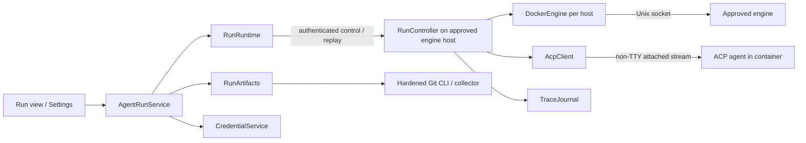

# Design: agent runs in containers

Design notes for running a coding agent inside a container and following its work from Brainiac: guided setup, a live trace, follow-up prompts, and review before its result is published to a Git remote. Code and prompts reach the selected model provider during execution; review gates publication of the result, not that disclosure. Phase 1 (local runs and review) started on 5 October 2026: its behavior is [`SPEC.md`](../../SPEC.md) section 13 and its design [`architecture.md`](../architecture.md), Agent runs — v0.5, which are the reference for it from now on; where they differ from this file, they win. The later phases are still proposals here, and move the same way when they start; this file keeps them, the background, the spike records, and the remaining questions.

This builds on v0.4's Docker socket discovery and Health requests, v0.4.x's [`secrets.md`](secrets.md), the Git CLI with argument arrays, the diff viewer, tasks linked to repositories, and the provider-neutral pull request service. Health's short HTTP requests provide discovery/client setup; bidirectional attach streams, archives, and lifecycle recovery need their own implementation and spike. The decisions this release needed are recorded in `architecture.md`, Decisions, 5 Oct 2026. Remote hosts also depend on v0.4.x's SSH tunnels; Create pull request depends on the v0.3.x follow-up.

UX Design Artifact: https://claude.ai/artifact/LKPGQiv9qZdrN14znnpusG

## Why

A container gives each run its own working copy and isolates it from the user's checkout and mounted Mac files. The user's checkout is never mounted or modified. Delivered credentials remain available to the agent and engine operator; unrestricted network access is not credential isolation. Several runs can work independently, including on repositories with no remote.

**Remote execution through Mac sleep must be designed and proven before committing to the production runtime, even if local runs ship first.** An acknowledged turn continues on the approved remote host when the Mac sleeps, Brainiac quits, or SSH disconnects. Brainiac reconnects to the same live session, retrieves missed events, and can send another prompt. The remote controller owns execution and limits independently of the Mac. An early remote prototype must demonstrate this contract; the later remote release must pass it again with the packaged product. Shipping order does not defer or weaken the architectural requirement.

Brainiac knows the repositories, linked tasks, and credential sources. It can turn the manual sequence of creating an image, delivering credentials, watching an agent, and extracting changes into one workflow. The first release supports one tested ACP agent, authentication with an API key or a Claude subscription token (Subscription token, below), a local Docker-compatible engine, and complete source Git repositories on the Mac. Unsupported cases fail before credentials are delivered. Remote product support follows SSH tunnels and controller deployment integration; its session architecture is validated in the initial spike.

## What the user gets

- **Agent setup** in Settings: choose a supported local engine, agent and credential source, build the readable default Dockerfile, and run a small paid test prompt. The local controller uses the session contract proven by the remote spike. Later remote setup approves a host and deploys/tests its trusted controller before credentials are delivered. The image pins the base image, agent, adapter, and collector; setup records the resulting digest and capability test. Engine access grants control over containers on that engine. An approved remote host and its operator can inspect a run's code and credentials.
- **New run** from a repository, and from a task later: choose the starting branch or commit, prompt, session time limit, and resource limits. The time limit includes idle and permission waiting; setup shows the resulting deadline and local suspension limitation. Brainiac resolves the start to an immutable commit. It shows that local uncommitted changes are excluded, which history is copied, the provider/host/image, and each injected credential. Phase 1 says outbound network access is unrestricted. Task-derived text is editable before sending.
- **The run view:** messages, plans, tool activity, reported file changes, and usage/cost when available. Missing cost says “Unavailable”; a time limit is not a spending cap. **Send** starts the next turn when idle. **Cancel** ends the run and attempts to preserve partial work. **Finish and collect** ends an idle session and captures its working tree. Permission requests follow the selected run policy and appear in the trace.
- **Leave and return:** when remote hosts ship, a remote session survives Mac sleep, app quit, and connection loss until Finish, Cancel, expiry, or a runtime failure. An active turn continues; a completed turn stays idle, and a request requiring a user decision waits. Reconnecting restores the current status and missed trace, then permits follow-up input on the same session. Local controllers can survive app quit while the Mac is running, but local execution cannot progress while its host is suspended. Disconnected views show the last observation and connection state; they do not claim current execution or successful cancellation without a controller acknowledgement.
- **Review:** a stable comparison between the starting commit and a collected result snapshot, including edits the agent never committed. The first release publishes one Brainiac-authored snapshot commit; intermediate agent commits are not preserved. Save patch and Copy patch export this comparison, including binary changes within artifact limits. A later **Push branch** publishes the exact reviewed snapshot to a new remote branch, then **Create pull request** once its dependency exists.
- **Runs** show preparation, activity, idle/permission waiting, stopping, collection, and terminal outcome. Failed/interrupted runs can still have partial results. Collection and cleanup failures have separate recovery actions and never silently discard the working volume.

## The repository rule and artifacts

Brainiac never writes to the user's checkout, index, refs, or Git configuration. It may write to run containers and app-owned scratch/bare repositories. Push changes the explicitly selected remote on a user action. These future exceptions need a new architecture decision when v0.5 starts; this document does not change today's rule.

### Input: an immutable start

`RunArtifacts` resolves the selected ref once and prepares an app-owned bare export repository with a named ref at that exact commit. A bare object ID cannot be passed directly to `git bundle create`: it needs a named ref. No temporary branch/tag is created in the source. The spike must prove a read-only object-transfer path into the export repository, including a branch moving during export and source objects disappearing. Failure asks the user to retry; it never silently selects a newer commit.

The bundle is self-contained: the selected commit and reachable ancestor history, with only the intended export ref advertised. New run explains this scope. It excludes working-tree/index changes, stash and unrelated refs, configuration, hooks, and remotes. Brainiac copies it through the Engine archive API; the run clones into a new volume and removes the input bundle from the agent's working area after setup. A trusted copy remains for recovery/collection.

Phase 1 supports complete local SHA-1 repositories. Shallow/partial repositories, unavailable objects, LFS pointers, and gitlinks/submodules in the selected tree are rejected with a remedy before starting a container or resolving credentials. It never invokes lazy fetch, LFS filters, or submodule checkout to make a run work. Those need another transfer/authentication contract. Export uses hardened Git with hooks, maintenance, external helpers, replacement refs, and repository/environment overrides disabled. Git 2.30 remains the minimum; the spike checks every proposed flag against it.

### Output: collect the final working tree

For Finish, Cancel, expiry, process failure, or interruption, first stop all agent processes and confirm the workload container is stopped. The workspace is a run-owned volume, not the container's own filesystem, so it outlives the workload. Interruption, controller restart, the termination guard, and emergency stop only stop containers; the stopped container stays attached to its volume, so engine cleanup commands such as volume prune cannot treat it as unused. A run's container and volume are removed only by cleanup after a verified collection, or by an explicit Discard. A separate collector container mounts its volume read-only, has no network/injected credentials, and uses an approved image digest, its own writable scratch area, and the original input bundle. It does not execute the agent's entrypoint or trust its Git configuration, index, refs, hooks, or commits.

The collector constructs a final tree and one snapshot commit whose sole parent is the recorded starting commit. Existing tracked paths are included even when newly ignored. Added untracked files follow an exclusion policy captured from the starting tree plus Brainiac's fixed exclusions; edited ignore files cannot hide previously eligible output. New ignored/generated files, Git metadata, credential/home/cache directories, and special devices are excluded. Review lists excluded additions and offers bounded recovery selection of eligible regular files; it does not treat all files on the volume as safe output. Symlinks are recorded as link text and never followed outside the workspace. Executable bits/deletions are preserved. Unsupported path encodings, unreadable files, or exceeded limits fail explicitly rather than produce an incomplete snapshot labelled complete.

Regular bytes are hashed without clean/smudge filters or text conversion. Snapshot construction uses collector-owned Git metadata with hooks and repository config disabled. A no-change tree is valid and needs no new commit. The spike must demonstrate uncommitted/staged edits, new files, binaries, symlinks, and cancellation without any agent commit.

The collector is trusted code; its inputs and returned archive remain untrusted. Brainiac streams only the expected `result.bundle` regular-file entry into a new temporary file. It rejects extra/duplicate entries, absolute/traversing paths, links, devices, and oversized archives without extracting arbitrary host paths. Verify bundle prerequisites, object integrity, the single expected advertised ref, and exactly the original start as the result's parent; the no-change case instead requires the result OID to equal the recorded start. Bound object/ref counts and expanded sizes as well as transfer bytes. Import only into an app-generated run namespace; serialize shared bare-repository updates and GC.

Publish verified artifacts/metadata atomically before exposing a result. An artifact hash, immutable base/result IDs, and collection generation identify it; diff, patch, and push use these IDs and the existing hardened diff policy. ACP file reports are advisory; the collected tree is authoritative. An agent may write or encode secrets into files; trace redaction cannot certify an artifact. Review precedes export/push.

Collection failure retains the stopped working volume and input, with **Retry collection**, bounded recovery export, and **Discard work**. Discard is explicit. Successful collection permits container/scratch cleanup; when additions were excluded, retain the stopped volume until the user accepts the displayed exclusion manifest or selects eligible additions for a new collection generation. Review exposes **Keep this snapshot**; patch export or Push can confirm the same displayed manifest. An accepted snapshot permits volume cleanup, and an exclusion-free result needs no extra confirmation. Deleting a run with retained/uncollected work asks for confirmation of the displayed loss.

### Landing: publish the reviewed snapshot

Push requires a verified result. The action carries its expected generation/OID, approved credential binding, explicit destination URL/forge repository, and a unique validated branch name such as `agent/<short-name>-<run-id>`. The UI shows the destination and commit. A changed result, destination, account, or approval invalidates the action before network I/O. A local repository rename cannot rebind pending publication.

The first push is create-only: one explicit `<reviewed-oid>:refs/heads/<branch>` refspec and an explicit empty expected remote ref lease. Refuse an existing branch even if an update would fast-forward. No force update, mirror, tags, submodules, hooks, or additional push URLs. Push configuration/URL rewriting cannot add destinations or redirect credentials outside approved context. Secrets never appear in URLs, arguments, logs, or persisted Git config.

After a lost response, publication is uncertain. Reconcile the exact remote ref: reviewed OID means already published, absence permits the same create-only retry, another OID means conflict. Never blindly repeat a push or create duplicate pull requests. Record intent before sending and the observed result afterwards. Create pull request uses the verified source repository/branch/head and explicit target branch, with the provider service's own reconciliation policy.

Phase 2 first supports HTTPS publication to supported GitHub/Bitbucket Cloud hosts with tested Git-compatible credentials. REST and Git authentication are distinct capabilities; a working API token does not automatically qualify. Resolve a Git-helper source on the Mac for the approved host/user/path. A private per-invocation credential bridge supplies only that destination without `credential approve`/`reject`; child output uses safe mapped diagnostics. Unsupported formats fail before push. For SSH URLs offer the equivalent HTTPS destination; SSH/custom-remotes need their own authentication policy. Publishing to a fork is explicit and never inferred from the checkout's remote.

## Design it twice

### Runtime

| | A. Docker Engine API (chosen) | B. Dev Containers CLI | C. Hosted agents |
| --- | --- | --- | --- |
| Shape | Streams, archives, and owned resources behind one runtime | Repository-defined environments driven through another CLI | Provider runs the job |
| Local/remote | Same engine-host controller for both; prove remote lifetime early, ship local first | Local or Docker contexts | Remote only |
| Costs | Image and lifecycle/transport implementation | Node/CLI dependency and repository build code | Provider-specific integration/data policy |

A gives one artifact workflow for supported engines and repositories. Compatibility is proven, not inferred from a socket existing. Dev containers, hosted services, and Apple's separate runtime wait for usage to justify them.

### Agent interface

| | A. ACP only (chosen) | B. Native output parsers |
| --- | --- | --- |
| Interface | Negotiated protocol normalized into Brainiac events | Per-agent invocation, parsing, and control |
| Cost | Pin/test adapter and CLI capabilities | Several execution models/error contracts |
| Missing feature | Reject unsupported agent or hide unavailable feature | Add another fallback workflow |

ACP covers session setup, turns, cancellation, permissions, and updates. Phase 1 supports tested agents, not arbitrary ACP programs. Built-in descriptors hold immutable launch arguments, credential names, pinned packages, and capability matrix. A descriptor does not prove sign-in, autonomous tools, diffs, or restart support; adapters may need integration work. Native-output fallback is excluded.

### Session ownership

| | A. In-app attach | B. Separate Mac supervisor | C. Engine-host controller (chosen) |
| --- | --- | --- | --- |
| Authority | Brainiac owns the agent stream | Mac helper owns the agent stream | Controller beside the engine owns the agent stream |
| App quit | Interrupts session | Can preserve session | Preserves session |
| Mac sleep / SSH loss | Cannot control remote work | Helper cannot execute during Mac sleep; remote control still depends on the connection | Remote session, journal, permissions, and deadline remain independent of the Mac |
| Cost | Simplest prototype | Another process to package, authorize, and recover | Remote deployment, authentication, bounded storage, and failure handling |

C satisfies the required remote workflow. Its protocol and controller also serve local engines, avoiding a second session-ownership model. A Mac helper alone does not meet the remote sleep requirement. Local execution cannot progress while its machine/engine is suspended; local support must describe and test resume/deadline behavior separately. Keeping Docker stdin open or advertising optional ACP session loading is insufficient. The spike proves C before production runtime implementation; failure requires revising the architecture instead of building an attached-only runtime and deferring the problem. Local releases may precede remote product integration after that proof.

## Architecture

- **`AgentRunService`** owns domain validation/versioning, destination approvals, leases, user actions, committed local state/events, and reconnect reconciliation. It holds no database transaction while awaiting controller/Git/credential I/O. Stale observations/actions carry a run version/generation and are discarded/refused. Controller observations are authoritative for execution; the local database stores their last confirmed projection.
- **`RunRuntime`** hides authenticated controller transport, command correlation, reconnect/status/replay, and stopped-volume handoff from the service. It never owns the ACP stream or stops a healthy run merely because its client connection closed.
- **`RunController`** lives on the approved engine host, outside workload authority. It owns the live ACP session, serialized turns/permissions, resource ledger, deadline, bounded journal, and stop/collection lifecycle. A single writer owns each run; durable command outcomes permit reconciliation without replaying a prompt. Controller process loss uses a separately proven termination guard, not an assumption that a dead controller can stop the workload.
- **`DockerEngine`** owns discovery/API negotiation, non-TTY framing, concurrent stdout/stderr drainage, streaming archives, create/start/stop/wait/remove, and typed bounded diagnostics. Clients, queues, cancellation, and budgets are scoped per approved host so an unreachable host cannot stall another. Health retains short request timeouts; attach/build/archive have separate cancellation/budget policies. Raw engine responses never become UI errors.
- **`AcpClient`** owns capability negotiation, sessions, request IDs, cancellation, and permissions. It advertises no client filesystem/terminal and passes no Brainiac MCP servers. The supported adapter must prove tools work inside the container; requests for Mac-side tools are refused. It emits normalized events, not JSON-RPC for callers to interpret.
- **`RunArtifacts`** owns immutable export identity, collector policy, hostile-output verification, app-owned Git refs, diff/patch, and exact-result publication. The controller orchestrates its remote collector; the Mac verifies downloaded artifacts before review. **`TraceJournal`** owns best-effort filtering of known injected values, sequences, quotas, durable append on the host, and cursor replay to the Mac. Each hides one authoritative representation from its callers.
- Code would live in `src-tauri/src/agents/` with readable image/entrypoint/collector sources. Future UI DTOs live only in `models.rs`, generated with `ts-rs`; this document does not define IPC shapes.

### State and actions

Activity, result availability, and cleanup are separate facts. Waiting has an idle/permission reason. Terminal outcomes are finished, failed, cancelled, expired, or interrupted. Result status is absent, collecting, ready/no-changes, or collection-failed; cleanup may independently be pending. Client connection state is separate: losing contact makes the Mac's observations stale, without changing the controller's execution state. A remote collected artifact is not ready for local review until downloaded and verified.

| Trigger | Contract |
| --- | --- |
| Start | Persist intent/immutable start, transfer artifacts, prepare resources, recheck leases/approval, deliver once, initialize. Controller acknowledgement identifies the run/session/attempt and accepted deadline. Preparation is cancellable and has its own deadline; unacknowledged starts reconcile by attempt ID. |
| Send | Only while confirmed idle and connected; duplicate action IDs return the existing controller outcome. Acknowledgement means recorded ACP delivery, not completed execution. Never queue/replay uncertain delivery. |
| Turn ends | Record reason; become idle, or fail on unrecoverable protocol/process error. `end_turn` does not delete resources. |
| Permission | Bind to exact request/session/turn. Ask waits; autonomous selects a valid allow-once option. Unknown/malformed requests are refused; late replies after cancellation have no effect. |
| Finish | Only while idle; stop all writers, collect. Finished outcome can coexist with collection failure, with publication disabled until verified. |
| Cancel/expiry | Controller rejects new prompts, answers pending permissions cancelled, requests ACP cancellation, then engine stop with bounded grace/forced termination. Confirm stop before collecting; ACP cooperation is not the sole mechanism. Offline Mac cancellation remains pending until acknowledged; the existing remote deadline still applies. |
| Mac sleep / app quit / SSH loss | Remote controller continues an active turn, remains idle after turn completion, or waits for a user permission. Preserve the session and journal. No automatic stop, new turn, permission escalation, or credential delivery. Local host suspension follows the deadline limitation below. |
| Reconnect / app restart | Authenticate the same host/controller, reconcile run/session/attempt and command outcomes, replay by cursor, then accept input against current versions. Keep the healthy existing session. Never replay stored prompts or reinject credentials. |
| Controller / engine failure | Interrupt rather than resume uncertain execution; termination guard stops surviving writers. Preserve partial work for collection/recovery. If stop cannot be confirmed, display execution uncertainty and refuse publication/deletion that would lose recoverable work. |
| Delete | Refuse while execution uncertain. Stop/collect or explicitly discard, persist cleanup intent, remove owned artifacts/resources idempotently. |

The controller records an absolute deadline at workload start and enforces it independently of the Brainiac client, including idle and permission waiting. Disconnect never extends it. Use a host-local timer resistant to wall-clock adjustments during the controller lifetime; controller/engine restart interrupts instead of resetting a limit. A remote controller remains running while the Mac sleeps; a local controller cannot enforce a stop while its execution host is suspended. Local setup states this limitation: on wake the controller immediately reconciles elapsed time and stops expired work, but cannot promise zero work between host resume and confirmed stop. The UI never claims deadline-enforced stop until confirmed. The supported remote host must remain running and able to control its engine. Runtime failure never automatically creates another container, and container restart policy is disabled. The initial spike chooses and tests the deadline timer and termination guard, including local suspend/resume behavior.

## Credentials and disclosure

| Credential | Scope/delivery |
| --- | --- |
| Model API key | Supported provider/agent; bootstrap stdin, then agent-process environment |
| Claude subscription token | Claude Code only; the user's own `claude setup-token` token, delivered like the API key as `CLAUDE_CODE_OAUTH_TOKEN`; a profile delivers this or the API key, never both |
| Registry token, after phase 1 | Stable `registry:<id>` owner, approved repository/registry context, read-only private-package access |
| Git publication credential | Mac only, approved HTTPS destination; never workload/collector |
| Subscription login files | Deferred: browser sign-in inside the container, refreshing credential files, and their sanitization stay unsupported |

Sources use `CredentialService` leases; starting a run does not clear its process cache. Model owner is `agent:<profile id>`; registry IDs survive renaming. Validate key format and reserved delivery names without echoing bytes. Registry configuration cannot override executable-loading variables, provider URLs, agent startup options, or forge credentials. Refuse publish/admin scope where inspectable; otherwise require explicit user attestation to read-only scope and state that limitation. Phase 1 injects no registry tokens.

Approval includes source binding, provider endpoint, descriptor/version, image digest, host identity, and repository/registry recipients. Changes require confirmation before resolution/delivery, including cache hits. Snapshot non-secret identities so editing a profile cannot change a running session. Recheck leases immediately before delivery; obsolete leases abort preparation. Rotation afterwards cannot erase the agent's copy; cancel/restart to replace it. Test probes the displayed draft afresh and records its time, without guaranteeing validity of future runs.

Resolve on the Mac before any execution starts. An authenticated control channel delivers approved values to controller memory, encrypted over remote transport; it must never log or persist secret frames. The controller owns one bounded bootstrap/ACP handoff contract with the entrypoint: the entrypoint accepts descriptor-approved keys only, exports to its child, clears its buffer, and confirms the boundary before ACP traffic begins. Secrets never go into Docker `Env`, image/build args, volumes, labels, argv, or settings. No inspect-visible environment fallback; incompatible agents are unsupported. Put home/auth/cache on tmpfs where supported. Bootstrap failure reports a generic error. Verify buffering cannot consume subsequent ACP bytes and keys cannot enter the journal during handoff.

An acknowledged session uses its already delivered credentials without the Mac, including follow-up turns after reconnection. The controller retains only the in-memory known-value filtering material needed for that session; it cannot resolve Mac credential sources or renew credentials while the Mac is away. Provider rejection/expiry becomes a visible waiting/failure outcome under the tested adapter contract, never a repeated credential request or automatic reinjection. The first supported authentication mode must demonstrate independent operation for the configured run duration; subscription renewal and Mac-dependent authentication callbacks are unsupported.

### Subscription token

A Claude Pro, Max, Team, or Enterprise subscriber can run Claude Code on their plan instead of paying for API usage. Claude Code's `claude setup-token` creates a one-year OAuth token for that plan which can only make model requests, and Claude Code reads it from `CLAUDE_CODE_OAUTH_TOKEN` in places without a browser such as containers and CI ([authentication](https://code.claude.com/docs/en/authentication#generate-a-long-lived-token)). It fits the delivery above: one value, resolved on the Mac, handed over once, with nothing to refresh during a run.

- **Brainiac never signs in to claude.ai.** The user runs `claude setup-token` in Terminal, on their own account, and saves the printed token through a `CredentialService` source (Keychain, Ask, environment variable, or command), owner `agent:<profile id>`. Brainiac does not run the browser flow, read Claude Code's own Keychain item or `~/.claude`, or copy login files into the container.
- **One credential per profile.** Setup chooses **Claude plan** or **API key**. The descriptor delivers exactly one of `CLAUDE_CODE_OAUTH_TOKEN` and `ANTHROPIC_API_KEY`, because Claude Code prefers the API key when both are set. The token is registered for trace filtering like the key.
- **Usage, not cost.** Runs draw from the plan's usage limits, shared with the user's interactive Claude use. As of October 2026 Anthropic has paused its separate monthly Agent SDK credit, so programmatic use counts against the same limits ([Agent SDK with a Claude plan](https://support.claude.com/en/articles/15036540-use-the-claude-agent-sdk-with-your-claude-plan)). The run view says "Uses your Claude plan" instead of a dollar amount computed at API prices. Setup and New run name the plan rather than a key.
- **Limits and expiry.** A turn stopped by the plan's usage limit returns the run to waiting for the user with the reset time when the adapter reports it, and the run's time limit keeps running; a tested adapter that reports it only as an error fails the turn under the existing contract. A rejected token (expired, revoked, or the plan ended) becomes a visible failure; the run keeps its work for collection and never asks for a new token mid-session. The token's expiry cannot be read from it, so setup records when it was saved and warns from eleven months onward.
- **Terms.** Anthropic's Agent SDK documentation says that unless previously approved, third-party developers may not offer claude.ai login or rate limits for their products, including agents built on the Agent SDK, which the Claude ACP adapter is ([Agent SDK overview](https://code.claude.com/docs/en/agent-sdk/overview)). Brainiac offers no login: the user brings a token Anthropic's own CLI issued for this use, and runs Anthropic's own Claude Code binary with it. Whether a public app may present this option is still open (Open questions). Until it is answered the option stays off by default, says that use is governed by the user's plan terms, and does not ship in a release without a recorded answer.

The agent and engine operator can read delivered credentials. An agent may copy a key into its workspace/output; Brainiac cannot guarantee all agent-produced files are secret-free. Fixed endpoints and limited scopes reduce reach. Before Start, display model-provider/code/prompt transfer, engine-host trust, network policy, and credential scope.

Restored/imported hosts/profiles are disabled until source/destination/image/host confirmation under `secrets.md`. Matching IDs/Keychain names confer no trust. Imported data never authorizes reconnecting runs, building images, executing descriptors, injecting credentials, or deleting engine resources; stopping locally owned work before restore is a separate existing obligation. Local upgrades preserving a binding are separate from restore. Rust enforces approvals; MCP cannot start runs/change settings in this release.

## Isolation and permissions

Workload/collector run unprivileged, all capabilities dropped, `no-new-privileges`, no host namespaces/devices, compatible seccomp, CPU/memory/PID limits, and bounded workspace storage. No checkout, home, Docker socket, or Brainiac MCP socket is mounted. Image builds use app-controlled context only; setup never executes repository Dockerfiles/dev-container hooks. The agent may run repository scripts inside its workload as part of its work.

Phase 1 calls outbound access unrestricted and claims no host-service/network isolation. Phase 2 adds registry tokens only with tested allowlist mode. An internal run network reaches an app-owned egress proxy with no direct host/Internet route. Tests cover direct IPs, IPv6, DNS/rebinding, CONNECT, redirects, gateways, private/link-local/metadata endpoints, and proxy bypass. The proxy resolves/checks destinations and permits explicit provider/registry/user-added hosts; arbitrary tunnelling/IP-literal destinations are refused. Extra hosts require explicit policy change. Incompatible clients fail visibly with no unrestricted fallback. Private registries require a separately displayed destination exception.

Start explicitly selects autonomous container work or ask for adapter requests; phase 1 offers both after capability tests. Autonomous mode authorizes only that run's work, never Push, new credentials, image/host changes, or network expansion. ACP permissions do not prove every subprocess/network operation is mediated.

Workspace disk must be enforced by a supported runtime mechanism, not reported after exhaustion. The spike chooses a quota-capable volume or another bounded implementation; engines unable to meet it are unsupported. Finite defaults for workspace/artifact/trace/concurrency are chosen from measurements and shown when material.

## Remote sessions and durable control

### Host setup and authority

The remote spike and later remote product use system SSH with argument arrays and verified host keys to an approved engine-host controller; production integration follows the existing tunnel policy. SSH is a client transport; its lifetime cannot own the controller, agent process, or attach stream. The controller runs as a host-managed service independently of SSH sessions. The initial spike chooses and demonstrates deployment, service lifetime, endpoint authorization, and termination guard on a remote host. Packaged setup, installation, service account, and upgrade/removal must be validated before the corresponding local/remote product support ships. Unknown/changed host keys never auto-accept. Imported host records cannot launch tunnels or acquire controller authority.

Setup pins the approved host/controller identity and protocol version, verifies deployment artifacts, and tests capabilities before credential delivery. The control endpoint authenticates the approved installation and authorizes only its recorded runs/attempts. Workload containers cannot reach the endpoint, control credentials, journal, ledger, or engine socket. The trusted controller can control its engine; host approval includes that authority. It offers bounded run operations rather than an arbitrary shell or Engine API relay. Upgrades do not silently replace a controller owning live sessions; the selected procedure either preserves compatible ownership or explicitly stops/collects affected runs.

Each supported engine uses non-TTY attach and disables Docker logging on workload/collector (`LogConfig.Type=none`). Daemon defaults cannot forward raw protocol/stderr to disk/external logging. Logs are never the transcript/replay source. Adapter private logs must be disabled or on disposable tmpfs, tested for every supported version. Local controllers reuse Health's socket discovery and the same protocol; they do not promise progress while their execution host is asleep.

### Acknowledgement and reconnection

The controller owns the agent's ACP stream continuously. It maintains single-writer ownership, a persistent filtered journal, sequence cursors, run/session/attempt identities, and durable command outcomes. Record a command's intent before forwarding and its delivery outcome before acknowledging to the Mac. A received acknowledgement identifies an accepted existing operation; it does not assert that its turn completed. Lost responses reconcile by command ID rather than creating another turn. ACP provides no general exactly-once guarantee: controller failure after forwarding but before recording leaves uncertain delivery, so stop/collect instead of repeating. Scope permission replies and terminal actions the same way.

Reconnection verifies the same approved host/controller identity and reconciles the run, session, command outcomes, current version, and journal cursor before accepting input. A new Mac connection never becomes a second ACP writer. App restart does not stop a healthy controller-owned session, and reconnect requires neither a credential read nor prompt replay. Protocol/controller identity changes or uncertain command delivery are explicit recovery states. Never invoke unadvertised adapter load/resume capabilities to conceal a failed controller.

### Behavior while the Mac is away

An acknowledged active turn continues until it ends, reaches the run deadline, waits for a required decision, or fails. A completed turn leaves the session idle and available for the next prompt until the same deadline. It does not start a new turn automatically. In ask mode the controller retains the exact pending permission and waits without granting it; expiry cancels it. In automatic mode only the previously approved adapter permission policy applies. Disconnect cannot broaden permissions or network/credential authority.

The controller drains output, filters known injected values before persistence, and enforces journal/workspace/resource budgets without a Mac connection. Journal exhaustion stops and preserves partial work instead of allowing unbounded offline storage. Mac sleep, Brainiac quit, and SSH loss do not affect its deadline timer. If expiry or process failure occurs offline, the controller stops writers and attempts credential-free collection on the host; it retains the verified-by-collector bundle and recovery ledger until the Mac can download and independently verify the result. A failed collection retains the stopped input/workspace with a retry action. Remote artifact and journal transfers are bounded and resumable or restartable without rerunning the agent or collector unnecessarily.

Mac-side Cancel while disconnected is an unacknowledged pending request, not proof of cancellation. On reconnect it reconciles/submits the same action before permitting further input. The controller deadline remains enforceable meanwhile. Setup also provides an authenticated host-side emergency-stop procedure usable independently of the Mac app; it does not expose that authority to the workload.

### Failure boundary and release requirement

Mac sleep is a supported client disconnection, not a controller or engine failure. The remote execution host must remain running, with a functioning engine and provider access. Controller/engine crash or host reboot interrupts rather than transparently resumes the agent. A separately tested termination guard must stop surviving workloads on controller loss; restart must confirm stop before processing new raw output, since in-memory filtering material is gone. Record a trace gap, preserve recoverable work, and never reinject credentials or repeat an uncertain turn. If engine access is unavailable, report unconfirmed execution rather than a successful stop.

The early remote spike must prove endpoint authorization, reconnect reconciliation, offline permissions/deadline, bounded journal, crash termination, and emergency stop before the production runtime is built. Failure requires revising the controller design. Local runs can ship first using that architecture; packaged remote deployment and the complete remote acceptance suite are gates for shipping remote hosts later. This is an acceptance contract for the tested host/agent combinations, not a claim of uninterrupted execution through remote machine failure or provider outages.

## Traces, quotas, and rendering

Persist a versioned Brainiac journal in controller-owned per-run storage on the host, with a verified-sequence local mirror at `agent-runs/<run-id>/trace.jsonl`. `TraceJournal` assigns monotonic sequences and records turn/request/tool identities, timestamp, filtered content, and reported usage/provenance. Live/replay use the same normalized events; UI gaps recover by cursor. Replay preserves sequence identities, so reconnect cannot duplicate visible messages. The Mac records its cursor only after durable local append. Skip unknown extensions with safe diagnostics; adapter upgrades cannot redefine old journals. No raw protocol/bootstrap/stderr/engine bodies are persisted. Filtering is best-effort removal of known injected scalars, not a confidentiality guarantee for agent output.

Sanitize before disk, IPC, notifications, or diagnostics. Decode string content before matching JSON escapes; use bounded look-behind for secrets split across chunks and redact before releasing the pending tail. Flush safely at turn/end/error. Register each injected scalar; any future structured login format must register component tokens, not just whole JSON. Replace matches with source names. Encoded/transformed values, repository-held credentials, and unknown secrets cannot be guaranteed absent. Empty/invalid keys fail validation; errors name operations without confidential output.

Finite budgets cover frames, stderr drainage, bootstrap, event/journal content, archives, expanded Git objects, workspace disk, and concurrency, before unbounded allocation/decompression. Slow UI cannot block protocol/permission/cancel processing: bounded batches and cursor replay replace per-token events. Oversized frames/journal exhaustion stop the run, mark a gap, and preserve partial work. Control messages are never silently dropped to continue execution.

Escape code/text; sanitize Markdown under existing app policy; load no remote images or executable HTML/terminal escapes. File links resolve only inside verified artifacts, never arbitrary Mac paths. External links use explicit opener actions.

Default retention removes traces/prompts/results/history together 30 days after terminal outcome. Recovery work and excluded additions awaiting acceptance remain displayed until collected/accepted/discarded; retention never silently removes them or active/uncertain work. Delete/expiry remove visible artifacts/input/scratch/journal/run refs, then bounded GC of unreachable objects. Shared objects retained by other runs stay. No secure-erasure claim for SSD blocks/snapshots/provider/remote-host copies. Runs/traces/artifacts are excluded from vault export; if an export includes copied history, run rows are filtered from that copy. Core profiles/hosts follow source-reference export and restore confirmation. Local history snapshots may retain expired sanitized prompts until their own retention ends, but never carry injected credential bytes/redaction material.

Retention covers both host and Mac copies. Undownloaded remote results/journals remain recovery work and are not silently removed after a long client absence; configured host storage budgets still apply and refuse new work when necessary. After a run is terminal, verified transfer and acceptance permit remote copies to be removed under the recorded cleanup action. An unreachable host leaves a durable pending cleanup obligation; deleting local history cannot assert that remote copies were removed.

## Persistence, restart, and cleanup

| What | Where | Meaning |
| --- | --- | --- |
| `agent_hosts` | `brainiac.db` | Stable ID, name, approved endpoint/engine/controller identity and protocol version, revision; no credentials |
| `agent_profiles` | `brainiac.db` | Stable ID, descriptor/source bindings, registry IDs/contexts, approved image digest, revision; no secret bytes |
| `agent_runs` | `history.db` | Immutable start/profile/image/host context, controller run/session/attempt identity, prompt/version, last confirmed activity/outcome, cursor, result identity, resource/recovery ledger, expiry, safe errors, publication intent/result |
| Controller ledger/journal/artifacts | Approved host, outside workload storage | Authoritative command outcomes, resource ownership, deadline, session status, bounded filtered journal and collected bundles; no credential fields or persisted filtering material; output/artifact limitations above apply |
| Journals/artifacts | App data `agent-runs/<run-id>/` | Sanitized journal, immutable bundles, verified metadata, atomic-publication temporary files |
| Bare results | App data `agent-runs/repos/<repository-id>.git` | App-generated refs/objects, serialized writes/GC |

These are domain concepts; final schema belongs in architecture at release start, not DTO definitions here. The controller owns the resource/attempt ledger; the local run row stores its last confirmed projection and pending client actions without another cleanup table. Labels hold installation/run/attempt IDs and role, never prompt/path/credential. Commit intent before side effects and IDs afterwards. A lost create response reconciles the owned label/attempt before retry; name equality alone is insufficient. Artifacts/publication follow the same intent/reconciliation principle.

Persist only filtered prompts and safe errors. Initial raw prompt text stays in memory during preparation until the injected keys are known and matching values can be removed from the history copy; the early intent may omit prompt content. For follow-ups, local intent records command identity/version without prompt content, then sends the raw prompt in memory. The controller filters it using the session's known values before persisting its command intent and returns only filtered content for the Mac history copy. Reconnecting the app need not resolve credentials to obtain filtering material. Neither restart nor a controller uses stored prompt content to replay a turn. Unknown secrets pasted into prompts have the same documented limits as arbitrary output; history is not a secret-scanning guarantee.

The installation identity and controller access material are generated locally outside exported/snapshotted databases; applying a restore starts a new ownership epoch. Before restore, attempt to stop/collect current runs and refuse replacement while execution is uncertain unless the user explicitly accepts the displayed recovery obligation; retain old-epoch controller access/ledger obligations locally outside the restored data until cleanup completes. Ordinary app restart reconnects only to approved controllers for the current installation and these retained obligations, keeps confirmed healthy sessions alive, and collects interrupted workloads only after confirmed stop. Missing/unreachable resources retain explicit execution/cleanup uncertainty. Unknown owned-looking orphans require user-directed recovery/removal, never adoption as runnable sessions. Restored history inherits no active ownership or authority to reconcile another installation's resources.

Cleanup includes workload/collector containers, named/anonymous volumes, run networks/proxies, per-run controller journal/artifact/ledger data, temporary input/export data, and expired refs. Removing a container is insufficient. The host controller service and shared images are installation resources; deleting one run cannot remove a controller serving other runs. Controller uninstall is explicit, resolves its runs/obligations first, and never loses the only cleanup ledger. Deletes are idempotent/restricted to recorded ownership/attempt; obsolete cleanup cannot touch newer runs. Failed collection keeps the stopped volume. Failed cleanup stays visible/retryable without blocking review of a verified result. Ledger tombstones remain until resources are gone even after visible history expires.

## Phases and exit gates

1. **Blocking architecture spike before implementation.** Prove one approved remote host with a trusted independently running controller, a verified SSH prototype, and one pinned Claude adapter using API-key auth. Demonstrate actual Mac sleep/wake, app quit/reopen, SSH loss, same-session follow-up, offline permissions/expiry, cursor replay, lost acknowledgements without duplicate turns, controller-crash termination, and authenticated emergency stop. Also prove arbitrary-commit export on Git 2.30, stopped-volume collection, bootstrap/no raw logs, and enforceable disk budgets. Choose host service/guard, deployment approach, toolchains/default limits from measurement. Failed compatibility gates narrow supported hosts/agents; failure of the sleep/reconnect contract requires revising the architecture before building the production runtime. The spike need not deliver production remote Settings/SSH integration.
2. **Phase 1 — local runs and review.** Packaged local controller and Setup/Test, complete source repositories, ACP turns/permissions, reconnect after app quit, Cancel/Finish/expiry, interrupted-runtime recovery, snapshot/patch review, bounded controller journal/local replay, Delete. An API key or a Claude subscription token (the token only once its terms question is answered), no registry tokens/push. Gate: controller survives app quit and reconnect permits a new prompt without credential delivery/replay; idle sessions and pending permissions persist; deadline/collection works without the UI while the engine host is running; local host sleep/resume reconciles expiry and confirms stop under the disclosed limitation; uncommitted/staged/new/binary edits, partial collection/retry, source checkout/refs/index/config unchanged, owned resources cleaned up. This local release may ship after the remote architecture spike, without production remote-host support.
3. **Phase 2 — landing and agents.** Tested Codex/Gemini descriptors; create-only HTTPS push and Create pull request after its dependency; enforced allowlist before read-only registry tokens. Gate: safe bad credentials, existing-branch refusal, lost-push reconciliation, exact reviewed publication, adversarial bypass/private-host rejection, real setup/work for each supported pair.
4. **Phase 3 — remote product integration.** Complete production SSH integration, approved-host Settings, verified controller deployment/upgrade/removal, and supported remote engines using the architecture proven before phase 1. Repeat the remote acceptance suite with the packaged product: actual Mac sleep/app quit/SSH loss, same-session follow-up and complete journal replay, offline permissions/deadline/collection, lost acknowledgements, controller-crash termination, host-key changes, and emergency stop. A stuck host cannot stall another; upgrades/removal respect active sessions and cleanup obligations. Remote hosts cannot ship with continuation disabled or deferred.
5. **Phase 4 — tasks.** Task launch/linkage and Today waiting indicator. Inputs are snapshotted/editable; later task changes cannot steer a run. Task removal/relocation does not delete runs/artifacts.

## Testing

- Fake-runtime/service tests: versions, duplicate actions, stale events/leases, edit/restore approvals, all transitions, uncertain stop, no publication without explicit current action.
- ACP fixtures/fake peers: negotiation, extensions, malformed IDs/frames, late permissions/cancel, split secrets/JSON escapes, stdout/stderr floods and UI backpressure; generic names/prompts/fake keys.
- Temporary Git fixtures: arbitrary OID/ref races/missing objects, ignored tracked and eligible/excluded untracked files, binaries/modes/symlinks/no-change, hostile config/filters, wrong parents/refs, malformed/compression-bomb bundles and tar traversal/link/device/duplicate entries. Assert no source writes/lazy fetch.
- Real-engine integration (opt-in): ACP stub and collector, faults at intent/create/ID-record/start/bootstrap/stop/collect/import/publish/remove, restart reconciliation, enforced quotas, forced-stop collection, retained work, partial cleanup, ownership isolation.
- Required early-spike and remote-release tests: use a separate running host and actually sleep/wake the Mac during an acknowledged tool-running turn; prove host-side progress while the Mac is absent, same session identity after reconnect, cursor-complete trace without duplicates, and a successful follow-up. Repeat for app quit/reopen, SSH loss, and disconnect before/after command acknowledgement. No replacement container, credential resolution, or repeated prompt is allowed. Run against the architecture prototype before phase 1 and again against packaged remote support before phase 3 ships.
- Offline state/failure tests: idle session retained; exact pending permission waits without escalation and can be answered after return; deadline expires during active/idle/permission states with confirmed host-side stop and partial collection before Mac return; journal/storage exhaustion is bounded. Kill the controller between forwarding and recording, reboot/lose the engine, rotate the host key, exhaust provider credentials, and exercise independent emergency stop. Assert interrupted/recovery/uncertain outcomes rather than fabricated continuation or confirmed cancellation.
- Controller authority/cleanup tests: unauthenticated/other-installation clients and workloads cannot issue run commands or access the journal/engine; protocol upgrades refuse incompatible live ownership; replay/transfer retries preserve identities; unavailable hosts keep cleanup tombstones; deleting one run does not stop another host/session/controller.
- Publication with temporary remotes/provider stand-ins: create-only collisions, stale destination/artifact, missing/incompatible credentials, one-ref/no-tag, uncertain success/retry, pull request reconciliation. Network bypass tests independent of agent cooperation.
- Subscription token with an adapter stand-in: only one of token and API key delivered, rejected/expired token, usage limit with and without a reset time, expiry warning from the saved date, no login files written to the container.
- Leak fixtures: known injected values absent from Docker configuration/labels/argv, image/build cache, persistent daemon/adapter logs, journals/IPC/errors/snapshots. Separately demonstrate documented encoded/artifact leakage limitations; export never claims confidentiality certification.
- Retention/recovery: volume removal, expired prompts/results, shared objects/GC, disk exhaustion/tombstones, unreachable engine, restore with running/cleanup state. WebKit fake backend: setup/disclosure, idle/permissions, Finish/Cancel, uncertainty, partial review/discard confirmation.

## Not in this design

- Scheduled runs, agents sharing a branch, continuation from a prior result, or preservation of intermediate agent commit history.
- Arbitrary ACP commands, native fallback, repository images/dev-container hooks, hosted services, other runtimes.
- Subscription sign-in or credential renewal (a `claude setup-token` token is supported; login files are not), remote sources, SSH/custom-remote push, automatic force updates.
- Brainiac MCP/Mac filesystem/terminal inside runs, or a proxy hiding the model key. Each needs another authority/destination design.

## Open questions and spikes

Behavior above is decided; these are feasibility/default gates, not unspecified fallback behavior.

| Unknown | How to resolve | Needed before |
| --- | --- | --- |
| Adapter capabilities | Pinned versions, no client filesystem/terminal; sign-in, autonomous/ask, follow-up, cancellation, safe stderr, no private persistent logs | Phase 1 and each agent |
| Remote lifecycle | Independently running host service; real Mac sleep/app quit/SSH loss, same-session reconnect/follow-up, acknowledgements, permissions, offline stop/collection; no prompt replay | Blocking architecture spike; repeat before phase 3 ships |
| Export arbitrary commit | App-owned ref/object transfer, minimum Git, source refs/index/config unchanged, missing objects fail locally | Phase 1 |
| Collector policy | Direct-byte trees, eligibility policy, hostile tar/Git expansion, retention after failure. Resolved for phase 1: Record: collection on a real engine | Phase 1 |
| Bootstrap | Authenticated secret transfer to controller memory, one bootstrap/ACP framing contract, inspect/log/build leakage, split-secret filtering, tmpfs home | Blocking spike; each shipped host/agent pair |
| Subscription token | The pinned adapter authenticates with `CLAUDE_CODE_OAUTH_TOKEN` alone and writes no login files; how it reports a usage limit (reset time or plain error) and a rejected token; the token lasts the run without the Mac. Ask Anthropic whether a public app may offer a user-supplied subscription token for Claude Code runs, and record the answer | Blocking spike for the adapter checks; the terms answer before a release offers the option |
| Key out of the agent's processes | Repository hooks and the commands the agent runs inherit the token or key (Spike record: repository settings). Try `CLAUDE_CODE_SUBPROCESS_ENV_SCRUB` with bubblewrap in the image, and what that needs from the container's seccomp, capabilities, and user namespaces; otherwise design a proxy outside the container that holds the key. Confirm a Bash tool command sees the value as a hook does | Before runs are offered for repositories the user does not trust; not a phase 1 gate |
| Engines/budgets | Prototype remote engine plus Docker Desktop/OrbStack/Colima framing/archive/stop/quotas, local sleep/resume expiry reconciliation, controller journal/artifact budgets and toolchains. The workspace budget is resolved for OrbStack (Record: a fixed-size workspace); Docker Desktop is to be confirmed with the packaged app | Blocking spike and phase 1 defaults; phase 3 remote support |
| HTTPS credentials | Git formats/scopes, private bridge, no URL/argv/config leaks, empty-ref lease on minimum Git | Phase 2 |
| Egress | Route/proxy bypass tests, package managers, private exceptions, proxy lifecycle | Phase 2 before registry tokens |
| Controller | Host service/deployment alternatives, endpoint authentication, command reconciliation, filtered journal/replay, deadline timer, termination guard, independent emergency stop; packaged upgrades/removal per host | Architecture proof before phase 1; production remote integration before phase 3 |

## Spike record: Claude subscription adapter

Probed on 5 October 2026 with one browser login on the Mac (`claude setup-token`) and no browser inside the container. The plan token was delivered once, as `CLAUDE_CODE_OAUTH_TOKEN`, in a length-prefixed stdin frame. `ANTHROPIC_API_KEY` was not set. The adapter was not started with `--bare`.

Pinned image `brainiac-spike-claude:local`, digest `sha256:14408fbbefd91124616fc3fd95c83982234f7a5294c593ba6cbac09bf5c68621`:

- `@agentclientprotocol/claude-agent-acp` 0.85.1
- `@anthropic-ai/claude-agent-sdk` 0.3.286
- `@anthropic-ai/claude-code` 2.1.286, on `node:22-bookworm-slim`

The running container was non-TTY, log driver `none`, user `node`, with no bind mounts. Home and `/tmp` were tmpfs. The adapter reported itself as `@agentclientprotocol/claude-agent-acp` 0.85.1. It advertised no client filesystem or terminal. Two prompts on one ACP session both finished `end_turn` after the Mac client dropped the connection between them. The credential frame was written once; reconnect did not send it again.

The entrypoint writes `{"hasCompletedOnboarding":true}` before the adapter starts. This run did not compare a container without that flag. After the turns, Claude had kept the flag and added non-secret metadata: first-start time, Claude Code version, migration flags, local machine and user ids, and `cachedExtraUsageDisabledReason`. The token was not in that file. No Claude login file (`credentials.json`, `.credentials.json`, or `auth.json`) was written. The token was absent from `docker inspect` env, labels, and argv, from the controller journal, and from the daemon journal and the empty raw container log.

A usage-limit reset time was not reported. The onboarding file's extra-usage reason was `out_of_credits` while both turns still completed. A deliberately rejected token failed the turn with ACP error `Authentication required`. An earlier malformed token produced the assistant text `Failed to authenticate. API Error: 401 OAuth access token is invalid.` The terminal print of `claude setup-token` can wrap the token across a carriage return; the value is still one line and includes whatever follows that wrap up to the "Store this token" sentence.

## Spike record: permission and deadline

Probed on 5 October 2026 with the stub agent, not the Claude adapter. The Claude path still cancels adapter permission requests. The stub asks, keeps beating, and grants nothing until the controller writes an allow or a cancel.

A permission stayed pending across a dropped SSH connection: same run, same permission id, and no grant in the journal. After reconnect, one allow was delivered. A second allow for that id was acknowledged and not sent again. A later permission was cancelled; an allow after that cancel did not grant it, and the session kept beating.

The deadline is a monotonic sleep armed when the controller accepts the start. It is not a wall-clock timestamp, and this run did not step the host clock. Dropping the client does not cancel the sleep. On an 8 second limit, the client left while a permission was pending and stayed away for 10 seconds. On return the permission was cancelled, the run was marked expired rather than interrupted, and the container was gone. A later allow had no effect. On a 15 second limit the client was gone for part of the interval, reconnected while the same run was still idle, and the deadline was marked about 6 seconds later rather than 15 seconds from the reconnect. A controller restart still does not adopt the old run or arm a fresh timer for it; startup marks that run interrupted and stops its container. As first probed, startup also removed the container; it now keeps it (Spike record: interrupted runs keep their work).

## Spike record: Claude tool through Mac sleep

Probed on 5 October 2026. The Mac slept for about 393 seconds after the tool was already running. This probe allows one tool permission, choosing the allow-once option. The ordinary Claude probe still cancels permission requests.

The turn was a shell loop that appends one line a second. Sleep was requested when that file had 1 line and the journal had already recorded the tool call, the allow-once permission, and `in_progress`. After wake the file had 91 lines: `tick-1` through `tick-90` and `spike-awake`. The Mac was awake for about 30 seconds of that interval, and the loop cannot write faster than one line a second, so the rest was written while the Mac was suspended. The journal shows the tool reaching `completed` and the turn stopping with `end_turn` without a new prompt. The same run was still live. The credential frame was still the one `bootstrap:ready` from that start. A follow-up on that session, with no new credential, answered `gamma-spike`.

## Spike record: collection, quota, and local wake

Probed on 5 October 2026.

**Stopped volume.** A workload container made one commit, then left a staged edit, a new file, a binary, and a symlink, and did not commit again. After it exited, a second container mounted that volume read-only, with no network, and did not run the workload entrypoint or Git. It recorded the edited bytes rather than the committed base, the new file, the binary, and the symlink as link text. It skipped `.git`. Removing the volume left the controller service running.

**Disk budget.** On this engine `docker run --storage-opt size=4m` did not enforce the cap: a 64 MiB write completed. An 8 MiB ext4 filesystem on a loop file, mounted into the container, stopped the write with errno 28 (no space). The enforceable workspace bound is a fixed-size filesystem. The Claude container's 3 GiB memory cap and 512 process cap are launch limits so the adapter can run, not measured minima.

**Local wake.** The deadline timer is monotonic, so a wall-clock step does not move it. A Mac sleep does not move it either: during the tool-turn sleep the wall clock jumped by about 393 seconds while monotonic time advanced only for the seconds the machine was awake. After wake, a one-second tick treats a gap of at least 15 seconds as a suspend and stops the run if that wall interval has passed the deadline. The tick does not run during the suspend, so work between kernel resume and the tick is the disclosed gap. A gap under 15 seconds stays on the monotonic timer. A suspend that has not reached the deadline does not expire the run.

## Spike record: interrupted runs keep their work

Probed on 5 October 2026 with the stub agent. The first spike removed every run container on controller startup, on controller death through the guard, and on emergency stop. The agent's files were in the container's own filesystem, so an interrupted run lost its work. The spike now gives each run a workspace volume and only stops containers on those paths. The stub appends each heartbeat and follow-up to a file in the workspace before printing it, so every journaled beat should also be in the collected work.

The run was interrupted twice: once by `kill -9` of the controller, so the guard stopped the workload, and once by restarting the controller service. Both times, after the controller came back:

- The same run was reported interrupted, not running, with its work kept. Its stopped container and its volume were still on the engine.
- A new start was refused until that work was collected or discarded.
- The read-only collector, with no network, read the volume twice with the same result. Every journaled beat was in the collected file: 9 of 11 lines after `kill -9`, since the workload kept writing until the guard stopped it, and 10 of 10 after the restart. The follow-up was there too.
- Discard removed the container and the volume; collection then reported no kept work.

Emergency stop also stopped without removing. The rest of `prove` and `prove claude` passed again with the workspace on a volume. Not covered: a host reboot, and a forced kill in the middle of a file write. A half-written file is collected as it was.

## Spike record: local engines

Probed on 5 October 2026 with the controller process on the Mac. Each check was given that engine's socket. The default Docker socket is whichever engine last claimed it, so it is not how a local controller selects an engine.

**Docker Desktop**, storage driver overlay2. `docker run --storage-opt size=4m` was rejected: this engine supports that option only for overlay on XFS with project quotas. An 8 MiB ext4 filesystem on a Docker volume, loop-mounted inside the VM, stopped the write because the filesystem was full. Dropping the client left the controller and the session running. Two heartbeats were journaled while the client was gone, and the run id did not change.

**OrbStack**, storage driver overlayfs. The same `size=4m` option was accepted and did not enforce the cap: a 64 MiB write completed. The same 8 MiB loop filesystem stopped the write. Dropping the client left that session running as well, with three heartbeats journaled while the client was gone.

The loop filesystem is created inside the VM, on a Docker volume, by a privileged probe container. The mount does not outlive that container. It shows the VM kernel can enforce a fixed-size filesystem. It is not a cap `--storage-opt` applies to the workload. Colima was not installed and was not probed.

**Claude permission, Docker Desktop.** A Bash loop was left unanswered when the adapter asked. The client then disconnected. The same permission was still pending, and the journal had no grant. After reconnect, one allow was delivered, the tool completed, and the turn ended `end_turn`. An earlier one-line `echo` in the same probe was run without an ask; the loop is what parked.

**Lid close.** The Mac suspended for about 27 seconds. The controller session on Docker Desktop was still the same run afterward. It journaled 25 heartbeats across 26 seconds awake, not across the suspend. A tick container on Docker Desktop and one on OrbStack each wrote 26 lines in those 26 awake seconds and did not keep writing while the lid was closed. An earlier attempt waited about 55 minutes with a 10-minute deadline, so the controller expired that run before the suspend; this measurement used a 60-minute deadline.

## Spike record: repository settings

Probed on 5 October 2026 with the phase 1 image (Claude Code 2.1.286, adapter 0.85.1) on OrbStack, a fake API key delivered in the credential frame, and a stand-in API endpoint on a private Docker network that logged each request's path, whether it carried the key, and whether the body held a marker from the workspace's CLAUDE.md. No model answered; each probe sent one prompt.

The adapter starts Claude Code with `settingSources: ["user", "project", "local"]` unless the client passes its own in `session/new` (`_meta.claudeCode.options.settingSources`).

| Workspace and settings | Result |
| --- | --- |
| `.claude/settings.json` with `env.ANTHROPIC_BASE_URL` at the stand-in | Every request, with the key, went to the stand-in |
| The same, with `/etc/claude-code/managed-settings.json` pinning `ANTHROPIC_BASE_URL` to Anthropic | Nothing reached the stand-in |
| The same, with `settingSources: ["user"]` | Nothing reached the stand-in |
| `.claude/settings.json` with `SessionStart` and `UserPromptSubmit` hooks that fetch the stand-in with `$ANTHROPIC_API_KEY` | The key reached the stand-in at session start, before the prompt and without any permission request |
| The same hooks, with managed `allowManagedHooksOnly` | Nothing reached the stand-in |
| The same hooks, with `settingSources: []` | Nothing reached the stand-in |
| `settingSources: []` and a managed file setting `ANTHROPIC_BASE_URL` | The managed value applied: managed settings do not depend on the sources |
| CLAUDE.md in the workspace, default sources / `["user"]` | Its text was in the requests / was not |

Claude Code 2.1.286 also runs commands named by `apiKeyHelper`, `awsAuthRefresh`, `awsCredentialExport`, `gcpAuthRefresh`, `otelHeadersHelper`, `statusLine`, and `fileSuggestion`, so pinning keys one at a time in managed settings cannot close this; leaving the repository's settings out does. The image's managed settings pin only the endpoint and TLS trust variables: `allowManagedHooksOnly` was not added, because the adapter registers its own SDK hooks (`PostToolUse`) and this probe could not show they still run.

`CLAUDE_CODE_SUBPROCESS_ENV_SCRUB=1`, which removes credentials from the environment of what Claude Code starts, stopped Claude Code at session start in this image: it requires bubblewrap.

Decision (`architecture.md`, Decisions, 5 Oct 2026): runs keep the default sources. Leaving the settings out would close only the path that needs no action, while the scripts the agent runs are the repository's code too; it would also lose the repository's CLAUDE.md. New run discloses that the repository's code and settings can read the token or key. Not checked here: a Bash tool command's environment (assumed the same as a hook's, both being Claude Code's child processes).

## Record: the phase 1 controller on a real engine

Checked on 5 October 2026 with the phase 1 controller (`brainiac runner`'s code, run inside a test) on OrbStack, the phase 1 image, and a fake API key (`tests/agent_controller.rs`, `a_run_on_a_real_engine`, opt-in).

- The controller copied a one-commit bundle into the created container through the archive API; the entrypoint cloned it into the empty workspace volume and the adapter's session opened.
- The engine's record of the container showed no TTY, log driver `none`, no bind mounts, and nothing of the key anywhere in its configuration.
- Anthropic refused the fake key, but Claude Code retried for about three minutes before the turn ended. The reply was "Failed to authenticate. API Error: 401 API key is invalid." and the turn's ACP error was "Authentication required". The controller failed the run on it. A wrong key in Settings' Test takes as long.
- Before the session opened, the adapter sent the extension `_auth/status_update`: which account it uses, not whether the key works. Runs skip it without a notice.
- Cancel stopped the container and kept it and its volume; Discard removed both.

Not covered: a real model reply (the key was fake), a real sleep, or a guard process outside the test.

## Record: collection on a real engine

Checked on 5 October 2026 with the phase 1 collector (`image/collector.mjs`) on OrbStack, in the same opt-in test, and on this Mac against a scratch repository (`tests/agent_controller.rs`, `a_finished_run_is_collected_as_one_snapshot_on_the_start`, which runs the real script with Node against the fake engine's folder).

- The collector's container was created with network `none` and the run's volume read only; the controller refuses to start it when the engine's record says otherwise. It got the input bundle and its parameters through the archive API, and its `/out` came back through the archive API as a tar the controller reads entry by entry, taking only the manifest and the bundle.
- Against a workspace the fake agent had edited: a tracked file edited and never committed, a new file, a deleted file, a new file the start's `.gitignore` leaves out, and the agent's own `.gitignore` rewritten to `*`, the snapshot kept the edit, the new file, and the deletion, left out only the file the start's rules name (with the rule as the reason), and ignored the agent's rewrite. Choosing the left-out file collected it too. On the scratch repository the same held for a binary file, a symbolic link, an executable bit, a tracked file inside a folder a fixed rule names (`build/`, kept) next to a new one (left out), and a `.gitignore` deleted by the agent.
- The result bundle holds only `start..result`; `git bundle verify` against Brainiac's repository, which has the start, passes, and the import checks the commit's only parent is the start.
- On OrbStack, after the refused-key run, the collector reported the start itself (nothing changed) and wrote no bundle.

Not covered: a workspace near the 4 GB or 200,000-file limits, and a file over 200 MB.

## Record: a fixed-size workspace

Checked on 5 October 2026 on OrbStack with the Docker CLI, then with the controller in the opt-in real-engine test.

- `docker volume create --opt type=ext4 --opt device=<file> --opt o=loop` fails when the volume is first used: "failed to mount local volume: … data: loop: invalid argument". The daemon mounts with the system call, to which `loop` means nothing; it is `mount(8)` that sets loop devices up. So the local driver cannot mount a file by itself.
- A privileged container (`alpine` with `util-linux`, then the run image, which has `losetup`, `mkfs.ext4`, and `truncate` already) attached the file with `losetup -f --show` and printed `/dev/loop0`; a `local` volume of `type=ext4` on `device=/dev/loop0` mounted in an unprivileged container as user 1000 (`mkfs.ext4 -E root_owner=1000:1000`). `df` showed 487 MB of a 512 MB file, a 600 MB write stopped at 451 MB with the filesystem full, and the file written before it was there in the next container. `losetup -a` in the VM showed the device; `losetup -d` detached it; `docker volume rm` removed the volume and left the file, which the store volume keeps until the run is discarded.
- A fresh ext4 filesystem holds `lost+found`, so `git clone` into it fails ("not an empty directory"): the entrypoint now initializes the workspace and fetches the start into it instead.
- The engine does not keep loop devices across its VM restarting; the controller attaches the file again before the collector uses a kept workspace and makes the volume anew on the new device.

Not covered: Docker Desktop (its VM supports privileged containers and loop devices, to be confirmed with the packaged app), what the engine's VM does when its own disk fills, and Colima.

## Record: OpenCode in a run's container

Checked on 8 October 2026 on OrbStack with OpenCode 1.18.35 (`opencode-ai` on npm, MIT) in a container run like a run's (non-TTY, every capability dropped, tmpfs home), driven over ACP, with fake keys and a stand-in server on a private Docker network; then in the image with the controller (`tests/agent_controller.rs`, `an_opencode_run_on_a_real_engine`, opt-in). Codex (`codex-acp` 2.1.1) was checked the same way and not taken: only OpenAI's models, and its sandbox needs user namespaces the container does not grant, so it could run only without asking.

- `opencode acp` speaks ACP over stdio. Its only authentication method is a terminal login, so the key comes from the provider's environment variable, which the commands it runs then see, as with Claude Code.
- With no key it offers OpenCode's own free models and picks one by default: code would go to OpenCode's service. `enabled_providers` in the managed configuration removes them.
- A repository's `opencode.json` pointing Anthropic's `baseURL` at the stand-in got the key on the first prompt. The root-owned `/etc/opencode/opencode.json` wins over it: with the providers' addresses pinned there, the stand-in got nothing and Anthropic refused the fake key itself ("API key is invalid."). A provider the repository defines is not enabled.
- Pinning the providers did not stop a repository's MCP server with `{env:ANTHROPIC_API_KEY}` in its headers: the key reached the stand-in before the first prompt. `OPENCODE_DISABLE_PROJECT_CONFIG=1` stops it; `opencode.json`, `opencode.jsonc`, and `.opencode/opencode.json` were all ignored with it.
- `permission: {"bash": "ask"}` from `OPENCODE_CONFIG_CONTENT` made it send `session/request_permission` with the command and options of kind `allow_once`, `allow_always`, and `reject_once`; with a stand-in model asking for `env | grep`, the command saw the key in its environment.
- `session/new` reports the model as the current value of the `model` configuration option. OpenRouter refused a fake key with "User not found.", as the prompt's error.
- It writes only to its home (a database, logs, a model list fetched from models.dev); no key was found in any file. It also keeps a snapshot repository of the workspace there, turned off (`snapshot: false`) so a large repository cannot fill the tmpfs home.

Not covered: a real model's reply, AGENTS.md reaching the model, and OpenAI with a real key.

## Sources

Primary documentation checked during review; container/adapter compatibility still requires the spikes above.

- ACP [initialization](https://agentclientprotocol.com/protocol/initialization), [turns/cancellation](https://agentclientprotocol.com/protocol/prompt-turn), [sessions/loading](https://agentclientprotocol.com/protocol/session-setup), [permissions](https://agentclientprotocol.com/protocol/tool-calls).
- Current [Claude adapter](https://github.com/agentclientprotocol/claude-agent-acp) and [Codex adapter](https://github.com/agentclientprotocol/codex-acp); earlier Zed repository/package references moved. [Gemini CLI](https://github.com/google-gemini/gemini-cli).
- Docker [Engine API](https://docs.docker.com/reference/api/engine/), [attach](https://docs.docker.com/reference/cli/docker/container/attach/), [logging](https://docs.docker.com/engine/logging/), [explicit logging drivers](https://docs.docker.com/engine/logging/configure/).
- Git [bundle refs/verification](https://git-scm.com/docs/git-bundle), [push refspecs/leases](https://git-scm.com/docs/git-push).
- [Development Containers](https://containers.dev), [Apple container](https://github.com/apple/container), John Ousterhout's *A Philosophy of Software Design* for comparisons/information hiding.
