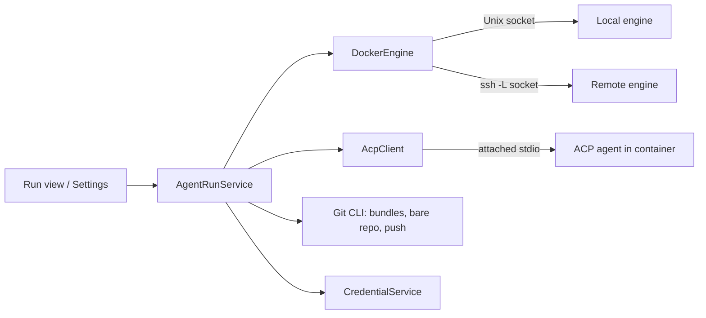

# Design: agent runs in containers

Design notes for running a coding agent's command-line tool (Claude Code, Codex, Gemini CLI, and others) inside a container, on the Mac or on a remote machine, and following the run from Brainiac: a setup flow with every credential the run needs, a live trace of what the agent does, and a review of the result before anything leaves the container. These notes are not the specification and not yet on the roadmap. When a release takes them, the behavior moves into [`SPEC.md`](../../SPEC.md), the design into [`architecture.md`](../architecture.md), and this file keeps only the background and open questions.

They build on what Brainiac already has: credentials kept only in the Keychain (`architecture.md`, Pull requests — v0.3, and `credentials.rs` in v0.4), or from the other sources of [`secrets.md`](secrets.md) once that design is taken, all outside I/O in Rust, Docker's Engine API reached over its Unix socket for Health (`architecture.md`, Databases — v0.4), the Git CLI with argument arrays, the diff viewer of v0.1, tasks that link to a repository (v0.2), and writes to GitHub and Bitbucket only on an explicit user action (v0.3).

## Status: planned for v0.5 (4 Oct 2026)

On the roadmap as v0.5 (`roadmap.md`, v0.5 — Agent runs), after v0.4.x's secrets (`secrets.md`), which it needs for its credentials. Nothing here adds a dependency or a table before the release starts. The first step is the spike under Open questions; its answers decide whether phase 1 is worth building.

## Why

Agents are most useful when they can work without asking before every command, and that is exactly when running them on the Mac is a risk: they see every file, every credential in the environment, and every repository. A container bounds what a run can reach. It also lets several runs go at once without sharing a working copy, and lets a long run happen on a bigger machine while the laptop sleeps.

Doing this by hand today means writing a Dockerfile, copying tokens into environment variables, cloning the repository inside, watching a terminal, and getting the changes out again. Brainiac already knows the repositories, the tasks they belong to, the forge accounts, and the Keychain, so it can do the setup once and make each run a single action.

## What the user gets

- **Agent setup** in Settings, a guided flow that ends in a working test run:
  1. **Where runs happen.** A local Docker-compatible engine (Docker Desktop, OrbStack, Colima) found from its socket, or a remote host reached over SSH. Brainiac checks that the engine answers and shows its version.
  2. **Which agents.** Claude Code, Codex, Gemini CLI, and any other agent that speaks ACP (Agent interface, below). Each agent shows how it signs in.
  3. **Sign in.** For each agent, an API key or the agent's own long-lived login token, pasted once and stored in the Keychain (Credentials, below).
  4. **The image.** Brainiac builds its default image from a Dockerfile the user can read, with Git, the chosen agents, and their ACP adapters at pinned versions.
  5. **Test.** A run in a throwaway container that starts each agent, sends it a one-line prompt, and shows the reply. Setup is done when every chosen agent answers.
- **New run**, from a repository or a task: the agent, the branch and commit to start from (the branch's head by default), a prompt (prefilled from the task's title, description, and linked note), and a time limit. The run gets its own branch name, `agent/<short-name>`.
- **The run view.** A live trace: the agent's messages, its plan, each tool call with its status, files it changed, and its cost when the agent reports one. **Cancel** stops the run. **Send** adds a follow-up prompt to the same session. When the agent asks for permission (Isolation, below), the run view shows the request and waits.
- **Review.** When a run finishes, its commits open in the diff viewer against the commit it started from. From there the user can:
  - **Save patch** or **Copy patch**, to apply by hand;
  - **Push branch**, which pushes the run's branch to the repository's remote;
  - then **Create pull request** through v0.3's `PullRequestService`.
- **Runs** in the sidebar: running, waiting for the user, finished, failed, cancelled. A run linked to a task shows on that task.

## The repository rule

Brainiac never writes to a user's repository (AGENTS.md, Hard rules). An agent's job is to write code, so the design keeps every write inside places the user did not ask Brainiac to protect:

- **In:** Brainiac makes a Git bundle of the starting commit (`git bundle create`, which only reads the repository) in the app's own data folder and copies it into the container through the Engine API (`PUT /containers/{id}/archive`). The agent clones from the bundle. The same path works for a remote host, and the user's working copy is never mounted. Uncommitted changes are not part of a run; New run says so when the working copy has any.
- **Out:** when the run ends, Brainiac asks the container for a bundle of the run's branch and copies it out (`GET /containers/{id}/archive`) into a bare repository that Brainiac owns in its data folder. The diff viewer reads that bare repository, not the user's.
- **Landing:** Push branch runs `git push` from Brainiac's bare repository to the user's remote, on the user's action, with hooks disabled and no other refs. It writes to the forge, as v0.3's merge does, and never to the local repository. The user fetches the branch as they would any colleague's.

This needs a new entry in the Decisions log when a release takes it: the bundle in, the bundle out, and the app-owned bare repository are the only Git operations, and none of them touches a working copy.

## Review of the first proposal

The first sketch (in conversation, 4 Oct 2026) had the agent clone the remote and push its own branch with a forge token, an adapter for each CLI that parsed its headless output, a setting choosing between automatic and manual pushes, and a relay binary in the container so a remote run survives a disconnect. Reviewed with the vocabulary of *A Philosophy of Software Design*:

| Finding | Symptom | Change |
| --- | --- | --- |
| The agent held a forge token to push its own branch | **Unknown unknown:** a prompt injection in the repository, an issue, or a web page could push anywhere the token reaches, or leak it | The agent never holds a credential that writes outside the container, other than its own model key. Pushing happens from Brainiac's bare repository, after review (The repository rule). |
| A setting for automatic or manual pushes | A hard decision (when is an unreviewed push safe?) handed to the user | **Define the error out of existence:** a run always ends in a branch to review, and pushing is always the user's action. No setting. |
| Cloning the remote inside the container | Two code paths (remote URL and local path), a forge read token in the container, and a local-only repository can't be used | One path for every repository and host: a bundle of the commit, copied in. |
| An adapter per CLI parsing `stream-json`, `exec --json`, and the rest | **Information leakage:** each CLI's output format, which changes without notice, known to the service and the UI | **Deep module:** speak one protocol, ACP, and keep each CLI's native output only as a fallback (Agent interface). |
| A relay binary in the container for reconnecting | A Linux binary to build, sign, and ship beside a macOS app | Docker already keeps a container's stdin open across attaches and replays its output from the logs (Local and remote). |
| Keeping full transcripts | Traces can hold code, secrets the agent printed, and company data | Traces are kept as files with a retention period, the injected secrets are redacted by exact value, and deleting a run deletes everything it left (Traces). |
| Honoring `.devcontainer.json` from the start | A Node dependency for the Dev Containers CLI and a second way to build images | Later, if one image per repository turns out to be needed (Not in this design). |

## Design it twice

### Runtime

| | A. Docker Engine API (chosen) | B. Dev Containers CLI | C. Hosted agents |
| --- | --- | --- | --- |
| Shape | Brainiac creates, attaches to, and removes containers over the Engine API | `devcontainer up` and `exec` driven from Rust, configured by each repository | Codex Cloud, Claude Code on the web, and similar services run the agent |
| Local and remote | One client: a Unix socket, local or forwarded over SSH | Local; remote through Docker contexts | Remote only |
| Reuses | Health's Docker client | The repository's own toolchain definition | Nothing in Brainiac but a link |
| Costs | A default image to maintain | Node and the CLI on the Mac; each repository's setup code runs at build time | Code and credentials leave the Mac; one service per provider; no local runs |

A puts the work in one module and works with every Docker-compatible engine on the Mac. B is worth adding later for repositories that already have a dev container. C is what Brainiac would link to, not build. Apple's `container` tool has no Engine API; it would need a second runtime behind the same interface, so it waits until someone asks for it.

### Agent interface

| | A. ACP client, native output as fallback (chosen) | B. Brainiac's own adapter per CLI |
| --- | --- | --- |
| Code per agent | None for an agent with ACP support; an image line and its sign-in | A parser for its output and its invocation |
| Steering (cancel, follow-up, permission) | Part of the protocol | Mostly impossible once the run starts |
| Trace | The recorded ACP messages | Brainiac's own normalized events |
| Risk | A young protocol; adapters for Claude Code and Codex are third-party and lag behind the CLIs | Output formats change without notice, for each CLI |

The Agent Client Protocol (ACP, from Zed) is JSON-RPC over stdio between a client, usually an editor, and an agent. It already describes what the run view needs: `session/update` notifications for message chunks, plans, and tool calls with their status and diffs; `session/cancel`; `session/request_permission`; and follow-up prompts in the same session. Gemini CLI speaks it directly, and Claude Code and Codex speak it through adapters. With A, Brainiac is one more ACP client, and a new agent costs a line in the image rather than a parser.

## Architecture

- **`AgentRunService`** owns a run from start to cleanup: it makes the bundle, creates the container with the run's credentials, attaches the ACP client, records the trace, collects the result bundle, and removes the container. It emits `agent_run_changed` for every state change and `agent_run_update` for each trace entry, and keeps every rule above in one place.
- **`DockerEngine`** is the Engine API calls the service needs: build, create, start, attach, logs, archive in and out, wait, and remove. It grows out of Health's client in `databases/health.rs` into a shared module, so Brainiac doesn't have two Docker clients.
- **`AcpClient`** speaks ACP over the attached stream: `initialize` (advertising no file system and no terminal, so the agent uses its own tools inside the container), `session/new`, `session/prompt`, `session/cancel`, and answers to `session/request_permission`. It turns ACP messages into trace entries the UI renders; nothing above it sees JSON-RPC.
- **Agents are data, not code.** Each supported agent is a descriptor: its name, its lines in the Dockerfile, the environment variables or file its credential goes into, the command that starts it under ACP, and its native headless command as the fallback.
- **Source code** would live in `src-tauri/src/agents/` (`service.rs`, `engine.rs`, `acp.rs`, `agents.rs`, `image/Dockerfile`). Command handlers stay thin, as elsewhere.

### A run's states

`preparing` (bundle, container, sign-in) → `running` → `waiting` (a permission request or the agent's turn ended and it waits for a follow-up) → `finished`, `failed`, or `cancelled`. The time limit cancels a run that is still `running` or `waiting`. A run that ends any way keeps its trace and, when the agent committed anything, its result bundle; its container is removed.

## Credentials

| Credential | Used for | Where it goes in the container |
| --- | --- | --- |
| Claude Code: an Anthropic API key, or the long-lived token from `claude setup-token` | The model | `ANTHROPIC_API_KEY` or `CLAUDE_CODE_OAUTH_TOKEN` |
| Codex: an OpenAI API key, or the login file from `codex login` | The model | `OPENAI_API_KEY`, or `auth.json` on a tmpfs |
| Gemini CLI: a Gemini API key | The model | `GEMINI_API_KEY` |
| Package registry tokens (optional) | Private dependencies | Named environment variables, chosen per repository |
| Forge token | Push branch | Never in the container; used by Brainiac's push |

- Every credential comes through `CredentialService` and the source saved for it ([`secrets.md`](secrets.md)): the store by default, or a command, Google Secret Manager, or another source the user keeps it in. A profile's model key has the owner `agent:<profile id>`, a registry token `registry:<name>`, and Push branch may use Git's credential helper for the forge host.
- Credentials are read on the Mac when the run starts, for every host. On a remote host each value crosses the SSH tunnel once, to the container it is for.
- **Delivery.** Docker keeps a container's environment in its configuration, where `docker inspect` shows it to anyone who can reach the engine, and the archive API cannot write into a tmpfs mount. So Brainiac's image starts a small entrypoint that reads one JSON line of credentials from the attached stdin, writes the file credentials (Codex's `auth.json`) to a tmpfs and exports the rest into the agent's process only, then replaces itself with the ACP agent, whose protocol uses the same stdin from then on. Environment variables in the container's configuration are only the fallback for an agent the entrypoint cannot serve, and New run says so for that agent.
- A credential is never in the image, a volume, the container's configuration (except that fallback), the database, or a log Brainiac keeps, and it lives in the container only as long as the run.
- The trace redacts the exact values `CredentialService` handed to the run, whatever their source.
- Setup tests each credential with the agent itself, so a wrong or expired token fails in Settings and not in the middle of a run.
- Whether each provider's terms allow a subscription login in automated containers is an open question; API keys are the default the docs recommend.

## Isolation

- The container runs as an unprivileged user, with no added capabilities, `no-new-privileges`, CPU and memory limits, and a writable work directory on a volume of its own.
- Nothing from the Mac is mounted: not the repository, not the home folder, not the Docker socket, and not Brainiac's MCP socket.
- **Network.** Phase 1 allows outbound traffic, and says so in New run, because the only credential inside is the model key. Phase 2 adds an allowlist: the container sits on an internal network whose only way out is a proxy Brainiac starts, allowing the model API, the package registries, and hosts the user adds. Which agents honor `HTTPS_PROXY` is a spike question.
- **Permissions.** Inside the container the agent runs in its most autonomous mode, because the container is the boundary. The ACP adapter still sends `session/request_permission` for what it considers risky; Brainiac allows those by default and shows them in the trace, and a per-run choice can make it ask instead.

## Local and remote

- **Local:** the engine's Unix socket, found the way Health finds it.
- **Remote:** the system `ssh` forwards a local Unix socket to the host's Docker socket (`ssh -N -L <local.sock>:/var/run/docker.sock host`), using the user's `~/.ssh/config` and agent, as Git uses the system CLI. The rest of Brainiac sees one more socket. This waits for v0.4.x's SSH tunnels (`roadmap.md`, v0.4) rather than adding its own.
- **Disconnecting.** The agent runs as the container's main process with stdin kept open (`OpenStdin`, not `StdinOnce`). When the Mac sleeps or the tunnel drops, the run continues. Brainiac reattaches on wake and reads what it missed from the container's logs, which hold every ACP message the agent wrote. An agent waiting on a permission request or a follow-up simply waits. That this works with each adapter is a spike question; ACP's optional `session/load` is the alternative.

## Traces

- A trace is the ACP messages of a run, written as JSON Lines to the app's data folder (`agent-runs/<run-id>/trace.jsonl`) as they arrive, with the run's injected credentials replaced by their names. The run view renders the live stream and a finished run's file with the same code.
- Traces are kept for 30 days by default, and **Delete run** removes the trace, the result bundle, and the run's branch in the bare repository.
- Traces are not indexed for search and not exported in the vault export; they are history, like query runs, and the export question is open.

## Storage

| What | Where | Fields |
| --- | --- | --- |
| `agent_hosts` | `brainiac.db` | `id`, name, kind (`local`, `ssh`), socket path or SSH host, image tag and its Dockerfile version, `created_at`; never a credential |
| `agent_profiles` | `brainiac.db` | `id`, agent (`claude_code`, `codex`, `gemini`, an ACP command), credential kind and its source (`secrets.md`), registry tokens by name with their sources, `created_at`; never a credential |
| `agent_runs` | `history.db` | `id`, host, profile, repository, task?, start commit, branch, prompt, state, started and ended times, cost?, error?, result commit? |
| Traces and result bundles | App data folder, `agent-runs/<run-id>/` | `trace.jsonl`, `result.bundle` |
| Bare repositories | App data folder, `agent-runs/repos/<repository-id>.git` | One per repository, holding the branches of its runs |

Hosts and profiles are in `brainiac.db` because they can't be rebuilt, and a restore on a new Mac needs the credentials entered again, as with v0.3's accounts. Runs are history and live in `history.db`.

## Phases

1. **Local runs with one agent.** Setup with a local engine and Claude Code, the image built from Brainiac's Dockerfile, a run from a repository with the bundle in and out, the live ACP trace, cancel and follow-up prompts, review in the diff viewer, Save patch, and Delete run.
2. **Landing and more agents.** Push branch and Create pull request, Codex and Gemini CLI, the network allowlist, and permission requests that ask.
3. **Remote hosts**, once SSH tunnels exist: setup over SSH, reattaching after sleep.
4. **Runs from tasks.** New run from a task, the run shown on the task, and Today's line for runs that wait for the user.

**Exit gate (phases 1 and 2):**
- Set up Claude Code and Codex from nothing, ending in passing test runs.
- Run an agent on a repository with no remote, and save its patch.
- Cancel a run halfway, then start one and steer it with a follow-up prompt.
- Push a run's branch and open a pull request from it; the local repository's refs, index, and working copy are unchanged.
- Confirm that a run's container could not reach a host off the allowlist, and that no credential appears in a trace, the database, the image, or the container's configuration (`docker inspect`).

## Not in this design

- **Scheduled or recurring runs**, and agents that keep running between tasks.
- **Several agents on one branch**, or a run that continues another run's branch.
- **An image per repository** or `.devcontainer.json` support (Runtime, above).
- **Brainiac's MCP tools inside a run.** ACP's `session/new` can pass MCP servers, but the socket is closed to other users on purpose (`architecture.md`, Agent access), and opening it to containers is its own design.
- **Hosted agent services**, beyond perhaps a link to them.
- **Hiding the model key from the agent** with a proxy that adds it to requests; worth revisiting if the allowlist is not enough.

## Testing

- `AgentRunService` tests run against a fake engine and a fake ACP agent in memory: a run that finishes, fails, is cancelled, hits its time limit, asks for permission, and is reattached after a disconnect.
- `AcpClient` tests replay recorded ACP sessions from each supported adapter, with generic prompts and file names.
- An integration test, skipped without a Docker engine, runs a small ACP agent stub in a real container: bundle in, a commit, bundle out, and removal.
- The bundle and bare repository code is tested against Git fixtures the tests build, as elsewhere, including a check that the source repository's refs and index are unchanged.
- The setup flow and the run view are tested in WebKit over the fake backend.

## Open questions

| Unknown | How to resolve | Needed before |
| --- | --- | --- |
| ACP adapters in a container | Spike: run Claude Code's and Codex's ACP adapters over an attached stdio stream, with the client advertising no file system or terminal; check that they use their own tools and still report diffs | Phase 1 |
| Reattaching | Spike: detach and reattach to a running container, replaying from the logs; check what each adapter does when its client disappears mid-request; compare with `session/load` | Phase 1 (local), phase 3 |
| Subscription logins | Whether Anthropic's and OpenAI's terms allow `claude setup-token` and Codex's login file in automated containers, and how long they last | Phase 1 |
| The default image | What it contains beyond Git and the agents (common language toolchains or none), its size, and how a user adds what a repository needs | Phase 1 |
| Proxy support | Spike: which agents and package managers honor `HTTPS_PROXY`; how the proxy is started and stopped with the run | Phase 2 |
| Credentials for Push branch | The user's own Git credential helper (a source in `secrets.md`), or v0.3's forge token passed to `git push` for one invocation | Phase 2 |
| Delivering credentials without environment variables | Spike: the stdin entrypoint with each agent and its ACP adapter; check that each reads its key from an inherited environment or a file, and that nothing shows in `docker inspect` or the engine's logs | Phase 1 |
| Credentials read by a remote host | A source resolved on the host (Secret Manager through a cloud VM's service account) keeps a secret off the Mac, but gives the container a credential that reaches beyond its model key; worth it only with a narrowly scoped account and the allowlist | Phase 3 |
| Engines | Check Docker Desktop, OrbStack, and Colima for the archive, attach, and logs calls used here | Phase 1 |
| Trace size and retention | Measure a typical run's trace; decide whether 30 days is right and whether traces belong in the export | Phase 1 defaults |

## Sources

Not yet verified in a spike.

- Agent Client Protocol — <https://agentclientprotocol.com>
- Zed's ACP adapter for Claude Code — <https://github.com/zed-industries/claude-code-acp>
- Zed's ACP adapter for Codex — <https://github.com/zed-industries/codex-acp>
- Claude Code, headless use and authentication — <https://docs.anthropic.com/en/docs/claude-code/sdk/sdk-headless>
- Codex CLI — <https://github.com/openai/codex>
- Gemini CLI — <https://github.com/google-gemini/gemini-cli>
- Docker Engine API: containers, attach, logs, and archive — <https://docs.docker.com/reference/api/engine/>
- Git bundles — <https://git-scm.com/docs/git-bundle>
- Development Containers specification — <https://containers.dev>
- Apple's `container` tool — <https://github.com/apple/container>
- John Ousterhout, *A Philosophy of Software Design*, the vocabulary of the review above
