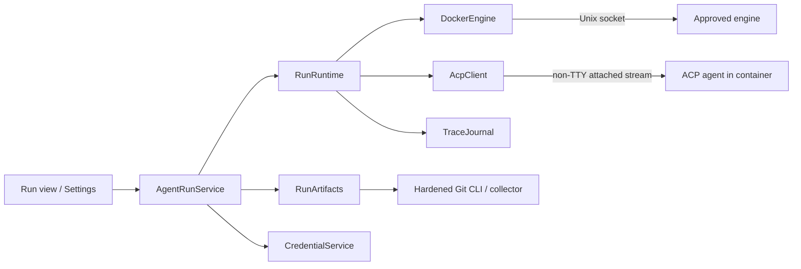

# Design: agent runs in containers

Design notes for running a coding agent inside a container and following its work from Brainiac: guided setup, a live trace, follow-up prompts, and review before its result is published to a Git remote. Code and prompts reach the selected model provider during execution; review gates publication of the result, not that disclosure. These notes describe the planned v0.5 on [`roadmap.md`](../roadmap.md), not current behavior. When the release starts, behavior moves into [`SPEC.md`](../../SPEC.md), architecture into [`architecture.md`](../architecture.md), and this file keeps the background and remaining questions.

This builds on v0.4's Docker socket discovery and Health requests, v0.4.x's [`secrets.md`](secrets.md), the Git CLI with argument arrays, the diff viewer, tasks linked to repositories, and the provider-neutral pull request service. Health's short HTTP requests provide discovery/client setup; bidirectional attach streams, archives, and lifecycle recovery need their own implementation and spike. Nothing here adds a dependency, table, or accepted architecture decision before v0.5 starts. Remote hosts also depend on v0.4.x's SSH tunnels; Create pull request depends on the v0.3.x follow-up.

## Why

A container gives each run its own working copy and bounds the files and credentials the agent can reach. The user's checkout is never mounted or modified. Several runs can work independently, including on repositories with no remote. A later remote runtime can keep working while the laptop sleeps, once its control and recovery protocol is proven.

Brainiac knows the repositories, linked tasks, and credential sources. It can turn the manual sequence of creating an image, delivering credentials, watching an agent, and extracting changes into one workflow. The first release supports one tested ACP agent, API-key authentication, and complete local Git repositories. Unsupported cases fail before credentials are delivered.

## What the user gets

- **Agent setup** in Settings: choose a local Docker-compatible engine, a supported agent and credential source, build the readable default Dockerfile, and run a small paid test prompt. The image pins the base image, agent, adapter, and collector; setup records the resulting digest and capability test. Engine access grants control over containers on that engine. An approved remote host and its operator can inspect a run's code and credentials.
- **New run** from a repository, and from a task later: choose the starting branch or commit, prompt, time limit, and resource limits. Brainiac resolves the start to an immutable commit. It shows that local uncommitted changes are excluded, which history is copied, the provider/host/image, and each injected credential. Phase 1 says outbound network access is unrestricted. Task-derived text is editable before sending.
- **The run view:** messages, plans, tool activity, reported file changes, and usage/cost when available. Missing cost says “Unavailable”; a time limit is not a spending cap. **Send** starts the next turn when idle. **Cancel** ends the run and attempts to preserve partial work. **Finish and collect** ends an idle session and captures its working tree. Permission requests follow the selected run policy and appear in the trace.
- **Review:** a stable comparison between the starting commit and a collected result snapshot, including edits the agent never committed. The first release publishes one Brainiac-authored snapshot commit; intermediate agent commits are not preserved. Save patch and Copy patch export this comparison, including binary changes within artifact limits. A later **Push branch** publishes the exact reviewed snapshot to a new remote branch, then **Create pull request** once its dependency exists.
- **Runs** show preparation, activity, idle/permission waiting, stopping, collection, and terminal outcome. Failed/interrupted runs can still have partial results. Collection and cleanup failures have separate recovery actions and never silently discard the working volume.

## The repository rule and artifacts

Brainiac never writes to the user's checkout, index, refs, or Git configuration. It may write to run containers and app-owned scratch/bare repositories. Push changes the explicitly selected remote on a user action. These future exceptions need a new architecture decision when v0.5 starts; this document does not change today's rule.

### Input: an immutable start

`RunArtifacts` resolves the selected ref once and prepares an app-owned bare export repository with a named ref at that exact commit. A bare object ID cannot be passed directly to `git bundle create`: it needs a named ref. No temporary branch/tag is created in the source. The spike must prove a read-only object-transfer path into the export repository, including a branch moving during export and source objects disappearing. Failure asks the user to retry; it never silently selects a newer commit.

The bundle is self-contained: the selected commit and reachable ancestor history, with only the intended export ref advertised. New run explains this scope. It excludes working-tree/index changes, stash and unrelated refs, configuration, hooks, and remotes. Brainiac copies it through the Engine archive API; the run clones into a new volume and removes the input bundle from the agent's working area after setup. A trusted copy remains for recovery/collection.

Phase 1 supports complete local SHA-1 repositories. Shallow/partial repositories, unavailable objects, LFS pointers, and gitlinks/submodules in the selected tree are rejected with a remedy before starting a container or resolving credentials. It never invokes lazy fetch, LFS filters, or submodule checkout to make a run work. Those need another transfer/authentication contract. Export uses hardened Git with hooks, maintenance, external helpers, replacement refs, and repository/environment overrides disabled. Git 2.30 remains the minimum; the spike checks every proposed flag against it.

### Output: collect the final working tree

For Finish, Cancel, expiry, process failure, or interruption, first stop all agent processes and confirm the workload container is stopped. A separate collector container mounts its volume read-only, has no network/injected credentials, and uses an approved image digest, its own writable scratch area, and the original input bundle. It does not execute the agent's entrypoint or trust its Git configuration, index, refs, hooks, or commits.

The collector constructs a final tree and one snapshot commit whose sole parent is the recorded starting commit. Existing tracked paths are included even when newly ignored. Added untracked files follow an exclusion policy captured from the starting tree plus Brainiac's fixed exclusions; edited ignore files cannot hide previously eligible output. New ignored/generated files, Git metadata, credential/home/cache directories, and special devices are excluded. Review lists excluded additions and offers bounded recovery selection of eligible regular files; it does not treat all files on the volume as safe output. Symlinks are recorded as link text and never followed outside the workspace. Executable bits/deletions are preserved. Unsupported path encodings, unreadable files, or exceeded limits fail explicitly rather than produce an incomplete snapshot labelled complete.

Regular bytes are hashed without clean/smudge filters or text conversion. Snapshot construction uses collector-owned Git metadata with hooks and repository config disabled. A no-change tree is valid and needs no new commit. The spike must demonstrate uncommitted/staged edits, new files, binaries, symlinks, and cancellation without any agent commit.

The collector is trusted code; its inputs and returned archive remain untrusted. Brainiac streams only the expected `result.bundle` regular-file entry into a new temporary file. It rejects extra/duplicate entries, absolute/traversing paths, links, devices, and oversized archives without extracting arbitrary host paths. Verify bundle prerequisites, object integrity, the single expected advertised ref, and exactly the original start as the result's parent; the no-change case instead requires the result OID to equal the recorded start. Bound object/ref counts and expanded sizes as well as transfer bytes. Import only into an app-generated run namespace; serialize shared bare-repository updates and GC.

Publish verified artifacts/metadata atomically before exposing a result. An artifact hash, immutable base/result IDs, and collection generation identify it; diff, patch, and push use these IDs and the existing hardened diff policy. ACP file reports are advisory; the collected tree is authoritative. An agent may write or encode secrets into files; trace redaction cannot certify an artifact. Review precedes export/push.

Collection failure retains the stopped working volume and input, with **Retry collection**, bounded recovery export, and **Discard work**. Discard is explicit. Successful collection permits container/scratch cleanup; when additions were excluded, retain the stopped volume until the user accepts the displayed exclusion manifest or selects eligible additions for a new collection generation. Review exposes **Keep this snapshot**; patch export or Push can confirm the same displayed manifest. An accepted snapshot permits volume cleanup, and an exclusion-free result needs no extra confirmation. Deleting a run with retained/uncollected work asks for confirmation of the displayed loss.

### Landing: publish the reviewed snapshot

Push requires a verified result. The action carries its expected generation/OID, approved credential binding, explicit destination URL/forge repository, and a unique validated branch name such as `agent/<short-name>-<run-id>`. The UI shows the destination and commit. A changed result, destination, account, or approval invalidates the action before network I/O. A local repository rename cannot rebind pending publication.

The first push is create-only: one explicit `<reviewed-oid>:refs/heads/<branch>` refspec and an explicit empty expected remote ref lease. Refuse an existing branch even if an update would fast-forward. No force update, mirror, tags, submodules, hooks, or additional push URLs. Push configuration/URL rewriting cannot add destinations or redirect credentials outside approved context. Secrets never appear in URLs, arguments, logs, or persisted Git config.

After a lost response, publication is uncertain. Reconcile the exact remote ref: reviewed OID means already published, absence permits the same create-only retry, another OID means conflict. Never blindly repeat a push or create duplicate pull requests. Record intent before sending and the observed result afterwards. Create pull request uses the verified source repository/branch/head and explicit target branch, with the provider service's own reconciliation policy.

Phase 2 first supports HTTPS publication to supported GitHub/Bitbucket Cloud hosts with tested Git-compatible credentials. REST and Git authentication are distinct capabilities; a working API token does not automatically qualify. Resolve a Git-helper source on the Mac for the approved host/user/path. A private per-invocation credential bridge supplies only that destination without `credential approve`/`reject`; child output uses safe mapped diagnostics. Unsupported formats fail before push. For SSH URLs offer the equivalent HTTPS destination; SSH/custom-remotes need their own authentication policy. Publishing to a fork is explicit and never inferred from the checkout's remote.

## Design it twice

### Runtime

| | A. Docker Engine API (chosen) | B. Dev Containers CLI | C. Hosted agents |
| --- | --- | --- | --- |
| Shape | Streams, archives, and owned resources behind one runtime | Repository-defined environments driven through another CLI | Provider runs the job |
| Local/remote | Local socket first; SSH plus durable control later | Local or Docker contexts | Remote only |
| Costs | Image and lifecycle/transport implementation | Node/CLI dependency and repository build code | Provider-specific integration/data policy |

A gives one artifact workflow for supported engines and repositories. Compatibility is proven, not inferred from a socket existing. Dev containers, hosted services, and Apple's separate runtime wait for usage to justify them.

### Agent interface

| | A. ACP only (chosen) | B. Native output parsers |
| --- | --- | --- |
| Interface | Negotiated protocol normalized into Brainiac events | Per-agent invocation, parsing, and control |
| Cost | Pin/test adapter and CLI capabilities | Several execution models/error contracts |
| Missing feature | Reject unsupported agent or hide unavailable feature | Add another fallback workflow |

ACP covers session setup, turns, cancellation, permissions, and updates. Phase 1 supports tested agents, not arbitrary ACP programs. Built-in descriptors hold immutable launch arguments, credential names, pinned packages, and capability matrix. A descriptor does not prove sign-in, autonomous tools, diffs, or restart support; adapters may need integration work. Native-output fallback is excluded.

### Disconnect policy

| | A. Attached session, interrupt on loss (phases 1–2) | B. Durable controller (required for phase 3) |
| --- | --- | --- |
| Authority | Brainiac owns request state while connected | Engine-host controller owns session/journal |
| Lost connection | Stop and collect once engine is reachable | Reconcile requests and replay by sequence/cursor |
| Cost | No conversational resume/log replay | Component to package, secure, upgrade, and test |

A makes local collection useful without treating Docker logs as a durable RPC protocol. Phase 3 must prove B before promising continuation during laptop sleep. Keeping stdin open or advertising optional ACP session loading is insufficient.

## Architecture

- **`AgentRunService`** owns domain validation/versioning, destination approvals, leases, user actions, committed state/events, and restart reconciliation. It holds no database transaction while awaiting engine/Git/credential I/O. Stale observations/actions carry a run version/generation and are discarded/refused.
- **`RunRuntime`** owns session/resource lifecycle: start, serialized turns, permission replies, bounded stop, status, and stopped-volume handoff. It hides transport/correlation from the service. Its resource ledger is persisted as IDs become known; single-session ownership prevents duplicate attached writers.
- **`DockerEngine`** owns discovery/API negotiation, non-TTY framing, concurrent stdout/stderr drainage, streaming archives, create/start/stop/wait/remove, and typed bounded diagnostics. Health retains short request timeouts; attach/build/archive have separate cancellation/budget policies. Raw engine responses never become UI errors.
- **`AcpClient`** owns capability negotiation, sessions, request IDs, cancellation, and permissions. It advertises no client filesystem/terminal and passes no Brainiac MCP servers. The supported adapter must prove tools work inside the container; requests for Mac-side tools are refused. It emits normalized events, not JSON-RPC for callers to interpret.
- **`RunArtifacts`** owns immutable export identity, collector policy, hostile-output verification, app-owned Git refs, diff/patch, and exact-result publication. **`TraceJournal`** owns sanitization, sequences, quotas, durable append, and UI replay. Each hides one authoritative representation from its callers.
- Code would live in `src-tauri/src/agents/` with readable image/entrypoint/collector sources. Future UI DTOs live only in `models.rs`, generated with `ts-rs`; this document does not define IPC shapes.

### State and actions

Activity, result availability, and cleanup are separate facts. Waiting has an idle/permission reason. Terminal outcomes are finished, failed, cancelled, expired, or interrupted. Result status is absent, collecting, ready/no-changes, or collection-failed; cleanup may independently be pending. Transport loss means execution is uncertain until engine-confirmed stop.

| Trigger | Contract |
| --- | --- |
| Start | Persist intent/immutable start, prepare artifacts/resources, recheck leases/approval, deliver once, initialize. Preparation is cancellable and has its own deadline. |
| Send | Only while idle; duplicate action IDs return the existing outcome. Never queue/replay uncertain delivery. |
| Turn ends | Record reason; become idle, or fail on unrecoverable protocol/process error. `end_turn` does not delete resources. |
| Permission | Bind to exact request/session/turn. Ask waits; autonomous selects a valid allow-once option. Unknown/malformed requests are refused; late replies after cancellation have no effect. |
| Finish | Only while idle; stop all writers, collect. Finished outcome can coexist with collection failure, with publication disabled until verified. |
| Cancel/expiry | Reject new prompts, answer pending permissions cancelled, request ACP cancellation, then engine stop with bounded grace/forced termination. Confirm stop before collecting; ACP cooperation is not the sole mechanism. |
| Disconnect/restart | Persist uncertainty, inspect/stop recorded owned resources when engine returns, collect as interrupted. No ACP replay or fresh credential delivery. |
| Delete | Refuse while execution uncertain. Stop/collect or explicitly discard, persist cleanup intent, remove owned artifacts/resources idempotently. |

The run limit begins at workload start. In phases 1–2 Brainiac enforces it while connected. If Brainiac stops/sleeps or cannot reach the engine, work may continue until reconciliation; setup/UI states this limitation and never labels it stopped/deadline-enforced while unconfirmed. Restart prioritizes pending stops. Runtime failure never automatically creates another container. Container restart policy is disabled.

## Credentials and disclosure

| Credential | Scope/delivery |
| --- | --- |
| Model API key | Supported provider/agent; bootstrap stdin, then agent-process environment |
| Registry token, after phase 1 | Stable `registry:<id>` owner, approved repository/registry context, read-only private-package access |
| Git publication credential | Mac only, approved HTTPS destination; never workload/collector |
| Subscription/login files | Deferred pending provider terms, renewal/format, and sanitization verification |

Sources use `CredentialService` leases; starting a run does not clear its process cache. Model owner is `agent:<profile id>`; registry IDs survive renaming. Validate key format and reserved delivery names without echoing bytes. Registry configuration cannot override executable-loading variables, provider URLs, agent startup options, or forge credentials. Refuse publish/admin scope where inspectable; otherwise require explicit user attestation to read-only scope and state that limitation. Phase 1 injects no registry tokens.

Approval includes source binding, provider endpoint, descriptor/version, image digest, host identity, and repository/registry recipients. Changes require confirmation before resolution/delivery, including cache hits. Snapshot non-secret identities so editing a profile cannot change a running session. Recheck leases immediately before delivery; obsolete leases abort preparation. Rotation afterwards cannot erase the agent's copy; cancel/restart to replace it. Test probes the displayed draft afresh and records its time, without guaranteeing validity of future runs.

Resolve on the Mac for every host. The entrypoint reads a bounded bootstrap frame from attached stdin before ACP, accepts descriptor-approved keys only, exports to its child, and clears the bootstrap buffer. Secrets never go into Docker `Env`, image/build args, volumes, labels, argv, or settings. No inspect-visible environment fallback; incompatible agents are unsupported. Put home/auth/cache on tmpfs where supported. Bootstrap failure reports a generic error. Verify buffering cannot consume subsequent ACP bytes.

The agent and engine operator can read delivered credentials. An agent may copy a key into its workspace/output; Brainiac cannot guarantee all agent-produced files are secret-free. Fixed endpoints and limited scopes reduce reach. Before Start, display model-provider/code/prompt transfer, engine-host trust, network policy, and credential scope.

Restored/imported hosts/profiles are disabled until source/destination/image/host confirmation under `secrets.md`. Matching IDs/Keychain names confer no trust. Imported data never authorizes reconnecting runs, building images, executing descriptors, injecting credentials, or deleting engine resources; stopping locally owned work before restore is a separate existing obligation. Local upgrades preserving a binding are separate from restore. Rust enforces approvals; MCP cannot start runs/change settings in this release.

## Isolation and permissions

Workload/collector run unprivileged, all capabilities dropped, `no-new-privileges`, no host namespaces/devices, compatible seccomp, CPU/memory/PID limits, and bounded workspace storage. No checkout, home, Docker socket, or Brainiac MCP socket is mounted. Image builds use app-controlled context only; setup never executes repository Dockerfiles/dev-container hooks. The agent may run repository scripts inside its workload as part of its work.

Phase 1 calls outbound access unrestricted and claims no host-service/network isolation. Phase 2 adds registry tokens only with tested allowlist mode. An internal run network reaches an app-owned egress proxy with no direct host/Internet route. Tests cover direct IPs, IPv6, DNS/rebinding, CONNECT, redirects, gateways, private/link-local/metadata endpoints, and proxy bypass. The proxy resolves/checks destinations and permits explicit provider/registry/user-added hosts; arbitrary tunnelling/IP-literal destinations are refused. Extra hosts require explicit policy change. Incompatible clients fail visibly with no unrestricted fallback. Private registries require a separately displayed destination exception.

Start explicitly selects autonomous container work or ask for adapter requests; phase 1 offers both after capability tests. Autonomous mode authorizes only that run's work, never Push, new credentials, image/host changes, or network expansion. ACP permissions do not prove every subprocess/network operation is mediated.

Workspace disk must be enforced by a supported runtime mechanism, not reported after exhaustion. The spike chooses a quota-capable volume or another bounded implementation; engines unable to meet it are unsupported. Finite defaults for workspace/artifact/trace/concurrency are chosen from measurements and shown when material.

## Local, remote, and durable control

Phases 1–2 discover the local socket as Health does, identify the approved engine, use non-TTY attach, and disable Docker logging on workload/collector (`LogConfig.Type=none`). Daemon defaults cannot forward raw protocol/stderr to disk/external logging. Logs are never the transcript/replay source. Adapter private logs must be disabled or on disposable tmpfs, tested for every supported version.

Phase 3 uses system SSH with argument arrays, verified host keys, and existing tunnel policy to the approved socket. Unknown/changed host keys never auto-accept. Imported host records cannot launch tunnels. Transport alone does not promise offline continuation.

Continuation needs a trusted controller on the engine host, outside the agent's writable area/process authority, with single-writer ownership, persistent redacted journal, sequence cursors, and request IDs. Record prompt intent before forwarding/acknowledging; lost responses reconcile by ID rather than becoming new turns. ACP provides no general exactly-once guarantee: controller failure after forwarding but before recording leaves uncertain delivery, so stop/collect instead of repeating. Scope permission replies the same way; reconcile before accepting input. Never invoke unadvertised adapter load/resume capabilities. Reopening Brainiac uses the controller's status/journal instead of the phase-1 stop-on-restart rule; losing or restarting that controller still interrupts the workload.

The controller enforces expiry, cancellation, and bounded resources while Brainiac is offline. Redaction material stays in memory. A controller restart losing that material stops the agent before processing more raw output and records a trace gap. Engine restart interrupts the run, with no credential reinjection or automatic workload restart. Packaging/deployment, authorization, upgrades, journal limits, and emergency stop are phase-3 gates; if unproven, continuation stays unavailable. Remote credential resolution/subscription renewal need separate designs.

## Traces, quotas, and rendering

Persist a versioned Brainiac journal, `agent-runs/<run-id>/trace.jsonl`, not raw ACP. `TraceJournal` assigns monotonic sequences and records turn/request/tool identities, timestamp, safe content, and reported usage/provenance. Live/replay use the same normalized events; UI gaps recover by cursor. Skip unknown extensions with safe diagnostics; adapter upgrades cannot redefine old journals. No raw protocol/bootstrap/stderr/engine bodies are persisted.

Sanitize before disk, IPC, notifications, or diagnostics. Decode string content before matching JSON escapes; use bounded look-behind for secrets split across chunks and redact before releasing the pending tail. Flush safely at turn/end/error. Register each injected scalar; any future structured login format must register component tokens, not just whole JSON. Replace matches with source names. Encoded/transformed values, repository-held credentials, and unknown secrets cannot be guaranteed absent. Empty/invalid keys fail validation; errors name operations without confidential output.

Finite budgets cover frames, stderr drainage, bootstrap, event/journal content, archives, expanded Git objects, workspace disk, and concurrency, before unbounded allocation/decompression. Slow UI cannot block protocol/permission/cancel processing: bounded batches and cursor replay replace per-token events. Oversized frames/journal exhaustion stop the run, mark a gap, and preserve partial work. Control messages are never silently dropped to continue execution.

Escape code/text; sanitize Markdown under existing app policy; load no remote images or executable HTML/terminal escapes. File links resolve only inside verified artifacts, never arbitrary Mac paths. External links use explicit opener actions.

Default retention removes traces/prompts/results/history together 30 days after terminal outcome. Recovery work and excluded additions awaiting acceptance remain displayed until collected/accepted/discarded; retention never silently removes them or active/uncertain work. Delete/expiry remove visible artifacts/input/scratch/journal/run refs, then bounded GC of unreachable objects. Shared objects retained by other runs stay. No secure-erasure claim for SSD blocks/snapshots/provider/remote-host copies. Runs/traces/artifacts are excluded from vault export; if an export includes copied history, run rows are filtered from that copy. Core profiles/hosts follow source-reference export and restore confirmation. Local history snapshots may retain expired sanitized prompts until their own retention ends, but never carry injected credential bytes/redaction material.

## Persistence, restart, and cleanup

| What | Where | Meaning |
| --- | --- | --- |
| `agent_hosts` | `brainiac.db` | Stable ID, name, approved endpoint/engine identity, revision; no credentials |
| `agent_profiles` | `brainiac.db` | Stable ID, descriptor/source bindings, registry IDs/contexts, approved image digest, revision; no secret bytes |
| `agent_runs` | `history.db` | Immutable start/profile/image/host context, prompt/version, activity/outcome, result identity, resource/recovery ledger, expiry, safe errors, publication intent/result |
| Journals/artifacts | App data `agent-runs/<run-id>/` | Sanitized journal, immutable bundles, verified metadata, atomic-publication temporary files |
| Bare results | App data `agent-runs/repos/<repository-id>.git` | App-generated refs/objects, serialized writes/GC |

These are domain concepts; final schema belongs in architecture at release start, not DTO definitions here. Cleanup can use a ledger in the run row without another table. Labels hold installation/run/attempt IDs and role, never prompt/path/credential. Commit intent before side effects and IDs afterwards. A lost create response reconciles the owned label/attempt before retry; name equality alone is insufficient. Artifacts/publication follow the same intent/reconciliation principle.

Persist only sanitized prompts and safe errors. Initial raw prompt text stays in memory during preparation until the injected keys are known and matching values can be removed from the history copy; the early intent may omit prompt content. Follow-up intent stores a sanitized copy before sending the raw prompt in memory. Neither restart nor a controller uses stored prompt content to replay a turn. Unknown secrets pasted into prompts have the same documented limits as arbitrary output; history is not a secret-scanning guarantee.

The installation identity is generated locally outside exported/snapshotted databases; applying a restore starts a new ownership epoch. Before restore, attempt to stop/collect current runs and refuse replacement while execution is uncertain unless the user explicitly accepts the displayed recovery obligation; retain the local old-epoch resource ledger outside the restored data until cleanup completes. Restart enumerates resources only for the current installation/trusted host and these retained local obligations, correlates to history, stops interrupted workloads, then collects. Missing/unreachable resources retain explicit execution/cleanup uncertainty. Unknown owned-looking orphans require user-directed recovery/removal, never adoption as runnable sessions. Restored history inherits no active ownership or authority to reconcile another installation's resources.

Cleanup includes workload/collector containers, named/anonymous volumes, run networks/proxies/controllers, temporary input/export data, and expired refs. Removing a container is insufficient. Shared images are installation caches. Deletes are idempotent/restricted to recorded ownership/attempt; obsolete cleanup cannot touch newer runs. Failed collection keeps the stopped volume. Failed cleanup stays visible/retryable without blocking review of a verified result. Ledger tombstones remain until resources are gone even after visible history expires.

## Phases and exit gates

1. **Spike before implementation.** Pin one Claude adapter with API-key auth on target engines. Prove the lifecycle below, arbitrary-commit export on Git 2.30, stopped-volume collection, bootstrap/no raw logs, enforceable disk budgets. Choose toolchains/default limits from measurement; failed gates narrow supported engines/agents rather than add fallbacks.
2. **Phase 1 — local runs.** Setup/Test, complete local repositories, ACP turns/permissions, Cancel/Finish/expiry, interrupted-run recovery, snapshot/patch review, bounded journal, Delete. API keys only, no registry tokens/push/conversational reconnect. Gate: uncommitted/staged/new/binary edits, mid-tool cancellation, app restart mid-request, partial collection/retry, source checkout/refs/index/config unchanged, owned resources cleaned up.
3. **Phase 2 — landing and agents.** Tested Codex/Gemini descriptors; create-only HTTPS push and Create pull request after its dependency; enforced allowlist before read-only registry tokens. Gate: safe bad credentials, existing-branch refusal, lost-push reconciliation, exact reviewed publication, adversarial bypass/private-host rejection, real setup/work for each supported pair.
4. **Phase 3 — remote/durable continuation.** SSH dependency plus controller spike. Gate: sleep/disconnect during prompt/permission/replay, expiry/emergency stop offline, controller crash with uncertain delivery, host-key changes, tunnel/engine loss and cleanup; no duplicate prompt/credential delivery or raw replay logs.
5. **Phase 4 — tasks.** Task launch/linkage and Today waiting indicator. Inputs are snapshotted/editable; later task changes cannot steer a run. Task removal/relocation does not delete runs/artifacts.

## Testing

- Fake-runtime/service tests: versions, duplicate actions, stale events/leases, edit/restore approvals, all transitions, uncertain stop, no publication without explicit current action.
- ACP fixtures/fake peers: negotiation, extensions, malformed IDs/frames, late permissions/cancel, split secrets/JSON escapes, stdout/stderr floods and UI backpressure; generic names/prompts/fake keys.
- Temporary Git fixtures: arbitrary OID/ref races/missing objects, ignored tracked and eligible/excluded untracked files, binaries/modes/symlinks/no-change, hostile config/filters, wrong parents/refs, malformed/compression-bomb bundles and tar traversal/link/device/duplicate entries. Assert no source writes/lazy fetch.
- Real-engine integration (opt-in): ACP stub and collector, faults at intent/create/ID-record/start/bootstrap/stop/collect/import/publish/remove, restart reconciliation, enforced quotas, forced-stop collection, retained work, partial cleanup, ownership isolation.
- Publication with temporary remotes/provider stand-ins: create-only collisions, stale destination/artifact, missing/incompatible credentials, one-ref/no-tag, uncertain success/retry, pull request reconciliation. Network bypass tests independent of agent cooperation.
- Leak fixtures: known injected values absent from Docker configuration/labels/argv, image/build cache, persistent daemon/adapter logs, journals/IPC/errors/snapshots. Separately demonstrate documented encoded/artifact leakage limitations; export never claims confidentiality certification.
- Retention/recovery: volume removal, expired prompts/results, shared objects/GC, disk exhaustion/tombstones, unreachable engine, restore with running/cleanup state. WebKit fake backend: setup/disclosure, idle/permissions, Finish/Cancel, uncertainty, partial review/discard confirmation.

## Not in this design

- Scheduled runs, agents sharing a branch, continuation from a prior result, or preservation of intermediate agent commit history.
- Arbitrary ACP commands, native fallback, repository images/dev-container hooks, hosted services, other runtimes.
- Subscription auth/renewal, remote sources, SSH/custom-remote push, automatic force updates.
- Brainiac MCP/Mac filesystem/terminal inside runs, or a proxy hiding the model key. Each needs another authority/destination design.

## Open questions and spikes

Behavior above is decided; these are feasibility/default gates, not unspecified fallback behavior.

| Unknown | How to resolve | Needed before |
| --- | --- | --- |
| Adapter capabilities | Pinned versions, no client filesystem/terminal; sign-in, autonomous/ask, follow-up, cancellation, safe stderr, no private persistent logs | Phase 1 and each agent |
| Complete local lifecycle | Uncommitted edit, lost attach mid-request, stop/reconcile, volume collection/cleanup; no log replay | Phase 1 |
| Export arbitrary commit | App-owned ref/object transfer, minimum Git, source refs/index/config unchanged, missing objects fail locally | Phase 1 |
| Collector policy | Direct-byte trees, eligibility policy, hostile tar/Git expansion, retention after failure | Phase 1 |
| Bootstrap | Exact bytes/framing, inspect/log/build leakage, split-secret redaction, tmpfs home | Phase 1 |
| Engines/budgets | Docker Desktop/OrbStack/Colima framing/archive/stop, quotas, typical trace/image size and toolchains | Phase 1 defaults |
| HTTPS credentials | Git formats/scopes, private bridge, no URL/argv/config leaks, empty-ref lease on minimum Git | Phase 2 |
| Egress | Route/proxy bypass tests, package managers, private exceptions, proxy lifecycle | Phase 2 before registry tokens |
| Controller | Packaging/deployment alternatives; reconciliation, sanitized journal, offline deadline, ownership and crash stop | Phase 3 |

## Sources

Primary documentation checked during review; container/adapter compatibility still requires the spikes above.

- ACP [initialization](https://agentclientprotocol.com/protocol/initialization), [turns/cancellation](https://agentclientprotocol.com/protocol/prompt-turn), [sessions/loading](https://agentclientprotocol.com/protocol/session-setup), [permissions](https://agentclientprotocol.com/protocol/tool-calls).
- Current [Claude adapter](https://github.com/agentclientprotocol/claude-agent-acp) and [Codex adapter](https://github.com/agentclientprotocol/codex-acp); earlier Zed repository/package references moved. [Gemini CLI](https://github.com/google-gemini/gemini-cli).
- Docker [Engine API](https://docs.docker.com/reference/api/engine/), [attach](https://docs.docker.com/reference/cli/docker/container/attach/), [logging](https://docs.docker.com/engine/logging/), [explicit logging drivers](https://docs.docker.com/engine/logging/configure/).
- Git [bundle refs/verification](https://git-scm.com/docs/git-bundle), [push refspecs/leases](https://git-scm.com/docs/git-push).
- [Development Containers](https://containers.dev), [Apple container](https://github.com/apple/container), John Ousterhout's *A Philosophy of Software Design* for comparisons/information hiding.
