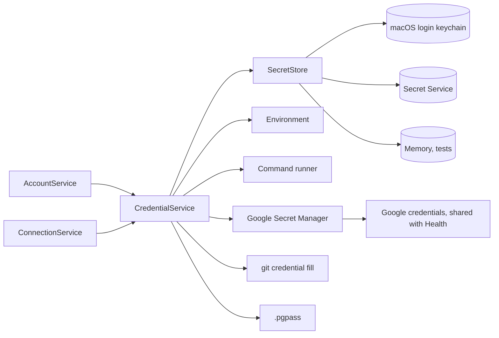

# Design: where secrets come from

Design notes for a secrets layer with more than one backend: the macOS Keychain as today, the platform's own store on other systems, and secrets the user already keeps elsewhere (an environment variable, a password manager, gcloud's Secret Manager, Git's credential helper, `~/.pgpass`), which Brainiac reads but never writes. Phase 1 is built: its behavior is in [`SPEC.md`](../../SPEC.md), section 12, and its design in [`architecture.md`](../architecture.md), Secrets — v0.4.x, which are the reference for it from now on. Phases 2 and 3 are still proposals here; when a release takes them, they move the same way, and this file keeps only the background and open questions.

They build on what Brainiac already has: account tokens (v0.3) and database passwords (v0.4) as generic passwords in the login keychain with service `brainiac` (`credentials.rs`, `forge/keychain.rs`), the `Secret` and `Token` wrappers whose `Debug` prints nothing, the `keychain`, `ask`, and `none` password choices of a database connection, gcloud's Application Default Credentials already read for Cloud SQL Health (`databases/health.rs`), and external programs always started with argument arrays, never through a shell.

## Status: phase 1 built, phases 2 and 3 planned (4 Oct 2026)

Phase 1 (1a, 1b, and 1c) is on the `v0.4-databases` branch, with its decision in `architecture.md` (Decisions, 4 Oct 2026): a secret is kept in the platform's store or read from a source the user controls, and never in Brainiac's databases, logs, snapshots, or exports. Its exit gates by hand, and the GUI spikes of 1b (Open questions), have not run. Phase 2 is a v0.4.x follow-up chosen by use (`roadmap.md`, v0.4.x follow-ups); phase 3 waits for a Linux build (`roadmap.md`, Later). Neither adds a dependency or a table before its work starts.

What phase 1 settled that this design left to implementation: owners keep one revision counter in the row, advanced on every account save (a save checks identity again) and on a connection's change of source, destination, or stored password; the pending marker is one column (`save`, `cleanup`, or `removal`), since a move back to the store replaces an obsolete cleanup in the same write; approval is a flag cleared by restore and set by Save or **Allow This Source** for the revision shown, because every other change to a binding goes through Save; and a refused credential has its own error code, `Unauthenticated`, so only a server's refusal of the credential rejects a lease.

## Why

- **The prompts.** An unsigned or ad hoc signed build is known to the Keychain only by its hash, so every rebuild, and every unsigned release, asks again before reading each item (`docs/keychain-access.md`). Signing fixes it for those who can sign; a developer running `pnpm tauri dev` without a certificate, or a user of an unsigned build, gets a prompt per provider and per connection on nearly every launch.
- **Secrets already live somewhere.** Many users keep their GitHub token in `gh`, their database passwords in 1Password or `~/.pgpass`, and a team's production password in Google Secret Manager. Copying each into the Keychain makes a second copy that goes stale when the original is rotated.
- **Other systems.** `security-framework` is macOS only. If Brainiac ever builds for Linux, every caller of `credentials.rs` would need a second path; with one interface, it needs one more backend.
- **Two interfaces for one thing.** `credentials::Secrets` and `forge::keychain::Keychain` wrap the same store operations, each with its own memory fake and its own per-run cache in the service that uses it.

## What the user gets

- **Settings → Secrets**, after the source picker ships, shows the store in use and lists each account and connection with its source, whether it needs confirmation or input, and the time and outcome of its last test. Opening it never resolves secrets, runs programs, or unlocks a store. An available backend, an existing item, a successful read, and successful server authentication are distinct facts; an untested source says "Not tested". Nothing there shows a value.
- **A source picker** where a secret is entered today: the account sheet (Settings → Accounts) and the connection dialog. "Keep in Brainiac" (the store; the default, and what every existing secret is), plus the sources in the table below that apply to it.
- **Test** reads the draft source afresh, without consulting or changing the active credential's cache. For an account, `GET /user` also checks identity and permissions; for a connection, Test Connection authenticates with the draft target. A successful source read alone does not say the server accepts it. Editing the draft makes its test result stale. Test never saves a source, changes approval of the saved binding, or deletes an item.
- **Refresh credential** forgets the active cached value so its next use reads again, or asks again for an Ask connection. Existing database sessions finish with the credentials they opened with; the action does not close a transaction.
- When a read fails, the error names the source safely and gives the available remedy. A generic command error says, for example, "The command op exited with status 1. Unlock or sign in to your password manager in Terminal, then retry." It never includes the command's output or its full arguments.

## Sources

| Source | Applies to | Reads | Brainiac writes it |
| --- | --- | --- | --- |
| **Store** (default) | Everything | The platform's store, item `brainiac` / `<key>` (Stores, below) | Yes: create, replace, delete |
| **Ask each run** | PostgreSQL connections (today's `ask`) | Typed once, kept in memory for this Brainiac process | No |
| **Environment variable** | Everything | `$NAME` of Brainiac's own process | No |
| **Command** | Everything | One secret on standard output, with program and arguments entered separately: `gh auth token --hostname github.com --user example-user`, `op read op://Private/GitHub/token`, `bw get password <id>` | No |
| **Google Secret Manager** | Everything | `projects/<project>/secrets/<name>/versions/<version>` over HTTPS with gcloud's credentials | No |
| **Git credential helper** | Forge accounts | `git credential fill` for the account's host | No |
| **`.pgpass`** | PostgreSQL connections | The line of `$PGPASSFILE` or `~/.pgpass` matching host, port, database, and user | No |
| **None** | Database connections (today's `none`) | Nothing | No |

- **Only the store is written by Brainiac.** Brainiac issues no create, rotate, approve, or delete operation to an external source. A user-selected program or credential helper may maintain its own login state or caches; it is executable code, not a sandboxed read. Removing an account or connection deletes only Brainiac's own item, including any item left after earlier cleanup failed.
- **What Brainiac keeps is where to look,** never the value: the variable's name, the program's absolute path and arguments, the secret's project, name, and version. These references live in the row and are exported. The picker says that arguments are saved and backed up and must contain references, never literal passwords, tokens, or credential-bearing URLs. An arbitrary command's arguments cannot be proved non-secret; Brainiac therefore never logs them and does not claim to detect every pasted credential.
- **Environment variables** are for development and CI. An app opened from Finder or the Dock does not inherit a shell's environment, so the picker says so and suggests a command instead.

## Review of the first proposal

The first sketch (in conversation, 4 Oct 2026) was a `SecretStore` trait with one implementation per system, chosen at build time, a fallback to an encrypted file when no store is available, and every external source as one more store. Reviewed with the vocabulary of *A Philosophy of Software Design*:

| Finding | Symptom | Change |
| --- | --- | --- |
| Every source behind the store trait | `set` and `delete` on 1Password or Secret Manager either fail at run time or write to something the user owns | Two concepts: a **store** Brainiac owns and writes, and a **source** it only reads. The store is one kind of source (Design it twice). |
| Two wrappers over the same store | **Change amplification:** a fix to error mapping or caching is made twice; two fakes in tests | One `SecretStore`, one `CredentialService` above it; `Token` and `Secret` stay as typed wrappers on what it returns. |
| Each service caches what it read | Duplicate caches, prompts, and invalidation rules | **Pull complexity down:** one cache shares concurrent reads and invalidates the exact refused credential. Domain services still check identity and commit their rows. |
| Value checks inside the store | `MacKeychain::get` builds a `Token`, `MacSecrets::get` a `Secret`: the store knows what a token looks like | The store returns redacted bytes; the caller makes the `Token` or `Secret`, so every source gets the same checks. |
| An encrypted file as automatic fallback | A passphrase prompt on every launch, a key-derivation choice, and a file that holds every secret, all to cover a case no one has reported | Not in this design. A system with no store uses sources only and says so (Stores). |
| A command typed as one string | Quoting, expansion, and shell syntax become part of the UI's contract | The program and each argument are separate fields, with a preview of the exact array; Brainiac adds no shell parser or expansion. |

## Design it twice

### Shape

| | A. One store trait for everything | B. A store, and sources that read (chosen) |
| --- | --- | --- |
| Interface | `get`, `set`, `delete`, `contains` on every backend | `SecretStore` (the four calls) for what Brainiac owns; `SecretSource`, a value in the row, for where a secret comes from |
| Read-only backends | `set` and `delete` return an error | Have no `set` or `delete` |
| Where the "where" is kept | A global setting choosing one backend | Per secret, so a GitHub token from `gh` and a database password in the Keychain coexist |
| Cost | Small; misleading for half its implementations | One enum and a resolver |

B matches how people keep secrets: not all in one place. A is what most libraries offer and is fine for the store alone, which is how B uses it.

### Stores

| | A. `security-framework` and a second crate per system (chosen for phase 1) | B. The `keyring` crate for every system |
| --- | --- | --- |
| macOS | Today's code, unchanged | `keyring`'s macOS backend, itself over `security-framework` |
| Linux | `oo7` or `secret-service` for the Secret Service API (GNOME Keyring, KWallet, KeePassXC) | `keyring` with its Secret Service feature |
| Control | Error codes (`errSecUserCanceled` and the rest), `contains` without reading, item attributes | What `keyring` exposes; checking existence without reading is not part of its API |
| Cost | One module per system | One dependency, with a feature per system |

A keeps the macOS behavior that `docs/keychain-access.md` documents, including finding an item without a prompt. B is worth revisiting if Windows is ever a target, where it would save the most work. Either way the choice is invisible above `SecretStore`.

### Fewer prompts

| | A. Lazy reads, a per-run cache, and sources (chosen) | B. One Keychain item holding every secret |
| --- | --- | --- |
| Prompts on an unsigned build | One per secret, only when first used; none for a secret from another source | One per launch |
| Item names | Unchanged: `github`, `bitbucket`, `db:<id>`, documented so a token can be added from Terminal | One item with a JSON map; the Terminal path goes away |
| Writes | One item each | The whole map rewritten on every save; two saves at once can lose one |
| Migration | None | Every existing item moved into the map |

B trades a documented interface and safe writes for one prompt fewer per extra secret, and only for builds that should be signed anyway.

## Architecture



- **`SecretStore`** is the store Brainiac owns, keyed by the same accounts as today:

  ```rust
  // `Send + Sync` so one store can be shared by the blocking threads that call it.
  pub trait SecretStore: Send + Sync {
      /// Whether the item exists, found without reading it (no prompt).
      fn contains(&self, key: &str) -> AppResult<bool>;
      fn get(&self, key: &str) -> AppResult<Option<SecretBytes>>;
      fn set(&self, key: &str, value: &SecretBytes) -> AppResult<()>;
      /// An item that is not there is not an error.
      fn delete(&self, key: &str) -> AppResult<()>;
  }
  ```

  `MacStore` is today's `credentials.rs` functions; `MemoryStore` replaces both memory fakes. Which store the app builds is chosen at compile time by target (`#[cfg(target_os = "macos")]`), in `lib.rs`, the one place it is chosen today.
- **`SecretBytes`** owns secret bytes with a redacted `Debug`, no `Display`, and no serialization. Store results, source results, and cache entries use it immediately; plaintext is exposed only for decoding into `Token` or `Secret`, a store write, or authentication. These domain wrappers retain their current validation rules, including preserving password spaces. A cache read does not make invalid bytes into a valid token or password.
- **`SecretSource`** is saved with the account or connection. It contains only source-specific configuration: a variable name, program and arguments, Google resource, or optional password-file path and Git username/path selectors. Store has no configurable key, Git derives its host from the account, and `.pgpass` derives its match fields from the connection. The backend validates applicability: Ask and `.pgpass` require PostgreSQL, Git requires a forge account, and SQLite uses None. Its DTO is defined in `models.rs` and exported by `ts-rs` when this release starts; the docs specify behavior rather than duplicate its shape.
- **A binding** is the owner, its validated source, its approved destination context, and its credential revision. A PostgreSQL context includes host, port, database, user, and TLS policy; a forge context includes provider, fixed API host, and account identity once checked. Changing any of these, the source's arguments or selectors, or the stored secret advances the revision. Renaming a connection or linking a repository does not. Domain services construct bindings from validated rows or drafts; the WebView cannot choose a store key independently of the owner.
- **`CredentialService`** owns source resolution, the cache, read generations, and the gate that serializes credential mutations per owner. It neither saves account/connection configuration nor decides whether a token belongs to an account. Its operations have the contracts below; exact Rust signatures are chosen during implementation.
- **Domain services** own source/destination validation, approval checks, expected-version checks, authentication, row commits, and recovery. `AccountService` constructs a `Token` and verifies identity and capabilities; `ConnectionService` constructs a `Secret` and supplies prompted passwords. Their secret caches disappear, but these responsibilities remain.
- **Execution.** The service's interface is async. Blocking store calls run on blocking threads; commands use async process I/O and Google uses async HTTP. No global cache lock or SQLite transaction is held while a store waits for permission, a program waits for unlock, or a network request runs. A timed-out waiter cannot cancel a Keychain call already running: its late result is discarded when obsolete, and another read for that binding joins the still-running call rather than starting a second prompt.
- **Source code** would live in `src-tauri/src/credentials/` (`mod.rs` with the service and wrappers, `store.rs` with the trait and memory store, `macos.rs`, `sources.rs`, `command.rs`, `google.rs`). Health's Google credential code moves into a shared authentication module, so there is one token exchange with its own access-token expiry.

### Resolution and cache lifecycle

Owners map to today's store keys: `github`, `bitbucket`, and `db:<connection id>`. One owner has one active binding. A credential lease is an internal handle carrying its redacted value, binding revision, and resolution generation; it never crosses IPC. The generation distinguishes rereads within the same revision, so a late refusal for an old value cannot evict its replacement.

Before starting a new authenticated operation or publishing a delayed validation result, the domain service checks that its lease is still current. A source edit, pending save, or approval revocation can make a previously returned lease obsolete too. Operations that already started are not retroactively canceled, and established database sessions follow their existing lifecycle.

| Operation | Contract |
| --- | --- |
| Resolve the active binding | Return its cached lease or share one in-flight read with other callers of the same binding. Check approval and pending-save state before any read, even on a cache hit. |
| Probe a draft | Read afresh for Test, with approval scoped to that draft. Do not populate or invalidate the active cache, publish a binding, or write a store. |
| Supply prompted input | For an approved Ask binding, validate and remember the typed password in memory for its current revision. A changed revision refuses stale input. |
| Reject a lease | On invalid authentication, invalidate only the matching active revision and generation, so the next use rereads or asks. It never tells an external source to erase anything. |
| Refresh or commit a binding change | Advance the in-memory generation, clear the active cache, and make earlier reads obsolete. They cannot repopulate the cache or be returned as the current credential. |
| Mutate the owned item | Perform idempotent delete or store replacement under the owner's mutation gate, as coordinated by the domain service's save protocol. External sources have no write operation. |

Resolution distinguishes a secret lease, no credential (None), input required (Ask), a missing item or source value, approval required, an interrupted save needing recovery, and an operational failure. None and Ask do not masquerade as a failed password read. Missing values, failed reads, and canceled reads are not cached; callers receive safe source-specific errors or actionable states. Once bytes are decoded, invalid token/password data invalidates that lease too.

"Per run" means the lifetime of the Brainiac process, not a query tab or a future agent run. Successful values stay cached until an edit, explicit refresh, authentication refusal, or known expiry. Sources without expiry have no arbitrary one-hour timer. A Git helper's advertised expiry, or an account token's known expiry, bounds reuse; expired credentials are reread before a new authenticated operation. An environment variable or rotated password changes nothing until one of those triggers. Refresh never falls back to the old value after failure; an invalidated credential remains invalidated. Existing database sessions retain their established authentication until they close normally.

### Authentication and account identity

`AccountService` checks each freshly resolved token with the provider before exposing a new authenticated session; concurrent callers share that check for the lease. Adding an account or changing its source follows today's `GET /user` and read-only confirmation rules. On later reads, the provider's stable user ID must match the saved account. A different user requires an explicit account replacement; no background refresh silently switches identities. For sources such as `gh`, the dialog recommends explicit host and user selectors.

A successful check refreshes token kind, expiry, scopes, and capabilities without promoting a read-only account to writable in the background. Previously refused permissions remain conservative unless the provider proves the new token grants them or the user explicitly rechecks through Accounts. Domain services classify invalid credentials separately from insufficient permission, a locked source, cancellation, and a network failure; message matching or a blanket `PermissionDenied` is insufficient. Only invalid authentication rejects a lease. Permission failures update capabilities only for the still-current lease, and network failures preserve a still-valid cached lease. Delayed checks commit metadata under the owner's gate after rechecking its revision. A refusal may invalidate future use but never blindly retries a write.

### Saving, transitions, and recovery

Account and connection saves use the same per-owner mutation gate as credential reads and approval changes. Every mutation that affects the row's expected version participates, so a version check cannot be invalidated by another app write during store I/O. A save validates its draft and checks the expected version before changing the store, approval, or active cache. Unsaved Test results are not authority to skip these checks; account Save checks the value it will actually use.

Keychain and SQLite cannot share a transaction. When a save must create or replace a store item, first commit a non-secret pending-save marker in the owner's row, with the version check. Publishing that marker immediately invalidates the current lease and makes in-flight reads obsolete, before any item write. A new row remains provisional and unavailable for use. Then write the item, and finally commit the configuration, advance its credential revision, and clear the marker in one database transaction. The marker prevents a crash between these steps from leaving an apparently usable row paired with an unknown credential. Neither the marker nor recovery stores an old or new secret in SQLite.

| Transition | Ordering and failure behavior |
| --- | --- |
| Add Store, replace its secret, or move another source to Store | Validate and, for an account, authenticate the supplied value; mark pending; write the item; commit the row and clear pending; invalidate the previous lease. If the store write or final commit fails, keep the owner blocked with a partial-save error. Do not report the old configuration as unchanged and usable. |
| Keep Store without entering a new secret | Keep the existing item. Commit validated metadata without a store write; a changed destination or approval still changes the binding and invalidates the cache. A pending save cannot take this shortcut. |
| Move Store to an external source, Ask, or None | Commit the new binding and invalidate its cache before deleting the old item. Record cleanup as pending in that commit; clear it after deletion succeeds. On failure the new binding remains usable, and Save returns a saved result with a cleanup warning. The old item is never used as fallback. |
| Change between external sources, or change their destination | Commit source, context, approval, and revision together, then invalidate the cache. No external source is written. A failed commit leaves the previous binding active. |
| Save Ask with typed input | Commit the binding first, then supply the password to that revision's memory cache. A crash loses the input and asks again. |
| Remove an owner | Commit it as pending removal, block new resolution, and clear its cache; delete its owned item regardless of current source; then finish removing the row. A failed cleanup leaves a visible removal awaiting retry. |

Pending store saves are never automatically replayed or resolved on restart. The UI says the save was interrupted and asks the user to edit, re-enter the password or choose another source, and save again. It does not read the uncertain item to test it against either the old or a proposed destination. An explicit switch to another source commits that binding and schedules cleanup of the uncertain owned item. Pending cleanup and removal contain only the owner and operation, can be retried idempotently, and remain visible until successful; retrying cleanup takes the mutation gate and checks it still applies, so it cannot delete a newly saved Store item. Moving back to Store clears obsolete cleanup in the same pending-save transaction.

At commit, binding state and cache invalidation change under the mutation gate before waiting readers proceed. No failed save installs draft bytes in the active cache. These guarantees cover new reads and operations; an already authenticated database session follows the existing connection-edit and transaction rules.

## Stores

- **macOS:** the login keychain, as today: service `brainiac`, generic passwords, the same item names, the same error mapping (`errSecItemNotFound` is no item; a refusal is `PermissionDenied`).
- **Linux (if Brainiac builds for it):** the Secret Service API over D-Bus, which GNOME Keyring, KWallet, and KeePassXC provide. Items carry the attributes `service=brainiac` and `account=<key>`, so a token can be added from a terminal with `secret-tool store --label='Brainiac: github' service brainiac account github`, the way `security` works on macOS. A locked collection asks to unlock it, which is a prompt like the Keychain's.
- **No store.** A system without a Secret Service (a server, a minimal desktop) has no store. "Keep in Brainiac" is then unavailable in the picker, with the reason, and the other sources still work. Brainiac does not fall back to a file.
- **The Data Protection Keychain** on macOS never prompts but needs a team ID and a provisioning profile (`docs/keychain-access.md`, Options that do not fit). If releases are signed with a Developer ID, it is a second macOS store behind the same trait; it is not needed for this design.

## Reading from other sources

### Commands

The dialog has a program picker and one field per argument, with an exact argument-array preview. No quoting language, variable substitution, tilde expansion, pipes, or shell wrapper is added by Brainiac. A short program name is looked up during setup in the launch `PATH` and conventional Homebrew locations (`/opt/homebrew/bin`, `/usr/local/bin`), with the chosen absolute path shown before approval and saved. It is never silently rebound to another executable at use. A missing executable asks the user to choose it again. Test and normal use have the same launch context.

The runner uses an app-owned working directory outside repositories and the vault, closes stdin, attaches no terminal, sets `GIT_TERMINAL_PROMPT=0`, and otherwise inherits Brainiac's launch environment for tools that need it. That inherited environment is not a sandbox: an approved program may access anything available to the user's account. Password-manager unlock windows may appear; the dialog explains this. The total deadline is 60 seconds from spawn through pipe closure and process reaping. Cancel, timeout, or excess output terminates the process group and reaps the child, with a bounded cleanup grace period. A descendant keeping a pipe open cannot leave a Test waiting forever. The GUI unlock behavior and cleanup implementation are verified in a spike before shipping.

Stdout and stderr are drained concurrently with bounded buffers. Stdout over 64 KiB fails immediately, without returning a truncated credential. Stderr is discarded as it is drained; more than 64 KiB also fails and stops the command. Success requires exit status zero and non-empty output after removing exactly one final LF or CRLF; all other bytes, spaces, and line breaks are preserved. Domain wrappers then validate UTF-8 and the token/password rules. Tools producing JSON or extra lines must be configured to print only the selected value; Brainiac adds no generic JSON selector or output-transformation language.

Neither output stream is ever returned in errors, logged, or saved, including on non-zero exit. Errors carry a safe program basename, exit status, timeout, or output-limit reason, with a generic instruction to run the tool directly to diagnose sign-in. Raw argument arrays, environment values, and subprocess output are excluded from tracing. Known native sources can map documented statuses to safe remedies; arbitrary command stderr cannot be sanitized reliably.

### Google Secret Manager

Access uses `GET https://secretmanager.googleapis.com/v1/projects/<project>/secrets/<name>/versions/<version>:access`, with the shared Google authentication module and the `authorized_user` ADC supported by Health today. It decodes `payload.data`, bounds the response and decoded value, and verifies `dataCrc32c` before returning redacted bytes. The user needs `roles/secretmanager.secretAccessor`. Production endpoints are fixed HTTPS hosts with cross-host redirects refused; tests inject local endpoints internally. Provider errors map to safe messages for missing credentials, denied access, an unavailable version, and network failure, without forwarding raw bodies.

The source requires an explicit numeric version or `latest`; the picker explains that a number is pinned and `latest` follows rotation only on the next fresh read, with the provider's consistency limits. The resolved version is safe diagnostic metadata. A disabled or destroyed version fails; it never silently chooses another one. A valid cache hit needs no network. A failed fresh read does not fall back to an expired or rejected value. AWS Secrets Manager, Azure Key Vault, and HashiCorp Vault use commands until a native client is needed.

### Git's credential helper

Brainiac invokes `git credential fill` with `protocol=https`, the provider's fixed Git host, and explicit username/path selectors when required. The helper host (`github.com` or `bitbucket.org`) is separate from the provider's fixed API destination. The returned username and password are treated as secret-bearing protocol output and parsed without logging. A password is not assumed to be a compatible API token: initially this source supports only credentials that pass Brainiac's existing GitHub or Bitbucket account check. Bitbucket still needs the Atlassian email for its API token; a Git username is not inferred to be that email. Bitbucket OAuth and repository/workspace access tokens, unsupported authentication schemes, and path-specific credentials that cannot serve the single configured account are refused with a compatibility message. No new forge authentication scheme is added here.

Git runs outside all repositories, using only the intended system/global configuration; inherited repository/config override variables are removed. The username selector and any explicit path are part of the binding, and account identity is checked as above. The native source disables Git's askpass/terminal fallback and Git Credential Manager's interactive sign-in; missing credentials ask the user to sign in with their tool, then retry. A helper may still show its store's unlock window. The same output bounds, deadline, safe diagnostics, and process cleanup as the command runner apply, and a helper's advertised password expiry bounds the lease.

Brainiac starts Git with an argument array, but Git executes configured helpers through a shell, including helper snippets. Selecting this source authorizes that execution; it has the same restore and edit approval requirements as Command. Brainiac never calls `git credential approve` or `git credential reject`, never modifies a repository or Git configuration, and cannot guarantee that an independently configured helper never updates its own state.

### Password files and environment

- **`.pgpass`** uses an explicit file if selected, otherwise `$PGPASSFILE` or `~/.pgpass`. It matches the validated connection's host, port, database, and user, with libpq's first-match, wildcard, comment, and escape rules. On Unix any group or world permission bits cause the file to be ignored, not just readable bits. Missing files, unsafe permissions, and no match are distinguished in safe errors. It reads only the matching password into the returned wrapper; there is no fallback to another source. Host/socket matching follows the connection forms Brainiac actually supports, rather than claiming support for every libpq parameter.
- **Environment variables** are read from Brainiac's process environment on a fresh resolution, not from a shell or an environment file. Missing, empty, and invalidly encoded values produce distinct safe errors without including their contents. The environment is normally fixed at launch, and Refresh does not import later shell changes.

## Rules that hold for every source

- A resolved secret is never sent to the WebView, a log, `brainiac.db`, `history.db`, a snapshot, or an export. The source's reference and safe status can cross IPC. A password or token the user types necessarily exists briefly in the input form and travels to Rust through the existing save/unlock IPC; the form clears it when the operation completes or is canceled, and it never receives a saved value back.
- A secret resolved by Brainiac authenticates only to its approved destination: an account's fixed provider API host or its own database connection. Changing the destination creates a new binding revision and requires approval for that context. External programs and helpers execute with the user's privileges, as described above; this rule governs Brainiac's handling of their result, not everything that program can do.
- MCP tools neither read secrets nor change a source; changing a source is a settings change, which agents cannot make (`architecture.md`, Agent access).
- **Bounds.** Resolved values are at most 64 KiB for every source. Validation errors describe the source and expected format without echoing bytes. References are treated as untrusted input, checked by the backend, and never interpolated into a shell command or an arbitrary credential-bearing HTTP endpoint.

### Approval, restore, and upgrades

Approval covers the exact source configuration and destination context, not just a boolean meaning "this owner once used a command". For Command it includes the resolved executable path and every argument; for Git it includes helper selection context and username/path selectors. It does not freeze the installed program's bytes or the user's global helper configuration: these remain user-managed. Changing source, selectors, or destination clears the saved approval; renaming the connection does not. Save explicitly approves the displayed binding. An explicit Test can authorize only the displayed draft, never an unseen or changed configuration. Saved reads and draft probes enforce their approval scopes in Rust before touching a source, including cached values.

Every restored/imported binding arrives requiring confirmation, including Store, environment variables, `.pgpass`, Google, and Git. Otherwise a backup could connect an existing local secret to an imported destination even without running a direct command. The UI shows where it will read and where Brainiac will send the result, plus the exact executable and arguments for a command, and offers **Allow this source**. Test and background use remain disabled until that binding is confirmed. Store may then need its secret entered because the destination Mac has no item; an item with a matching owner name is not automatically trusted. Pending saves from a backup stay blocked for recovery. Restored cleanup/removal markers are displayed but require a fresh explicit cleanup or removal action; importing a marker cannot automatically delete an item on this Mac. Restore clears cached leases, draft approval, and prior test status.

A schema upgrade of an existing local installation preserves today's Store/Ask/None meaning, existing items, and usable local bindings. It does not read a secret or trigger a prompt. Previously approved local sources stay approved when later versions upgrade their representation without changing the binding. Restore/import is a separate path and never inherits this upgrade exception. Snapshots preserve recovery markers, but applying a snapshot follows the restore confirmation rules.

## Agent runs

[`agent-runs.md`](agent-runs.md) is a future consumer. Its planned owner names (`agent:<profile id>` and `registry:<id>`, using stable IDs independent of display names) do not add variants, storage, or dependencies in v0.4.x. When that feature starts, it defines its own validated destination context and uses the same resolution leases; starting an agent run does not by itself reset the Brainiac-process cache.

Container delivery, remote resolution, and trace retention/redaction belong to that design, not this layer. Exact-value replacement in a trace is a mitigation, not a guarantee against an agent printing an encoded or transformed secret. Those contracts need their own review before credentials leave the Mac. This layer guarantees redacted results and scoped invalidation, not confidentiality of arbitrary agent output.

## Storage

| What | Change |
| --- | --- |
| `db_connections.password` (`keychain`, `ask`, `none`) | Becomes the connection's `SecretSource` as JSON; legacy values retain their meaning and Store derives key `db:<id>` |
| `forge_accounts` | Gains its token's `SecretSource`; a legacy row without one uses Store with key `github` or `bitbucket` |
| Account and connection rows | Keep a credential revision, approval tied to source and destination, and non-secret pending save/cleanup/removal state for the protocol above |
| Store items | Unchanged: service `brainiac`, the same keys; there is no migration of secret values |
| Last test and read status | Safe metadata in memory, scoped to the draft or binding revision; cleared when it changes or the process restarts |

No new table. Pending markers are recoverable state, not a general credential journal; they contain no plaintext, encrypted secret, subprocess output, or command environment. DTOs and schema details are defined in code when this release starts. Export carries references and recovery state, never approval that a restore can reuse. Old exports use the same legacy-source defaults and still require restore confirmation.

## Phases

1. **One credentials layer, then external sources**, in three independently reviewable steps:
   - **1a — Existing sources.** `SecretStore`, redacted bytes, `CredentialService`, shared concurrent resolution, scoped invalidation, Store/Ask/None, domain-coordinated save/recovery, and restore confirmation/recovery guards. Keep existing item names and local upgrade behavior. No external sources or new dependency.
   - **1b — Commands and environment.** Extend binding approval to external sources; add the program/argument picker, draft Test, explicit refresh, and safe process runner. Use existing dependencies. Ship only after the GUI/unlock and process-cleanup spikes pass.
   - **1c — Settings → Secrets.** Add the overview of sources, recovery, cleanup, and last-test status once that status model exists. Opening it has no resolution side effects.
2. **Sources that know their system.** Google Secret Manager (with Health's Google authentication shared), Git's credential helper for compatible forge API tokens, and `.pgpass` for PostgreSQL. Choose any small decoding/checksum dependencies when this phase starts; do not add them ahead of time or build a generic provider SDK layer.
3. **Another system's store**, only when Brainiac builds for it: Secret Service on Linux, and its `secret-tool` line in the docs. Verify backend availability and the no-read existence check before choosing a crate.

**Exit gate (1a):**

- An existing local install upgrades with every account and connection working and no secret entered again or read during migration.
- Concurrent reads share one store access; an obsolete read or refusal cannot install or remove a replacement credential.
- Inject failures and restart at every store/row commit boundary: a pending save remains blocked, cleanup remains retryable, and no failed save caches draft bytes.
- Store replacement, Ask unlock, None, and removal retain their documented behavior, including missing-item and recovery states.

**Exit gate (1b and 1c):**

- On an unsigned `pnpm tauri dev` build, use an explicitly selected GitHub account through `gh auth token --hostname github.com --user example-user` and a database password from a command for a week with no Keychain prompt for those sources.
- Move a connection from Store to Command and back, including failed metadata commits and failed item cleanup. The active binding is unambiguous and obsolete cleanup cannot delete its replacement.
- A command that hangs, fails, floods either stream, spawns a child holding a pipe, or prints secrets only on stderr stops within the deadline and cleanup grace, without secret-bearing diagnostics.
- Test always reads the exact draft afresh, never changes the active cache, and becomes stale on edit. Settings opens without source reads or prompts.
- Restore on the same or another Mac: no binding resolves until its source and destination are confirmed, and edits cannot reuse approval for different arguments or a different host.
- Switch the external tool's active account or rotate its token: refresh cannot silently change Brainiac's saved account identity or retry a write.

**Exit gate (phase 2):** a PostgreSQL connection on Cloud SQL takes its password from a pinned version and then `latest` in Secret Manager, a forge account uses a compatible Git-helper API token with explicit identity, and a local connection uses `.pgpass`, each tested from the dialog. Expired helper credentials, incompatible Bitbucket credentials, disabled Google versions, checksum mismatches, and unsafe password-file permissions fail safely. Unsupported helper behavior is documented or left unavailable rather than silently adapted.

## Not in this design

- **An encrypted file store** with a passphrase, for systems with no store (Review, above). Worth a design of its own if a headless install becomes a target.
- **Writing to external sources:** rotating a token in 1Password, adding a version in Secret Manager, or `git credential approve`.
- **Native clients for every secret manager.** Commands cover them; a native one is added when a command is not enough.
- **A shell, JSON selector, or transformation language for command output.** Each command must return one credential in the existing domain's format.
- **New forge authentication schemes.** OAuth/API changes and repository/workspace tokens need their own provider design.
- **Credentials or delivery mechanisms for agents and imports.** Those features define their own owners and destination contexts when they arrive.
- **Sources resolved on a remote host.** Remote service accounts and container delivery belong to Agent runs.
- **Windows Credential Manager**, unless Windows becomes a target.
- **Sharing secrets between Macs** beyond what the store already does (iCloud Keychain does not sync these items; Data Protection items could).

## Testing

- `CredentialService` tests use `MemoryStore` and controllable fake sources: concurrent readers share one access; reads finishing after refresh, edit, removal, or approval revocation are obsolete; an old lease's rejection does not evict a new one. Check expiry, missing values, no negative caching, and Ask/None outcomes.
- Domain tests cover source applicability, derived store keys and destination context, stale prompted input, account identity changing outside Brainiac, permission versus authentication failures, safe validation, and explicit refresh without closing an existing transaction. Invalid account checks never publish a usable binding.
- Fault-injection and restart tests cover every transition-table boundary: pending marker commit, store write, final row commit, cleanup, and removal. Failed expected-version checks have no credential side effects. No snapshot/export or pending marker contains a supplied secret. Cleanup raced with a switch back to Store cannot delete the new item.
- Command tests write small programs to temporary folders: exact arguments with spaces and quotes, launch context, LF and CRLF, preserved spaces and embedded line breaks, empty/invalid output, non-zero exit, cancellation, timeout, stdout/stderr overflow, and descendants retaining pipes. A recognizable secret emitted only to stderr or both streams never appears in an error, trace, or stored status. Tests never invoke a user's password manager.
- `.pgpass` tests cover literal matches, wildcards, first-match order, comments, escapes, an explicit file and environment selection, no match, and all group/world permission bits. Matching uses the draft connection context during Test and the committed context during use.
- Git tests configure helpers under an isolated temporary home and system/global config, with no user config or repository discovered. Cover username/path selection, expiry, incompatible API credentials, disabled askpass, helper shell execution, timeout, and secret-bearing protocol fields never reaching diagnostics. Compatibility is checked on the minimum supported Git version; newer expiry metadata is optional, with server refusal and explicit refresh as the fallback.
- Google tests use a local HTTP server for shared token exchange and access endpoints: expiry, base64 decoding, CRC32C, pinned/latest version metadata, disabled versions, denied access, bounded payloads, and refusal of unexpected redirects. Raw provider bodies and tokens never appear in errors.
- The macOS store tests use the memory backend; real login-keychain permissions, cancellation, and late completion remain manual tests with dedicated generic test items, never existing user items.
- WebKit over the fake backend covers the picker, draft Test, prompted input, refresh, stale results, interrupted-save recovery, cleanup warnings, side-effect-free Settings, and approval on restore/edit. A restore cannot bypass approval through Test or a cache hit, and restored cleanup/removal never starts an item deletion automatically.

## Open questions

| Unknown | How to resolve | Needed before |
| --- | --- | --- |
| GUI executable discovery | Built: **Find…** looks in the launch `PATH`, then `/opt/homebrew/bin` and `/usr/local/bin`, and saves the path shown. Still to verify from Finder on an Intel Mac | Phase 1b exit gate |
| Password-manager unlock and process cleanup | Process cleanup is built and tested with scripts (hangs, floods on either stream, a child holding the output open). Still to spike: `op read` and `bw get` from the GUI app, their unlock windows, and whether 60 seconds is enough | Phase 1b exit gate |
| Save recovery in the existing rows | Resolved: a marker column in each row; `tests/secrets.rs` fails the Keychain write and deletion and restarts the service at each boundary | — |
| Git helper compatibility | Spike `osxkeychain` and Git Credential Manager with explicit username/path selectors, API checks, askpass disabled, and interactive sign-in disabled; test minimum Git and available expiry metadata | Phase 2 |
| Google decoding and checksum support | Reuse current HTTP/authentication infrastructure; choose small base64/CRC32C support at phase start and verify resource/version error mapping | Phase 2 |
| Linux store attributes and availability | Verify interoperable `service`/`account` attributes, locked/missing collections, and whether existence can be checked without reading or unlocking | Phase 3 |
| Linux store crate | Compare `oo7`, `secret-service`, and `keyring` against those store contracts | Phase 3 |

Freshness, numeric versus `latest` versions, generic command diagnostics, restore confirmation, and noninteractive native Git sign-in are decisions in this proposal, not unresolved implementation choices. Agent-run remote resolution and trace confidentiality remain in that feature's design.

## Sources

Protocol contracts were checked in documentation during review; GUI behavior, platform integration, and recovery still need the spikes above.

- Keychain access prompts, this repository — [`docs/keychain-access.md`](../keychain-access.md)
- Freedesktop Secret Service API — <https://specifications.freedesktop.org/secret-service/latest/>
- `oo7`, a Secret Service client in Rust — <https://github.com/bilelmoussaoui/oo7>
- `keyring`, a cross-platform credential crate — <https://github.com/hwchen/keyring-rs>
- Tokio, blocking task cancellation — <https://docs.rs/tokio/latest/tokio/task/fn.spawn_blocking.html>
- GitHub CLI, host and user selection — <https://cli.github.com/manual/gh_auth_token>
- Google Secret Manager, access, integrity checks, and consistency — <https://cloud.google.com/secret-manager/docs/access-secret-version>
- Git credential protocol, contexts, and expiry — <https://git-scm.com/docs/git-credential>
- Git helper execution and askpass — <https://git-scm.com/docs/gitcredentials>
- Bitbucket API tokens — <https://support.atlassian.com/bitbucket-cloud/docs/using-api-tokens/>
- Bitbucket repository access tokens — <https://support.atlassian.com/bitbucket-cloud/docs/using-access-tokens/>
- The password file of libpq — <https://www.postgresql.org/docs/current/libpq-pgpass.html>
- 1Password CLI, secret references — <https://developer.1password.com/docs/cli/secret-references/>
- John Ousterhout, *A Philosophy of Software Design*, the vocabulary of the review above
