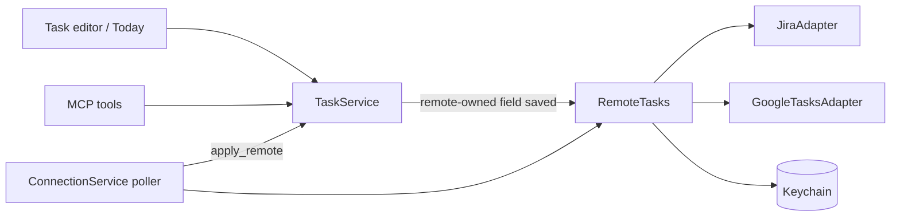

# Design: task connections (Jira and Google Tasks)

Design notes for connecting Brainiac's tasks to an outside task system: Jira issues at work, a Google Tasks list for personal tasks. Changes travel both ways, and the user never has to reconcile two copies of the same field. These notes are not the specification and not yet on the roadmap. When a release takes them, the behavior moves into [`SPEC.md`](../../SPEC.md) section 6, the design into [`architecture.md`](../architecture.md), and this file keeps only the background and open questions.

They build on what v0.2 guarantees for tasks (`SPEC.md` section 6): a task has a title, a short plain-text description, one of four statuses, a planned date, a deadline, and at most one note and one repository. Two edits never overwrite each other silently, because every write names the version it read. They also reuse v0.3's account handling (`architecture.md`, Pull requests — v0.3): tokens are kept only in the Keychain, all HTTP runs in Rust, and nothing is written to a provider except on an explicit user action.

## Status: deferred (4 Oct 2026)

Not planned for now. Jira work already happens in Jira itself and through Claude with a Jira MCP server, and Brainiac's own MCP server lets the same agent session create and plan Brainiac tasks from Jira issues. A mirror inside Brainiac would add a third place showing the same issues, and its write-back would rebuild what the Jira MCP already does. The fixed costs come first and are uncertain: company token policies, Google's app verification, and two outside APIs to maintain. Jira already shows deployments through its Bitbucket integration.

What remains useful is the issue key, which needs no tracker API: recognizing `ABC-123` in branches, commits, pull requests, and task titles (`roadmap.md`, Pull request follow-ups, Issue keys). This replaces phase 3's "follow the key" below.

Revisit phase 1 (Jira, read and link) if Jira issues end up being copied into Brainiac by hand most days. The review and the comparison of designs below still apply then.

## Why

At work, planning happens in Jira. Branches, commits, and pull request titles carry the issue key (`ABC-123`), and that key ties an issue to its code. Personal tasks live in a separate app. Brainiac's Today is only useful as *the* daily list if it shows both, and if the status a user sets in Brainiac also changes in Jira, so the user doesn't have to do it twice.

## What the user gets

- **Connections** in Settings. A connection is an account plus a source: a Jira JQL query (default `assignee = currentUser() AND statusCategory != Done`) or one Google Tasks list. It can also name a workspace. Adding a connection first shows a preview ("this query matches 34 issues"), and nothing is created until the user confirms.
- **Linked tasks.** Each item in the source becomes an ordinary task that carries a badge with the remote key (`ABC-123`) and an **Open in Jira** link. New items arrive as *to sort*, so they fold into Today's **To sort · N** line like any task without a date. Search, Today, Tasks, the palette, export, and the MCP tools see them as tasks.
- **One owner per field.** A linked task shows which fields come from the remote. Editing one of them in Brainiac writes it to the remote at save time (write-through). A field the provider can't take from Brainiac is read-only, with a link to edit it there. The planned date, the note, the repository, and triage stay Brainiac's own and never leave the Mac.
- **Status both ways.**
  - When a Jira issue reaches a Done status, the task completes in Brainiac.
  - When the user completes the task in Brainiac, Brainiac moves the issue to Done in Jira. If only one move leads there and it asks for no input, Brainiac makes it; otherwise the user picks the move.
  - When a move needs input (a resolution, a required field, a screen), Brainiac offers **Open in Jira** instead of filling it in.
  - Google Tasks has no workflow: completing and reopening go straight through.
- **Unlink** is always available. The task becomes an ordinary Brainiac task with every field its own, and the remote item is left as it is.
- **Nothing is deleted remotely.** Deleting a linked task in Brainiac removes it here and marks the remote item ignored, so the next poll does not bring it back.
- **Remote items that go away stay here.** When a remote item is deleted, or stops matching the query (for example, because it was reassigned), the task stays with all its fields. Its link ends, and Today shows once: "ABC-123 left the Jira query: keep or delete".

## Review of the first proposal

The first sketch (in conversation, 4 Oct 2026) had a link, bindings from a query to tasks, an owner for each field, a due date edited on both sides with a three-way merge, and an opt-in automatic status push for each binding. Reviewed for complexity, using the vocabulary of *A Philosophy of Software Design*, it changes in these ways:

| Finding | Symptom | Change |
| --- | --- | --- |
| The due date could be edited on both sides and reconciled against the last synced value | Defines a conflict path that exists only because two writers are allowed; the merge code, the "differs from Jira" state, and its UI are all error handling | **Define the error out of existence:** every field has exactly one writer. The due date belongs to the remote and is written through; Brainiac's own planning goes in the planned date it already has. No merge is needed anywhere. |
| An opt-in automatic status push for each binding | A hard decision (when is a background write safe?) handed to the user as a setting; it also creates a second write path beside explicit actions | **Pull complexity downward:** saving is the explicit action. A remote-owned field is written when the user saves it, and never in the background. No setting is needed. |
| Statuses mapped by name between Brainiac and each provider | **Information leakage:** each provider's workflow vocabulary would be known to the service, the UI, and the mapping table | The adapter normalizes to a category (`todo`, `in_progress`, `done`) and lists the *actions* that reach each one. The service and the UI never see a Jira status name except as a label. |
| A Jira description round-tripped through plain text | **Unknown unknown:** an edit in Brainiac would flatten the issue's rich text (Atlassian Document Format) for everyone on the team | Each provider declares which fields it can take. For Jira the description is read-only; for Google Tasks, whose notes are plain text, it is written through. |
| "Per workspace" as the home of a binding | **Hard to name:** a workspace is a group of repositories, and tasks don't belong to one today | Treated as a separate decision: tasks gain an optional workspace that is useful without connections (Workspaces, below). |
| Copying v0.3's `ForgeAdapter` shape | `ForgeAdapter` is wide because pull requests are; a task provider is a much smaller thing, and a wide interface would make each new provider expensive | **Deep module:** a provider adapter with four methods (Architecture, below). |
| Agents write tasks through `TaskService` | **Unknown unknown:** an agent editing a linked task's title over MCP would silently become a write to the company's Jira | Agents may change only Brainiac-owned fields of a linked task. Remote-owned fields are refused with `REMOTE_OWNED`. |
| The name "sync" | **Vague name:** the roadmap's Later list already uses "sync" for syncing between devices | **Connections** and **linked tasks**. |
| Deployment status ("which commit is in which environment") | A separate feature that happens to share the issue key | Moved out of this design (Not in this design, below). |

## Design it twice

Three shapes were compared before choosing.

| | A. Mirror, one writer per field (chosen) | B. Overlay | C. Symmetric sync |
| --- | --- | --- | --- |
| Shape | Remote items become ordinary tasks; remote-owned fields are copied into the task and written only by the connection or by write-through | Remote items live in a separate cache; a task may point at one and shows the remote's title and status from there | Both sides edit every field; a merge reconciles them on each poll |
| Readers (Today, Tasks, search, MCP, export) | Unchanged | Every reader joins two stores; search indexes the cache; Today depends on a cache that can be deleted | Unchanged |
| Conflicts | None by construction | None by construction | Every field, with a merge policy and a conflict UI |
| Offline | Reading and Brainiac-owned edits work; saving a remote-owned field fails with a clear error | Same | Edits queue and merge later |
| Cost | A link table, write-through in `TaskService`, a poller | A second task-like entity across the whole app | The merge engine, conflict states, and their tests, for each provider |

B keeps the data cleanest, but its cost lands on every reader of tasks, which is where most of the code is. C is what "two-way sync" usually means, and it is the one that fails in practice: two workflow models never map exactly, and every mismatch becomes a conflict the user has to resolve. A puts the cost in one module and keeps everything else unchanged.

The trade-off A accepts is that a remote-owned field can't be edited offline. For Jira that is fine. For a personal Google Tasks list it may be annoying; if it is, a queue of pending write-throughs could be added later without changing the model.

## Field ownership

| Field | Jira | Google Tasks | Unlinked task |
| --- | --- | --- | --- |
| Title | Remote; written through | Remote; written through | Brainiac |
| Description | Remote; read-only (rich text in Jira) | Remote (`notes`); written through | Brainiac |
| Status | Remote by category; written through as a transition | Remote (`needsAction`/`completed`); written through | Brainiac |
| Deadline | Remote (`duedate`); written through | Remote (`due`, date only); written through | Brainiac |
| Planned date, triage, note, repository, workspace | Brainiac | Brainiac | Brainiac |

**Status in detail.** Brainiac has four statuses and a remote has its own set, so the comparison is made in the remote's terms. The adapter turns a local status into the remote's category: Google Tasks counts both `todo` and `in_progress` as `needsAction`. A poll changes the local status only when the remote's category differs from that projection. This keeps finer local states, such as *in progress* on a Google task, for as long as the remote agrees with them. **Cancelled** is written through only where the provider has an action into Done that the user picks, such as Jira's "Won't do". Google Tasks has no such action, so cancelling a linked Google task offers to complete it there, or to unlink it and cancel it here.

## Workspaces

Today a task links to one repository, and a workspace is a group of repositories. "My work tasks" versus "my personal tasks" needs a third link: an optional `workspace_id` on the task. It earns its place without connections, too, as a filter for Today and Tasks. A connection may name a workspace, and the tasks it creates start with it. The user can change it, because the workspace is a Brainiac-owned field.

For a personal Google Tasks list, the workspace may have no repositories. Whether a workspace without members is allowed, and how the sidebar shows one, is an open question.

## Architecture



- **`TaskService` stays the only writer of tasks** (the decision that every write goes through a domain service).
  - `update` gains the caller (`User` or `Agent`). For a linked task, the user's changes to remote-owned fields go to `RemoteTasks` first. The local write follows only when the remote write succeeds, so a failed save changes nothing and the editor keeps the user's text.
  - A second method, `apply_remote`, is used only by the poller. It writes remote-owned fields with the expected local version and retries after a conflict. That retry can't lose anything, because no other writer owns those fields.
- **`RemoteTasks`** holds the adapters and the accounts. Both `TaskService` and the poller depend on it, and neither depends on the other through it, so there is no cycle.
- **`ConnectionService`** owns connections: create (with the preview), the poll loop with backoff, reconciliation, ignoring a deleted item, and unlinking. It emits nothing itself: `TaskService` emits `task_changed` for every write, as it does now.
- **The provider adapter** is the deep module. Everything provider-specific hides behind four methods:

```rust
trait TaskProvider {
    /// Items changed since `cursor` (opaque to the caller), and the next cursor.
    async fn changes(&self, source: &Source, cursor: Option<&str>) -> AppResult<Changes>;
    /// IDs of every item the source matches now, for reconciliation.
    async fn members(&self, source: &Source) -> AppResult<Vec<RemoteId>>;
    /// What the user can do to an item: field edits it accepts, moves to each status category.
    async fn actions(&self, item: &RemoteRef) -> AppResult<Vec<RemoteAction>>;
    /// Apply one action, refusing it when the item changed since `expected_version`.
    async fn apply(&self, item: &RemoteRef, action: RemoteAction, expected_version: &str) -> AppResult<RemoteItem>;
}
```

  `RemoteItem` is already normalized: a title, a plain-text description (the adapter converts Atlassian Document Format), a status category and a display label, a deadline, the key, the URL, and an opaque version. Pagination, JQL, Jira's minute-precision `updated` filter and the overlap it needs, Google's `updatedMin`/`showDeleted`/`showHidden`, and the formats of both stay inside the adapters.

- **Accounts** reuse v0.3's Keychain storage and HTTP client (`forge/keychain.rs`, `forge/http.rs`). Those modules move out of `forge/` into a shared module rather than being copied, so the two features don't grow two ways of doing the same thing.
- **Source code.** The new code lives in `src-tauri/src/connections/` (`service.rs`, `provider.rs`, `jira.rs`, `google_tasks.rs`). Command handlers stay thin, as they do elsewhere.

### Polling and reconciliation

- `changes` runs at each poll, about every five minutes with backoff, plus once when the app comes to the front. It returns what changed, but it can't see an item that *stopped* matching the query.
- `members` runs less often (about hourly, and on demand). A linked item missing from it is fetched by ID: a `404` means deleted, and a found item means it left the query. Either way the link ends as described above. Items the user deleted in Brainiac are in the ignored list and are never recreated.
- The first poll is limited by the preview: the user confirmed a count, and an unexpectedly large result (for example, a query edited in Jira's filter) stops and asks again.

### Write-through

On save, `TaskService` reads the task and its link, then calls `RemoteTasks::apply` with the remote version it last saw. Jira has no conditional update for issues, so the adapter compares the issue's `updated` value just before the write, the same compare-then-act approach Bitbucket merges use (`architecture.md`, Decisions, S6). Google Tasks supports ETags, and the adapter uses them where the API accepts them. When the remote refuses because the item changed, the user sees the current remote values, as with a local `CONFLICT`. The network call happens outside any database transaction.

## Storage

| Table | Database | Fields |
| --- | --- | --- |
| `task_connections` | `brainiac.db` | `id`, `provider` (`jira`, `google_tasks`), `account_id`, `source` (a JQL query or a list ID), `workspace_id?`, `cursor?`, `last_polled_at?`, `last_error?`, `created_at` |
| `task_links` | `brainiac.db` | `task_id` (unique), `connection_id`, `remote_id`, `remote_key`, `remote_url`, `remote_version`, `remote_status_label`, `editable_fields`; unique `(connection_id, remote_id)` |
| `task_connection_ignored` | `brainiac.db` | `connection_id`, `remote_id`, `ignored_at`: items deleted in Brainiac, never recreated |
| `tasks.workspace_id` | `brainiac.db` | Optional; no foreign key, like `linked_repository_id` |

All of these are in `brainiac.db` because a link can't be rebuilt from the vault. Export copies them with the rest of the database. A restore keeps the connections, which need their account signed in again on the new Mac, because Keychain items don't travel. Remote-owned fields mirrored into `tasks` are searchable through the existing `task_search` triggers with no change.

## Phases

1. **Jira, read and link.** Connections with a preview, linked tasks with every remote-owned field read-only, Open in Jira, completing in Brainiac when Jira reaches Done, unlink, ignore, reconciliation. This is the authenticated adapter that the roadmap's v0.7.x follow-up leaves open between Jira and email: Jira arrives as linked tasks rather than as captured snapshot notes.
2. **Write-through and Google Tasks.** Status moves and the deadline written to Jira, plus a Google Tasks connection with every field written through. Optional workspace on tasks.
3. **Create remotely and follow the key.** **Create in Jira/Google Tasks** from an unlinked task. On a linked Jira task, show the branches (local Git) and pull requests (v0.3's cache) whose names or titles contain its key.

**Exit gate (phases 1 and 2):**
- Connect a JQL query and a Google list.
- Plan the arrived tasks in Today.
- Complete one in each app and see the other follow.
- Edit a title in Brainiac while offline, and see a clear refusal with nothing changed.
- Reassign an issue away and see it leave without losing its planned date or note link.
- Delete a linked task, and confirm it does not return.
- Confirm an agent can plan a linked task but not rename it.

## Not in this design

- **Which commit is deployed where.** The data lives in Bitbucket Pipelines' deployments API rather than in Jira. Jira's development panel is fed by integrations, and as far as is known its read API is internal. With Bitbucket's deployed commit per environment and a local `git merge-base --is-ancestor`, Brainiac could show "in staging, not in production" for a change. That belongs to the In flight view (`roadmap.md`, Pull request follow-ups). The issue key is only how a task finds its branch there.
- **Comments, assignee changes, subtasks, sprints, and Jira fields beyond those above.** Open in Jira covers them.
- **Syncing between devices**, which the roadmap's Later list calls "sync".
- **Webhooks.** Polling with backoff is enough for a desktop app (`roadmap.md`, Later).

## Testing

- `ConnectionService` and `TaskService` tests run against a fake `TaskProvider` in memory. The fake covers items that change, leave the query, are deleted, or refuse a stale version, and a poll that races a user edit.
- Adapter tests parse recorded JSON responses with generic names: issues with ADF descriptions, transitions with required fields, paginated search, and Google tasks that are deleted, hidden, or completed.
- A spike like S6 runs against a throwaway Jira Cloud site and a throwaway Google account before phase 1 starts (Open questions).

## Open questions

| Unknown | How to resolve | Needed before |
| --- | --- | --- |
| Jira authentication | Can an API token (email and token, or a scoped token) be used where company admins restrict tokens? Does OAuth 2.0 (3LO) work for an open-source desktop app without a shared client secret? Cloud only, or Data Center too (already a roadmap question)? | Phase 1 |
| Jira search and transitions | Spike: the current search endpoint and its paging, the `updated` filter's precision, transitions with `expand=transitions.fields` reporting required fields, and status categories across a few workflows | Phase 1 |
| Google OAuth | Spike: whether the Tasks scope requires Google's app verification for a published client, and whether each user brings their own OAuth client ID; PKCE with a loopback redirect | Phase 2 |
| Google conditional writes | Spike: which Tasks API calls honor `If-Match` | Phase 2 |
| Workspaces without repositories | Decide whether a workspace may have no members, and how the sidebar shows it | Phase 2 |
| Poll cost | Measure requests an hour for a query of about 50 issues and a list of about 100 tasks | Phase 1 defaults |
| Company data | Whether caching issue titles and descriptions locally is acceptable (the same question v0.3 asked of pull requests) | Phase 1 |

## Sources

Not yet verified in a spike.

- Jira Cloud REST API v3: issue transitions — <https://developer.atlassian.com/cloud/jira/platform/rest/v3/api-group-issues/>
- Jira Cloud REST API v3: issue search — <https://developer.atlassian.com/cloud/jira/platform/rest/v3/api-group-issue-search/>
- Atlassian Document Format — <https://developer.atlassian.com/cloud/jira/platform/apis/document/structure/>
- Google Tasks API: tasks resource — <https://developers.google.com/tasks/reference/rest/v1/tasks>
- Bitbucket Cloud REST API: deployments — <https://developer.atlassian.com/cloud/bitbucket/rest/api-group-deployments/>
- John Ousterhout, *A Philosophy of Software Design*, the vocabulary of the review above
